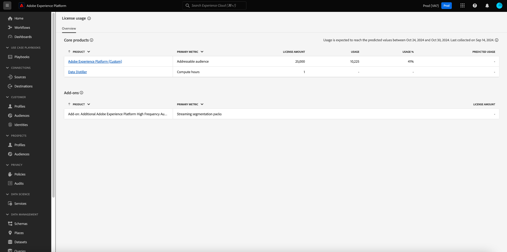

# [!UICONTROL License usage] dashboard {#license-usage-dashboard}

The Adobe Experience Platform user interface (UI) provides a dashboard through which you can view important information about your organization's license usage, as captured during a daily snapshot. 

For detailed instructions on how to access and interact with the license usage dashboard in the UI, as well as to learn more about the available metrics displayed in the dashboard, please visit the [license usage dashboard guide](../../dashboards/guides/license-usage.md).  

For an overview of all of the dashboard features within Experience Platform, please begin by reading the [dashboards overview](../../dashboards/home.md).

