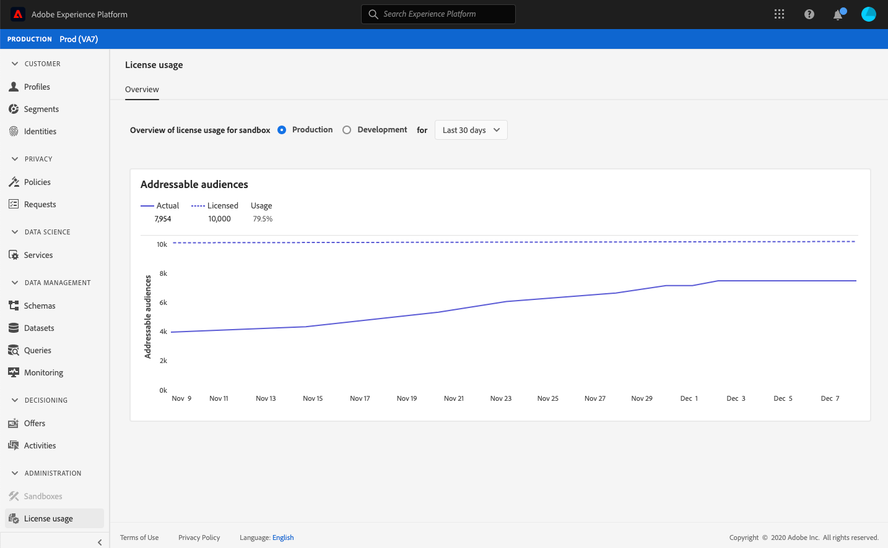
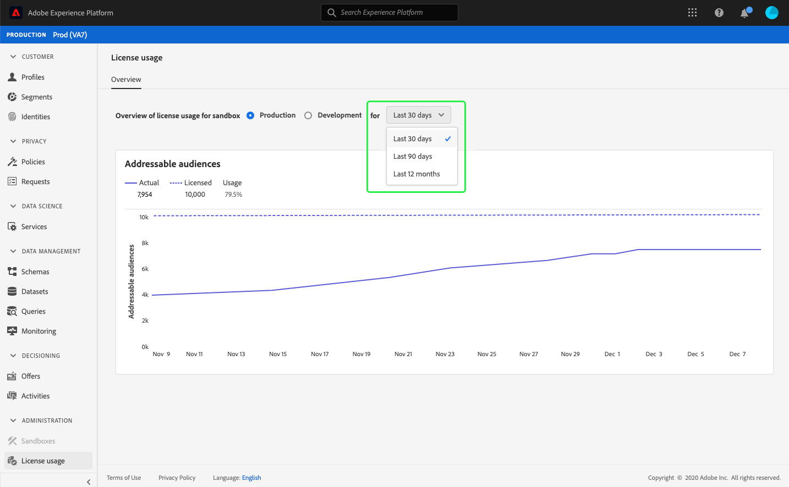

# (Alpha) [!UICONTROL License usage] dashboard {#license-usage-dashboard}

>[!IMPORTANT]
>
>The dashboard functionality outlined in this document is currently in alpha and is not available to all users. The documentation and the functionality are subject to change.

The Adobe Experience Platform user interface (UI) provides a dashboard through which you can view important information about your organization's license usage, as captured during a daily snapshot. This guide outlines how to access and work with the license usage dashboard in the UI and provides more information regarding the visualizations displayed in the dashboard.  

For a general overview of the Platform UI, please visit the [Experience Platform UI guide](ui-guide.md).

## License usage dashboard data

The license usage dashboard displays a snapshot of your organization's license-related data for Experience Platform. The data in the dashboard is displayed exactly as it appears at the specific point in time when the snapshot was taken. In other words, the snapshot is not an approximation or sample of the data, and the dashboard is not updating in real time.

>[!NOTE]
>
>Any changes or updates made to the data since the snapshot was taken will not be reflected in the dashboard until the next snapshot is taken.

## Exploring the license usage dashboard

To navigate to the license usage dashboard within the Platform UI, select **[!UICONTROL License usage]** in the left rail. This opens with the **[!UICONTROL Overview]** tab displaying the dashboard.

### Select a sandbox

To choose a sandbox to view in the dashboard, select either [!UICONTROL Production] or [!UICONTROL Development]. The selected sandbox is indicated by the radio button next to the sandbox name. 

>[!NOTE]
>
>Consumption reporting for sandboxes is cumulative for all sandboxes of the same type. In other words, selecting [!UICONTROL Production] or [!UICONTROL Development] will report on all production or development sandboxes, respectively.

### Select a date range

After selecting a sandbox, you can use the date range dropdown to select the time period to display in the dashboard. There are three available options: [!UICONTROL Last 30 days], [!UICONTROL Last 90 days], and [!UICONTROL Last 12 months]. The last 30 days are selected by default.

### Widgets and metrics

The license usage dashboard is composed of widgets, which display read-only metrics providing important information regarding your organization's license usage. To learn more about these widgets, see the available widgets section in this guide.

## Available widgets {#available-widgets}

Experience Platform currently provides one widget that you can use to visualize license usage, with more widgets being released soon. 

### [!UICONTROL Addressable audiences] {#addressable-audiences}

The **[!UICONTROL Addressable audiences]** widget displays the total number of merged profiles within the Profile data store, after applying a system-generated merge policy to combine profile fragments from all present datasets using a deterministic (private) graph algorithm. 

For more information on fragments and merged profiles, please begin by reading the *Profile fragments vs merged profiles* section of the [Profile overview](../profile/home.md).

>[!NOTE]
>
>The merge policy used to calculate this metric is generated by Experience Platform and cannot be edited, nor can a different merge policy be selected. This system-generated merge policy is not the same as the default merge policy used to calculate [!UICONTROL Audience size] in the [!DNL Profile] dashboard, therefore the audience count in the [!UICONTROL License usage] and [!DNL Profile] dashboards are unlikely to be exactly the same.

## Additional dashboards

The Platform UI provides additional dashboards for viewing snapshots of your data within Experience Platform. These dashboards include Real-time Customer Profile and segments. For more information on these dashboards, select from the following links:

* [[!DNL Profile] dashboard](../profile/ui/profile-dashboard.md)
* [Segment dashboard](../segmentation/ui/segment-dashboard.md)

## Next steps

By following this document you should now be able to locate the license usage dashboard and select a sandbox to view. You should also understand the metrics displayed in the available widgets. To learn more about the Experience Platform UI, please refer to the [Platform UI guide](ui-guide.md).