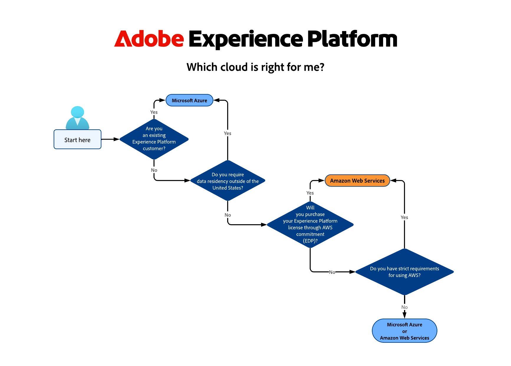
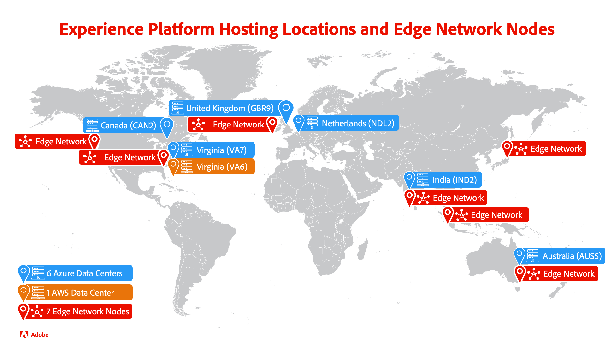

# Adobe Experience Platform multi-cloud overview

Adobe Experience Platform is a multi-cloud product, giving you the choice between running on [[!DNL Microsoft Azure]](https://azure.microsoft.com/en-us) or [[!DNL Amazon Web Services (AWS)]](https://aws.amazon.com/). This flexibility allows you to choose the best fit for your business and technical requirements.

>[!AVAILABILITY]
>
>Adobe Experience Platform running on Amazon Web Services (AWS) is currently available to a limited number of customers. To learn more about Experience Platform on AWS, contact your Adobe Account Team.

This page provides a high-level overview of the two available cloud infrastructures and includes guidance on how to choose the right one for your business.

## Which cloud implementation is right for me? {#which-cloud-is-right}

Choosing between Experience Platform on Azure or AWS depends on several factors specific to your business:

* **Business and technical needs**: Assess your organization's requirements and long-term cloud strategy.
* **Existing infrastructure**: Consider your current cloud infrastructure and integration needs.
* **Cloud technology reliance**: If your business relies heavily on Microsoft technologies, Azure might be the better fit. If you rely more on Amazon services, AWS could be the better option.
* **Data residency considerations**: Evaluate the data residency requirements for your organization and ensure the chosen cloud platform offers regions that comply with these regulations.

Considering the factors above, use this simplified decision tree to help decide on the right cloud implementation for your business needs.

{align="center" zoomable="yes"}

## Hosting locations {#available-cloud-regions}

Choosing the right cloud region is crucial for meeting data residency requirements and ensuring optimal performance.

{align="center" zoomable="yes"}

Experience Platform is available in six Microsoft Azure hosting locations, one Amazon Web Services (AWS) hosting location, and routes data to Adobe services through seven [Edge Network nodes](../collection/home.md#edge) distributed around the world.

### Microsoft Azure regions {#azure-regions}

The table below indicates the Microsoft Azure regions where Experience Platform is hosted.

| Country  | Region Code | Location |
|---------|-------------|----------|
| United States of America | VA7 | Virginia |
| United Kingdom | GBR9 | London |
| Netherlands | NDL2 | Amsterdam |
| Canada  | CAN2 | Toronto |
| India |  IND2 | Maharashtra |
| Australia  | AUS5 | New South Wales |

{style="table-layout:auto"}

### Amazon Web Services (AWS) regions {#aws-regions}

The table below indicates the AWS regions where Experience Platform is hosted. Check back regularly to see if additional loctions have been added.

| Country | Region Code | Location |
|---------|-------------|----------|
| United States of America | VA6 | Virginia |

{style="table-layout:auto"}

## Feature parity {#feature-parity}

Adobe is committed to offering feature parity across cloud platforms, for all applications running on Experience Platform, such as:

* [Real-Time Customer Data Platform](../rtcdp/home.md)
* [Adobe Journey Optimizer](https://experienceleague.adobe.com/en/docs/journey-optimizer/using/ajo-home)
* [Customer Journey Analytics](https://experienceleague.adobe.com/en/docs/analytics-platform/using/cja-landing)

However, some functionality may differ between Azure and AWS implemetations. These differences are outlined in the section below and in other parts of the product documentation, where applicable.

### Differences between running Experience Platform on Microsoft Azure and AWS {#azure-aws-differences}

The table below highlights the major differences between running Experience Platform on Microsoft Azure and AWS.

| Feature / Functionality | Microsoft Azure | Amazon Web Services |
| --- | --- | --- |
| [HIPAA compliance](https://www.adobe.com/trust/compliance/hipaa-ready.html) | Supported | Not supported |
| [Catalog of source connectors](/help/sources/home.md) | All connectors in the sources catalog are supported | A limited number of source connectors is available. Any source connectors available for AWS implementations are called out in a top-of-page note in their respective documentation pages.| 

{style="table-layout:auto"}

<!-- To be determined if we need to add this part about the AI Assistant 

| [Experience Platform AI Assistant](/help/ai-assistant/home.md) | Supported | Not supported |

-->

## Conclusion {#conclusion}

Experience Platform provides flexibility and choice by giving you the option to run on Microsoft Azure or Amazon Web Services. Evaluate your business needs and existing infrastructure to make an informed decision on which cloud platform to use.
