# Adobe Experience Platform for multi-region, multi-brand enterprises

## Introduction

Adobe Experience Platform is at the forefront of transformative solutions, empowering you to take advantage of the full potential of your customer data and content. With Experience Platform, you can centralize and standardize data from diverse systems and apply the power of data science and machine learning. The result is enhanced creation and delivery of personalized experiences that resonate with your consumers.

Experience Platform empowers you to represent structure, and govern your business data for scalable, flexible implementations. Implementing Platform applications is a significant journey that requires strategic planning and careful considerations, especially if you operate across global, regional, and brand-specific domains or a combination of all these aspects.

This whitepaper serves as a reference, offering a product point of view and a set of guidelines. Its primary aim is to empower you and your implementation teams with the tools and insights needed to navigate the intricacies of Experience Platform effectively. By providing a structured framework for evaluating your specific requirements, considerations, and real-world use cases, it equips you with the knowledge necessary to unlock the full potential of Experience Platform and platform-based applications. As you read the following sections, you will find invaluable insights and recommendations to streamline the implementation process and elevate your organization's capability to deliver exceptional experiences to your audience while providing the governance and controls to maintain privacy and compliance.


## Understanding the multi-brand, multi-region enterprise

If you operate a multi-brand, multi-region enterprise, you likely have unique data management requirements for Experience Platform. Understanding your distinct requirements is crucial for tailoring the Experience Platform implementation to best suit your specific needs.

When exploring deployment options, you need to understand and consider the personas that will interact with Experience Platform and platform-based applications. Designing their experience based on their roles and interests ensures a successful implementation. Here are three key personas you should consider as you explore the options:

**Mary, the marketer:**

- Focus: Customer acquisition and experience personalization at scale.
- Goals: Creating comprehensive profiles, enhancing media efficiency.

**Ted, the technologist**

- Focus: Organizational data management.
- Goals: Ensuring compliance, managing data silos, servicing various lines of business.

**Dan, the data architect**

- Focus: Data accuracy and quality.
- Goals: Ensuring data privacy and trust, designing schemas and data models, managing data sources.

### An enterprise operating With limited data isolation

A key architectural principle in Experience Platform is one where customer data is restricted to a specific production sandbox based on governance policies and requirements.

If your organization needs a singular data environment to operate your marketing experience at scale, you may prefer consolidating all your data into a single Experience Platform sandbox with minimal data isolation requirements. Within this set up, data is ingested into a sandbox, and all related identities are represented as a single unified profile, whether identified by a pseudonymous or known identity. This means your marketers can access all profile attributes and experience event data within Experience Platform across your enterprise. They can use this data with platform-based applications to create audiences and journeys with minimal need to restrict marketers from using all the data regardless of brand or region. This approach facilitates seamless segmentation and audience activation into the destinations supported by Experience Platform applications. This strategy works well if you aim to leverage your entire customer base, regardless of regional or brand-specific differences, for unified and cohesive marketing efforts.

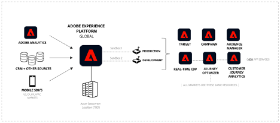 

#### How this works

Let's begin by planning your implementation and configuring your top-level environment. Next, you'll decide on the number of sandboxes, roles, and permissions required to operate Experience Platform and platform-based applications optimally for your enterprise.

##### General setup for your implementation

- Configure sandboxes to enable building unified customer profiles.
- Set up roles and access controls to administer sandboxes and access to functionality for each persona.
- Manage the development lifecycle with a development sandbox and sandbox tooling.

**Sandboxes**

Sandboxes are virtual partitions within a single instance of Experience Platform, which allow for seamless integration with the development process of your digital experience applications. All content and actions taken within a sandbox are confined to that sandbox and do not affect any other sandbox, including data and access to data. There are two kinds of sandboxes supported on Experience Platform:

- **Production sandbox**: A production sandbox is meant to be used with profiles in your production environment. Experience Platform allows you to create multiple production sandboxes to provide the right data functionality while maintaining operational isolation.

- **Development sandbox**: A development sandbox can be used exclusively for development and testing with non-production profiles.

You can create multiple sandboxes of any type, and for this type of enterprise, we will use one production and one development sandbox to illustrate how to run and operate this type of enterprise.
  
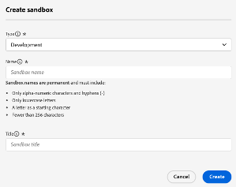 

In the production sandbox, we expect you to ingest your production profile and experience event data to build a unified profile for your marketing activities. For more details on how to combine known and anonymous data from multiple enterprise sources to create customer profiles that can be used to provide personalized customer experiences across all channels and devices in real-time, see the [Adobe Real-Time Customer Data Platform documentation](https://experienceleague.adobe.com/en/docs/experience-platform/rtcdp/home).

**Access controls**

You can define access controls with roles and permissions to control access to application resources depending on the persona and its required functionality. Additionally, you have the option to limit access to specific fields of the profile data. You should think through this step in depth to better govern the usage of Experience Platform, platform-based applications, and your customer data.

Consider a data engineer who may not need access to all Experience Platform and platform-based application functionality. They are typically responsible for creating data definitions (schemas), configuring data sources to ingest data, and creating datasets. However, they may not be the same persona that creates and activates audiences for personalized customer experiences. For this persona, create a role, add the appropriate permissions, and grant access only to the required functionality. In contrast, a marketer persona would not be creating schemas and ingesting data but rather focusing on creating and activating audiences to enable personalized customer experiences.

If desired, consider adding granular access controls to limit access to specific fields on the unified customer profile with attribute-based access control/ field-level access control capability. These are governance mechanisms in Experience Platform that allow you to restrict access to data attributes based on predefined labels. With field level access control, personally identifiable data can be governed, and access is restricted across all Experience Platform and application workflows. For more details on access control capabilities, see the [access control documentation](https://experienceleague.adobe.com/en/docs/experience-platform/access-control/home).

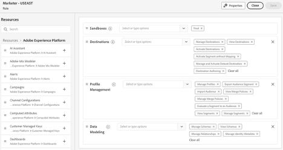 

**Development lifecycle with development sandboxes**

A development sandbox behaves the same way as a production sandbox in all functional aspects. It's different in that it will have some contractual guardrails to keep you within your license limits. It is designed exclusively for development and testing with non-production profiles, supporting up to 10% of your licensed profile commitment (measured cumulatively across all authorized development sandboxes). For additional details and guardrails, see the [sandboxes overview documentation](https://experienceleague.adobe.com/en/docs/experience-platform/sandbox/home) and the [product descriptions page](https://helpx.adobe.com/legal/product-descriptions.html) for entitlement details.

You can have multiple development sandboxes (up to 4 in this enterprise example, since we are using one production sandbox) for the development and testing lifecycle.

**Exporting and importing packages with sandbox tooling**

The sandbox tooling feature allows users with appropriate permissions to package their work from a development sandbox and export it to a repository. This repository is accessible to other users, who can import these packages into their designated sandboxes. This capability ensures consistent configurations across sandboxes, facilitating seamless export and import processes.

Using sandbox tooling significantly enhances configuration accuracy and reduces the time needed for implementation. It enables the efficient movement of successful configurations across different sandboxes.  

With the sandbox tooling feature, you can select various objects and export them into a package. A package can include single object or multiple objects, but all objects must originate from the same sandbox.

**Sandbox automation via APIs**

You have the option to use Experience Platform APIs to automate sandbox deployments and configuration tasks. APIs allow programmable control for repetitive tasks such as exporting, importing, or modifying sandbox configurations, providing flexibility if you prefer automated workflows.

For additional details on sandbox tooling, see the [sandbox tooling documentation](https://experienceleague.adobe.com/en/docs/experience-platform/sandbox/ui/sandbox-tooling).
  
| 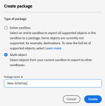 | 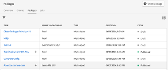 |
| --- | --- |

### Region or brand-specific data isolation

If you require complete isolation (e.g., regional or brand-based), you may operate under strict data access policies or legal requirements restricting your brand teams' access to data specific to their respective regions or brands. You define access patterns based on region or brand-specific data, ensuring compliance with internal, regulatory, and data governance protocols. This approach is crucial if you operate in highly regulated industries (e.g., handling PII data) or need to maintain distinct and segmented data for different geographic regions or brand identities.

  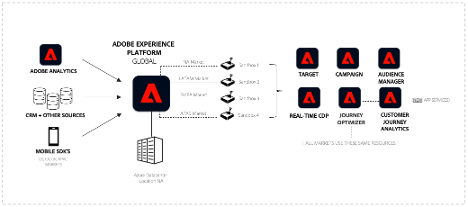 

#### How this works

Let's begin by planning your implementation, configuring your top-level environment, and deciding on the number of sandboxes, roles, and permissions required to operate Experience Platform and platform-based applications optimally for your enterprise.

##### General setup for your multi-sandbox implementation

- Configure multiple production sandboxes to enable building the unified customer profiles in each sandbox.

- Set up roles and access controls to administer sandboxes and access to functionality for each persona.

- Manage the development lifecycle with sandbox tooling.

- Global reporting and activation (aggregating data from multiple sandboxes for cross-organizational insights with Customer Journey Analytics).

**Sandboxes**  

In contrast to a setup with a single production sandbox, you may require a more complex approach if you need complete isolation of data and workflows. This is where multiple production sandboxes come into play, each representing a unit of isolation tailored to your specific needs.

As mentioned, each sandbox is a virtual partition within a single platform instance. These sandboxes allow you to manage your data, workflows, and processes in a controlled environment that does not interfere with other sandboxes. While development sandboxes are intended for testing and development activities with non-production profiles, production sandboxes are the backbone of live operations, supporting the ingestion of actual production data for real-world marketing activities.

Key benefits of clean isolation in production sandboxes:

1. **Data governance and compliance:** If you operate in regulated industries or regions with stringent data privacy laws, you need to ensure that data from one region or brand remains isolated. Multiple production sandboxes allow you to comply with governance requirements or industry-specific standards by ensuring that data is only accessible within the appropriate sandbox.

2. **Operational efficiency:** By isolating data and workflows, you can manage your operations more efficiently. Your teams responsible for different regions or brands can work independently within their dedicated sandboxes without worrying about accidental data leaks or unauthorized access.

3. **Customized workflows:** You can tailor each production sandbox to your region's specific needs or the brand it represents. This allows you to implement customized workflows, data models, and marketing strategies optimized for that segment.

4. **Scalability:** As you grow, you can easily create additional production sandboxes to accommodate new regions or brands. This scalability ensures that the platform can adapt to your evolving needs without compromising data integrity or performance.

5. **Enhanced control:** With multiple production sandboxes, your administrators have fine-grained control over access permissions, data ingestion, and workflow execution. This enables you to take a more secure and organized approach to managing complex operations across your global enterprise.

**Access controls**

In the context of multiple production sandboxes, access controls remain a critical component of managing data and workflows within Experience Platform. However, the complexity increases as your administrators must ensure that users can only access the sandboxes relevant to their roles while still enabling cross-sandbox operations for users who require it, such as your marketing teams spanning multiple regions or data engineers responsible for global data ingestion and data modeling.

**Defining roles and permissions across sandboxes:**

Just like in the single production sandbox scenario, you can define access control policies with roles and permissions tailored to the needs of different personas. However, you must consider how these roles extend across different sandboxes in a multi-sandbox environment.

For instance:

- **Regional marketers:** If your marketers operate in multiple regions, their roles might need to span more than one sandbox. You can grant them the necessary permissions to access resources across multiple sandboxes while ensuring their access is still confined to the appropriate data and workflows within each sandbox.

- **Data engineers:** Data engineers responsible for creating data models, defining schemas, and managing data ingestion might need access to all sandboxes. You can design their roles to allow them to operate across the entire platform while limiting their access to only the functionalities and data relevant to their tasks. For example, your data engineer working on data models for Europe and North America could access the production sandboxes for these regions with permission to modify schemas and ingest data. However, they would not have the ability to access marketing functions such as creating and activating audiences.

**Granular access control considerations:**

In a multi-sandbox environment, granular access control becomes even more critical. Attribute-based access control (field-level access control/object-level access control) allows you to further restrict access to specific data fields within profiles or certain audiences, ensuring that sensitive or personally identifiable information (PII) is protected across all your sandboxes. For instance:

- You might restrict access to certain data fields within a sandbox to only users within that region. This ensures that PII or sensitive data is only visible to those who need it, aligning with privacy regulations and internal governance policies.

- For users with cross-sandbox access, attribute-based access control ensures that even if they have access to multiple sandboxes, their visibility into sensitive data is limited by their role and a need-to-know basis.

Benefits of role-based and attribute-based access controls:

1. By controlling access based on roles and attributes, you can significantly reduce the risk of unauthorized data access, ensuring that only those with the appropriate permissions can view or manipulate sensitive information.

2. Clear and well-defined roles and permissions streamline operations, as each persona has access to the functionality and data they need without unnecessary clutter or risk. This clarity supports efficient workflows and reduces friction.

3. As your enterprise grows and evolves, access controls can be adjusted to accommodate new regions, brands, or roles. The flexibility to modify access without disrupting existing workflows is crucial for scaling your operations.

4. Administrators can maintain centralized control over all sandboxes, ensuring consistency in how access controls are applied across your enterprise while allowing for customization for different regions or brands.

**Development lifecycle with development sandboxes**

Managing your development lifecycle across multiple regions and brands within Experience Platform requires a robust approach that ensures consistency, efficiency, and scalability. Development sandboxes support the development lifecycle in a complex environment with numerous production sandboxes. They are enhanced by the sandbox tooling feature, which enables seamless configuration sharing and deployment across different environments.

Development sandboxes play a crucial role in the development lifecycle. These sandboxes provide an isolated environment where developers and data engineers can build, test, and iterate on configurations without affecting production data. While functionally similar to production sandboxes, development sandboxes differ because they are intended for testing with non-production profiles and are governed by contractual limits, such as supporting up to 10% of your licensed profile commitment across all authorized development sandboxes.

You can create multiple development sandboxes to support different teams or regions. This allows each of your teams to experiment with workflows specific to their region or brand, ensuring that production environments remain stable and secure during development. If you have many production sandboxes, we recommend using a pool of development sandboxes to support multiple regions/brands.

**Exporting and importing packages with sandbox tooling**

The sandbox tooling feature is a powerful tool if you're managing multiple sandboxes. It enables developers, data engineers, and marketers to package their work in a development sandbox, including schemas, data models, and other configurations, and then export them to a repository. From there, other users can access and import these packages into their designated sandboxes, facilitating seamless sharing and deployment of successful configurations across the business.

For example, your data engineer working in a development sandbox for the North American region can create a schema and package it with all its dependencies. Another data engineer in a different region, such as Europe, can access this package and import it into their regional sandbox. This process ensures consistency in data modeling and configuration across your entire enterprise, reducing the risk of errors and enhancing operational efficiency.

Benefits of sandbox tooling in a multi-sandbox environment:

1. Sandbox tooling streamlines the development lifecycle by allowing successful configurations to be easily shared across multiple sandboxes. This reduces duplication of effort and ensures that best practices are implemented consistently across all regions or brands.

2. The ability to export and import packages across different sandboxes enhances interoperability within the enterprise. Teams in different regions can collaborate more effectively, ensuring their configurations align with the overall enterprise goals while accommodating regional or brand-specific requirements.

3. As enterprises grow and add more sandboxes to accommodate new regions or brands, sandbox tooling provides the scalability needed to manage these environments efficiently. New sandboxes can be quickly configured using existing packages, accelerating the onboarding process and reducing the time required to go live.

4. By packaging configurations and dependencies in a development sandbox and then deploying them to production sandboxes, enterprises can ensure that their configurations are accurate and consistent across the board. This reduces the likelihood of errors and enhances the overall reliability of the platform.

5. With sandbox tooling, the transition from development to production is smooth and controlled. Once configurations have been tested and validated in a development sandbox, they can be exported and imported into a production sandbox with confidence that they will perform as expected.

**Global reporting and activation**

This involves aggregating data from multiple sandboxes for cross-organizational insights, often requiring a dedicated reporting sandbox for integration with Customer Journey Analytics.

While the multiple production sandbox approach clearly provides isolation benefits for regional and brand-specific operations, it also introduces challenges that require creative solutions. A key challenge is the ability to analyze data across sandboxes for global reporting and global campaign purposes. Enterprises often need to understand the customer journey at a global level, which involves integrating data from multiple sandboxes and enabling cross-sandbox marketing efforts. Below, we outline approaches to address these challenges.

**Global reporting across sandboxes**

When an enterprise operates with multiple production sandboxes, each representing a region or brand, analyzing customer data across all sandboxes becomes complex. For example, creating a unified view of the customer journey across different brands requires consolidating data from these isolated environments.

**Dedicated global sandbox**

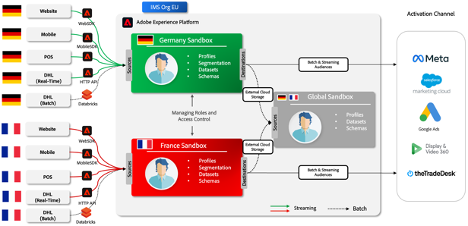 

This sandbox acts as a central repository where data from individual regional or brand-specific sandboxes is consolidated. A common solution is to use Query Service within each sandbox to extract relevant customer data. This may include profiles and experience events that need to be analyzed across different regions or brands. Once data is prepared from each sandbox, it is ingested into the global reporting sandbox for analysis and audience creation.

Use Customer Journey Analytics to perform cross-market and cross-brand analysis on aggregated data in the global sandbox to gain a comprehensive view of customer interactions across all brands and regions. This enables them to generate valuable insights, such as identifying customers who engage with multiple brands and create cross-brand or cross-region audiences. These insights can be used for various purposes, including activating marketing strategies, personalizing customer experiences, and driving enterprise growth.

**Audience sharing**

The global sandbox also enables global marketing teams to define and manage audiences on a broader scale. Using sandbox tooling, these global audiences (definitions only, not data) can be exported from the global sandbox to individual brand or regional sandboxes, allowing local marketing teams to evaluate and activate them in their respective markets.

Additionally, you can utilize Experience Platform Segment Match, a feature in Platform that enables cross-sandbox segment sharing (qualified audience) between different organizational units or business entities.

This segment-sharing service allows two or more users to exchange segment data in a secure, governed, and privacy-friendly manner.

For additional details on the Segment Match feature, see the [Segment Match documentation](https://experienceleague.adobe.com/en/docs/experience-platform/segmentation/ui/segment-match/overview).

### A blend of approaches for global operations, regional, and brand-specific

Many multi-brand enterprises operate on a global scale and, as such, often seek a blend of both unified and isolated data management approaches. They seek to separate data for multiple regions or countries in this scenario. Brands within the organization can expect to operate exclusively on the data associated with their specific brand, all within the same data boundaries of a geography or country. This approach allows for centralized regional or country data management while still facilitating brand-specific marketing and data operations. It's a model that combines the advantages of unified data management with the necessity for brand and region-specific isolation.

Recognizing these varying requirements, Experience Platform can be configured to provide you with a highly adaptable and flexible data management solution, ensuring that multi-brand, multi-region enterprises can effectively represent your business within the platform. Whether the goal is to maximize the collective customer data, maintain strict data isolation, or achieve a balance between the two, Experience Platform is equipped to meet the diverse needs of your enterprise.

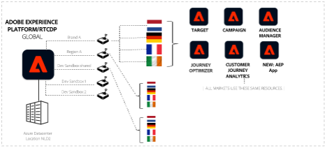 

#### How this works

Let's begin by planning your implementation, configuring your top-level environment, and deciding on the number of sandboxes, roles, and permissions required to operate Experience Platform and platform-based applications optimally for this enterprise.

##### General setup for this enterprise

- Configure multiple production sandboxes to enable building the unified customer profiles.

- Set up roles and access controls to administer sandboxes and access to functionality for each persona.

- Set up atrribute-based access control: Field-level access control/object level access control for granular controls over profile attributes and audiences.
  
- Manage the development lifecycle with development sandboxes and sandbox tooling.

- Global reporting.

**Sandboxes**

Set up a sandbox per brand/region. Refer to the sections above for creating multiple production sandboxes.

**Access controls**

Roles and user permissions:

- Create the role "**Marketer—Global**" and grant permission to create, view, and manage audiences. Additionally, this role will get permission to view all customer data.

- Create roles and grant access only to certain features for the right persona. For example, the user roles "**Marketer—Germany**" and "**Marketer—France**" would only get permission to create, view, and manage audiences on country data enabled by a combination of field-level access control, object level access control, and default audiences.

- Create the role "**Technologist—Global**" and grant the right permissions to create and manage schemas, datasets, policies, sources, and so on. This role would be responsible for all the necessary administration and configurations.

###### Schema design and attribute-based access control: Field-level access control

**Experience data model (XDM)** 

A standardized data schema in Experience Platform that ensures consistent data structure and interoperability across all platform-based applications.

**Attribute-based access control: Field-level access control and data modeling option:**

- Create a data model to include tenant-specific XDM fields (PII) that should be restricted for each country.

- Create and apply country labels to XDM fields. Labels = Germany, France, Ireland, Netherlands, etc.

- Add labels to the proper role. For example, add the label Germany to the role "Marketer—Germany".

XDM Individual Profile Schema:

```
\- PII
\- Germany
    \- name --> Label: "Germany"
    \- email --> Label: "Germany"
    \- birthdate --> Label: "Germany"

\- France
    \- name --> Label: "France"
    \- email --> Label: "France"
    \- birthdate --> Label: "France"

\- Netherland
    \- name --> Label: "Netherland", "Germany"
    \- email --> Label: "Netherland", "Germany"
    \- birthdate --> Label: "Netherland", "Germany"

\- Loyalty
    \- member
    \- registrationDate
```

###### Audiences: Use attribute-based access control: Object level access control to control access to brand/country-specific audiences

**Attribute-based access control: Object level access control for audiences:**

- Create audiences and control who can view them.

- Create and apply country labels to audiences. Labels = Germany, France, Ireland, Netherlands, and so on.

- Add labels to the proper role. For example, add the label "Germany" to the role "Marketer—Germany".

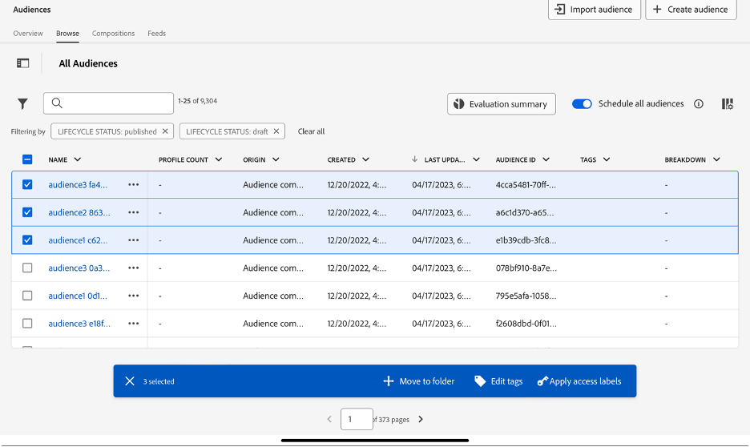 

###### Include a default audience as you create brand/country-specific audiences

**Default Audience: Alternative to Row-Level Access Control:**

- Currently, the audience builder enables you to include existing audiences as building blocks in your audience creation process.

- The result would be derived from the audience, followed by attributes and events.

- There is no mechanism to auto-add one or more audiences at the time of composition.

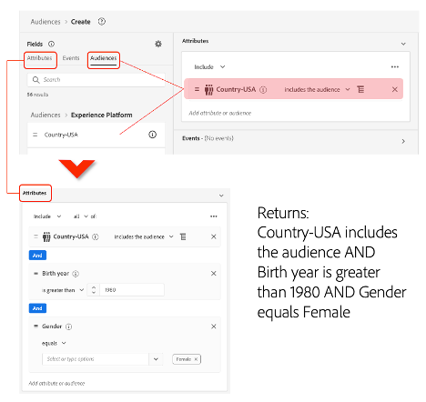 

###### Activation and brand/country level profile filtering

**Custom consent policy option:**

This allows you to control or filter profiles at the time of activation:

- Create marketing action.

- Create a destination and associate the marketing action.

- Create a custom consent policy.

>[!NOTE]
>
> The Privacy and Security Shield SKU is required to create consent policies.  

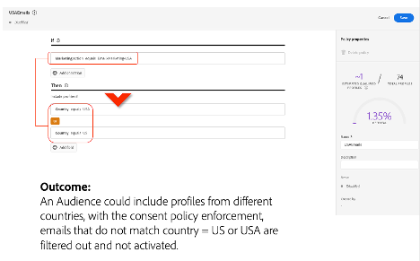 

Multi-Brand Activation and Consent Policy Complexity:

Managing audience activation across multiple brands requires detailed governance of consent policies, ensuring that each brand's unique requirements are met. Additionally, Adobe Privacy and Security Shield (a compliance feature in Experience Platform that enforces data protection policies and ensures regulatory alignment across various activation channels) may impose specific limitations on how consent policies are enforced across different activation channels. You should assess these considerations carefully and implement governance frameworks to maintain compliance and operational efficiency.

You must also carefully navigate complexities around consent policy configurations and channel-specific activations. Explicitly defining consent policies for each region or brand and consistently managing these configurations is crucial for compliance and operational efficiency.

## General Considerations

In some scenarios, you may opt for deploying Experience Platform and platform-based applications across multiple organization IDs rather than using a single organization ID with many sandboxes. This approach can provide benefits in terms of data residency, security, and administration, but it also introduces complexity. Here are key considerations for determining when a multi-organization approach may be appropriate.

### What is an organization ID

- An organization ID is Adobe's implementation of Federated ID and OAuth 2.0 protocol.

- An organization ID is a collection of all the applications, users, and permissions that an organization has the rights to under their Adobe contractual terms.

- User accounts and permissions are managed through each organization's Admin Console.

- Organization IDs also govern how Adobe solutions interact with each other. Solutions within the same organization can have interoperability.

- In general, an organization ID is deployed in a single geographical region.

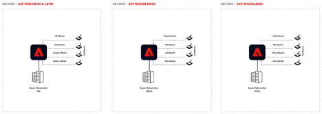 

**Multiple organization IDs: Benefits and considerations​**

| Benefits | Considerations |
| -------- | -------------- |
| The following are a list of benefits of having multiple organization IDs: <ul><li>Flexibility to store data in particular global regions.</li><li>​Separate user logins per instance – i.e., Wholefoods can't log in to Audible.​</li><li>Dedicated API endpoints that give each Market/BU the ability to build custom connections as needed into their own environment​.</li><li>Each business unit would have their own customer-managed keys​.</li><li>GDPR requests can be made per-business unit​.</li><li>Completely isolated storage and compute between business units​.</li><li>Alleviates some organization-level performance guardrails/limits​.</li><li>More flexibility with provisioning and mixing SKUs between business units. For example, one organization can have a different SKU of Adobe Journey Optimizer versus another organization.</li></ul> | The following are things to consider when having multiple organization IDs: <ul><li>Multiple organization IDs to manage, versus one.​</li><li>Multiple separate instances/environments to manage (integrations, data loads, and so on).</li><li>​ECIDs will be unique per organization, making it difficult to match data up between business units​.</li><li>Would need to migrate/reimplement Analytics and Target per organization – lose global roll-up (if currently being used).​</li><li>More orchestration required to make GDPR requests across business units​.</li><li>Some Experience Platform based application integrations store metadata at the organization level. Not everything is "sandboxed" by sandboxes.​</li><li>Organization ID is pinned to a region. The Adobe AWS hosting location is currently in the US only. Adobe does not support migrating from one hosting region to another.​</li><li>Edge is not sandbox aware (for event forwarding).</li></ul> |

**Single organization ID: Benefits and considerations**


| Benefits | Considerations |
| -------- | -------------- |
| The following are a list of benefits of having a single organization ID: <ul><li>Provision individual sandboxes to create logical separation between business units within a deployed region</li><li>Single organization ID for IT to manage for users, provisioning, and so on.</li><li>No migration of Adobe Tags, Target, Analytics, and more, if staying in same organization ID.</li><li>No reset required for existing ECIDs – prevents "cliffing" in Adobe Analytics data.</li><li>Single login for global marketing resources.</li><li>User access rights to control who has access to what sandboxes, with appropriate levels of role-based access control.</li><li>Leverage Global Analytics and Target instances and report suite data.</li></ul> | The following are things to consider when having a single organization ID: <ul><li>Data will be stored in a single region.</li><li>Potential need to consolidate data into a single organization ID.</li><li>All business units would be sharing the same infrastructure across applications (core Experience Platform, Real-Time CDP, Adobe Journey Optimizer, Customer Journey Analytics).</li><li>Guardrails: Some are global per organization, such as streaming segmentation, which is 1.5k RPS.</li><li>GDPR requests operate at the organization-level and cannot be targeted to specific sandboxes.</li><li>Customer-Managed Keys are set at the organization ID level – all business unit sandboxes would share the same encryption key with this approach.</li><li>Will require clarity on enterprise licensing across DX and CC to ensure that applications are provisioned in the correct organization IDs.</ul></li> |

**Benefits and considerations**

Multiple organization IDs govern user access, entitlements, and data segregation at an organizational level versus a single organization ID, which governs at the sandbox level.

| Scenario/ Requirement               | Multiple organization IDs                           | Multiple sandboxes (single organization ID)     |
| ----------------------------------- | --------------------------------------------------- | ----------------------------------------------- |
| Data residency                      | Full isolation and region-specific organization IDs | Single-region deployment                        |
| Data governance and isolation       | Complete separation and isolation                   | Operational isolation, shared organization ID   |
| Compliance management (e.g., GDPR)  | Separate requests per organization ID               | Single request applies across sandboxes         |
| Infrastructure cost and licensing   | Potentially higher due to duplicated setup          | Typically lower with centralized administration |
| Global reporting and activation     | Challenging due to isolated environments            | Easier cross-region reporting and activation    |
| Administrative complexity           | Higher due to multiple isolated organization IDs    | Lower, centralized administration               |

## Summary conclusion

Experience Platform provides enterprises with a robust framework to centralize, govern, and activate customer data across multi-brand, multi-region business models. This whitepaper has explored key deployment strategies, governance models, and best practices to optimize Experience Platform implementation for organizations with varying data isolation and operational needs.

## Key takeaways

1. **Flexible deployment models**

    - Enterprises can choose between **single-sandbox, multi-sandbox, or hybrid approaches** based on their operational, compliance, and governance requirements.

    - **Global organizations** may require multiple production sandboxes to comply with governance requirements while maintaining operational efficiency.

2. **Data governance and access control**

    - **Attribute-based access control, field-level access control, and object-level access control** enable precise governance over data access.

    - You must define **clear roles and permissions** for different personas (e.g., marketers, data architects, and IT teams) to ensure proper data usage.

3. **Sandbox tooling and automation**

    - **Sandbox tooling** simplifies configuration management, allowing teams to export and import settings efficiently.

    - **API-based automation** is an available option for enterprises looking to streamline sandbox deployments and governance at scale.

4. **Global reporting and activation strategies**

    - Enterprises leveraging **Customer Journey Analytics** must consider data synchronization and commercial implications when consolidating global reporting.

    - **Segment Match** provides a privacy-compliant mechanism for cross-sandbox audience sharing, ensuring seamless marketing activations.

5. **Multi-organization IDs vs. multi-sandbox considerations**

    - You must carefully assess whether to deploy **multiple organization IDs or multiple sandboxes** based on data residency, compliance, and operational needs.

    - **Organization IDs** offer full isolation**, while multi-sandbox setups provide operational flexibility within a shared governance framework**.

## Final thoughts

As enterprises scale their digital experience capabilities, Experience Platform serves as a foundational platform to drive data-driven marketing, customer intelligence, and cross-channel activations. A successful implementation requires careful planning of **sandbox governance, compliance policies, and operational workflows** to ensure long-term efficiency and scalability.

By leveraging best practices outlined in this whitepaper, you can **optimize Experience Platform for multi-brand and multi-region operations**, ensuring seamless data management, compliance, and personalized customer experiences at scale.

## Acknowledgment

This whitepaper was developed with insights and feedback from subject matter experts across various teams, ensuring accuracy, clarity, and practical guidance. We thank all colleagues for their valuable input and review. Their expertise has helped refine this document to better serve enterprises implementing Adobe Experience Platform in multi-brand, multi-region environments.
