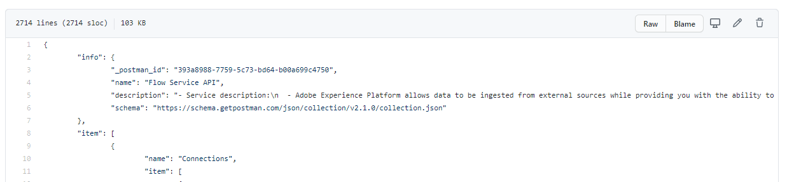
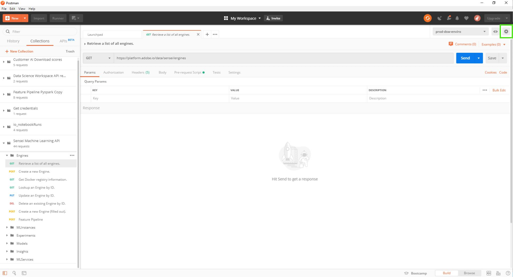
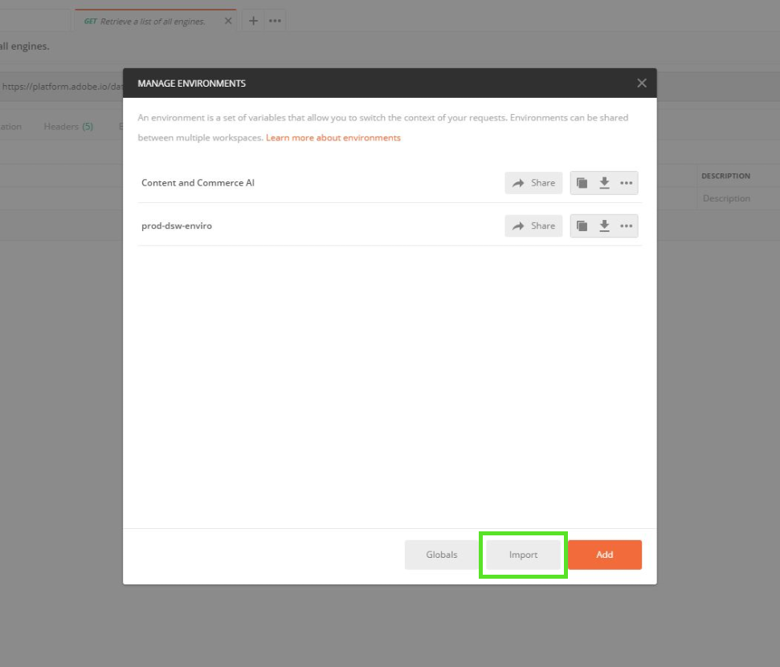
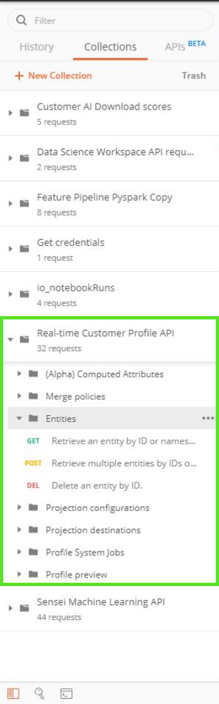

# Postman in Adobe Experience Platform

Postman is a collaboration platform for API development that allows you to set up environments with preset variables, share API collections, streamline CRUD requests, and more. Most Platform API services have Postman collections which can be used to assist with making API calls.

## How to set up a Postman environment for Experience Platform

The following video guide outlines creating and setting up your Postman environment. A Postman environment contains all the required headers you need to make API calls to the various collections provided below. Once set up, any time a value expires (such as an `ACCESS_TOKEN`) you can update the current value in the environment, and this new value is used across all your collections.

>[!VIDEO](https://video.tv.adobe.com/v/28832)

## Postman collections {#collections}

A folder containing all the available Postman collections can be found by, visiting the [Experience Platform Postman samples GitHub repository](https://github.com/adobe/experience-platform-postman-samples/tree/master/apis/experience-platform). Alternatively, a Postman collection link can be found in each individual swagger file in the [API reference documentation](https://www.adobe.com/go/platform-api-reference-en) on Adobe I/O.

To download a Postman collection, select **[!DNL Raw]** from the GitHub page to load the raw JSON file in a new tab. Then, right-click and select **[!DNL Save as]** to save the file to a local destination of your choice.

## Import a Postman collection {#import}

In order to utilize a [Postman collection](#collections), you need to have an environment set up. Once you have completed your environment setup, select the **[!DNL Manage Environments]** selector in the top-right corner.

A popover appears and displays all of your current environments. To import a collection, select **[!DNL import]** .

You are asked to choose a file to import. Select the Postman collection file you wish to import. Once selected, the collection populates in the left rail under the Collections tab.

Each collection has different key-value pairs that may be required to perform a successful CRUD operation. Please review the service's [API developer guide](api-guide.md#api-guides) to learn about required values, tips, and see examples.

To learn more about the Postman UI and its available features, visit the [Postman documentation](https://learning.postman.com/docs/getting-started/navigating-postman/).

### Generate an access token with Postman for non-production use

>[!WARNING]
>
>As noted in the Identity Management Service (IMS) Postman collection, the denoted generation methods are suitable for **non-production use**. Local signing loads a JavaScript library from a third-party host, and remote signing sends the private key to a web service that is owned and operated by Adobe. While Adobe does not store this private key, production keys should never be shared with anyone.

The video below uses the [Identity Management Service (IMS) Postman collection](https://github.com/adobe/experience-platform-postman-samples/blob/master/apis/ims/Identity%20Management%20Service.postman_collection.json) which can be downloaded from the public GitHub repository.

>[!VIDEO](https://video.tv.adobe.com/v/29698/?quality=12&learn=on)

## Next steps

This document introduced Postman environments, collections, and how to import collections. Now that you have Postman ready, visit the [Platform getting started guide](api-guide.md) for information on required headers, examples, and a list of [API guides](api-guide.md#api-guides) available for each Platform service.
