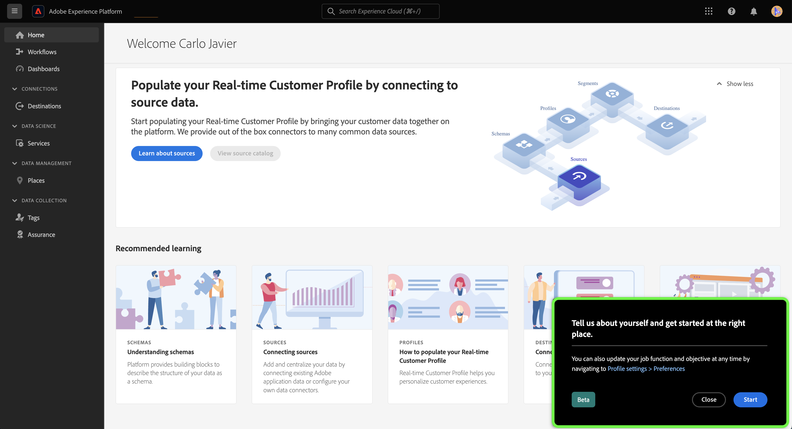
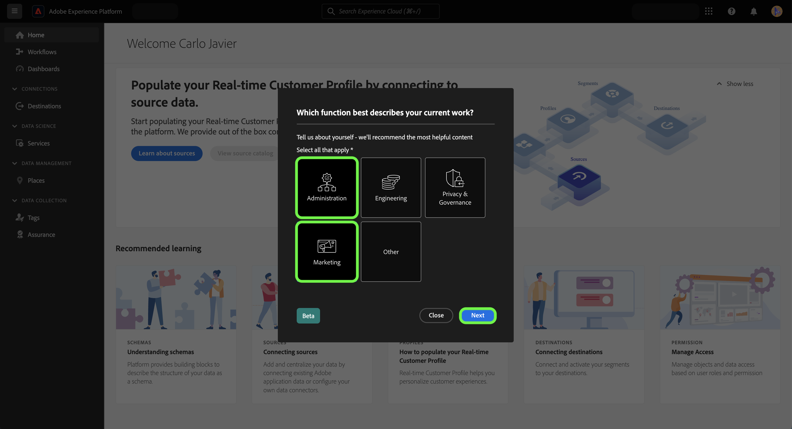
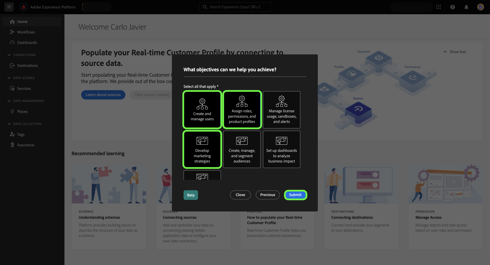
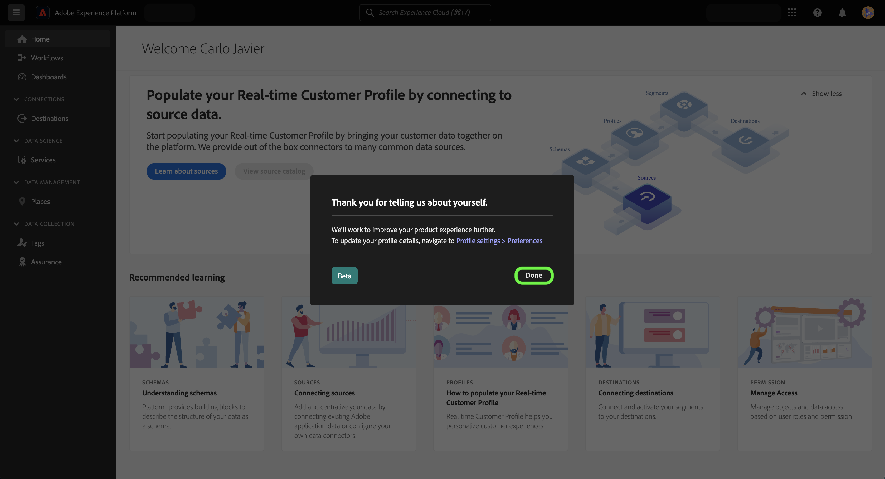
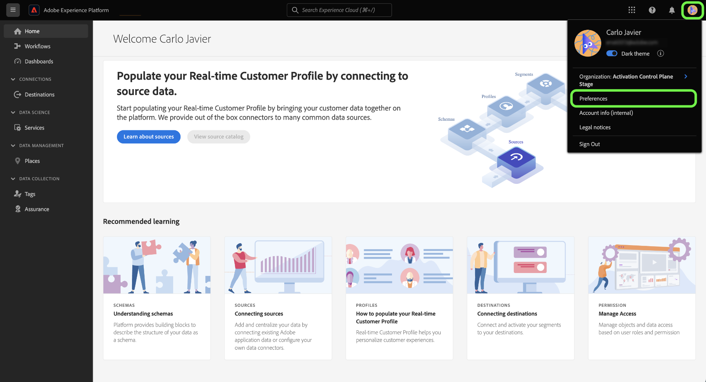
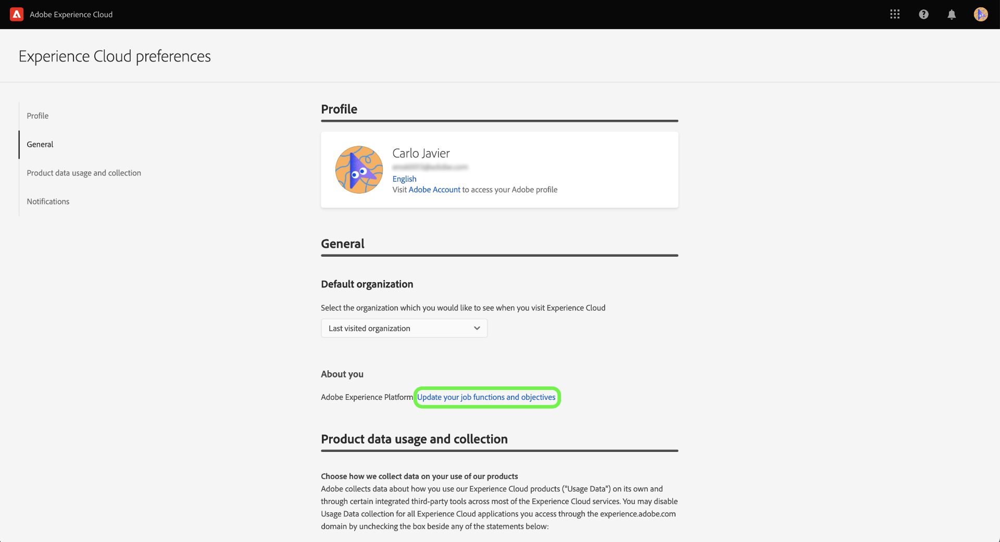
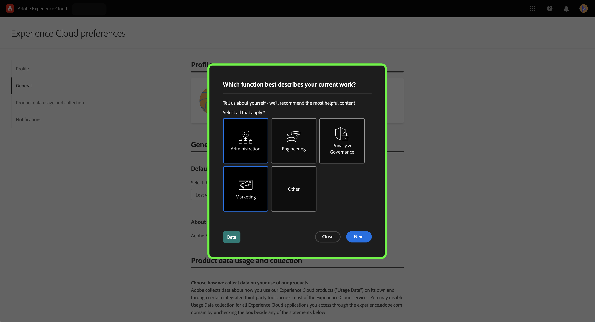

# Use the self-identification survey to build your Experience Cloud personal profile

The self-identification survey is a short questionnaire presented in the Adobe Experience Platform UI home page. Use the survey to provide information on your job functions and general objectives. This information is then used to better align in-product guides and eventually deliver content that is more relevant to your objectives.

This document provides information on how you can use the self-identification survey in Platform UI to receive relevant content based on your goals and tasks. This document also provides information on how to reconfigure your personal profile attributes using the UI.

To learn more about Adobe Experience Platform, please read the [Experience Platform overview](home.md).

## Self-identification survey in the Platform UI

The self-identification survey prompt appears in the bottom right of the Platform UI home page upon signing in.

To begin the survey, select **[!UICONTROL Start]**.

### Selection mapping

| Role function | Objectives |
| --- | --- |
| Administration | <ul><li>Create and manage users</li><li>Assign roles and permissions</li><li>Manage license usage and sandboxes</li></ul>|
| Engineering | <ul><li>Data ingestion</li><li>Model data structures</li><li>Query, filter, and distill data</li></ul> |
| Privacy & Governance | <ul><li>Configure consent and data policies</li><li>Privacy and data governance</li></ul> |
| Marketing | <ul><li>Develop marketing strategies</li><li>Segment audiences</li><li>Set up and analyze dashboards</li><li>Activate destinations</li></ul> |

For the first survey question, select the function that best describes your work. 

The available options are: 

* [!UICONTROL Administration]
* [!UICONTROL Engineering]
* [!UICONTROL Privacy & Governance]
* [!UICONTROL Marketing]
* [!UICONTROL Other]

>[!NOTE]
>
>You can select more than one function from the list of options. If you select [!UICONTROL Other], you will be prompted to provide details on your objective.

To proceed, select the function(s) that best describes your current work and then select **[!UICONTROL Next]**.

Next, select the specific objective(s) that best applies to your work.

The list of available objectives include:

* [!UICONTROL Create and manage users]
* [!UICONTROL Assign roles, permissions, and product profiles]
* [!UICONTROL Manage license usage, sandboxes, and alerts]
* [!UICONTROL Configure the system for data ingestion]
* [!UICONTROL Model my organization's data structure]
* [!UICONTROL Query, filter, and optimize data to generate insights]
* [!UICONTROL Configure consent and data policies]
* [!UICONTROL Data governance and privacy compliance]
* [!UICONTROL Develop marketing strategies]
* [!UICONTROL Create, manage, and segment audiences]
* [!UICONTROL Set up dashboards to analyze business impact]
* [!UICONTROL Activate data to destinations for downstream targeting]

When finished, select **[!UICONTROL Submit]**.

With your self-identification survey completed, select **[!UICONTROL Done]**.

Update your job functions and objects using the Experience Cloud preferences menu. To access the preferences menu, select your profile icon on the top navigation and then select **[!UICONTROL Preferences]**

Next, in the [!UICONTROL General] section of your profile preferences menu, select **[!UICONTROL Update your job functions and objectives]**. 

The self-identification survey appears, allowing you to reconfigure your responses and update your profile.

## Next steps

By reading this document, you have now submitted and updated information regarding your job functions and objectives in order to receive more relevant content when using Platform UI. For more information on Platform UI, read the [Experience Platform overview](home.md).