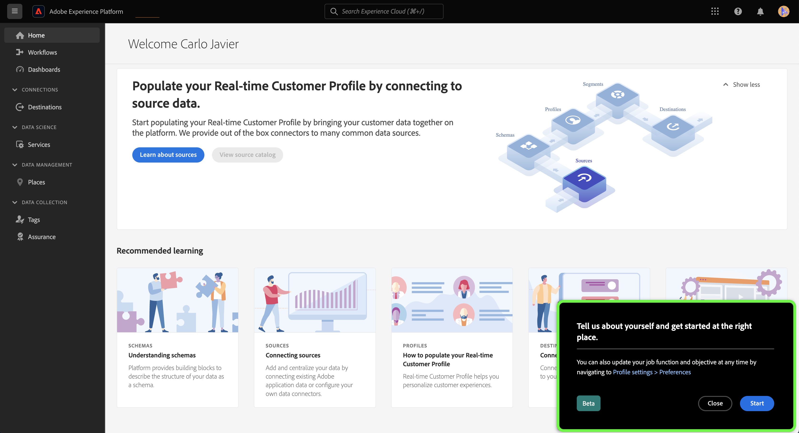
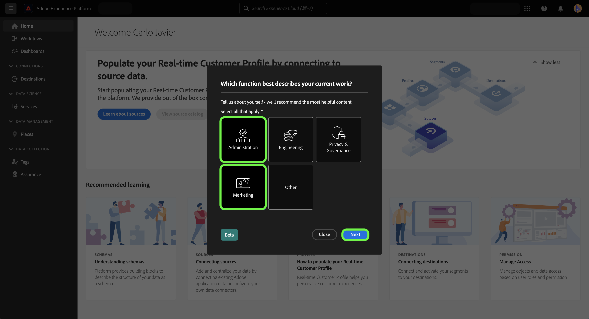
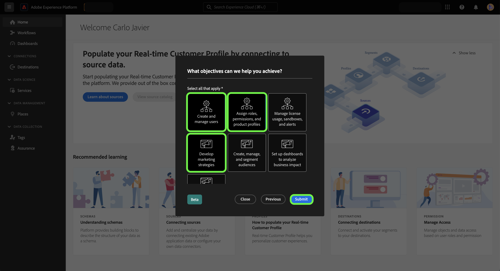
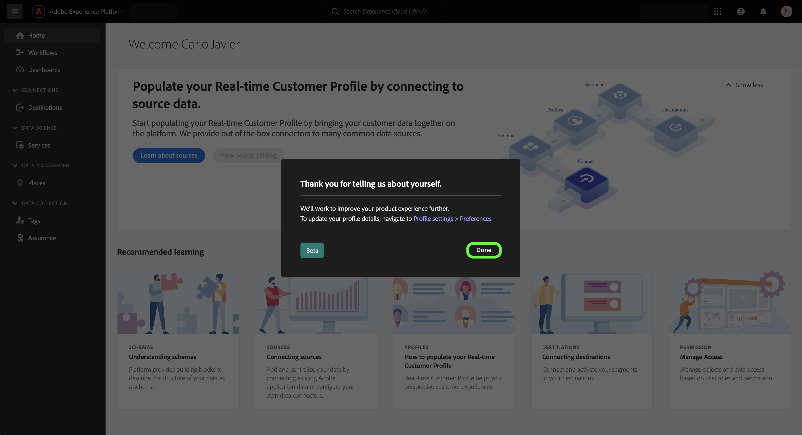
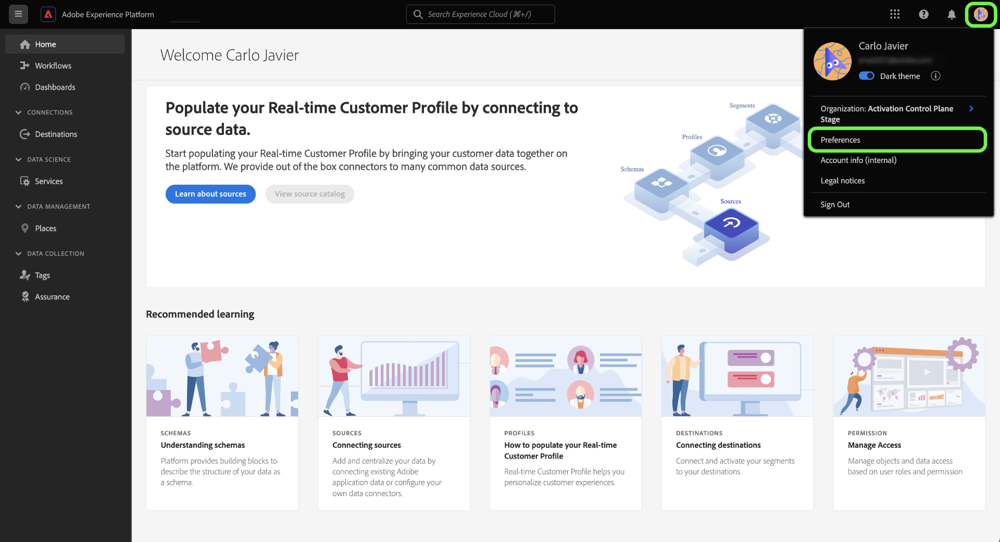
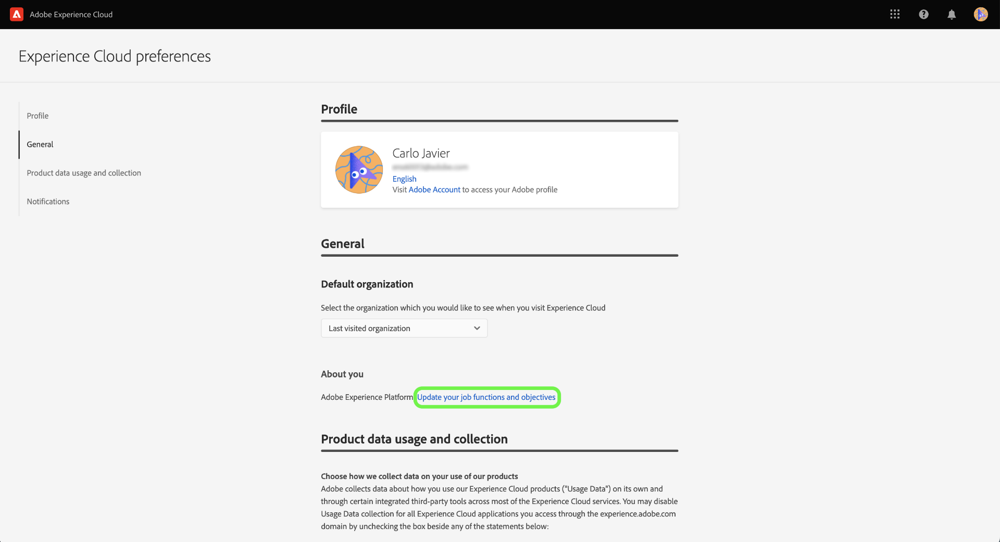
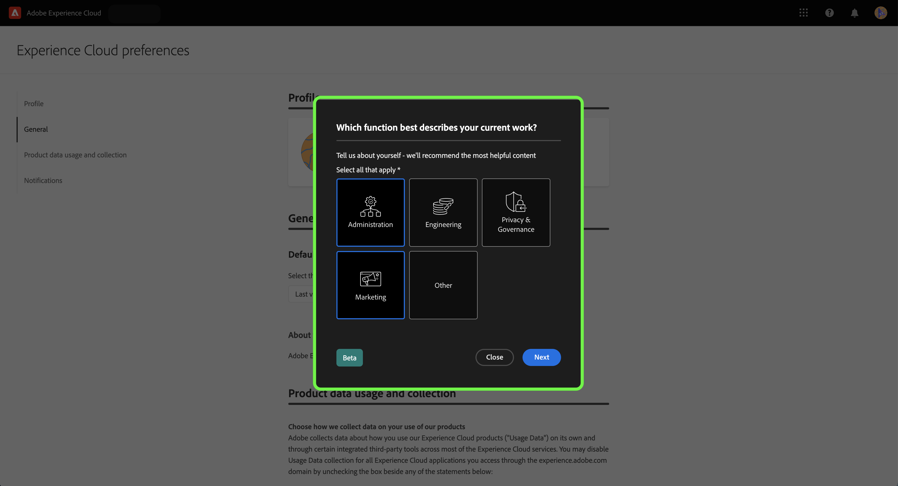

# Use the self-identification survey to build your Experience Platform personal profile

>[!NOTE]
>
>The self-identification survey is in beta. Its features and documentation are subject to change.

The self-identification survey is a short questionnaire presented in the Adobe Experience Platform UI home page. You can fill out the survey to provide information on your job functions and general objectives. This information is then used to better align in-product guides and eventually deliver content that is more relevant to your objectives.

This document provides information on how you can use the self-identification survey in the Experience Platform UI to receive relevant content based on your goals and tasks, as well as how to reconfigure your personal profile attributes using the UI.

To learn more about Adobe Experience Platform, please read the [Experience Platform overview](home.md).

## Self-identification survey in the Experience Platform UI

The self-identification survey prompt appears in the bottom right of the Experience Platform UI home page upon signing in.

To begin the survey, select **[!UICONTROL Start]**.

For the first survey question, select the function that best describes your work. 

The available options are:

* Administration
* Engineering
* Privacy & Governance
* Marketing
* Other

>[!NOTE]
>
>You can select more than one function from the list of options. If you select [!UICONTROL Other], you will be prompted to provide details on your objective.

To proceed, select the function(s) that best describes your current work and then select **[!UICONTROL Next]**.

Next, select the specific objective(s) that best applies to your work.

The list of available objectives include:

* Create and manage users
* Assign roles, permissions, and product profiles
* Manage license usage, sandboxes, and alerts
* Configure the system for data ingestion
* Model my organization's data structure
* Query, filter, and optimize data to generate insights
* Configure consent and data policies
* Data governance and privacy compliance
* Develop marketing strategies
* Create, manage, and segment audiences
* Set up dashboards to analyze business impact
* Activate data to destinations for downstream targeting

When finished, select **[!UICONTROL Submit]**.

With your self-identification survey completed, select **[!UICONTROL Done]**.

>[!NOTE]
>
>Objectives and recommendations (if present) will change based on the select job functions.

## Update your survey responses

Update your job functions and objects using the Experience Cloud preferences menu. To access the preferences menu, select your profile icon on the top navigation and then select **[!UICONTROL Preferences]**.

Next, in the [!UICONTROL General] section of your profile preferences menu, select **[!UICONTROL Update your job functions and objectives]**. 

The self-identification survey appears, allowing you to reconfigure your responses and update your profile.

## Next steps

By reading this document, you have now submitted and updated information regarding your job functions and objectives in order to receive more relevant content when using the Experience Platform UI. For more information on Experience Platform UI, read the [Experience Platform overview](home.md).
