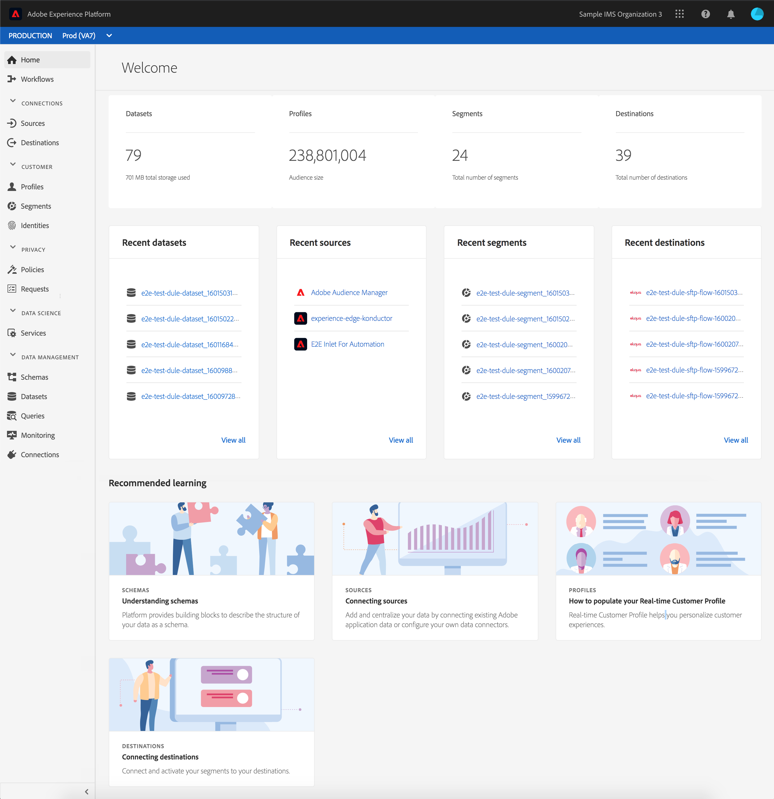
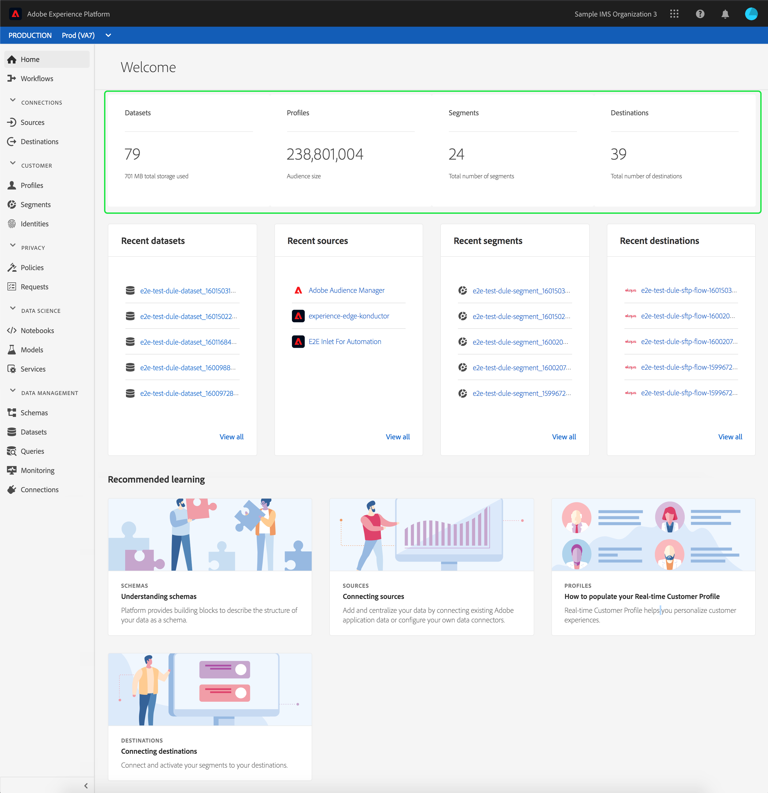
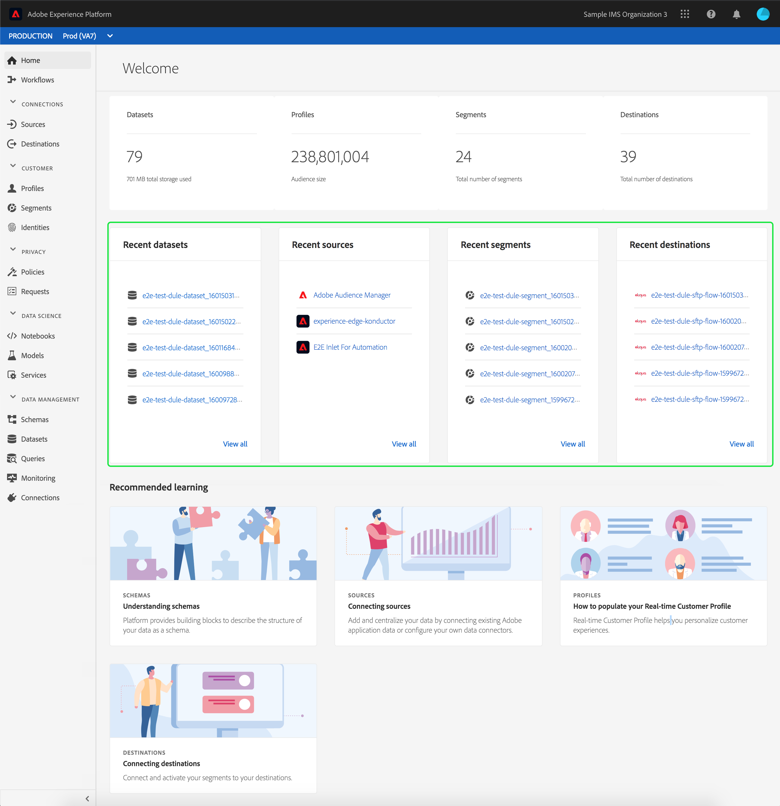
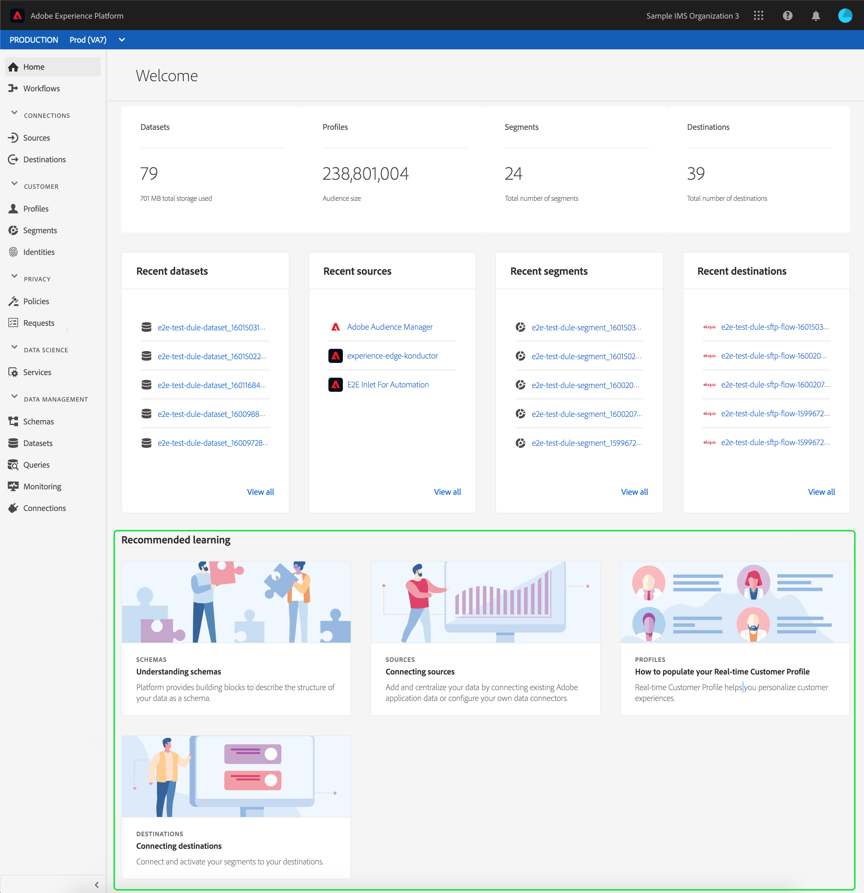
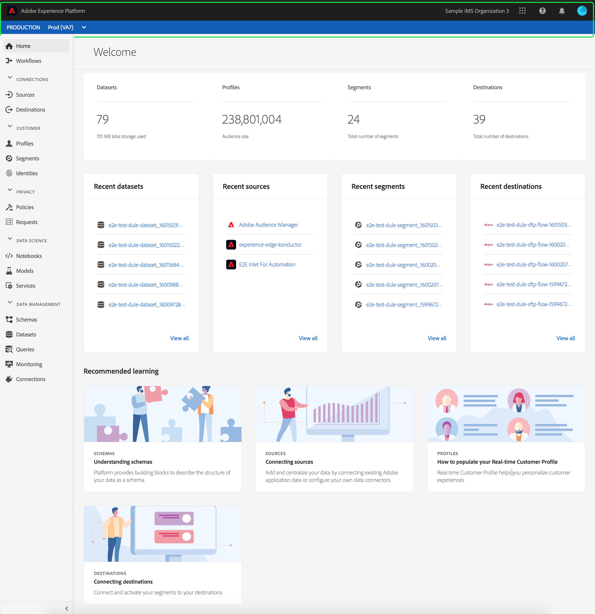
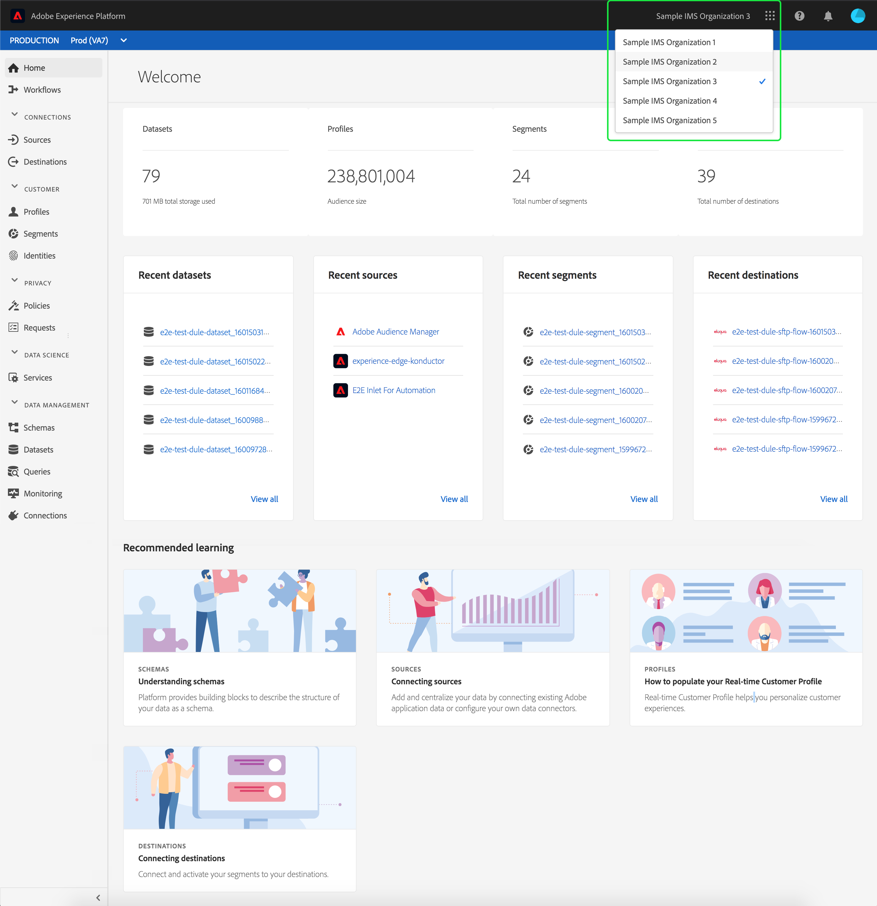
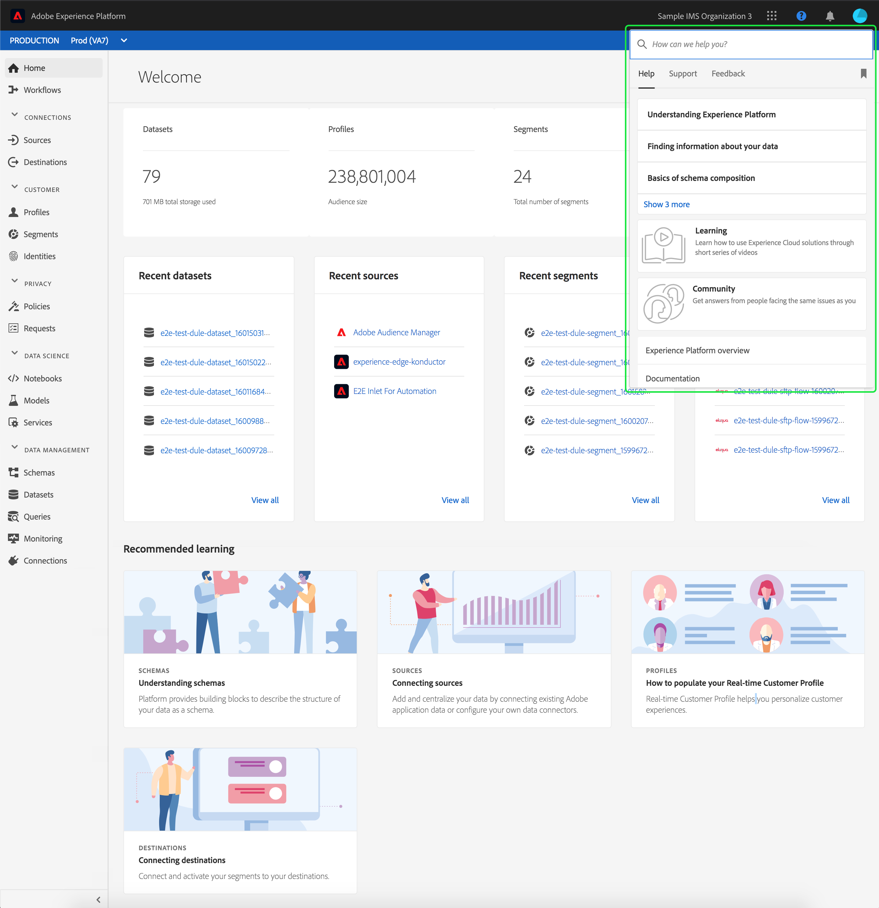
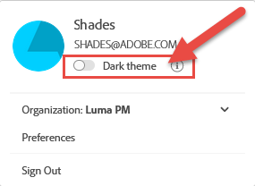
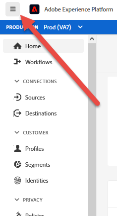
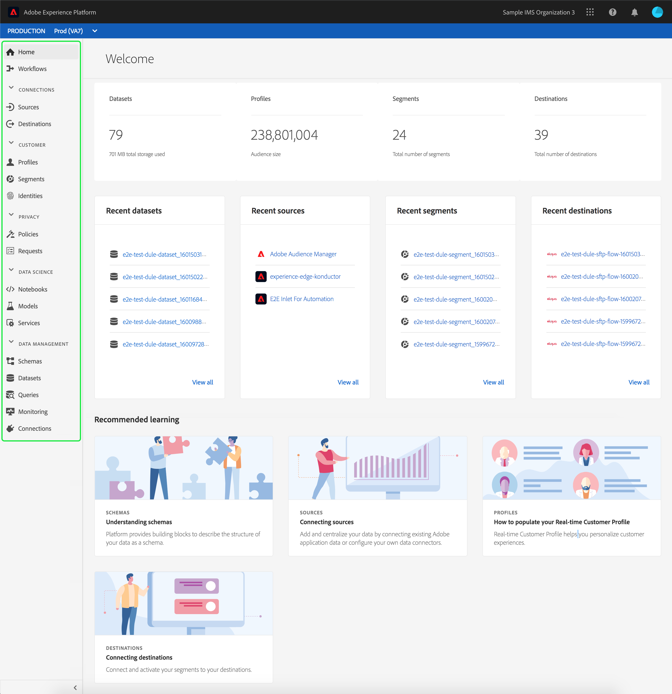

# Adobe Experience Platform UI guide

This guide serves as an introduction to using the Adobe Experience Platform user interface (UI), explaining what the various components are used for and providing links to further documentation for more information.

To learn more about Adobe Experience Platform, please read the [Experience Platform overview](home.md).

## Home screen

After logging into Adobe Experience Platform, you are on the [!UICONTROL Home] page, which is comprised of the [metrics dashboard](#metrics), [recent data](#recent-data), and [recommended learning](#recommended-learning) sections.

### Metrics

The metrics dashboard provides cards that give you information about datasets, profiles, segments, and destinations within your organization.

The **[!UICONTROL Datasets]** section shows the number of datasets within your organization. This number is updated when a new dataset is created. More information about datasets can be found in the [datasets overview](../catalog/datasets/overview.md).

The **[!UICONTROL Profiles]** section shows the total number of people with profiles within your organization, excluding profile fragments. This total number of people represents the total addressable audience, and is updated once every 24 hours. More information about profiles can be found in the [Real-Time Customer Profile overview](../profile/home.md).

The **[!UICONTROL Segments]** section shows the total number of segments created within your organization. This number is updated when a new segment is created. More information about segments can be found in the [Segmentation Service overview](../segmentation/home.md).

The **[!UICONTROL Destinations]** section shows the total number of destinations created for the organization. This number is updated when a new destination is created. More information about destinations can be found in the [destinations overview](../destinations/home.md).

### Recent data

The recent data dashboard provides information about recently created datasets, sources, segments, and destinations.

The **[!UICONTROL Recent datasets]** section lists the five most recently created datasets within your organization. This list is updated every time a new dataset is created. You can select a dataset from the list to view more information about the specified dataset or select **[!UICONTROL View all]** to see a list of all created datasets. More information about datasets can be found in the [datasets overview](../catalog/datasets/overview.md).

The **[!UICONTROL Recent sources]** section lists the five most recently created source connectors within your organization. This list is updated every time a new source connector is created. You can select a source connection from the list to view more information about the specified connector or select **[!UICONTROL View all]** to see a list of all created source connections. More information about sources can be found in the [sources overview](../sources/home.md).

The **[!UICONTROL Recent segments]** section lists the five most recently created segment definitions within your organization. This list is updated every time a new segment definition is created. You can select a segment definition from the list to view more information about the specified segment definition or select **[!UICONTROL View all]** to see a list of all created segment definitions. More information about segments can be found in the [Segmentation Service overview](../segmentation/home.md).

The **[!UICONTROL Recent destinations]** section lists the five most recently created destinations within your organization. This list is updated every time a new destination is created. You can select a destination from the list to view more information about the specified destination or select **[!UICONTROL View all]** to see a list of all created destinations. More information about destinations can be found in the [destinations overview](../destinations/home.md).

### Recommended learning

The **[!UICONTROL Recommended learning]** section provides links to useful documentation to get started with Adobe Experience Platform.

## Top navigation bar

The top navigation bar in the Platform UI displays the organization you are currently signed into, and provides several important controls.

On the left side of the navigation bar is the Adobe Experience Platform logo. Selecting this logo at any time brings you back to the Platform UI home screen.

### Organization switcher

The first item on the right side of the top navigation bar is the **Organization switcher**. 

Selecting the switcher opens a dropdown menu of organizations you have access to, if any are available. To switch to another organization, select a listed option.

### Switch applications

The next item on the right side of the top navigation is the **application switcher**, represented by the  icon. When you select this icon, you can switch between Adobe applications that your organization has access to, such as Experience Platform, Analytics, Assets, and others.

### Help

To the right of the application switcher is the **help and support menu**, which is represented by the  icon. When you select this icon, a popover menu appears, containing several help and support resources. The **[!UICONTROL Help]** tab shows a list of relevant documentation for the page you're currently on. The **[!UICONTROL Support]** tab allows you to create a support ticket with the Adobe support team. The **[!UICONTROL Feedback]** tab allows you to submit feedback about Platform to Adobe.

### Notifications and announcements

In the **notifications section**, which is represented by the  icon. The **[!UICONTROL Notifications]** tab shows important information about the product and other relevant updates, while the **[!UICONTROL Announcements]** tab shows information about service maintenance.

### User profile

The final item on the top navigation bar is the **user settings**, represented by the  icon. Select this icon to edit your preferences or sign out.

You can toggle between the light and dark theme for the Platform interface with the switch located just below your name and email. Select the theme you prefer.

### Sandboxes

Immediately below the top navigation bar is the sandbox bar. This bar shows which sandbox you are currently using for Platform. More information about sandboxes can be found in the [sandboxes overview](../sandboxes/home.md).

## Left navigation {#left-nav}

The navigation on the left side of the screen lists all the different services supported in the Platform UI.

Click the menu icon to show or hide the left navigation panel.

You can lock the navigation in the open position by clicking again after showing the panel.

>[!IMPORTANT]
>
>The left navigation bar shows only the features that you are able to access. In previous versions of Adobe Experience Platform, unavailable items were disabled. If you believe you should have access to a section that does not appear, please contact your system administrator.

The **[!UICONTROL Home]** section lets you return to the Platform UI homepage.

The **[!UICONTROL Workflows]** section shows a list of multi-step workflows for performing operations within Platform. More information about workflows can be found in the [workflows overview](./workflows.md).

### [!UICONTROL Connections]

The **[!UICONTROL Sources]** section lets you create, update, and delete source connections, allowing you to ingest data from external sources into Platform. More information about sources can be found in the [sources overview](../sources/home.md).

The **[!UICONTROL Destinations]** section lets you create, update, and delete destinations, allowing you to export data from Platform to many external destinations. More information about destinations can be found in the [destinations overview](../destinations/home.md).

### [!UICONTROL Customer]

The **[!UICONTROL Profiles]** section lets you browse customer profiles, view profile metrics, create and manage merge policies, and view union schemas. To learn more about using the [!UICONTROL Profiles] section, please read the [[!DNL Profile] user guide](../profile/ui/user-guide.md). More information about Real-Time Customer Profile can be found in the [Real-Time Customer Profile overview](../profile/home.md).

The **[!UICONTROL Segments]** section lets you create and manage segment definitions. To learn more about using the [!UICONTROL Segments] section, please read the [segmentation user guide](../segmentation/ui/overview.md). More information about Segmentation Service can be found in the [Segmentation Service overview](../segmentation/home.md).

The **[!UICONTROL Identities]** section lets you create and manage identity namespaces. For more information about the [!UICONTROL Identities] section, including information about identity namespaces and how to use identities in the Platform UI, please refer to the [identity namespace overview](../identity-service/features/namespaces.md).

### [!UICONTROL Privacy]

The **[!UICONTROL Policies]** section lets you create and manage data usage policies. To learn more about using the Policies section, please read the [data usage policies user guide](../data-governance/policies/user-guide.md). More information about data usage policies can be found in the [data usage policies overview](../data-governance/policies/overview.md).

The **[!UICONTROL Requests]** section lets you create and manage privacy requests. Please note that you must be allowlisted in order to have access to the Privacy Service UI. To learn more about using the Requests section, please read the [Privacy Service user guide](../privacy-service/ui/user-guide.md). More information about Privacy Service can be found in the [Privacy Service overview](../privacy-service/home.md). 

### [!UICONTROL Data Science]

The **[!UICONTROL Notebooks]** section provides access to JupyterLab, an interactive development environment that lets you explore, analyze, and model your data. To learn more about using the Notebooks section, please read the [JupyterLab user guide](../data-science-workspace/jupyterlab/overview.md). More information about Data Science Workspace can be found in the [Data Science Workspace overview](../data-science-workspace/home.md)

The **[!UICONTROL Models]** section lets you use machine learning and artificial intelligence to create, develop, train, and tune models to make predictions. More information about the Models section can be found in the tutorial on [training and evaluate a model](../data-science-workspace/models-recipes/train-evaluate-model-ui.md).

The **[!UICONTROL Services]** section lets you manage your published models for scheduled training and scoring, or use Adobe's Intelligent Services, a set of AI services that deliver real-time, personalized customer experiences. More information about the Services section can be found in the [Publishing a Model as a Service tutorial](../data-science-workspace/models-recipes/publish-model-service-ui.md).

### [!UICONTROL Data management]

The **[!UICONTROL Schemas]** section lets you create and manage Experience Data Model (XDM) schemas. To learn more about schemas, please read the tutorial on [creating a schema](../xdm/tutorials/create-schema-ui.md). More information about XDM can be found in the [XDM System overview](../xdm/home.md).

The **[!UICONTROL Datasets]** section lets you create and manage datasets. More information about datasets can be found in the [datasets user guide](../catalog/datasets/user-guide.md).

The **[!UICONTROL Queries]** section lets you create and manage queries, log SQL queries made by Adobe Experience Platform Query Service, and view your [!DNL PostgreSQL] credentials. More information about queries can be found in the [Query Service user guide](../query-service/ui/overview.md).

The **[!UICONTROL Monitoring]** section lets you monitor batch and streaming ingestion. More information about monitoring can be found in the [monitoring data ingestion user guide](../ingestion/quality/monitor-data-ingestion.md).

### [!UICONTROL Decisioning]

Adobe Journey Optimizer is an application service built on top of Experience Platform. It allows you to use powerful decisioning technologies to deliver the best offer and experience to your customers across all touch points at the right time. To learn more about Journey Optimizer, including working with [!UICONTROL Offers] and [!UICONTROL Activities] visit the [Journey Optimizer documentation](https://experienceleague.adobe.com/docs/journey-optimizer.html).

### [!UICONTROL Administration]

The Platform user interface (UI) provides a dashboard through which you can view important information about your organization's license usage, as captured during a daily snapshot. Access this dashboard by selecting **[!UICONTROL License usage]** in the navigation. To learn more about the license usage dashboard, visit the [license usage dashboard guide](./license-usage-and-guardrails/license-usage-dashboard.md).

>[!IMPORTANT]
>
>The license usage dashboard functionality is currently in alpha and is not available to all users. The documentation and the functionality are subject to change.

## Next steps

By reading this guide, you now have been introduced to the home page and major navigational elements of the Platform UI. For more detailed information about working in the user interface, please refer to the documentation for each individual Platform service. Links to this documentation are provided in the [left navigation](#left-nav) section found earlier in this document.
