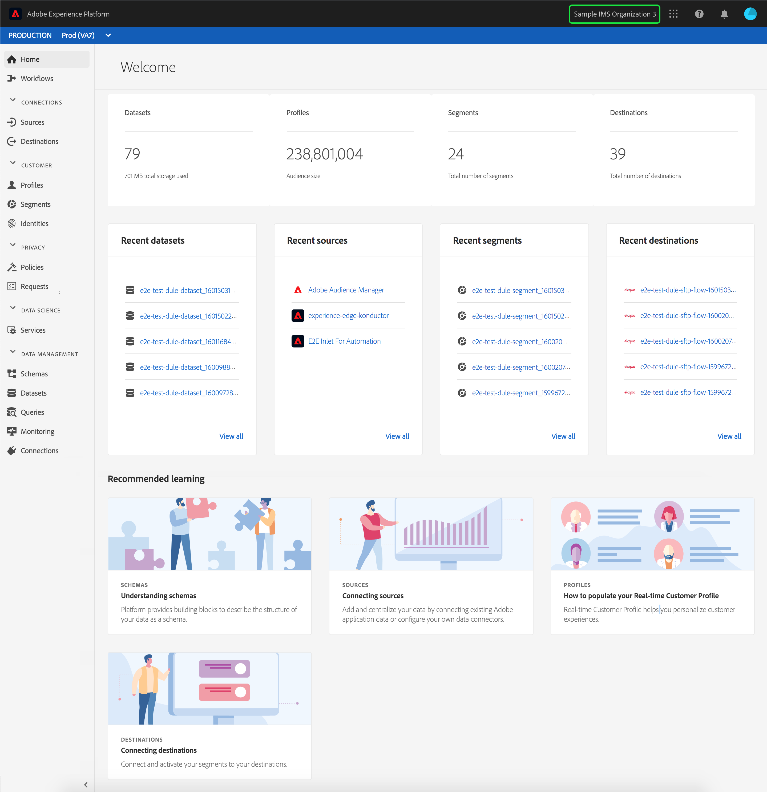
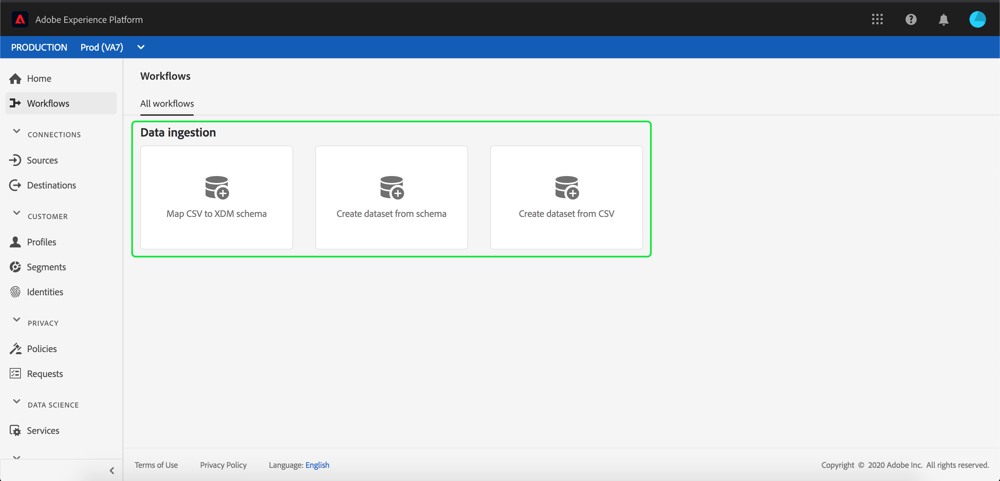

# Adobe Experience Platform user guide

Adobe Experience Platform is the most powerful, flexible, and open system on the market for building and managing complete solutions that drive customer experience. [!DNL Experience Platform] enables organizations to centralize and standardize customer data and content from any system and apply data science and machine learning to dramatically improve the design and delivery of rich, personalized experiences.

This guide serves an introduction to using the Platform user interface, explaining what the various components are used for, and provides links to further documentation for more information.

## Top navigation bar

The top navigation bar in the Platform UI displays the IMS Organization you are currently signed into, and provides several important controls.

On the left side of the navigation bar is the Adobe Experience Platform logo. Selecting this will bring you back to the Platform UI home screen.

The first item on the right side of the navigation bar is the **IMS Organization switcher**. 

Selecting the switcher opens a dropdown menu of IMS Organizations you have access to, if any are available. Select a listed option to switch over to that IMS Organization.

The next item on the right side is the **app switcher**, represented by the  icon. When you select this icon, you can switch between Experience Platform, Assets, Exchange, and Launch.

To the right of the app switcher is the **help menu**, which is represented by the  icon. When you select this icon, a popover menu appears, containing several help and support resources. The **[!UICONTROL Help]** tab shows a list of relevant documentation for the page you're currently on. The **[!UICONTROL Support]** tab allows you to create a support ticket with the Adobe support team. The **[!UICONTROL Feedback]** tab allows you to submit feedback about Platform to Adobe.

After the help menu is the **notifications section**, which is represented by the  icon. The **[!UICONTROL Notifications]** tab shows important information about the product and other relevant updates, while the **[!UICONTROL Announcements]** tab shows notifications about service maintenance.

The final item on the top navigation bar is the **user profile**, which is represented by the  icon. Select this icon to edit your preferences or sign out.

Running along the bottom of the top navigation bar is the sandbox bar. This bar shows which sandbox you are currently using for Platform. More information about sandboxes can be found in the [sandboxes overview](../sandboxes/home.md).

## Left navigation bar

The navigation bar on the left side of the screen lists all the different services supported in the Platform UI.

The **[!UICONTROL Home]** section lets you return to the Platform UI homepage.

The **[!UICONTROL Workflows]** section shows a list of workflows for ingesting data from various sources into Platform.

Within the [!UICONTROL Workflows] section, the following workflows are available:

- The **[!UICONTROL Map CSV to XDM schema]** workflow lets you upload and convert a CSV file to an XDM schema format. More information about this workflow can be found in the [mapping a CSV file to an XDM schema tutorial](../ingestion/tutorials/map-a-csv-file.md).
- The **[!UICONTROL Create dataset from schema]** workflow lets you create a new dataset from a registered XDM schema. More information about this workflow can be found in the [datasets user guide](../catalog/datasets/user-guide.md#schema).
- The **[!UICONTROL Create dataset from CSV]** workflow lets you create a new dataset by uploading a CSV file. More information about this workflow can be found in the [datasets user guide](../catalog/datasets/user-guide.md#csv). 

### [!UICONTROL Connections]

The **[!UICONTROL Sources]** section lets you create, update, and delete source connections, allowing you to ingest data from external sources into Platform. More information about sources can be found in the [sources overview](../sources/home.md).

The **[!UICONTROL Destinations]** section lets you create, update, and delete destinations, allowing you to export data from Platform to many external destinations. More information about destinations can be found in the [destinations overview](../rtcdp/destinations/destinations-overview.md).

### [!UICONTROL Customer]

The **[!UICONTROL Profiles]** section lets you browse customer profiles, view profile metrics, create and manage merge policies, and view union schemas. To learn more about using the [!UICONTROL Profiles] section, please read the [[!DNL Profile] user guide](../profile/ui/user-guide.md). More information about Real-time Customer Profile can be found in the [Real-time Customer Profile overview](../profile/home.md).

The **[!UICONTROL Segments]** section lets you create and manage segment definitions. To learn more about using the [!UICONTROL Segments] section, please read the [segmentation user guide](../segmentation/ui/overview.md). More information about Segmentation Service can be found in the [Segmentation Service overview](../segmentation/home.md).

The **[!UICONTROL Identities]** section lets you create and manage identity namespaces. For more information about the [!UICONTROL Identities] section, including information about identity namespaces and how to use identities in the Platform UI, please refer to the [identity namespace overview](../identity-service/namespaces.md).

### [!UICONTROL Privacy]

The **[!UICONTROL Policies]** section lets you create and manage data usage policies. To learn more about using the Policies section, please read the [data usage policies user guide](../data-governance/policies/user-guide.md). More information about data usage policies can be found in the [data usage policies overview](../data-governance/policies/overview.md).

The **[!UICONTROL Requests]** section lets you create and manage privacy requests. Please note that you must be allowlisted in order to have access to the Privacy Service UI. To learn more about using the Requests section, please read the [Privacy Service user guide](../privacy-service/ui/user-guide.md). More information about Privacy Service can be found in the [Privacy Service overview](../privacy-service/home.md). 

### [!UICONTROL Data Science]

The **[!UICONTROL Notebooks]** section provides access to JupyterLab, an interactive development environment that lets you explore, analyze, and model your data. To learn more about using the Notebooks section, please read the [JupyterLab user guide](../data-science-workspace/jupyterlab/overview.md). More information about Data Science Workspace can be found in the [Data Science Workspace overview](../data-science-workspace/home.md)

The **[!UICONTROL Models]** section lets you leverage machine learning and artificial intelligence to create, develope, train, and tune models to make predictions. More information about the Models section can be found in the tutorial on [training and evaluate a model](../data-science-workspace/models-recipes/train-evaluate-model-ui.md).

The **[!UICONTROL Services]** section lets you manage your published models for scheduled training and scoring, or leverage Adobe's Intelligent Services, a set of AI services that deliver real-time, personalized customer experiences. More information about the Services section can be found in the [Publishing a Model as a Service tutorial](../data-science-workspace/models-recipes/publish-model-service-ui.md).

### [!UICONTROL Data management]

The **[!UICONTROL Schemas]** section lets you create and manage schemas. To learn more about how to use the Schemas section, please read the tutorial on [creating a schema](../xdm/tutorials/create-schema-ui.md). More information about Experience Data Model (XDM) can be found in the [XDM overview](../xdm/home.md).

The **[!UICONTROL Datasets]** section lets you create and manage datasets. More information about the Datasets section can be found in the [datasets user guide](../catalog/datasets/user-guide.md).

The **[!UICONTROL Queries]** section lets you create and manage queries, logs SQL queries made by Query Service, and view your PostgreSQL credentials. More information about the Queries section can be found in the [Query Service user guide](../query-service/ui/overview.md).

The **[!UICONTROL Monitoring]** section lets you monitor batch and streaming ingestion. More information about the Monitoring section can be found in the [monitoring data ingestion user guide](../ingestion/quality/monitor-data-flows.md).

## Metrics dashboard

The metrics dashboard provides cards that gives you information about datasets, profiles, segments, and destinations within your organization.

The **[!UICONTROL Datasets]** section shows the number of datasets within your IMS Organization. This number is updated when a new dataset is created. More information about datasets can be found in the [datasets overview](../catalog/datasets/overview.md).

The **[!UICONTROL Profiles]** section shows the total number of people with profiles within your IMS Organization, excluding profile fragments. This total number of people represents the total addressable audience, and is updated once every 24 hours. More information about profiles can be found in the [Real-time Customer Profile overview](../profile/home.md).

The **[!UICONTROL Segments]** section shows the total number of segments created within your IMS Organization. This number is updated when a new segment is created. More information about segments can be found in the [Segmentation Service overview](../segmentation/home.md).

The **[!UICONTROL Destinations]** section shows the total number of destinations created for the IMS Organization. This number is updated when a new destination is created. More information about destinations can be found in the [destinations overview](../rtcdp/destinations/destinations-overview.md).

## Recent data

The recent data dashboard provides information about recently created datasets, sources, segments, and destinations.

The **[!UICONTROL Recent datasets]** section lists the five most recently created datasets within your IMS Organization. This list is updated every time a new dataset is created. You can select a dataset from the list to view more information about the specified dataset or select **[!UICONTROL View all]** to see a list of all created datasets. More information about datasets can be found in the [datasets overview](../catalog/datasets/overview.md).

The **[!UICONTROL Recent sources]** section lists the five most recently created source connectors within your IMS Organization. This list is updated every time a new source connector is created. You can select a source connection from the list to view more information about the specified connector or select **[!UICONTROL View all]** to see a list of all created source connections. More information about sources can be found in the [sources overview](../sources/home.md).

The **[!UICONTROL Recent segments]** section lists the five most recently created segment definitions within your IMS Organization. This list is updated every time a new segment definition is created. You can select a segment definition from the list to view more information about the specified segment definition or select **[!UICONTROL View all]** to see a list of all created segment definitions. More information about segments can be found in the [Segmentation Service overview](../segmentation/home.md).

The **[!UICONTROL Recent destinations]** section lists the five most recently created destinations within your IMS Organization. This list is updated every time a new destination is created. You can select a destination from the list to view more information about the specified destination or select **[!UICONTROL View all]** to see a list of all created destinations. More information about destinations can be found in the [destinations overview](../rtcdp/destinations/destinations-overview.md).

## Recommended learning

The **[!UICONTROL Recommended learning]** section provides links to useful documentation to get started with Adobe Experience Platform.

## Next steps

By reading this guide, you now have been introduced to the home page and major navigational elements of the Platform UI. It is highly recommended that you read the user guides linked in previous sections for more thorough information about working with Platform services in the user interface.