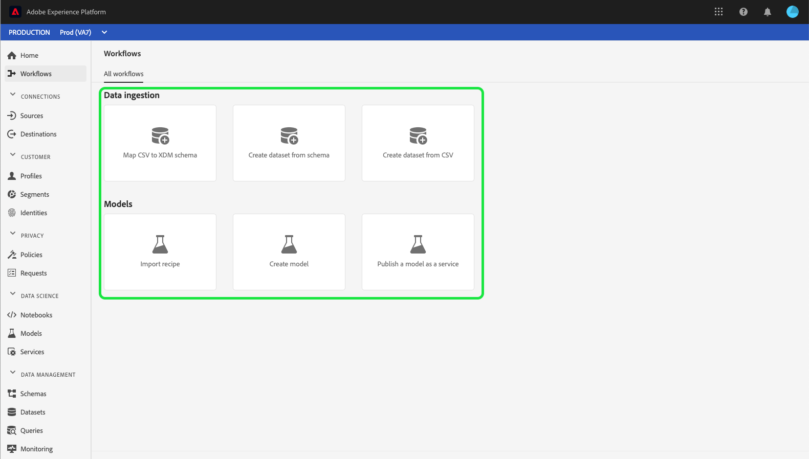

# [!UICONTROL Workflows] UI guide

The **[!UICONTROL Workflows]** section within the Adobe Experience Platform user interface shows a list of multi-step workflows for performing operations within Platform. These workflows cover areas including data ingestion and data science.

## [!UICONTROL Data ingestion]

The **[!UICONTROL Map CSV to XDM schema]** workflow lets you upload and convert a CSV file to an Experience Data Model (XDM) schema. More information about this workflow can be found in the tutorial on [mapping a CSV file to an XDM schema](../ingestion/tutorials/map-csv/overview.md).

The **[!UICONTROL Create dataset from schema]** workflow lets you create a new dataset from an existing XDM schema. More information about this workflow can be found in the [datasets user guide](../catalog/datasets/user-guide.md#schema).

The **[!UICONTROL Create dataset from CSV]** workflow lets you create a new dataset by uploading a CSV file. More information about this workflow can be found in the [datasets user guide](../catalog/datasets/user-guide.md#csv).

## [!UICONTROL Models]

The **[!UICONTROL Import recipe]** workflow lets you import and configure recipes. More information about this workflow can be found in the tutorial on [importing a packaged recipe](../data-science-workspace/models-recipes/import-packaged-recipe-ui.md).

The **[!UICONTROL Create model]** workflow lets you create a machine learning model. More information about this workflow can be found in the [model training and evaluation tutorial](../data-science-workspace/models-recipes/train-evaluate-model-ui.md).

The **[!UICONTROL Publish a model as a service]** workflow lets you publish a created model as a service that can be scored. More information about this workflow can be found in the tutorial on [publishing a model as a service](../data-science-workspace/models-recipes/publish-model-service-ui.md).

## Next steps

By reading this guide, you have been introduced to the [!UICONTROL Workflows] available within the Experience Platform user interface. For more information on Platform UI features and functionality, please read the [Adobe Experience Platform UI guide](ui-guide.md).
