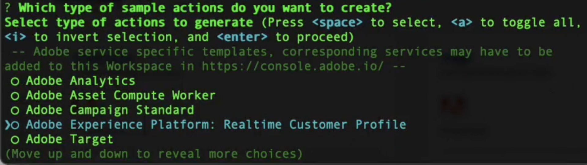
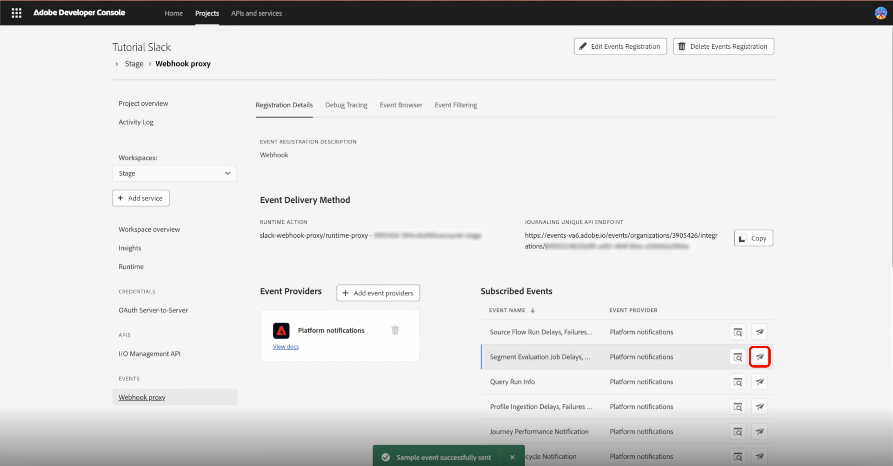

# Slack integration for customer facing alerts

Adobe Experience Platform allows you to use a webhook proxy on [Adobe App Builder](https://developer.adobe.com/app-builder/docs/get_started/app_builder_get_started/first-app) to receive [Adobe I/O Events](https://developer.adobe.com/events/docs/guides/) in [!DNL Slack]. The proxy handles Adobe’s verification handshake and turns event payloads into [!DNL Slack] messages, so you can get customer-facing alerts delivered to your workspace.

## Prerequisites {#prerequisites}

Before starting, ensure you have the following:

* **Adobe Developer Console access**: A System Admin or Developer role in an organization with App Builder enabled.
* **Node.js and npm**: Node.js (LTS recommended), which includes npm for installing the Adobe CLI and project dependencies. For more information, see the [Download Node.js](https://nodejs.org/) and [npm Getting Started guide](https://docs.npmjs.com/getting-started).
* **Adobe I/O CLI**: Install Adobe I/O CLI from your terminal: `npm install -g @adobe/aio-cli`.
* **Slack app with Incoming Webhook**: A Slack app in your workspace with an **Incoming Webhook** enabled. See [Create a Slack app](https://api.slack.com/apps) and the [Slack Incoming Webhooks guide](https://api.slack.com/messaging/webhooks) to create the app and obtain the webhook URL (format: `https://hooks.slack.com/...`).

## Set up a templated project {#templated-project}

To set up a templated project, log into the Adobe Developer Console, then select **[!UICONTROL Create project from template]** from the **[!UICONTROL Home]** tab.


Select the **[!UICONTROL App Builder]** template, then enter a **[!UICONTROL Project Title]** and select **[!UICONTROL Add workspace]**. Finally, select **[!UICONTROL Save]**.


You'll receive confirmation that your project has been created and are taken to the **[!UICONTROL Project overview]** tab. From here you can add a **[!UICONTROL Project description]**.


## Initialize project {#initialize-project}

Once you have your templated project set up, initialize the project.

1. Open your terminal and enter the following command to log in to Adobe I/O.

    ```bash
    aio login
    ```

1. Initialize the application and provide a name.

    ```bash
    aio app init slack-webhook-proxy
    ```

1. Select your `Organization` using the arrow keys, then select the `Project` you created earlier in the Developer Console. Select `Only Templates Supported By My Org` for the templates to search. Next, press **Enter** to skip templates and install a standalone application.

    

1. Specify the Adobe I/O App features you want to enable for this project. Use the arrow keys to scroll and select `Actions: Deploy Runtime actions`.

    

1. Use the arrow keys to scroll and select `Adobe Experience Platform: Realtime Customer Profile` for the type of sample actions you want to create.

    

1. Scroll and select `Pure HTML/JS` for the UI you want to add to your template. Press **Enter** to leave the sample actions as default, then press **Enter** again to leave the name as the default.

    

    You receive confirmation that the app initialization has finished.

1. Navigate to the project directory.

    ```bash
    cd slack-webhook-proxy
    ```

1. Add the web action.

    ```bash
    aio app add action
    ```

1. Select `Only Action Templates Supported By My Org`. A list of templates appears.

    

1. Select the template by pressing the spacebar, then navigate to `@adobe/generator-add-publish-events` using your **Up** and **Down** arrows. Finally, select the template by pressing the **Spacebar** and press **Enter**.

    

    A confirmation that the `npm package @adobe/generator-add-publish-events` has been installed is displayed.

1. Name the action `webhook-proxy`.

    

    A confirmation that the template has been installed is displayed.

## Create the file actions and deploy {#create-file-actions}

Add the proxy code, set environment variables, and then deploy. The action will then be available in the Developer Console for registration.

### Implement the runtime proxy {#runtime-proxy}

>[!NOTE]
>
>Signature verification and challenge handling are automatic when using Runtime Action registration.

Navigate to the project folder and open the file `actions/webhook-proxy/index.js`. Delete the contents and replace with the following:

```
const fetch = require("node-fetch");
const { Core } = require("@adobe/aio-sdk");
 
/**
 * Adobe I/O Events to Slack Runtime Proxy
 *
 * Receives events from Adobe I/O Events and forwards them to Slack.
 * Signature verification and challenge handling are automatic when
 * using Runtime Action registration (non-web action).
 */
async function main(params) {
  const logger = Core.Logger("runtime-proxy", { level: params.LOG_LEVEL || "info" });
 
  try {
    logger.info(`Event received: ${JSON.stringify(params)}`);
 
    // Forward to Slack
    return forwardToSlack(params, params.SLACK_WEBHOOK_URL, logger);
 
  } catch (error) {
    logger.error(`Error: ${error.message}`);
    return { statusCode: 500, body: { error: "Internal server error" } };
  }
}
 
/**
 * Forwards the event payload to Slack
 */
async function forwardToSlack(payload, webhookUrl, logger) {
  if (!webhookUrl) {
    logger.error("SLACK_WEBHOOK_URL not configured");
    return { statusCode: 500, body: { error: "Server configuration error" } };
  }
 
  // Extract Adobe headers passed to runtime action
  const headers = {
    "x-adobe-event-code": payload["x-adobe-event-code"],
    "x-adobe-event-id": payload["x-adobe-event-id"],
    "x-adobe-provider": payload["x-adobe-provider"]
  };
 
  const slackMessage = buildSlackMessage(payload, headers);
 
  const response = await fetch(webhookUrl, {
    method: "POST",
    headers: { "Content-Type": "application/json" },
    body: JSON.stringify(slackMessage)
  });
 
  if (!response.ok) {
    const errorText = await response.text();
    logger.error(`Slack API error: ${response.status} - ${errorText}`);
    return { statusCode: response.status, body: { error: errorText } };
  }
 
  logger.info("Event forwarded to Slack");
  return { statusCode: 200, body: { success: true } };
}
 
/**
 * Builds a Slack Block Kit message from the event payload
 */
function buildSlackMessage(payload, headers) {
  // Adobe passes event code as x-adobe-event-code header (available in params for runtime actions)
  const eventType = headers["x-adobe-event-code"] ||
                    payload["x-adobe-event-code"] ||
                    payload.event_code ||
                    payload.type ||
                    payload.event_type ||
                    "Adobe Event";
  const eventId = headers["x-adobe-event-id"] || payload["x-adobe-event-id"] || payload.event_id || payload.id || "N/A";
  const eventData = payload.data || payload.event || payload;
 
  return {
    blocks: [
      {
        type: "header",
        text: { type: "plain_text", text: `Event: ${eventType}`, emoji: true }
      },
      {
        type: "section",
        fields: formatDataFields(eventData)
      },
      { type: "divider" },
      {
        type: "context",
        elements: [{
          type: "mrkdwn",
          text: `*Event ID:* ${eventId}  |  *Time:* ${new Date().toISOString()}`
        }]
      }
    ]
  };
}
 
/**
 * Formats event data as Slack mrkdwn fields
 */
function formatDataFields(data, maxFields = 10) {
  if (typeof data !== "object" || data === null) {
    return [{ type: "mrkdwn", text: `*Payload:*\n${String(data)}` }];
  }
 
  const entries = Object.entries(data);
  if (entries.length === 0) {
    return [{ type: "mrkdwn", text: "_No data provided_" }];
  }
 
  return entries.slice(0, maxFields).map(([key, value]) => ({
    type: "mrkdwn",
    text: `*${key}:*\n${typeof value === "object" ? `\`\`\`${JSON.stringify(value)}\`\`\`` : value}`
  }));
}
 
exports.main = main;
```

### Configure the action in app.config.yaml {#app-config}

>[!IMPORTANT]
>
>The action configuration in `app.config.yaml` is critical. You must use `web: no` to create a non-web action that can be registered as a Runtime Action in the Developer Console.

Navigate to the project folder and open `app.config.yaml`. Replace the contents with the following:

```
application:
  runtimeManifest:
    packages:
      slack-webhook-proxy:
        license: Apache-2.0
        actions:
          webhook-proxy:
            function: actions/webhook-proxy/index.js
            web: no
            runtime: nodejs:22
            inputs:
              LOG_LEVEL: info
              SLACK_WEBHOOK_URL: $SLACK_WEBHOOK_URL
            annotations:
              require-adobe-auth: false
              final: true
```

### Environment variables {#environment-variables}

>[!IMPORTANT]
>
>The application will not run without a properly configured .env file.

To manage credentials securely, use environment variables. Modify the `.env` file in the root of your project and add:

```
SLACK_WEBHOOK_URL=https://hooks.slack.com/services/YOUR/WEBHOOK/URL
```

### Deploy the action {#deploy-action}

Once the environment variables are set, deploy the action. Make sure you are in the root of your project (`slack-webhook-proxy`) when you run this command in the terminal:

```bash
aio app deploy
```

A confirmation that the deployment was successful is displayed.

>[!IMPORTANT]
>
>Your action is deployed to Adobe I/O Runtime. The action will now be available in the Developer Console for registration.

## Register the action with Adobe I/O Events {#register-events}

Once your action is deployed, register it as the destination for Adobe I/O Events.

In the Developer Console, open your App Builder project, then select your **[!UICONTROL Workspace]**.

On the Workspace overview page, select **[!UICONTROL Add service]** and **[!UICONTROL Event]**.


On the Add events page, select **[!UICONTROL Experience Platform]** and **[!UICONTROL Platform notifications]**, then select **[!UICONTROL Next]**.


Select the events you want to receive notifications for, then select **[!UICONTROL Next]**.


Select your server-to-server authentication credential, then select **[!UICONTROL Next]**.


Enter an **[!UICONTROL Event registration name]** and a clear **[!UICONTROL Event registration description]** for the registration, then select **[!UICONTROL Next]**.


Select **[!UICONTROL Runtime Action]** as the delivery method and the `slack-webhook-proxy/runtime-proxy` action you created, then select **[!UICONTROL Save configured events]**.


Your webhook proxy is now configured. You are returned to the Webhook proxy page. You can test the entire flow end-to-end by selecting the **[!UICONTROL Send sample event]** icon next to any configured event.


