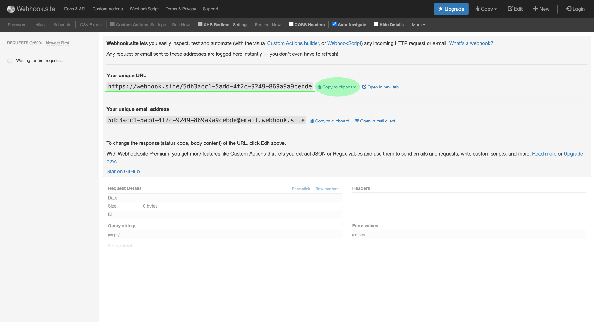
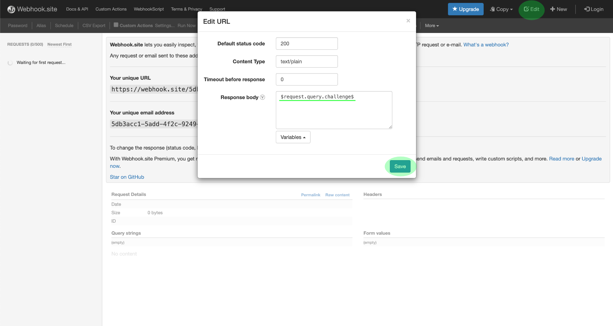
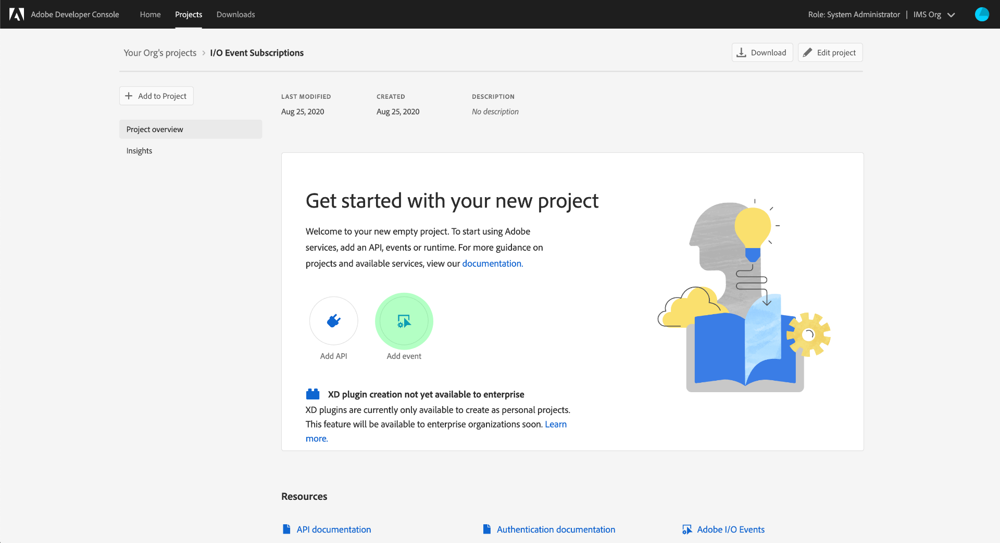
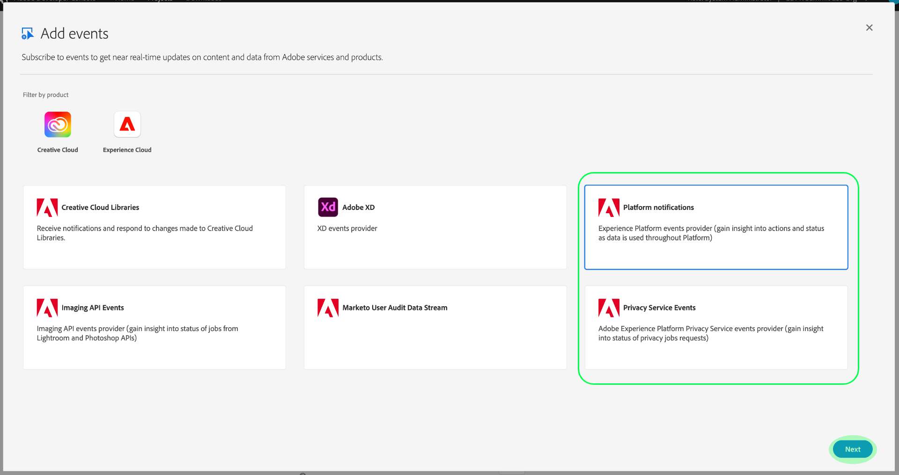
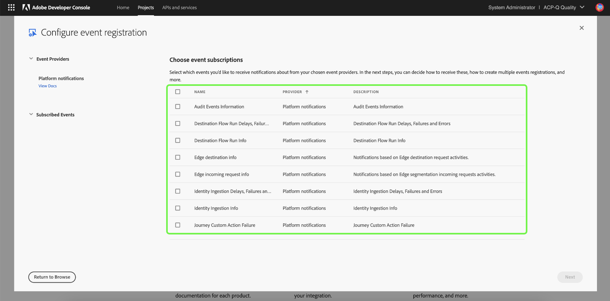
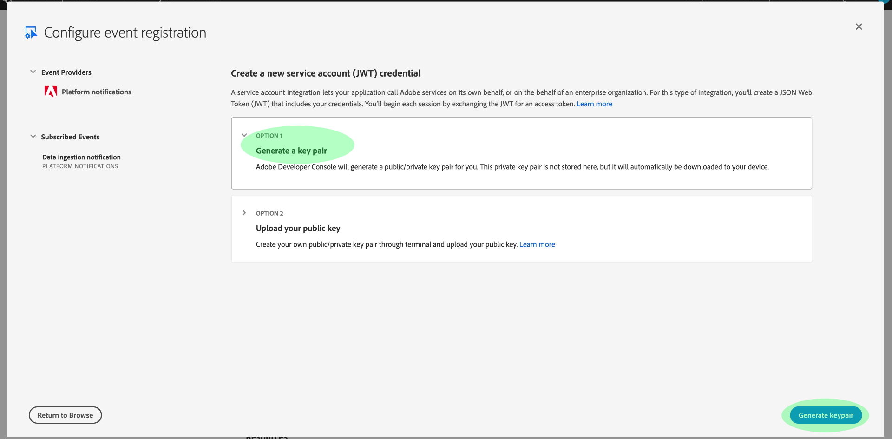
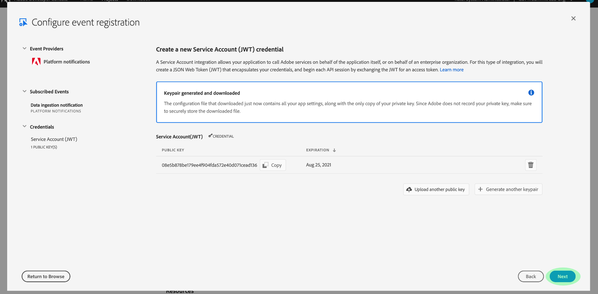
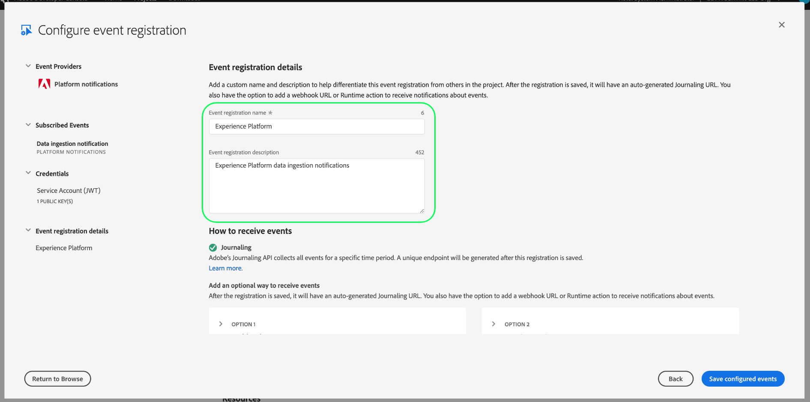
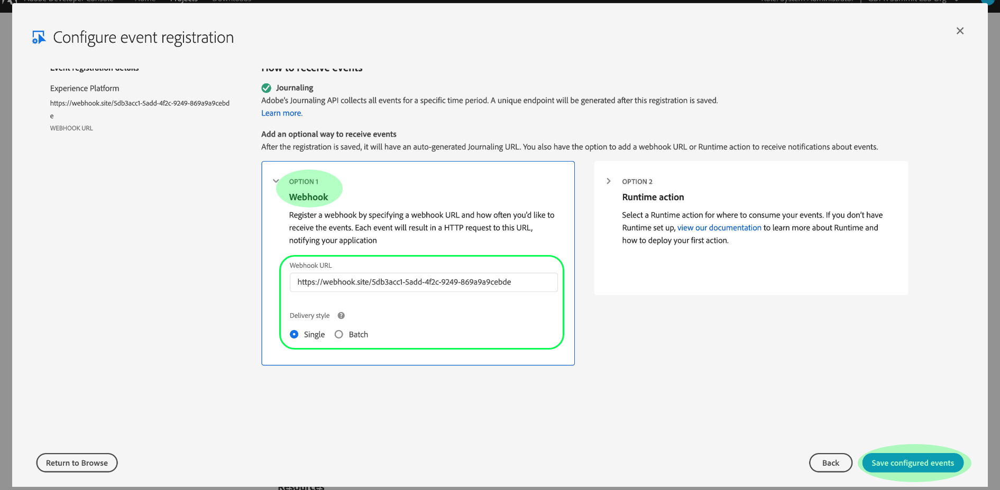
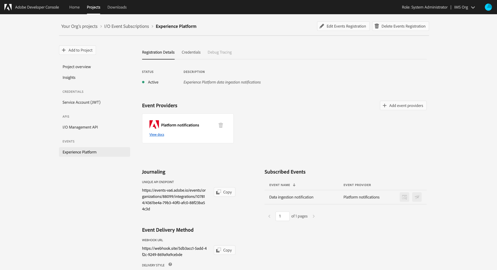

# Subscribe to Adobe I/O Event notifications

[!DNL Observability Insights] allows you to subscribe to Adobe I/O Event notifications regarding Adobe Experience Platform activities. These events are sent to a configured webhook to facilitate efficient automation of activity monitoring.

This document provides steps on how you can subscribe to Adobe I/O event notifications for Adobe Experience Platform services. Reference information regarding available event types is also provided, along with links to further documentation on how you can interpret returned event data for each applicable [!DNL Platform] service.

## Getting started

This document requires a working understanding of webhooks and how to connect a webhook from one application to another. Refer to the [[!DNL I/O Events] documentation](https://www.adobe.io/apis/experienceplatform/events/docs.html#!adobedocs/adobeio-events/master/intro/webhook_docs_intro.md) for an introduction to webhooks.

## Create a webhook

In order to receive [!DNL I/O Event] notifications, you must register a webhook by specifying a unique webhook URL as part of your event registration details.

You can configure your webhook using the client of your choice. For a temporary webhook address to use as part of this tutorial, visit [Webhook.site](https://webhook.site/) and copy the unique URL provided.

During the initial validation process, [!DNL I/O Events] sends a `challenge` query parameter in a GET request to the webhook. You must configure your webhook to return the value of this parameter in the response payload. If you are using Webhook.site, select **[!DNL Edit]** in the top-right corner, then enter `$request.query.challenge$` under **[!DNL Response body]** before selecting **[!DNL Save]**.

## Create a new project in Adobe Developer Console

Go to [Adobe Developer Console](https://www.adobe.com/go/devs_console_ui) and sign in with your Adobe ID. Next, follow the steps outlined in the tutorial on [creating an empty project](https://developer.adobe.com/developer-console/docs/guides/projects/projects-empty/) in the Adobe Developer Console documentation.

## Subscribe to events

>[!NOTE]
>
>The data ingestion notification event has been deprecated in Adobe I/O. Instead, you should use the **Sources Flow Run Info** I/O event.

Once you have created a new project, navigate to that project's overview screen. From here, select **[!UICONTROL Add event]**.

A dialog appears which allows you to add an event provider to your project:

* If you are subscribing to Experience Platform alerts, select **[!UICONTROL Platform notifications]** 
* If you are subscribing to Adobe Experience Platform [!DNL Privacy Service] notifications, select **[!UICONTROL Privacy Service Events]** 

Once you have chosen an event provider, select **[!UICONTROL Next]**.

The next screen displays a list of event types to subscribe to. Select the events you wish to subscribe to, then select **[!UICONTROL Next]**.

>[!NOTE]
>
>If you are unsure which events to subscribe to for the service you are working with, consult the following documentation:
>
>* [Platform notifications](./rules.md)
>* [Privacy Service notifications](../../privacy-service/privacy-events.md)

The next screen prompts you to create a JSON Web Token (JWT). You are given the option to automatically generate a key pair, or upload your own public key generated in the terminal.

For the purposes of this tutorial, the first option is followed. Select the option box for **[!UICONTROL Generate a key pair]**, then select the **[!UICONTROL Generate keypair]** button in the bottom-right corner.

When the key pair generates, it is automatically downloaded by the browser. You must store this file yourself as it is not persisted in the Developer Console.

The next screen allows you to review the details of the newly generated key pair. Select **[!UICONTROL Next]** to continue.

In the next screen, provide a name and description for the event registration in the [!UICONTROL Event registration details] section. Best practice is to create a unique, easily identifiable name to help differentiate this event registration from others on the same project.

Further down on the same screen under the [!UICONTROL How to receive events] section, you can optionally configure how to receive events. **[!UICONTROL Webhook]** allows you to provide a custom webhook address to receive events, whereas **[!UICONTROL Runtime action]** allows you to do the same using [Adobe I/O Runtime](https://www.adobe.io/apis/experienceplatform/runtime/docs.html).

For this tutorial, select **[!UICONTROL Webhook]** and provide the URL of the webhook you created earlier. Once you are finished, select **[!UICONTROL Save configured events]** to complete the event registration.

The details page for the newly created event registration appears, where you can edit its configuration, review received events, perform debug tracing, and add new event providers.

## Next steps

By following this tutorial, you have registered a webhook to receive [!DNL I/O Event] notifications for [!DNL Experience Platform] and/or [!DNL Privacy Service]. For details on available events and how to interpret notification payloads for each service, refer to the following documentation:

* [[!DNL Privacy Service] notifications](../../privacy-service/privacy-events.md)
* [[!DNL Data Ingestion] notifications](../../ingestion/quality/subscribe-events.md)
* [[!DNL Flow Service] (sources) notifications](../../sources/notifications.md)

See the [[!DNL Observability Insights] overview](../home.md) for more information on how you can monitor your activities on [!DNL Experience Platform] and [!DNL Privacy Service].
