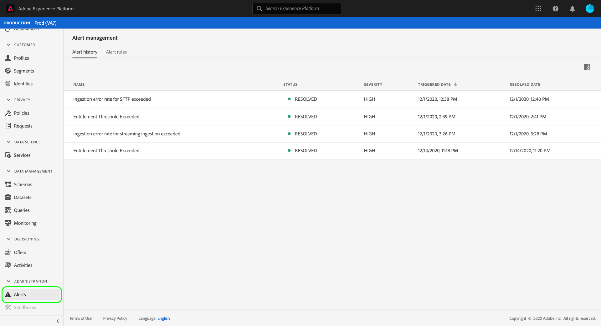

# Alerts UI guide

Adobe Experience Platform Observability Insights allows you to view a history of received alerts, as well as view, enable, and disable available alert rules.

>[!NOTE]
>
>For an introduction to alerts in Experience Platform, see the [alerts overview](./overview.md).

To get started, select **[!UICONTROL Alerts]** in the left navigation.

## [!UICONTROL Alert history]

The **[!UICONTROL Alert history]** tab shows the history of received alerts for your organization, including their current status, severity, triggered date, and resolved date (if applicable).

Select a listed alert and more details appear in the right rail, including a short summary of the alert rule that was triggered.

## [!UICONTROL Alert rules]

The **[!UICONTROL Alert rules]** tab lists the available rules that may trigger an alert. Select a rule from the list to view its description and is configuration parameters in the right rail, including threshold and severity.

The right rail also contains a toggle for enabling or disabling the rule, depending on its current status. Once you select the toggle, the rule's status will update to [!UICONTROL enabling] or [!UICONTROL disabling], and may take a few minutes before updating again to [!UICONTROL enabled] or [!UICONTROL disabled].

## Next steps

This document provided an overview of how to view and manage Observability alerts in the Platform UI. For more information on Observability, see the [overview documentation](../home.md).