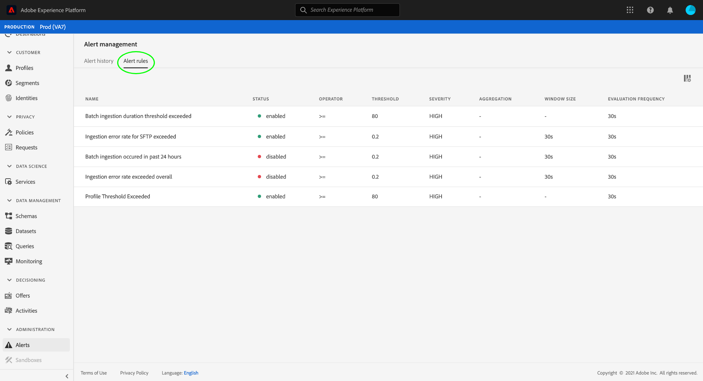

# Alerts UI guide (Alpha)

>[!IMPORTANT]
>
>Alerts in Adobe Experience Platform are not available to all users yet. This feature is in alpha and still being tested. This document is subject to change.

The Adobe Experience Platform user interface allows you to view a history of received alerts based on metrics revealed by Adobe Experience Platform Observability Insights. The UI also allows you to view, enable, and disable available alert rules.

>[!NOTE]
>
>For an introduction to alerts in Experience Platform, see the [alerts overview](./overview.md).

To get started, select **[!UICONTROL Alerts]** in the left navigation.

## [!UICONTROL Alert history]

The **[!UICONTROL Alert history]** tab shows the history of received alerts for your organization, including their current status, severity, triggered date, and resolved date (if applicable).

Select a listed alert and more details appear in the right rail, including a short summary of the alert that was triggered.

## [!UICONTROL Alert rules]

The **[!UICONTROL Alert rules]** tab lists the available rules that may trigger an alert.

Select a rule from the list to view its description and its configuration parameters in the right rail, including threshold and severity.

The right rail also contains a toggle for enabling or disabling the rule, depending on its current status. Once you select the toggle, the rule's status will update to [!UICONTROL enabling] or [!UICONTROL disabling], and may take a few minutes before updating again to [!UICONTROL enabled] or [!UICONTROL disabled].

## Next steps

This document provided an overview of how to view and manage alerts in the Platform UI. See the overview on [Observability Insights](../home.md) for more information on the service's capabilities