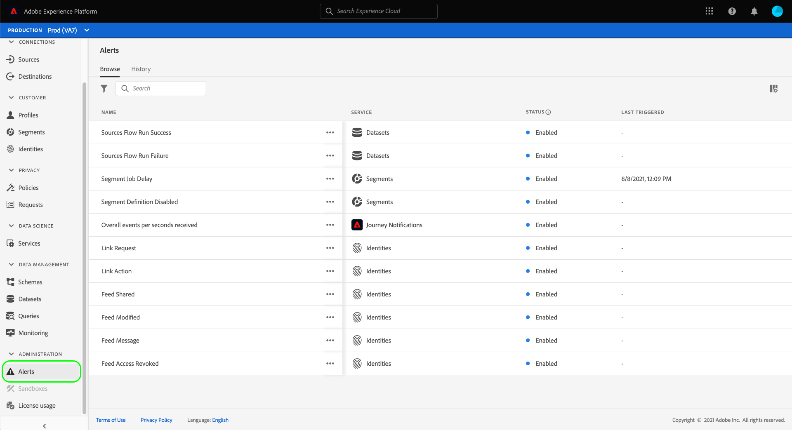
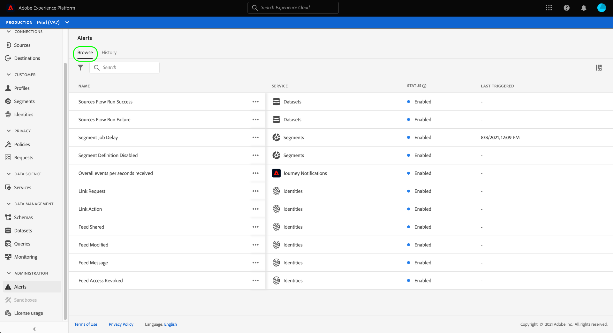
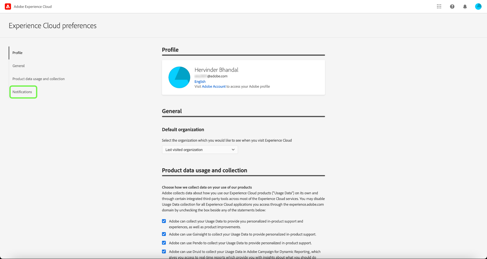
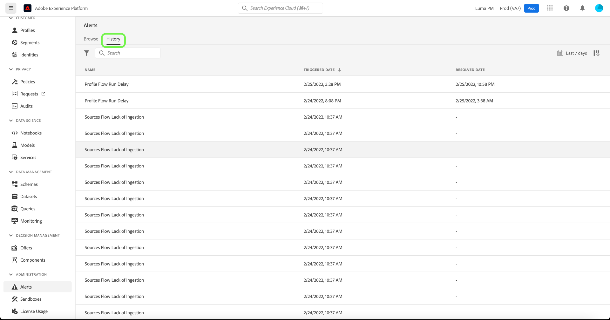

# Alerts UI guide

The Adobe Experience Platform user interface allows you to view a history of received alerts based on metrics revealed by Adobe Experience Platform Observability Insights. The UI also allows you to view, enable, disable, and subscribe to available alert rules.

>[!NOTE]
>
>For an introduction to alerts in Experience Platform, see the [alerts overview](./overview.md).

To get started, select **[!UICONTROL Alerts]** in the left navigation.

## Manage alert rules

The **[!UICONTROL Browse]** tab lists the available rules that may trigger an alert.

Select a rule from the list to view its description and its configuration parameters in the right rail, including threshold and severity.

Select the ellipsis (**...**) next to a rule's name, and a dropdown displays controls to enable or disable the alert (depending on its current status), and to subscribe or unsubscribe to email notifications for the alert.

## Enable email alerts

Alert notifications can be delivered direct to your email. 

Select the bell icon () located in the top ribbon on the right to display notifications and announcements. In the dropdown that appears, select the cog icon () to access the Experience Cloud preferences page.

The **Profile** tab is displayed. Select the **[!UICONTROL Notifications]** in the left navigation to access the email alerts preferences.

Scroll to the **Emails** section at the bottom of the page and select **[!UICONTROL Instant notifications]** 

Any alerts that you are subscribed to will now be delivered to the email address that is connected to your Adobe ID account.

## View alert history

The **[!UICONTROL History]** tab shows the history of received alerts for your organization, including the rule that triggered the alert, triggered date, and resolved date (if applicable).

Select a listed alert and more details appear in the right rail, including a short summary of the event that triggered the alert.

## Next steps

This document provided an overview of how to view and manage alerts in the Platform UI. See the overview on [Observability Insights](../home.md) for more information on the service's capabilities.
