# Alerts UI guide

In Adobe Experience Platform, you can view a history of alerts your organization has received, based on metrics from observability insights. You can also browse available alert rules and turn them on or off, subscribe to them, and manage who receives email notifications.

>[!NOTE]
>
>For an introduction to alerts in Experience Platform, see the [alerts overview](./overview.md).

To get started, select **[!UICONTROL Alerts]** in the left navigation.

![Alerts page highlighting [!UICONTROL Alerts] in the left navigation.](../images/alerts/ui/workspace.png)

## Manage alert rules {#manage-rules}

The **[!UICONTROL Browse]** tab lists the available rules that may trigger an alert. Select a rule from the list to view its description and its configuration parameters in the right panel, including threshold and severity.

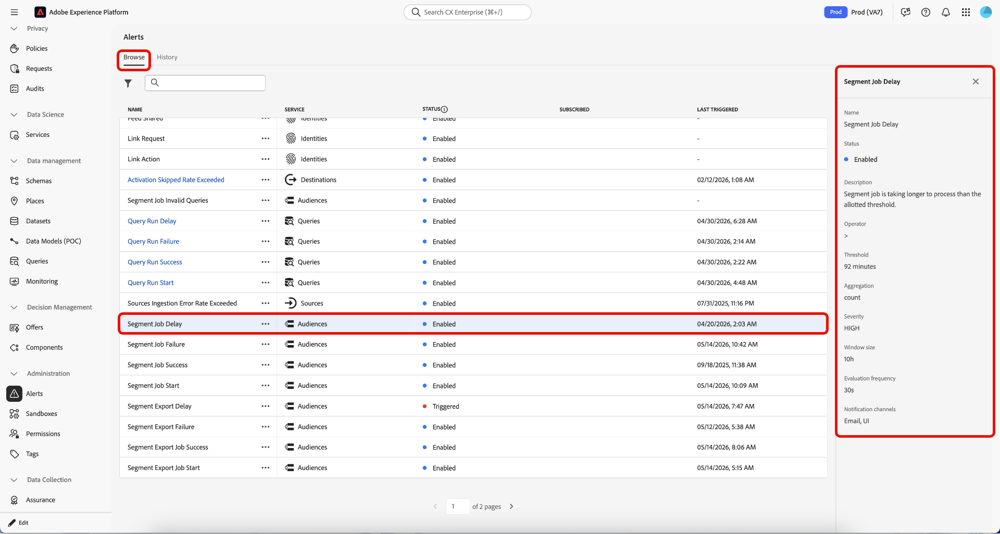

Select the ellipsis (**...**) next to a rule's name. A menu opens where you can enable or disable the alert (depending on its current status) and subscribe or unsubscribe from email notifications for that rule.

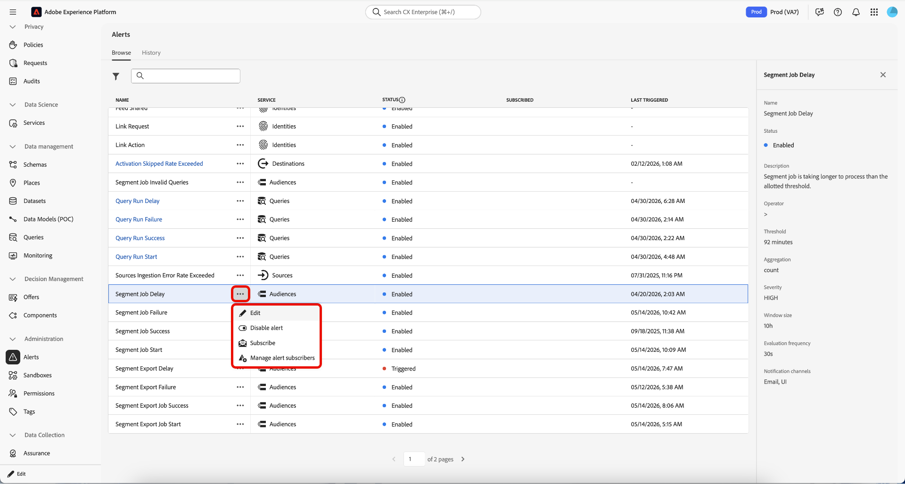

## Manage alert subscribers {#manage-subscribers}

>[!NOTE]
>
> To assign an alert to an Adobe user ID, an external email address, or an email group list, you must be an administrator. 

On the **[!UICONTROL Browse]** tab, select the ellipsis (**...**) next to the rule you want to manage, then select **[!UICONTROL Manage alert subscribers]**.

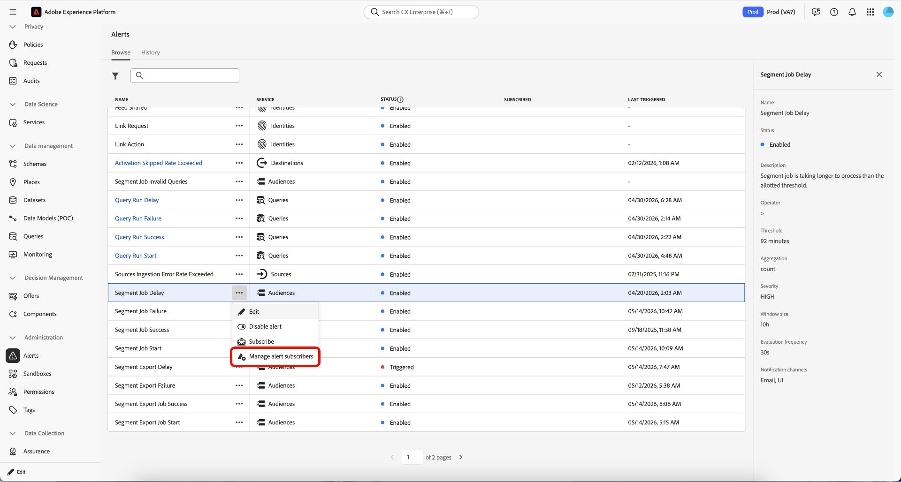

The **[!UICONTROL Manage alert subscribers]** page opens. To add subscribers, enter an Adobe user ID, an external email address, or an email group list, then press **Enter**.

>[!NOTE]
>
>To add several subscribers at once, enter user IDs or email addresses separated by commas.

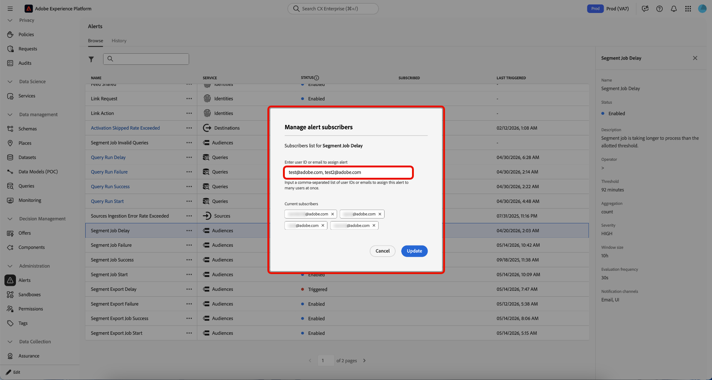

Added addresses appear in the subscribers list. Select **[!UICONTROL Update]**.

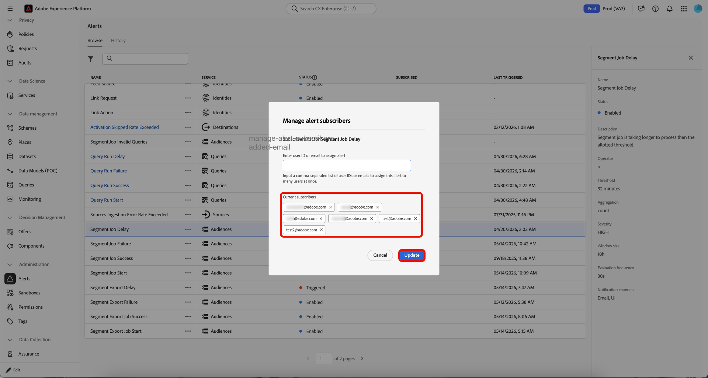

Once subscribers have been added successfully, they will receiving email notifications for this alert.

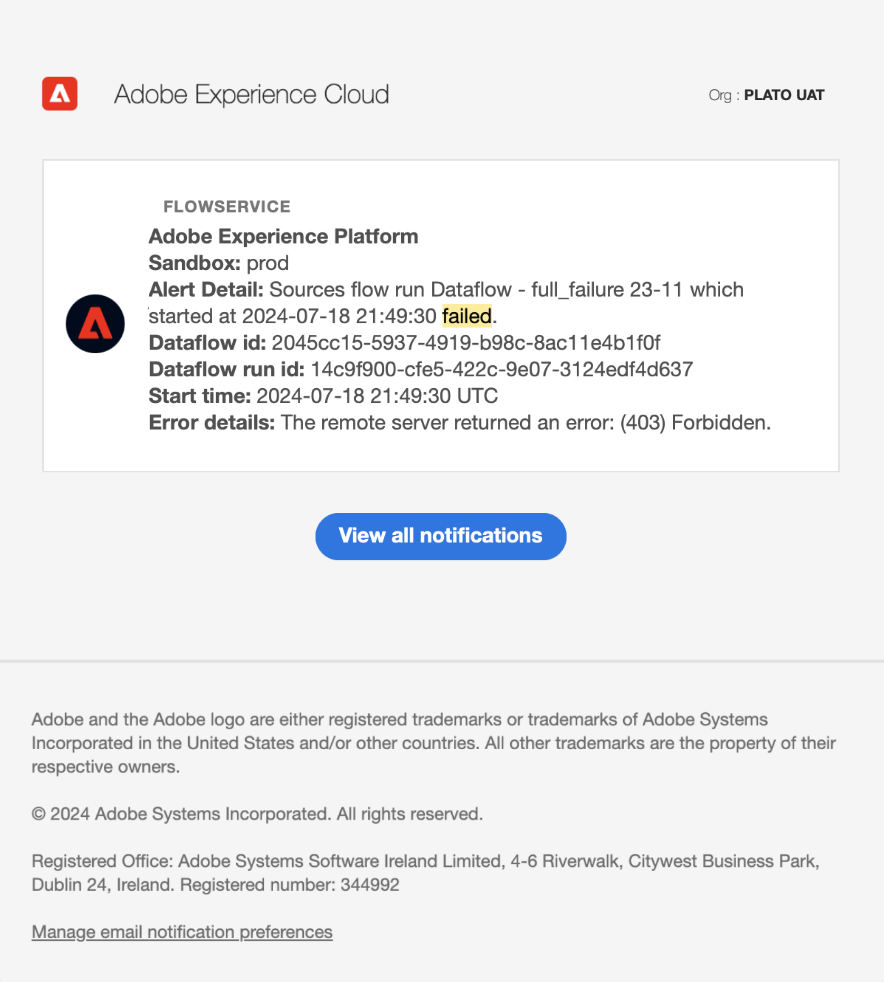

## Enable email alerts {#enable-email}

To have alert notifications delivered to your inbox, select the bell icon () in the upper-right toolbar to open notifications and announcements. From the dropdown, select the settings icon () to open Experience Cloud preferences.

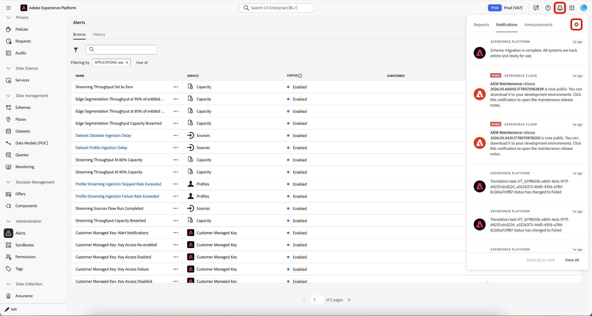

The **[!UICONTROL Profile]** page opens. Select **[!UICONTROL Notifications]** in the left navigation to open email preferences. Scroll to the **Emails** section at the bottom of the page and select **[!UICONTROL Instant notifications]**.

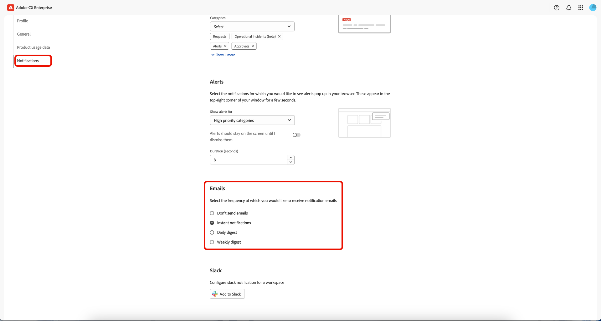

Alerts you are subscribed to are sent to the email address linked to your Adobe ID.

## Customize alert threshold {#alert-threshold}

Alert thresholds can be customized for the following alert types:

| Alert type | Customized parameter |
|---|---|
| Segment Job Delay | Delay threshold |
| Segment Export Delay | Delay threshold |
| Destination Flow Run Delay | Delay threshold |
| Identity Service Flow Run Delay | Delay threshold |
| Profile Flow Run Delay | Delay threshold |
| Profile Streaming Ingestion Failure Rate Exceeded | Error threshold |
| Profile Streaming Ingestion Skip Rate Exceeded | Error threshold |
| Sources Flow Run Delay | Delay threshold |
| Sources Ingestion Error Rate Exceeded | Error threshold |
| Query Run Delay | Delay threshold |
| Activation Skip Rate Exceeded | Error threshold |

Select the ellipsis (**...**) next to a rule's name, then select **[!UICONTROL Edit]**.

![The [!UICONTROL Edit] option is highlighted for the selected rule.](../images/alerts/ui/threshold-edit.png)

On the **[!UICONTROL Customize alert]** page, set the threshold for that rule to your desired time (in minutes), then select **[!UICONTROL Confirm]**.

![The Customize alert page highlighting [!UICONTROL Threshold] and [!UICONTROL Confirm] options.](../images/alerts/ui/threshold-update.png)

You return to the **[!UICONTROL Alerts]** page. To check the threshold, select the rule in the list. The right panel shows the threshold, status, severity, and other details.

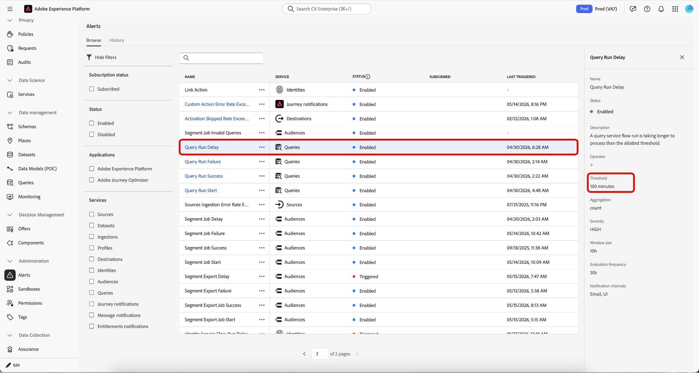

## View alert history {#alert-history}

The **[!UICONTROL History]** tab lists alerts your organization has received, including the rule that triggered the alert, the related object name, when the alert was triggered, and when it was resolved (if applicable).

![Received alerts listed on the [!UICONTROL History] tab.](../images/alerts/ui/history.png)

Select an alert from the list to view more details in the right panel, including a short summary of what triggered it. Use global search to find and open the related object.

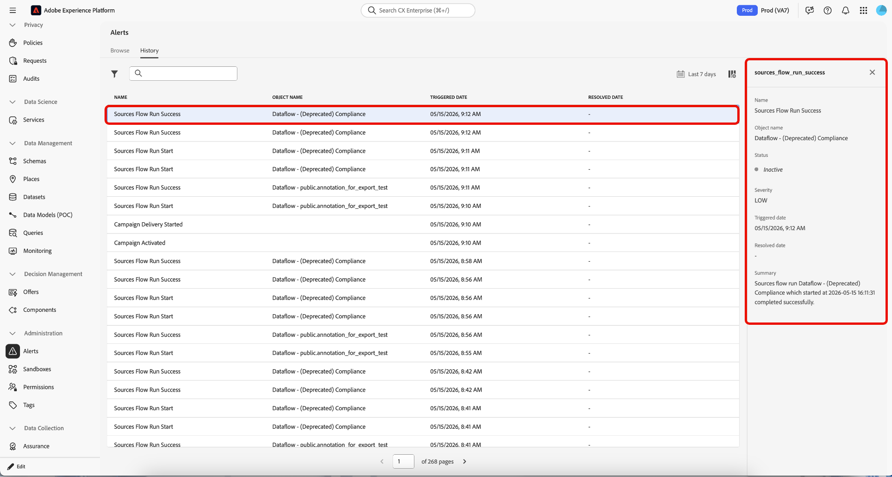

### Search alerts by alert name

In the search bar, enter text to match the **alert name**. The list updates to show matching alerts.

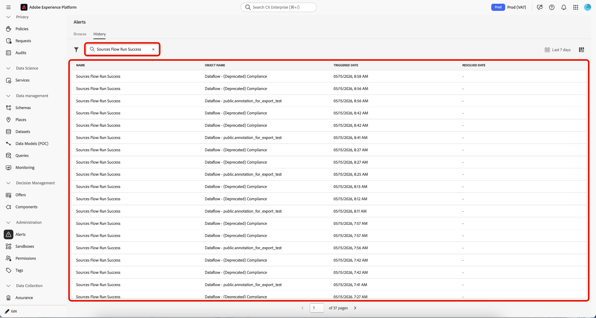

### Search alerts by object name

To filter by **object name**, select the filter icon (), then enter the object name in the search bar. The list shows alerts associated with that object.

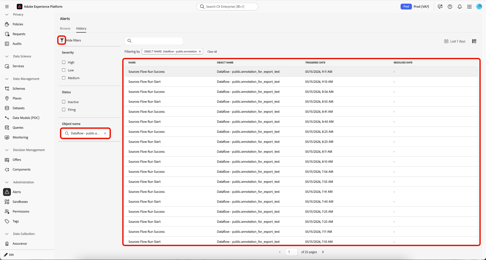

### Search alerts by date range

Select the calendar icon () in the upper right to limit results to alerts triggered in a specific period.

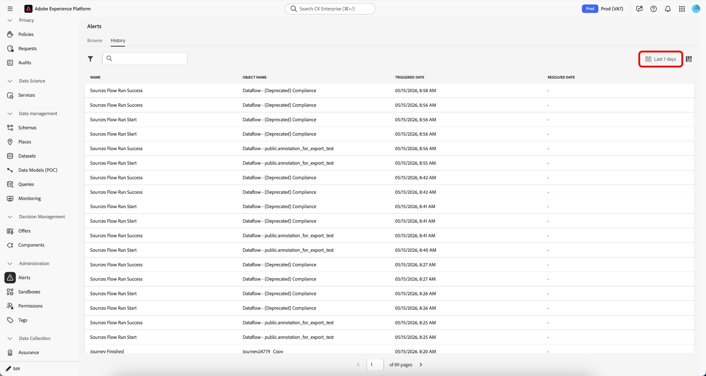

Select a preset (**[!UICONTROL Last 24 hours]**, **[!UICONTROL Last 7 days]**, or **[!UICONTROL Last 30 days]**) or set a custom range in the calendar, then select **[!UICONTROL Apply]**.

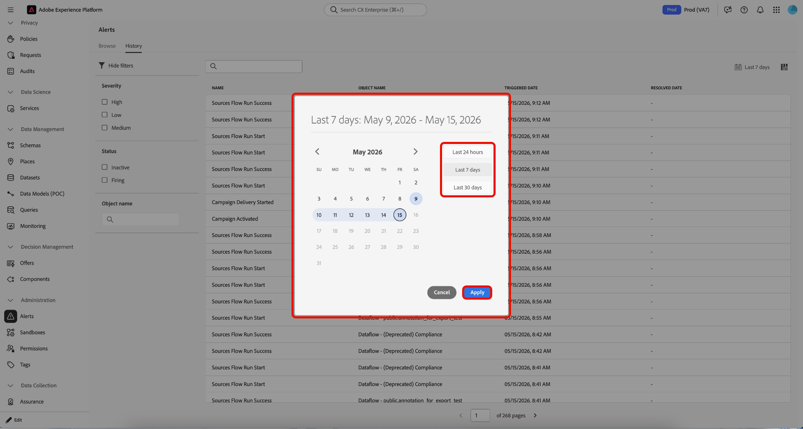

You return to the **[!UICONTROL History]** tab which shows the filtered results.

## Next steps

This guide showed how to view and manage alerts in the Experience Platform UI. See the [[!DNL Observability Insights] overview](../home.md) for more ways to monitor activity across Experience Platform.

