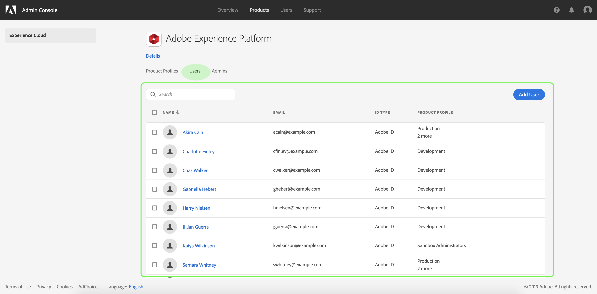
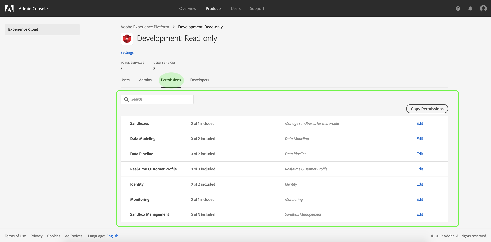
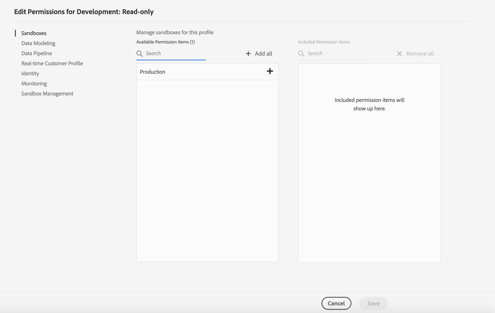
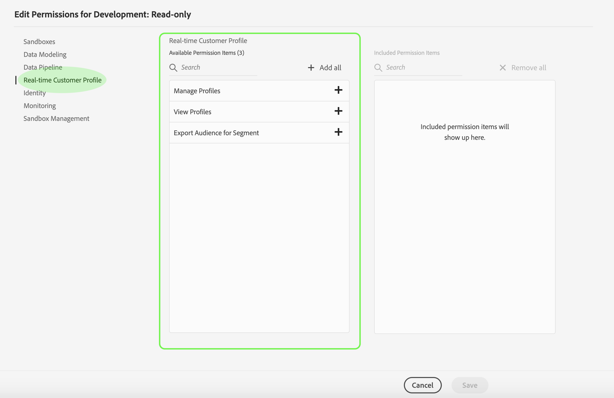
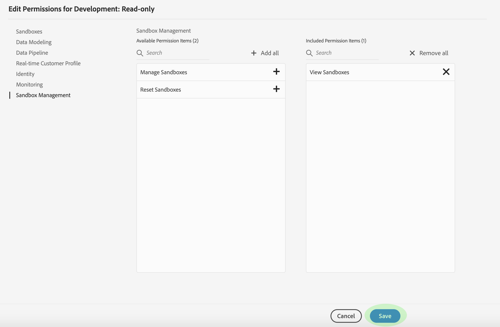
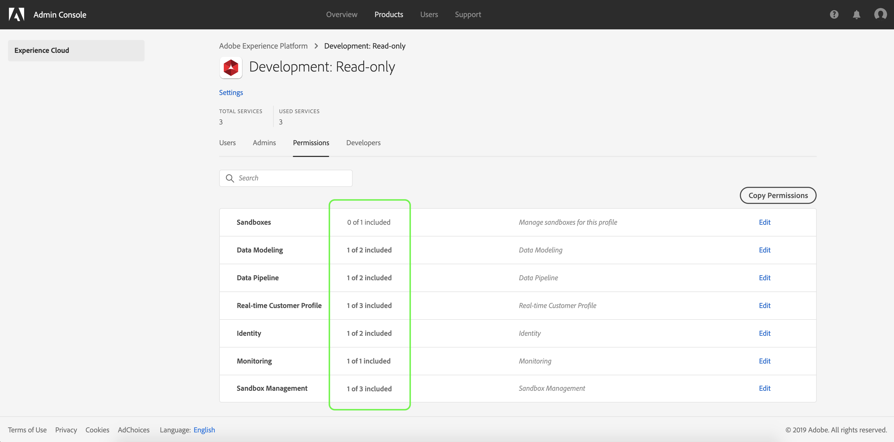
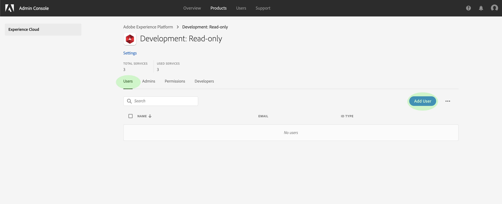

# Access control

Access control in Adobe Experience Platform allows you to manage roles and permissions for various Platform capabilities by using the [Adobe Admin Console](https://adminconsole.adobe.com). This document serves as a guide for how to perform various access control tasks for Platform using the Admin Console.

<!-- (Add to line 3 once access control overview is published)
For a high-level overview of access control in Experience Platform, see the [access control overview](access_control_overview.md). 
-->

The following tasks are covered:

* [Access the Admin Console](#access-the-admin-console)
* [Browse the access control workspace](#browse-the-access-control-workspace)
* [Create a new product profile](#create-product-profile)
* [Manage permissions for a product profile](#manage-permissions-for-a-product-profile)
* [Manage users for a product profile](#manage-users)

## Access the Admin Console {#access-the-admin-console}

In order to configure access control for Experience Platform through the Adobe Admin Console, you must be an administrator for an IMS Organization that has a Platform product integration. While Adobe supports flexible admin hierarchies for IMS Orgs, you must have **system admin**, **product admin**, or **product profile admin** privileges to configure access control. See the Adobe Help Center article on [administrative roles](https://helpx.adobe.com/enterprise/using/admin-roles.html) for more information.

If you do not have admin privileges, contact your system administrator to gain access.

Once you have admin privileges, go to [Adobe Admin Console](https://adminconsole.adobe.com) and sign in using your Adobe credentials. Once logged in, the _Overview_ page appears for the IMS Org you have admin privileges for. This page shows the products that your IMS Org has integrations with, along with other controls to add users and admins to the IMS Org as a whole. Click **Adobe Experience Platform** to open the access control workspace for your Platform integration.

The access control workspace for Adobe Experience Platform appears, allowing you to view all product profiles and manage various settings as outlined in this document.

## Browse the access control workspace {#browse-the-access-control-workspace}

The access control workspace has three main navigation tabs:

* Product Profiles
* Users
* Admins

The following sections outline the features of these tabs in more detail.

### Product Profiles

The _Product Profiles_ tab displays all created product profiles for your Platform integration. Product profiles are collections of permissions for specific Platform capabilities to which individual users can be assigned. A single profile can be assigned to any number of users. You can click a profile from the list to view and edit its details, or start the process of creating a new profile by clicking **New Profile**. Steps for creating and managing product profiles are provided later in this guide.

### Users

The _Users_ tab displays a list of all users that have been assigned to one or more of the product profiles created for your IMS Org's Platform integration. The list displays the users' names, email addresses, ID types, and the product profiles they have been assigned to.

### Admins

Similar to the _Users_ tab, the _Admins_ tab displays a list of all users who have admin privileges for this product integration. The list displays the admins' names, email addresses, and ID types.

## Create a new product profile {#create-product-profile}

To start creating a new profile, navigate to the _Product Profiles_ tab and click **New Profile**.

The _Create New Profile_ dialog appears, prompting you to enter a **Profile Name** and **Description** for the new profile. If you want the profile's display name to be different, uncheck **Same as Profile Name** and enter the display name in the text box that appears. Under _User Notifications_, you can toggle whether users will be notified by email when they are added or removed from the profile.

When finished, click **Next**.

 

The next screen prompts you to choose which Platform services to include in the profile. Click the toggle button next to a service to disable it. If a service is disabled, all functions associated with that service will not be available to users assigned to this product profile. When finished, click **Done**.

 

The new product profile is successfully created, and you are redirected to the profile's [edit permissions page](#edit-permissions). See the sections on [managing permissions](#managing-permissions-for-a-product-profile) and [managing users](#managing-users-for-a-product-profile) for more details on how to manage product profiles once they are created.

## Manage permissions for a product profile {#manage-permissions-for-a-product-profile}

Immediately after [creating a new product profile](#creating-a-new-product-profile), you are prompted to configure the profile's permissions. If you are editing permissions for an existing profile, select the profile from the _Product Profiles_ tab to open the profile's details page, then click **Permissions**.

Permissions are divided into categories and listed on this page. The list displays the category name, the number of permissions it contains (and how many are active), and its description.

Click any category on the list to open the _Edit Permissions_ page.

### Edit permissions

The _Edit Permissions_ page provides a workspace to add and remove permissions from the selected product profile. The left side of the screen displays a list of permission categories. Clicking a category changes the permissions that are displayed under _Available Permissions Items_.

To add a permission, click the **plus (+)** icon next to the permission's name. Alternatively, you can click **Add all** to add all permissions under the current category to the profile. Added permissions appear under _Included Permission Items_.

> **Note**: The _Included Permissions Items_ list only displays added permissions from the currently selected category.

To remove a permission, click the **X** icon next to the permission's name, or select **Remove all** to remove all permissions under the current cateogry. Removed permissions reappear under _Available Permission Items_.

Continue going through the available categories and adding any desired permissions. When finished, click **Save**.

The _Permissions_ tab for the product profile reappears, and shows that the selected permissions are now active.

## Manage users for a product profile {#manage-users}

To assign or remove users from a product profile, open the profile's details page an navigate to the _Users_ tab. From here, click **Add User**.

The _Add User_ dialog appears. Using the search field, you can lookup users to add either by name or by email. As you type, matching users will appear in an autocomplete window below the textbox.

 

> **Note:** If a user does not appear in the autocomplete window, enter their complete email address in the search bar. An invite will be sent to the email with instructions on setting up an Adobe ID account.

Once you have selected a user, click **Save** to add them to the product profile.

 

The _Users_ tab for the product profile reappears, where the added user is now listed.

## Next steps

Repeat the above steps to continue adding users as necessary.

<!-- (Add once access control overview is published)
Now that you have learned how to control access to Platform features through the Admin Console, see the appendix section in the [access control overview](access_control_overview.md) to learn more about each individual permission and the Platform functionalities they grant access to.  
-->