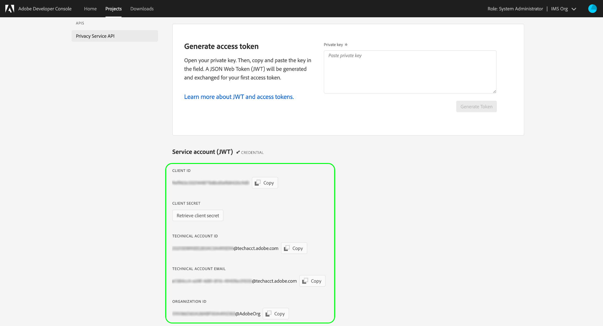
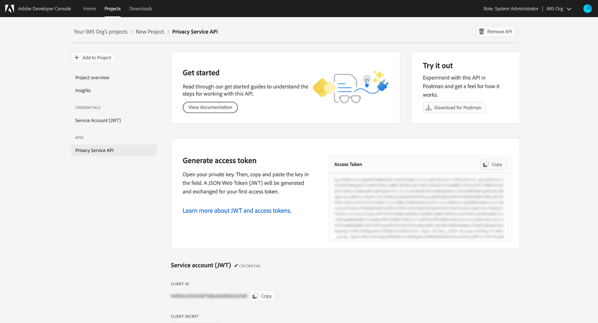

# Getting started with the Privacy Service API

This guide provides an introduction to the core concepts you need to know before attempting to make calls to the Adobe Experience Platform Privacy Service API.

## Prerequisites

This guide requires a working understanding of [Privacy Service](../home.md) and how it allows you to manage access and delete requests from your data subjects (customers) across Adobe Experience Cloud applications.

In order to create access credentials for the API, an administrator within your organization must have previously set up product profiles for Privacy Service within Adobe Admin Console. The product profile you assign to an API integration determines what permissions that integration has when accessing Privacy Service capabilities. See the guide on [managing Privacy Service permissions](../permissions.md) for more information.

## Gather values for required headers

In order to make calls to the Privacy Service API, you must first gather your access credentials to be used in required headers:

* `Authorization: Bearer {ACCESS_TOKEN}`
* `x-api-key: {API_KEY}`
* `x-gw-ims-org-id: {ORG_ID}`

These values are generated using [Adobe Developer Console](https://developer.adobe.com/console). Your `{ORG_ID}` and `{API_KEY}` only need to be generated once and can be reused in future API calls. However, your `{ACCESS_TOKEN}` is temporary and must be regenerated every 24 hours.

The steps for generating these values are covered in detail below.

### One-time setup

Go to [Adobe Developer Console](https://developer.adobe.com/console) and sign in with your Adobe ID. Next, follow the steps outlined in the tutorial on [creating an empty project](https://developer.adobe.com/developer-console/docs/guides/projects/projects-empty/) in the Developer Console documentation.

Once you have created a new project, select **[!UICONTROL Add to Project]** and choose **[!UICONTROL API]** from the dropdown menu.

![The API option being selected from the [!UICONTROL Add to Project] dropdown from the project details page in Developer Console](../images/api/getting-started/add-api-button.png)

#### Select an API and generate a keypair {#keypair}

The **[!UICONTROL Add an API]** screen appears. Select **[!UICONTROL Experience Cloud]** to narrow the list of available APIs, then select the card for **[!UICONTROL Privacy Service API]** before selecting **[!UICONTROL Next]**.

The **[!UICONTROL Configure API]** screen appears. Select the option to **[!UICONTROL Generate a key pair]**, then select **[!UICONTROL Generate keypair]**.

![The [!UICONTROL Generate a key pair] option being selected on the [!UICONTROL Configure API] screen](../images/api/getting-started/generate-key-pair.png)

The key pair is automatically generated and a ZIP file containing a private key and a public certificate are downloaded by your browser (to be used in a later step). Select **[!UICONTROL Next]** to continue.

#### Assign permissions through product profiles {#product-profiles}

The final configuration step is to select the product profiles that this integration will inherit its permissions from. If you select more than one profile, their permission sets will be combined for the integration.

>[!NOTE]
>
>Product profiles and the granular permissions they provide are created and managed by administrators through Adobe Admin Console. See the guide on [Privacy Service permissions](../permissions.md) for more information.

When finished, select **[!UICONTROL Save configured API]**.

Once the API has been added to the project, the project page reappears on the **Privacy Service API overview** page. From here, scroll down to the **[!UICONTROL Service Account (JWT)]** section, which provides the following access credentials that are required in all calls to the Privacy Service API:

* **[!UICONTROL CLIENT ID]**: The Client ID is the required `{API_KEY}` that must be provided in the `x-api-key` header.
* **[!UICONTROL ORGANIZATION ID]**: The Organization ID is the `{ORG_ID}` value that must be used in the `x-gw-ims-org-id` header.

### Authentication for each session

The final required credential you must gather is your `{ACCESS_TOKEN}`, which is used in the Authorization header. Unlike the values for `{API_KEY}` and `{ORG_ID}`, a new token must be generated every 24 hours to continue using the API.

In general, there are two methods of generating an access token:

* [Generate the token manually](#manual-token) for testing and development.
* [Automate token generation](#auto-token) for API integrations.

#### Generate a token manually {#manual-token}

To manually generate a new `{ACCESS_TOKEN}`, open the previously downloaded private key and paste its contents into the text box beside **[!UICONTROL Generate access token]** before selecting **[!UICONTROL Generate Token]**.

![The previously generated access token being pasted on the project's overview page, with the [!UICONTROL Generate Token] button being selected after](../images/api/getting-started/paste-private-key.png)

A new access token is generated, and a button to copy the token to your clipboard is provided. This value is used for the required Authorization header, and must be provided in the format `Bearer {ACCESS_TOKEN}`.

#### Automate token generation {#auto-token}

You can generate new access tokens for automated processes by sending a JSON Web Token (JWT) through a POST request to Adobe Identity Management Service (IMS). See the Developer Console document on [JWT authentication](https://developer.adobe.com/developer-console/docs/guides/authentication/JWT/) for detailed steps.

## Reading sample API calls

Each endpoint guide provides example API calls to demonstrate how to format your requests. These include paths, required headers, and properly formatted request payloads. Sample JSON returned in API responses is also provided. For information on the conventions used in documentation for sample API calls, see the section on [how to read example API calls](../../landing/api-guide.md#sample-api) in the getting started guide for Platform APIs.

## Next steps

Now that you understand what headers to use, you are ready to begin making calls to the Privacy Service API. Select one of the endpoint guides to get started:

* [Privacy jobs](./privacy-jobs.md)
* [Consent](./consent.md)
