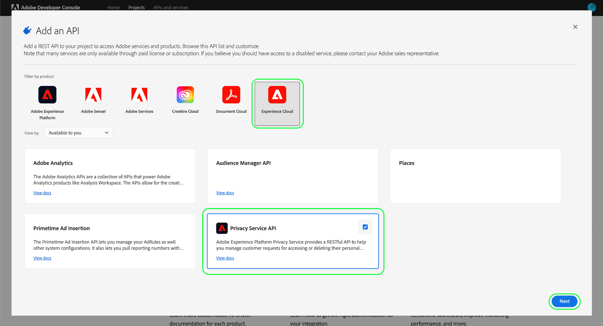
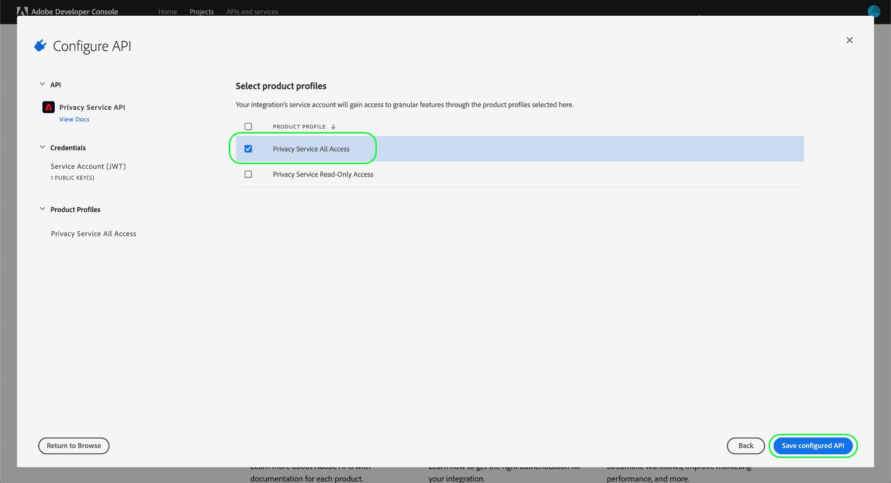

# Getting started with the Privacy Service API

This guide provides an introduction to the core concepts you must know before attempting to make calls to the Adobe Experience Platform Privacy Service API.

## Prerequisites {#prerequisites}

This guide requires a working understanding of [Privacy Service](../home.md) and how it allows you to manage access and delete requests from your data subjects (customers) across Adobe Experience Cloud applications.

In order to create access credentials for the API, an administrator within your organization must have previously set up product profiles for Privacy Service within Adobe Admin Console. The product profile that you assign to an API integration determines what permissions that integration has when accessing Privacy Service capabilities. See the guide on [managing Privacy Service permissions](../permissions.md) for more information.

## Gather values for required headers {#gather-values-required-headers}

In order to make calls to the Privacy Service API, you must first gather your access credentials to be used in required headers:

* `Authorization: Bearer {ACCESS_TOKEN}`
* `x-api-key: {API_KEY}`
* `x-gw-ims-org-id: {ORG_ID}`

These values are generated using [Adobe Developer Console](https://developer.adobe.com/console). Your `{ORG_ID}` and `{API_KEY}` only need to be generated once and can be reused in future API calls. However, your `{ACCESS_TOKEN}` is temporary and must be regenerated every 24 hours.

The steps for generating these values are covered in detail below.

### One-time setup {#one-time-setup}

Go to [Adobe Developer Console](https://developer.adobe.com/console) and sign in with your Adobe ID. Next, follow the steps outlined in the tutorial on [creating an empty project](https://developer.adobe.com/developer-console/docs/guides/projects/projects-empty/) in the Developer Console documentation.

Once you have created a new project, select **[!UICONTROL Add to Project]** and choose **[!UICONTROL API]** from the dropdown menu.

![The API option being selected from the [!UICONTROL Add to Project] dropdown from the project details page in Developer Console](../images/api/getting-started/add-api-button.png)

#### Select the Privacy Service API {#select-privacy-service-api}

The **[!UICONTROL Add an API]** screen appears. Select **[!UICONTROL Experience Cloud]** to narrow the list of available APIs, then select the card for **[!UICONTROL Privacy Service API]** before selecting **[!UICONTROL Next]**.

>[!TIP]
>
>Select the **[!UICONTROL View docs]** option to navigate in a separate browser window to the complete [Privacy Service API reference documentation](https://developer.adobe.com/experience-platform-apis/references/privacy-service/).

Next, select the authentication type to generate access tokens and access the Privacy Service API.

>[!IMPORTANT]
>
>Select the **[!UICONTROL OAuth Server-to-Server]** method as this will be the only method supported moving forward. The **[!UICONTROL Service Account (JWT)]** method is deprecated. While integrations using the JWT authentication method will continue to work until January 1st, 2025, Adobe strongly recommends that you migrate existing integrations to the new OAuth Server-to-Server method before that date. Get more information in the section [!BADGE Deprecated]{type=negative} [Generate a JSON Web Token (JWT)](/help/landing/api-authentication.md#jwt).

#### Assign permissions through product profiles {#product-profiles}

The final configuration step is to select the product profiles that this integration will inherit its permissions from. If you select more than one profile, their permission sets will be combined for the integration.

>[!NOTE]
>
>Product profiles and the granular permissions they provide are created and managed by administrators through Adobe Admin Console. See the guide on [Privacy Service permissions](../permissions.md) for more information.

When finished, select **[!UICONTROL Save configured API]**.

Once the API has been added to the project, the **[!UICONTROL Privacy Service API]** page for the project displays the following credentials that are required in all calls to Privacy Service APIs:

* `{API_KEY}` ([!UICONTROL Client ID])
* `{ORG_ID}` ([!UICONTROL Organization ID])

### Authentication for each session {#authentication-each-session}

The final required credential you must gather is your `{ACCESS_TOKEN}`, which is used in the Authorization header. Unlike the values for `{API_KEY}` and `{ORG_ID}`, a new token must be generated every 24 hours to continue using the API.

In general, there are two methods of generating an access token:

* [Generate the token manually](#manual-token) for testing and development.
* [Automate token generation](#auto-token) for API integrations.

#### Generate a token manually {#manual-token}

To manually generate a new `{ACCESS_TOKEN}`, navigate to **[!UICONTROL Credentials]** > **[!UICONTROL OAuth Server-to-Server]** and select **[!UICONTROL Generate access token]**, as shown below.

A new access token is generated, and a button to copy the token to your clipboard is provided. This value is used for the required Authorization header, and must be provided in the format `Bearer {ACCESS_TOKEN}`.

#### Automate token generation {#auto-token}

You can also use a Postman environment and collection to generate access tokens. For more information, read the section about [using Postman to authenticate and test API calls](/help/landing/api-authentication.md#use-postman) in the Experience Platform API authentication guide.

## Reading sample API calls {#read-sample-api-calls}

Each endpoint guide provides example API calls to demonstrate how to format your requests. These include paths, required headers, and properly formatted request payloads. Sample JSON returned in API responses is also provided. For information on the conventions used in documentation for sample API calls, see the section on [how to read example API calls](../../landing/api-guide.md#sample-api) in the getting started guide for Platform APIs.

## Next steps {#next-steps}

Now that you understand what headers to use, you are ready to begin making calls to the Privacy Service API. Select one of the endpoint guides to get started:

* [Privacy jobs](./privacy-jobs.md)
* [Consent](./consent.md)
