# Manage permissions for Privacy Service

>[!IMPORTANT]
>
>Permissions for Adobe Experience Platform Privacy Service have been improved to increase their level of granularity. These changes enable organization admins to grant more users access with the desired role and permission level. Technical account users must update their Privacy Service permissions as this impending update constitutes a breaking change for them. The enforcement of this permissions change will take place on **April 13th, 2023**. See the documentation on [migrating legacy API credentials](#migrate-tech-accounts) for guidance on resolving this issue.
>
>Technical accounts are available to enterprise customers and created through the Adobe Developers Console. The Adobe ID of a technical account holder ends in `@techacct.adobe.com`. If you are unsure whether you are a technical account holder, please contact your organization administrator.

Access to [Adobe Experience Platform Privacy Service](./home.md) is controlled through granular role-based permissions in Adobe Admin Console. By creating product profiles that assign permissions to groups of users, you can determine who has access to which features in the Privacy Service [UI](./ui/overview.md) and [API](./api/overview.md).

>[!NOTE]
>
>When creating an integration for the Privacy Service API, you must select an existing product profile in order to determine what features or actions that integration has permissions for. See the guide on [getting started with the Privacy Service API](./api/getting-started.md) for more information.

This guide shows you how to manage permissions for Privacy Service.

## Getting started

In order to configure access control for Privacy Service, you must have administrator privileges for an organization that has a product integration with Adobe Experience Platform Privacy Service. The minimum role that can grant or withdraw permissions is a **product profile administrator**. Other administrator roles that can manage permissions are **product administrators** (can manage all profiles within a product) and **system administrators** (no restrictions). See the article on [administrative roles](https://helpx.adobe.com/enterprise/using/admin-roles.html) in the Adobe Enterprise administration guide for more information.

This guide assumes you are familiar with basic Admin Console concepts like product profiles and how they grant product permissions to individual users and groups. For more information, see the [Admin Console user guide](https://helpx.adobe.com/enterprise/using/admin-console.html).

## Available permissions

The following table outlines the available permissions for Privacy Service with descriptions of the specific capabilities that they grant access to:

>[!NOTE]
>
>All Privacy Service and [!UICONTROL Opt Out of Sale] permissions are distinct and separate from one another with no functional overlap. This is possible as the Privacy Service API is considered idempotent.

| Category | Permission | Description |
| --- | --- | --- |
| [!UICONTROL Privacy Service Permissions] | [!UICONTROL Privacy Read Permission] | Determines whether the user can view existing access and delete requests, along with their details. |
| [!UICONTROL Privacy Service Permissions] | [!UICONTROL Privacy Write Permission] | Determines whether a user can create new access and delete requests. |
| [!UICONTROL Privacy Service Permissions] | [!UICONTROL Read (Access) Content Delivery Permission] | When an access request is processed by Privacy Service, a ZIP file containing the customer's data is sent to that customer. When looking up the details of an access request, this permission determines whether the user can access the download link for the request's ZIP file. |
| [!UICONTROL Opt Out of Sale Permissions] | [!UICONTROL Read Permission - Opt Out of Sale] | Determines whether the user can view existing opt-out-of-sale requests, along with their details. |
| [!UICONTROL Opt Out of Sale Permissions] | [!UICONTROL Write Permission - Opt Out of Sale] | Determines whether a user can create new opt-out-of-sale requests. |

{style="table-layout:auto"}

## Manage permissions {#manage}

To manage Privacy Service permissions, log in to [Admin Console](https://adminconsole.adobe.com/) and select **[!UICONTROL Products]** from the top navigation. From here, select **[!UICONTROL Adobe Experience Platform Privacy Service]**.

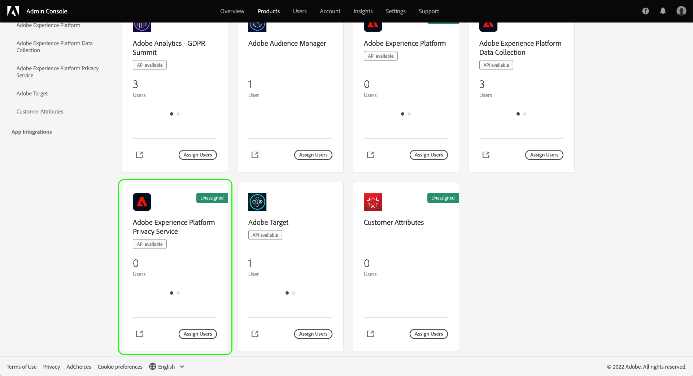

### Select or create a product profile

The next screen shows a list of available product profiles for Privacy Service under your organization. If no product profiles exist, select **[!UICONTROL New Profile]** to create one. If you have multiple roles or user groups in your organization that require different levels of access, you should create a separate product profile for each of them.

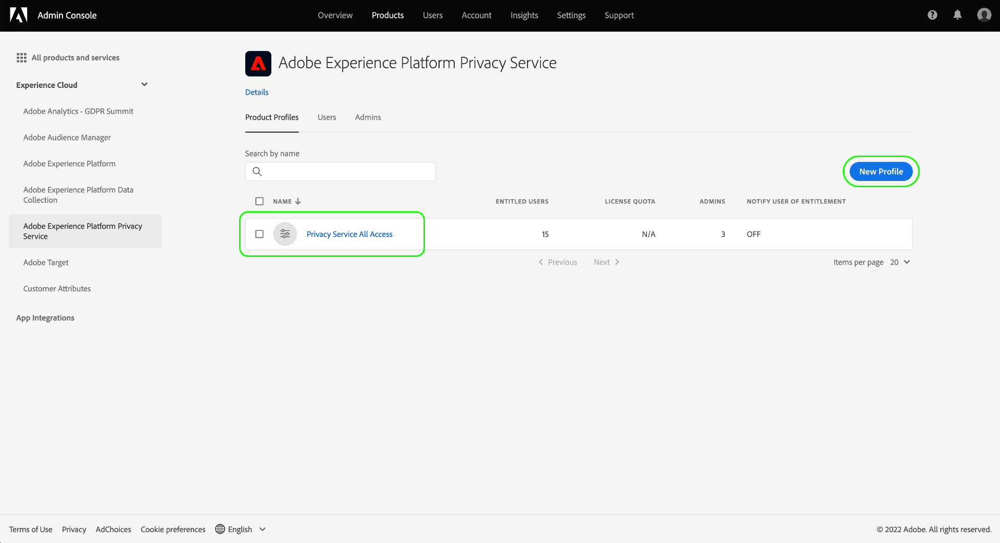

After selecting a product profile, you can use the **[!UICONTROL Permissions]** tab to start [editing permissions](#edit-permissions) for the profile, or select the **[!UICONTROL Users]** tab to start [assigning users](#assign-users) to the profile.

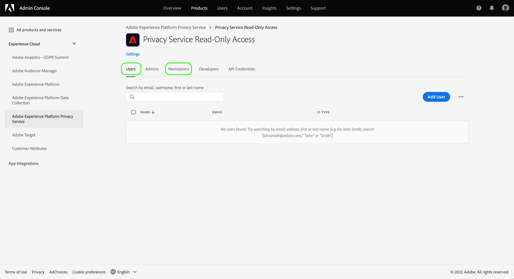

### Edit permissions for the profile {#edit-permissions}

On the **[!UICONTROL Permissions]** tab, select any of the displayed permission categories to access the permission editing view.

When editing permissions for a profile, available permissions are listed in the left column while those that are included in the profile are listed in the right column. Select the listed permissions to move them between either column.

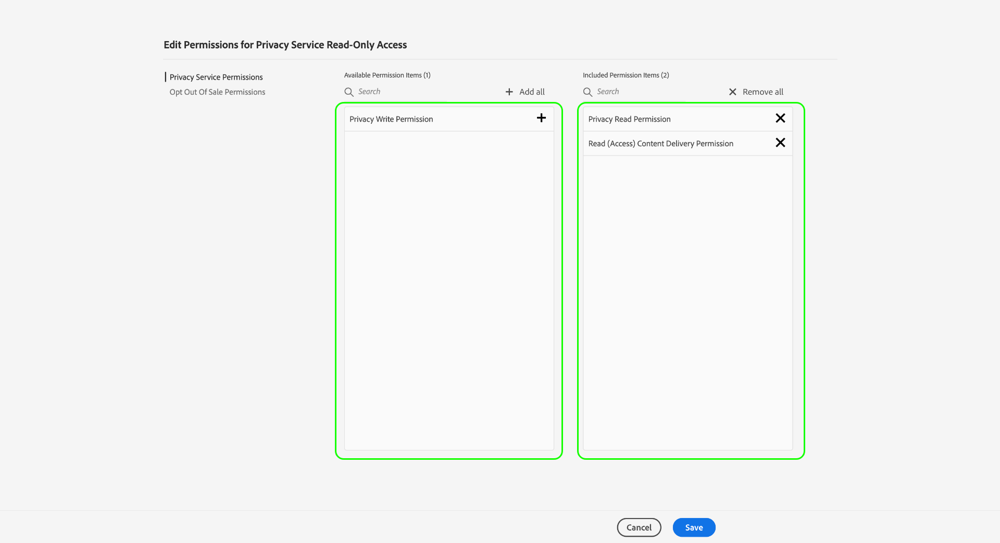

Permissions are organized into categories. To switch between categories, select the desired category from the left navigation.

![Image showing the [!UICONTROL Opt Out of Sale] section under permissions](./images/permissions/switch-category.png)

Select **[!UICONTROL Save]** once you have finished configuring permissions.

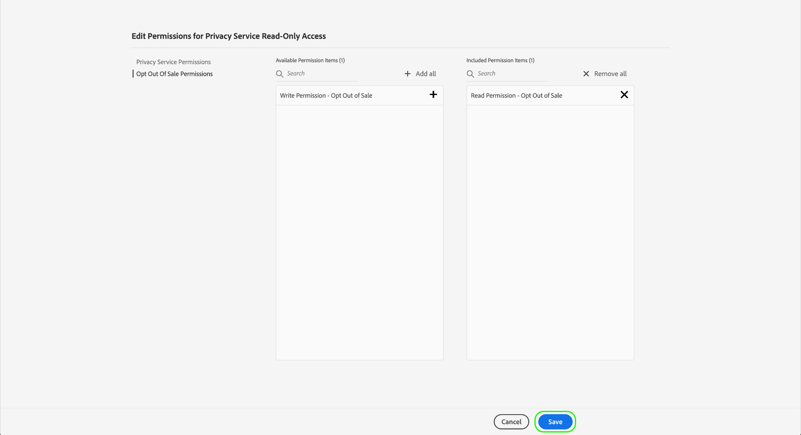

The product profile view reappears with the added permissions reflected.

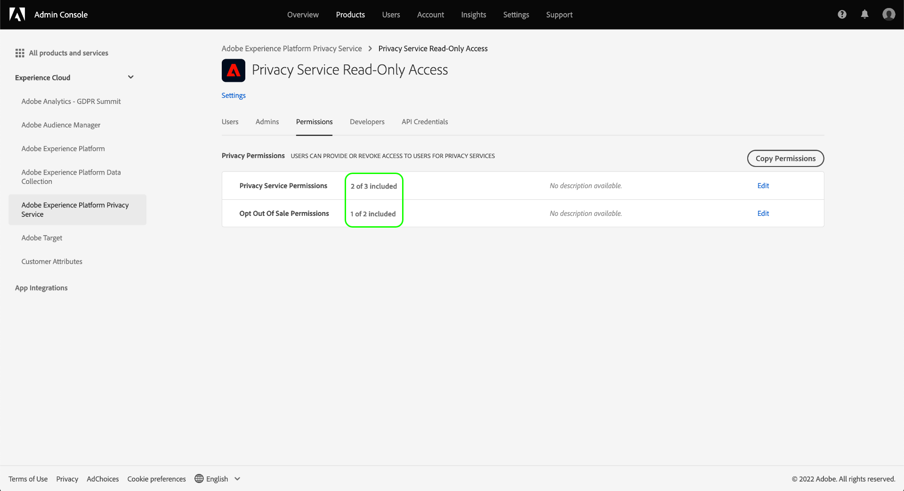

### Assign users to the profile {#assign-users}

To assign users to the product profile (and grant them the profile's configured permissions), select the **[!UICONTROL Users]** tab, followed by **[!UICONTROL Add user]**.

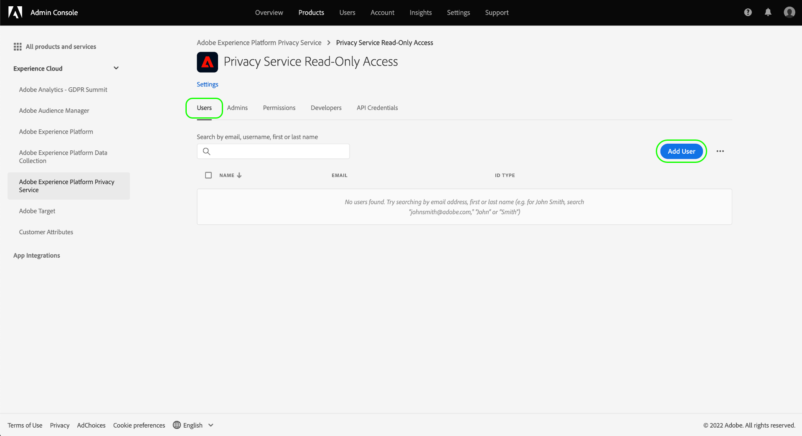

For more information on managing users for a product profile, see the [Admin Console documentation](https://helpx.adobe.com/enterprise/using/manage-product-profiles.html).

### Migrate legacy API credentials to the profile {#migrate-tech-accounts}

>[!NOTE]
>
>This section only applies to existing API credentials that were created before Privacy Service permissions were integrated into Adobe Admin Console. For new credentials, product profiles (and their permissions) are assigned through [Adobe Developer Console projects](https://developer.adobe.com/developer-console/docs/guides/projects/) instead.  See the section on [assigning product profiles to a project](./api/getting-started.md#product-profiles) in the Privacy Service API getting started guide for more information.

Previously, technical accounts did not require a product profile for integration and permissions. However, due to recent improvements in Privacy Service permissions, it is now necessary to migrate legacy API credentials to the product profile. This update allows for granular permissions to be granted to technical account holders. Follow the steps provided below to update technical account permissions for Privacy Service.

#### Update technical account permissions {#update-tech-account-permissions}

The first step in assigning a permission set for your technical account is to navigate to the [Adobe Admin Console](https://adminconsole.adobe.com/) and create a new product profile for Privacy Service. 

From the Admin Console UI, select **Products** from the navigation bar, followed by **[!UICONTROL Experience Cloud]** and **[!UICONTROL Adobe Experience Platform Privacy Service]** in the left sidebar. The [!UICONTROL Product Profiles] tab appears. Select **New Profile** to create a new product profile for Privacy Service.

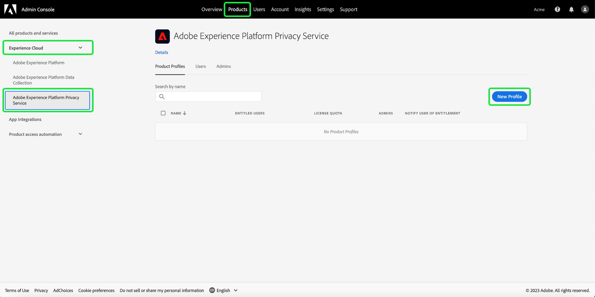

The [!UICONTROL Create a new product profile] dialog appears. Full instructions on how to create a product profile can be found in the [UI guide to create profiles](../access-control/ui/create-profile.md).

After you have saved your new product profile, navigate to the [Adobe Developer Console](https://developer.adobe.com/console/home) and log into that product or that project. Select **[!UICONTROL Projects]** from the top navigation, followed by the card for your project.

>[!NOTE]
>
>You may have to clear your cache and/or wait some time for the new project to appear in your list of Developer Console projects.

After you have logged into your project, select the **[!UICONTROL Privacy Service API]** integration from the left sidebar. 

The Privacy Service API integration dashboard appears. From this dashboard, you can edit the product profile associated with that project. Select **[!UICONTROL Edit product profiles]** to begin the process. The [!UICONTROL Configure API] dialog appears.

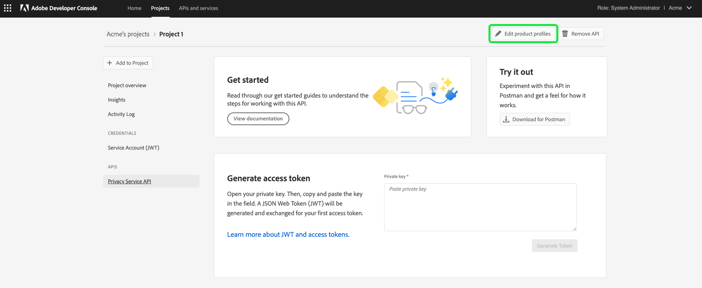

The [!UICONTROL Configure API] dialog shows the available product profiles that currently exist in the service. They correlate to the product profiles created in the admin console. From the list of available product profiles, select the checkbox for the new product profile you created for the technical account in the admin console. This automatically associates this technical account with the permissions in the selected product profile. Select **[!UICONTROL Save configured API]** to confirm your settings.

>[!NOTE]
>
>If a technical account is already associated with a product profile, one of the checkboxes from the list of available product profiles will already be selected. 

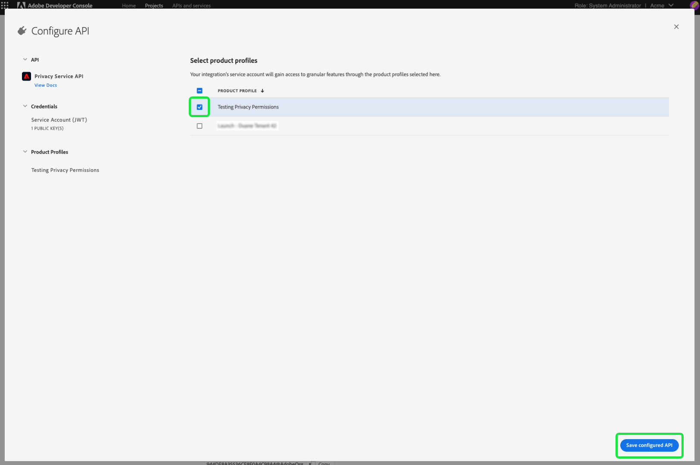

#### Confirm your settings have been applied {#confirm-applied-settings}

To confirm that your settings have been applied to the account. Return to the [Admin Console](https://adminconsole.adobe.com/) and navigate to your newly created product profile. Select the **[!UICONTROL API Credentials]** tab to see a list of associated projects. The project used in Developer Console where you assigned the product profile to the technical account is displayed in the list of credentials. The name of each API credential is composed of the project name with a randomly generated number suffixed to the end. Select a credential to open the details panel.   

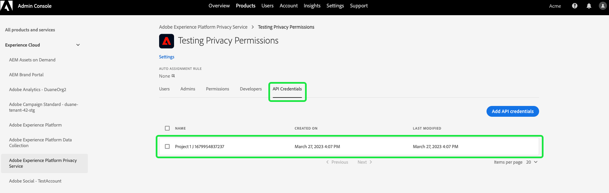

The [!UICONTROL Details] panel contains information on the API credential including the associated technical ID, the API key, created and last modified date, as well as associated Adobe Products.

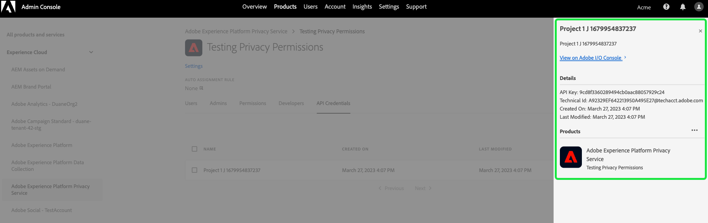

## Next steps

This guide covered the available permissions for Privacy Service and how to manage them through Admin Console.

For steps on how to create a new API integration after setting up product profiles, see the [getting started guide for the Privacy Service API](./api/getting-started.md). For more information on managing permissions for other Adobe Experience Platform capabilities, refer to the [access control documentation](../access-control/home.md).
