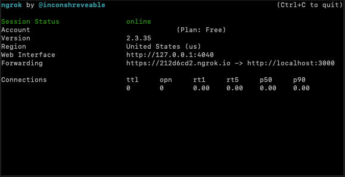
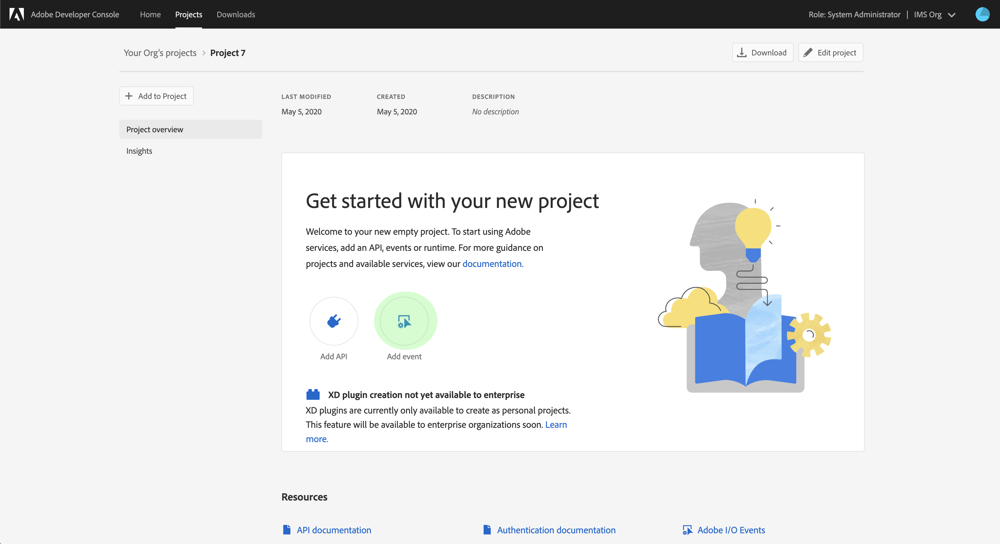
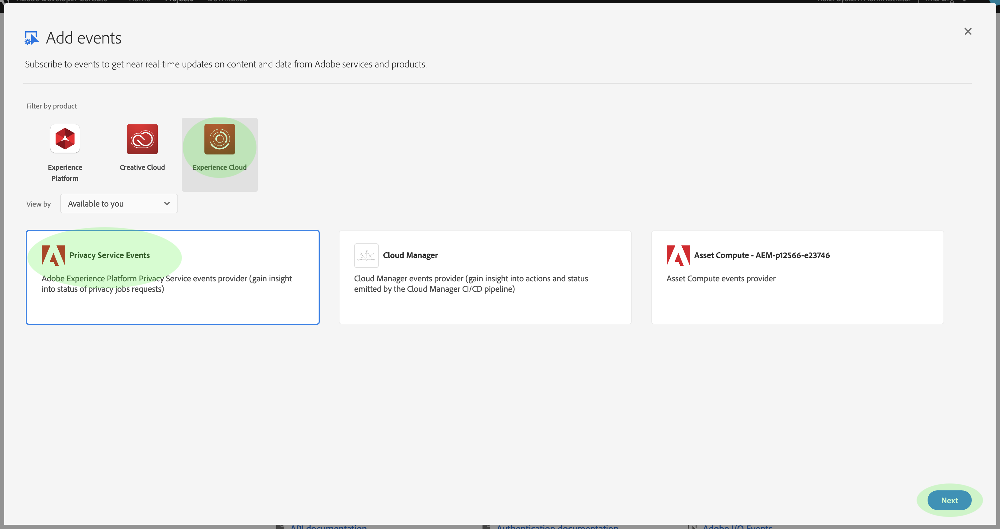
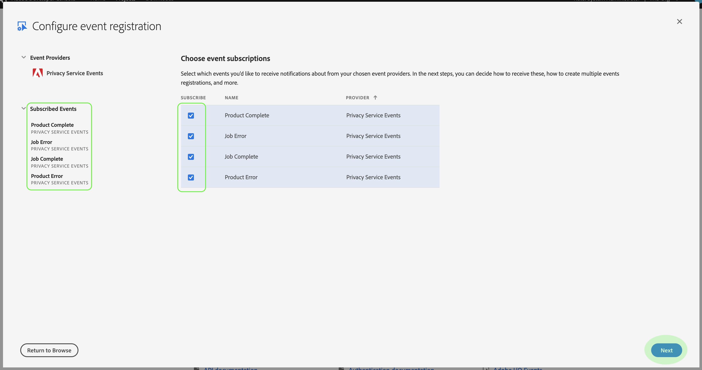
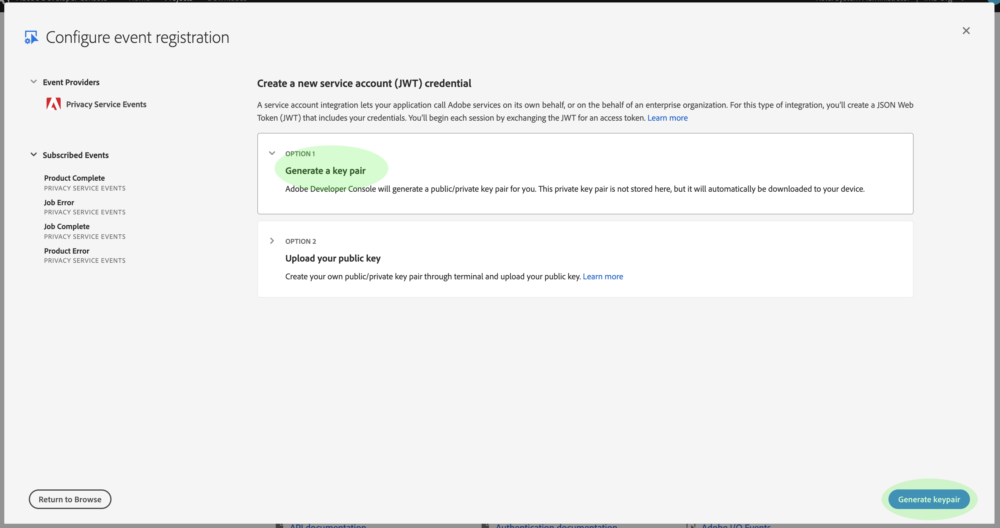
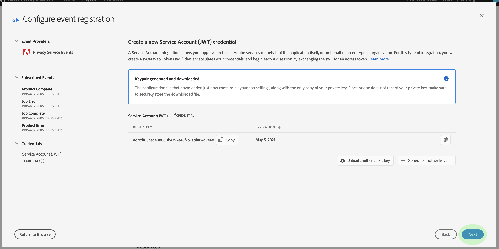
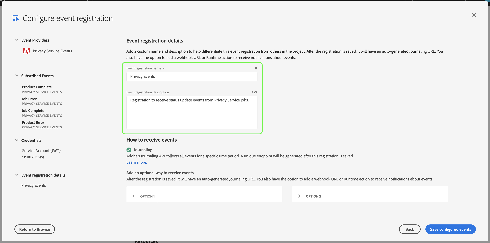
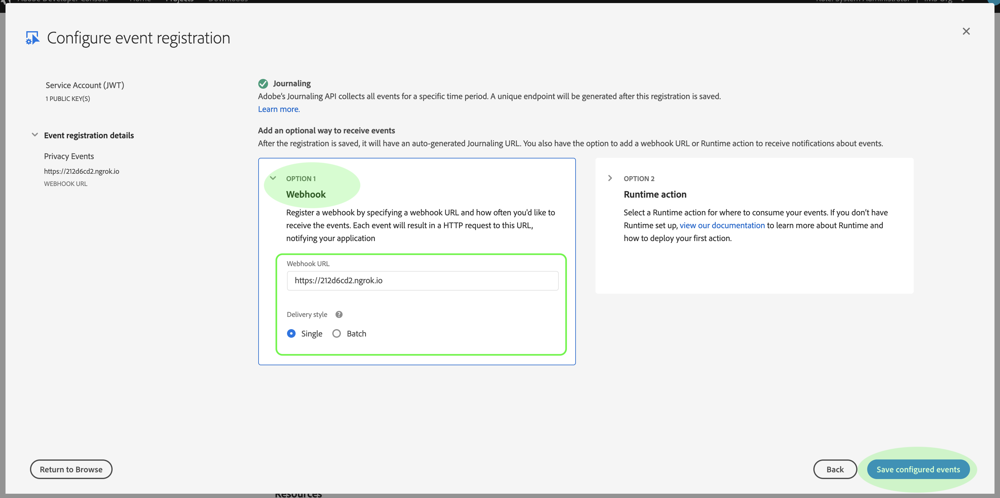
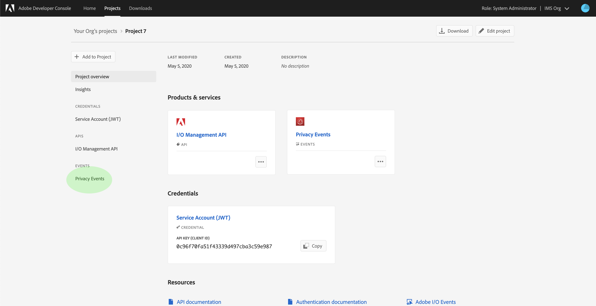
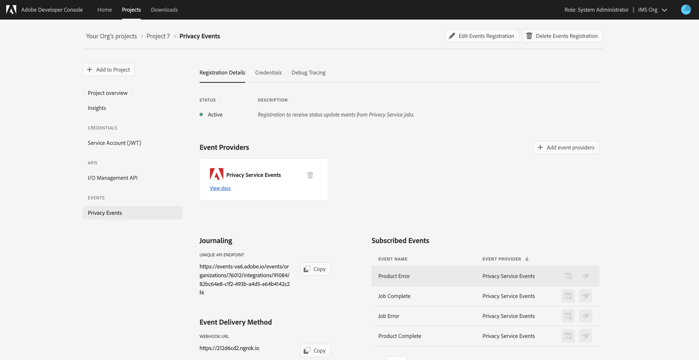

# Subscribe to [!DNL Privacy Events]

[!DNL Privacy Events] are messages provided by Adobe Experience Platform [!DNL Privacy Service], which leverage Adobe I/O Events sent to a configured webhook to facilitate efficient job request automation. They reduce or eliminate the need to poll the [!DNL Privacy Service] API in order to check if a job is complete or if a certain milestone within a workflow has been reached.

There are currently four types of notifications related to the privacy job request lifecycle:

Type | Description
--- | ---
Job Complete | All [!DNL Experience Cloud] solutions have reported back and the overall or global status of the job has been marked as complete.
Job Error | One or more solutions have reported an error while processing the request.
Product Complete | One of the solutions associated with this job has completed its work.
Product Error | One of the solutions reported an error while processing the request.

This document provides steps for setting up an integration for [!DNL Privacy Service] notifications within Adobe I/O. For a high-level overview of [!DNL Privacy Service] and its features, see the [Privacy Service overview](home.md).

## Getting started

This tutorial uses **ngrok**, a software product which exposes local servers to the public internet through secure tunnels. Please [install ngrok](https://ngrok.com/download) before starting this tutorial in order to follow along and create a webhook to your local machine. This guide also requires you to have a GIT repository downloaded that contains a simple [Node.js](https://nodejs.org/) server.

## Create a local server

Your Node.js server must return a `challenge` parameter sent by a request to the root (`/`) endpoint. Set up your `index.js` file with the following JavaScript to accomplish this:

```js
var express = require('express')
var app = express()

app.set('port', (process.env.PORT || 3000))
app.use(express.static(__dirname + '/public'))

app.get('/', function(request, response) {
  response.send(request.originalUrl.split('?challenge=')[1]);
})

app.listen(app.get('port'), function() {
  console.log("Node app is running at localhost:" + app.get('port'))
})
```

Using the command line, navigate to the root directory of your Node.js server. Then, type the following commands:

1. `npm install`
1. `npm start`

These commands install all dependencies and initialize the server. If successful, you can find your server running at http://localhost:3000/.

## Create a webhook using ngrok

Open a new command line window an navigate to the directory where you installed ngrok earlier. From here, type the following command:

```shell
./ngrok http -bind-tls=true 3000
```

A successful output looks similar to the following:



Take note of the `Forwarding` URL (`https://212d6cd2.ngrok.io`), as this will be used to identify your webhook the next step.

## Create a new project in Adobe Developer Console

Go to [Adobe Developer Console](https://www.adobe.com/go/devs_console_ui) and sign in with your Adobe ID. Next, follow the steps outlined in the tutorial on [creating an empty project](https://www.adobe.io/apis/experienceplatform/console/docs.html#!AdobeDocs/adobeio-console/master/projects-empty.md) in the Adobe Developer Console documentation.

## Add Privacy Events to the project

Once you have finished creating a new project in the console, click **[!UICONTROL Add event]** on the **Project Overview** screen.



The **Add events** dialog appears. Select **[!UICONTROL Experience Cloud]** to filter down the list of a available event types, then select **[!UICONTROL Privacy Service Events]** before clicking **[!UICONTROL Next]**.



The **Configure event registration** dialog appears. Select which events you would like to receive by selecting their corresponding checkboxes. Events that you select appear under **[!UICONTROL Subscribed Events]** in the left column. When finished, click **[!UICONTROL Next]**.



The next screen prompts you to provide a public key for the event registration. You are given the option to automatically generate a key pair, or upload your own public key generated in the terminal.

For the purposes of this tutorial, the first option is followed. Click the option box for **[!UICONTROL Generate a key pair]**, then click the **[!UICONTROL Generate keypair]** button in the bottom-right corner.



When the key pair generates, it is automatically downloaded by the browser. You must store this file yourself as it is not persisted in the Developer Console.

The next screen allows you to review the details of the newly generated key pair. Click **[!UICONTROL Next]** to continue.



In the next screen, provide a name and description for the event registration. Best practice is to create a unique, easily identifiable name to help differentiate this event registration from others on the same project.



Further down on the same screen, you are given two options for configuring how to receive events. Select **[!UICONTROL Webhook]** and provide the `Forwarding` URL for the ngrok webhook you created earlier under **[!UICONTROL Webhook URL]**. Next, select your preferred delivery style (single or batch) before clicking **[!UICONTROL Save configured events]** to complete the event registration.



The details page for your project reappears, with [!DNL Privacy Events] appearing under **[!UICONTROL Events]** in the left navigation.

## View event data

Once you have registered [!DNL Privacy Events] with your project and privacy jobs have been processed, you can view any received notifications for that registration. From the **[!UICONTROL Projects]** tab in Developer Console, select your project from the list to open the **Product overview** page. From here, select **[!UICONTROL Privacy Events]** from the left navigation.



The **Registration Details** tab appears, allowing you to view more information about the registration, edit its configuration, or view the actual events that were received since activating your webhook. 



Click the **[!UICONTROL Debug Tracing]** tab to view a list of received events. Click a listed event to view its details.


The **[!UICONTROL Payload]** section provides details about the selected event, including its event type (`com.adobe.platform.gdpr.productcomplete`) as highlighted in the example above.

## Next steps

You can repeat the above steps for adding new integrations for different webhook addresses as needed.