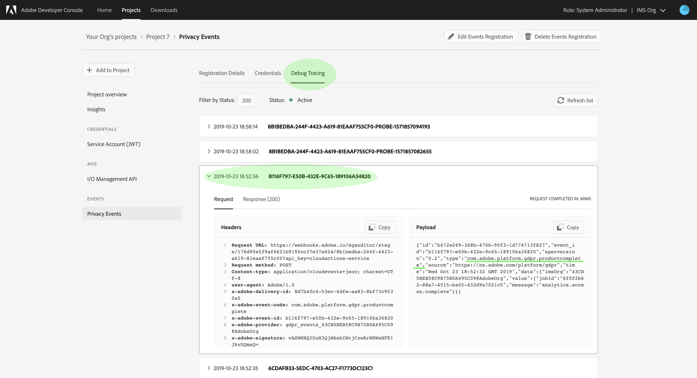

# Subscribe to [!DNL Privacy Service Events]

[!DNL Privacy Service Events] are messages provided by Adobe Experience Platform [!DNL Privacy Service], which leverage Adobe I/O Events sent to a configured webhook to facilitate efficient job request automation. They reduce or eliminate the need to poll the [!DNL Privacy Service] API in order to check if a job is complete or if a certain milestone within a workflow has been reached.

There are currently four types of notifications related to the privacy job request lifecycle:

| Type | Description |
| --- | --- |
| Job Complete | All [!DNL Experience Cloud] applications have reported back and the overall or global status of the job has been marked as complete. |
| Job Error | One or more applications have reported an error while processing the request. |
| Product Complete | One of the applications associated with this job has completed its work. |
| Product Error | One of the applications reported an error while processing the request. |

This document provides steps for setting up an event registration for [!DNL Privacy Service] notifications, and how to interpret notification payloads.

## Getting started

Please review the following Privacy Service documentation before starting this tutorial:

* [Privacy Service overview](./home.md)
* [Privacy Service API guide](./api/overview.md)

## Register a webhook to [!DNL Privacy Service Events]

In order to receive [!DNL Privacy Service Events], you must use Adobe Developer Console to register a webhook to your [!DNL Privacy Service] integration.

Follow the tutorial on [subscribing to [!DNL I/O Event] notifications](../observability/alerts/subscribe.md) for detailed steps on how to accomplish this. Ensure that you choose **[!UICONTROL Privacy Service Events]** as your event provider in order to access the events listed above.

## Receive [!DNL Privacy Service Event] notifications

Once you have successfully registered your webhook and privacy jobs have been run, you can start receiving event notifications. These events can be viewed using the webhook itself, or by selecting the **[!UICONTROL Debug Tracing]** tab in your project's event registration overview in Adobe Developer Console.



The following JSON is an example of a [!DNL Privacy Service Event] notification payload that would be sent to your webhook when one of the applications associated with a privacy job has completed its work:

```json
{
  "id":"b472e249-368b-4706-90f3-1d774713f827",
  "event_id":"b116f797-e50b-432e-9c65-189106a34820",
  "specversion":"0.2",
  "type":"com.adobe.platform.gdpr.productcomplete",
  "source":"https://ns.adobe.com/platform/gdpr",
  "time":"Wed Oct 23 18:52:32 GMT 2019",
  "data":{
    "imsOrg":"{ORG_ID}",
    "value":{
      "jobId":"6f0f2b62-88a7-4515-ba05-432d9a7021c5",
      "message":"analytics.access.complete"
    }
  }
}
```

| Property | Description |
| --- | --- |
| `id` | A unique, system-generated ID for the notification. |
| `type` | The type of notification being sent, giving context to the information provided under `data`. Potential values include: <ul><li>`com.adobe.platform.gdpr.jobcomplete`</li><li>`com.adobe.platform.gdpr.joberror`</li><li>`com.adobe.platform.gdpr.productcomplete`</li><li>`com.adobe.platform.gdpr.producterror`</li></ul> |
| `time` | A timestamp of when the event occurred. |
| `data.value` | Contains additional information regarding what triggered the notification: <ul><li>`jobId`: The ID of the privacy job that triggered the notification.</li><li>`message`: A message regarding the specific status of the job. For `productcomplete` or `producterror` notifications, this field indicates the Experience Cloud application in question.</li></ul> |

## Next steps

This document covered how to register Privacy Service Events to a configured webhook, and how to interpret notification payloads. To learn how to track privacy jobs using the user interface, see the [Privacy Service user guide](./ui/user-guide.md).
