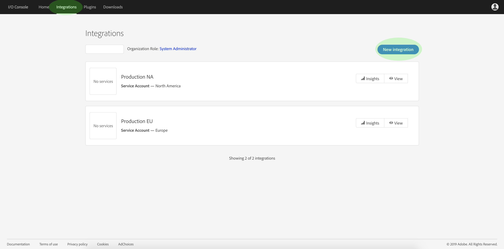
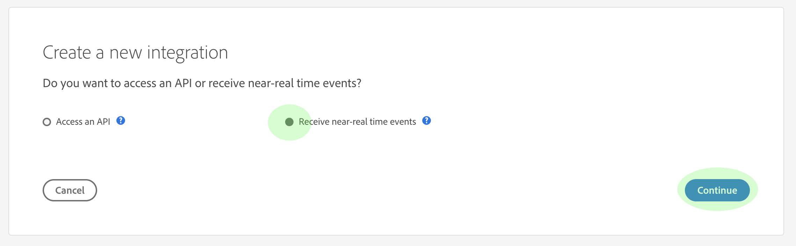
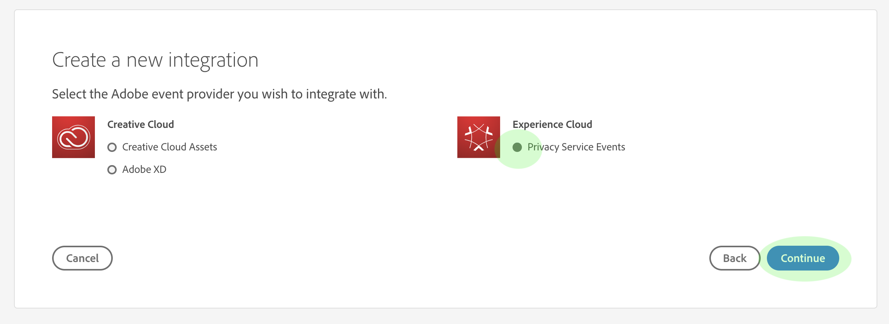
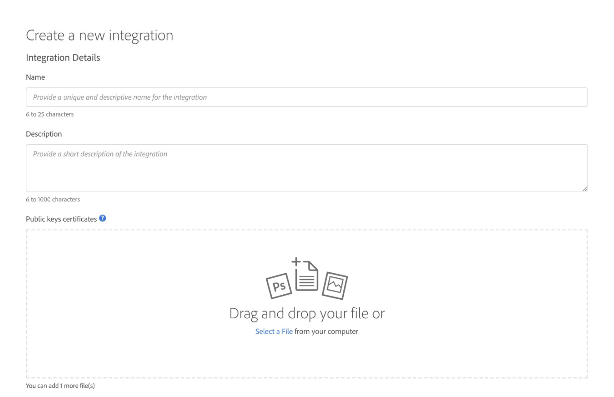
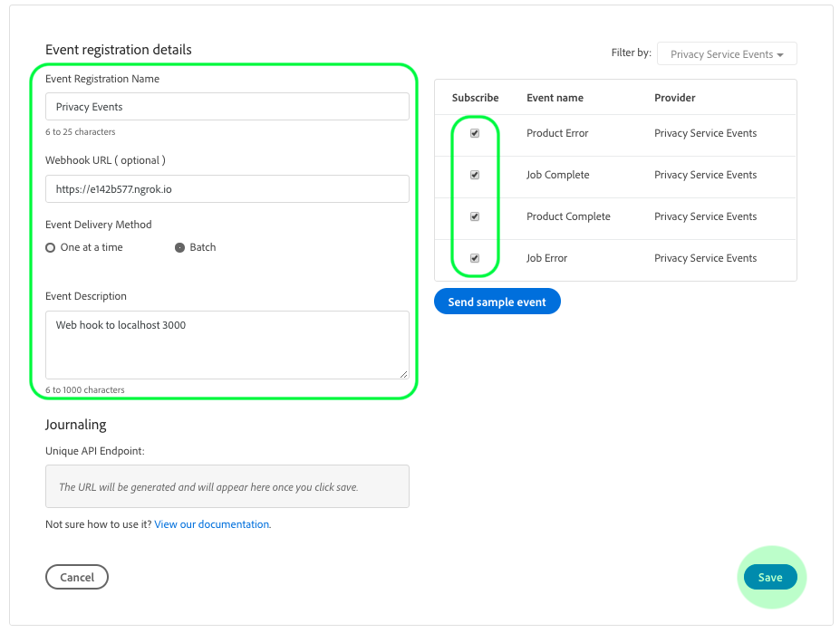
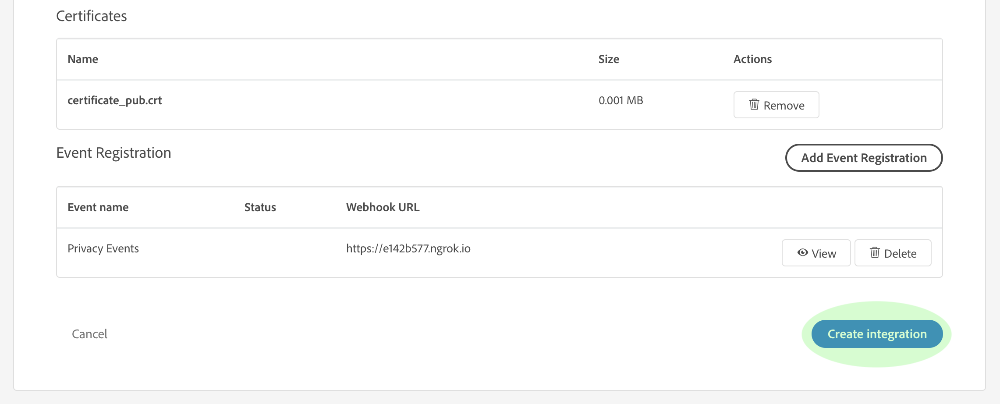
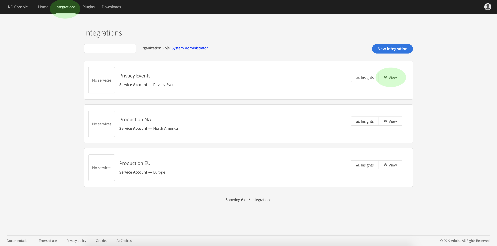
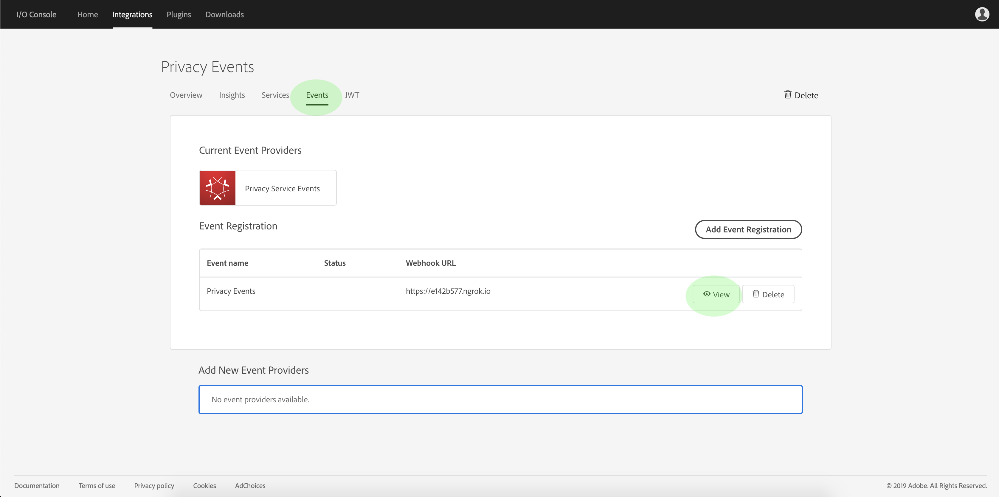

# Subscribe to Privacy Events

Privacy Events are messages provided by Adobe Experience Platform Privacy Service, which leverage Adobe I/O Events sent to a configured webhook to facilitate efficient job request automation. They reduce or eliminate the need to poll the Privacy Service API in order to check if a job is complete or if a certain milestone within a workflow has been reached.

There are currently four types of notifications related to the privacy job request lifecycle:

Type | Description
--- | ---
Job Complete | All Experience Cloud solutions have reported back and the overall or global status of the job has been marked as complete.
Job Error | One or more solutions have reported an error while processing the request.
Product Complete | One of the solutions associated with this job has completed its work.
Product Error | One of the solutions reported an error while processing the request.

This document provides steps for setting up an integration for Privacy Service notifications within Adobe I/O. For a high-level overview of Privacy Service and its features, see the [Privacy Service overview](home.md).

## Getting started

This tutorial uses **ngrok**, a software product which exposes local servers to the public internet through secure tunnels. Please [install ngrok](https://ngrok.com/download) before starting this tutorial in order to follow along and create a webhook to your local machine. This guide also requires you to have a GIT repository downloaded that contains a simple server written in [Node.js](https://nodejs.org/).

## Create a local server

Your Node.js server must return a `challenge` parameter sent by a request to the root (`/`) endpoint. Set up your `index.js` file with the following JavaScript to accomplish this:

```js
var express = require('express')
var app = express()

app.set('port', (process.env.PORT || 3000))
app.use(express.static(__dirname + '/public'))

app.get('/', function(request, response) {
  response.send(request.originalUrl.split('?challenge=')[1]);
})

app.listen(app.get('port'), function() {
  console.log("Node app is running at localhost:" + app.get('port'))
})
```

Using the command line, navigate to the root directory of your Node.js server. Then, type the following commands:

1. `npm install`
1. `npm start`

These commands install all dependencies and initialize the server. If successful, you can find your server running at http://localhost:3000/.

## Create a webhook using ngrok

Within the same directory and in a new command line window, type the following command:

```shell
ngrok http -bind-tls=true 3000
```

A successful output looks similar to the following:


Take note of the `Forwarding` URL (`https://e142b577.ngrok.io`), as this will be used to identify your webhook the next step.

## Create a new integration using Adobe I/O Console

Sign in to [Adobe I/O Console](https://console.adobe.io) and click the **Integrations** tab. The _Integrations_ window appears. From here, click **New integration**.



The *Create a new integration* window appears. Select **Receive near-real time events**, then click **Continue**.



The next screen provides options to create integrations with different events, products, and services available to your organization based on your subscriptions, entitlements, and permissions. For this integration, select **Privacy Service Events**, then click **Continue**.



The *Integration Details* form appears, requiring you to provide a name and description for the integration, as well as a public key certificate.



If you do not have a public certificate, you can generate one by using the following terminal command:

```shell
openssl req -x509 -sha256 -nodes -days 365 -newkey rsa:2048 -keyout private.key -out certificate_pub
```

Once you have generated a certificate, drag and drop the file into the **Public keys certificates** box, or click **Select a File** to browse your file directory and select the certificate directly.

After adding your certificate, the *Event Registration* option appears. Click **Add Event Registration**.


The dialog expands to show additional controls. Here you can select your desired event types and register your webhook. Enter a name for the event registration, the webhook URL (the `Forwarding` address returned when you initially [created the webhook](#create-a-webhook-using-ngrok)), as well as a brief description. Finally, select the event types you wish to subscribe to, then click **Save**.



Once the Event Registration form is completed, click **Create integration** and the I/O integration will be complete.



## View event data

Once you have created your I/O integration and privacy jobs have been processed, you can view any received notifications for that integration. From the **Integrations** tab in I/O Console, navigate to your integration and click **View**.



The details page for the integration appears. Click **Events** to view the event registrations for the integration. Locate the Privacy Events registration and click **View**.



The *Event Details* window appears, allowing you to view more information about the registration, edit its configuration, or view the actual events that were received since activating your webhook. You can view event details as well as navigate to the **Debug Tracing** option.


The **Payload** section provides details about the selected event, including its event type (`"com.adobe.platform.gdpr.productcomplete"`) as highlighted in the example above.

## Next steps

You can repeat the above steps for adding new integrations for different webhook addresses as needed.