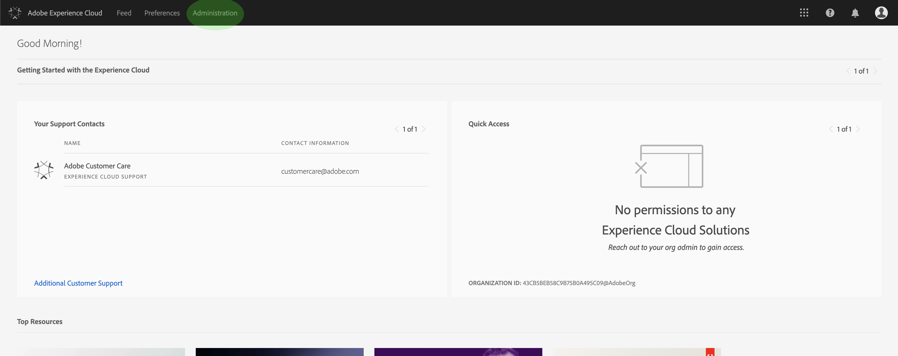
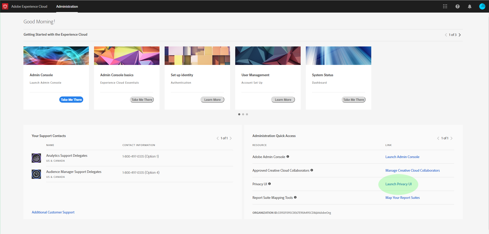

# Privacy Service UI overview

Adobe Experience Platform Privacy Service provides a RESTful API and user interface that allow you to coordinate privacy and compliance requests across various solutions. This document explores the Privacy Service UI. For information on using the API, please see the [Privacy Service developer guide](../api/getting-started.md). 

## Log in to the Privacy Service UI

You must have an Adobe ID in order to authenticate to the Privacy Service UI. In addition, you must have System Administrator privileges within the organization your Adobe ID is associated with.

Navigate to the Adobe Experience Cloud sign-in page at https://experience.adobe.com. Click **Sign In with an Adobe ID** and enter your Adobe ID credentials when prompted. Once you are signed in, click **Administration**.

> **Note:** The Administration tab only appears if you have system admin privileges within your organization.

Finally, select **Launch Privacy UI** on the next screen to open the Privacy Service UI.

## Next steps

Now that you have successfully logged in, please refer to the [user guide](user-guide.md) for steps on how perform various operations using the Privacy Service UI.