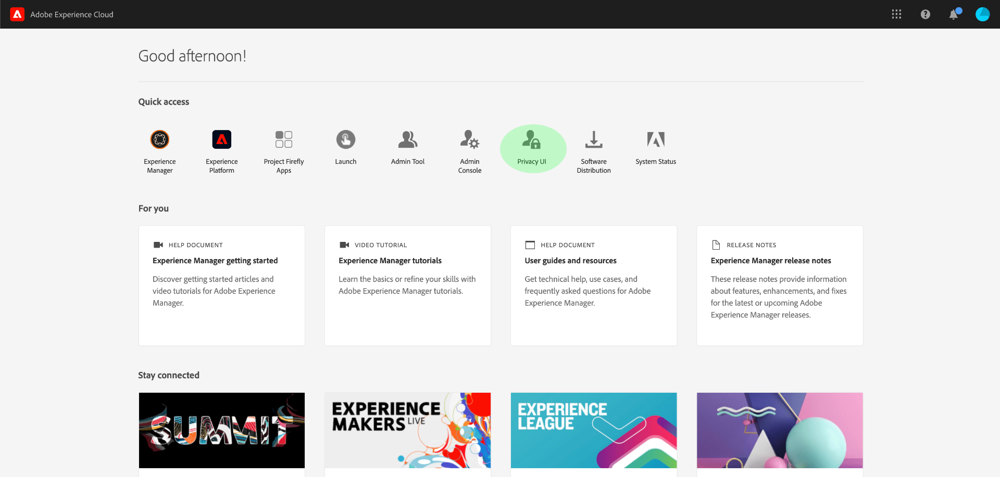
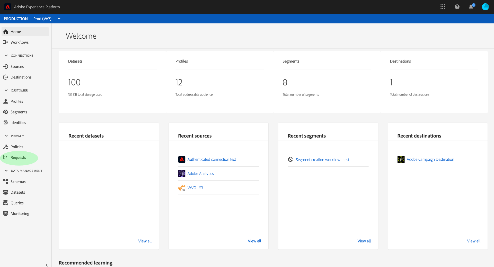

# [!DNL Privacy Service] UI overview {#privacy-ui-guide}

>[!CONTEXTUALHELP]
>id="platform_privacy_privacyconsole_requests"
>title="Data Subject Requests"
>abstract="This widget shows the number of submitted and completed data subject requests processed by Privacy Service for a given day. For more information on your Privacy Service processes, select **Requests** in the left navigation."

The Privacy Service UI [!DNL Privacy Service] allows you to coordinate privacy and compliance requests across various Adobe Experience Cloud applications.

>[!NOTE]
>
>For information on managing compliance requests programmatically using the Privacy Service API, please see the [Privacy Service API guide](../api/overview.md). 

## Log in to the [!DNL Privacy Service] UI

>[!IMPORTANT]
>
>You must have an Adobe ID in order to authenticate to the [!DNL Privacy Service] UI. In addition, you must have System Administrator privileges within your IMS Organization.

To access the UI, log in to [Adobe Experience Cloud](https://experience.adobe.com/)

Once you are signed in, select **[!UICONTROL Privacy UI]**.

### Logging in from [!DNL Experience Platform]

If you have access to the Adobe Experience Platform UI, you can also access the [!DNL Privacy Service] UI through the **[!UICONTROL Requests]** tab in the left navigation.

## Next steps

Now that you have successfully logged in, please refer to the [user guide](user-guide.md) for steps on how perform various operations using the [!DNL Privacy Service] UI.
