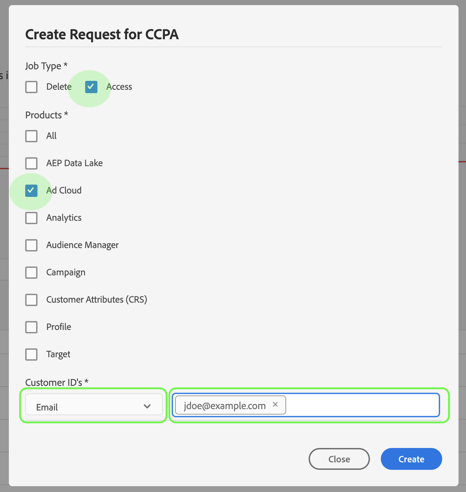

# Privacy Service user guide

This document provides steps for creating and managing privacy requests using the Privacy Service user interface.

## Browse the Privacy Service UI dashboard

The dashboard for the Privacy Service UI provides two widgets that allow you to view the status of your privacy jobs: **Status Report** and **Job Requests**. The dashboard also displays the current selected regulation for the displayed jobs.

### Regulation Type

Privacy Service supports job requests for two regulation types: 

* The General Data Protection Regulation (GDPR)
* The California Consumer Privacy Act (CCPA). 

Jobs for each regulation type are tracked separately. To switch between regulation types, click the **Regulation Type** dropdown menu and select the desired regulation from the list.

Upon changing the regulation type, the dashboard updates to show all operations, filters, widgets, and job-creation dialogs that apply to the selected regulation.

### Status Report

The graph on the left-hand side of the Status Report widget tracks submitted jobs against any jobs that may have reported back with errors. The graph on the right-hand side tracks jobs nearing the end of the 30-day compliance window.

Click one of the two toggle buttons above the graph to show or hide their respective metrics.

You can view the exact number of jobs associated with any data point on the graphs by hovering your mouse over the data point in question.

To view further details about a given data point, click the data point in question to display the associated jobs in the Job Requests widget. Take note of the filter that is applied just above the job list.

>[!NOTE] When a filter has been applied to the Job Requests widget, you can remove the filter by clicking the **X** on the filter pill. Job Requests then return to the default tracking list.

### Job Requests

The Job Requests widget lists all available job requests in your organization, including details such as the request type, current status, due date, and requestor email.

>[!NOTE] The data for previously created jobs is only accessible for 30 days after the completion date.

You can filter the list by typing keywords into the search bar below the Job Requests title. The list automatically filters as you type, showing requests that contain values that match your search terms. You can also use the **Requested on** dropdown menu to select a time range for the listed jobs.

To view the details of a particular job request, click the request's job ID from the list to open the *Job Details* page.

This dialog contains status information about each Experience Cloud solution and its current state in relation to the overall job. As every privacy job is asynchronous, the page displays the latest communication date and time (GMT) from each solution, as some require more time than others to process the request.

If a solution has provided any additional data, it is viewable in this dialog. You can view this data by clicking on individual product rows.

To download the complete job data as a CSV file, click **Export to CSV** at the top-right of the dialog.

## Create a new privacy job request

The Privacy Service UI provides two methods to create new job requests:

* Use the Request Builder
* Upload a JSON file

Steps for using each of these methods are provided in the following sections.

### Use the Request Builder

Using the Request Builder, you can manually create a new privacy job request in the user interface. The Request Builder is best used for simpler and smaller sets of requests, because the Request Builder limits requests to have only ID type per user. For more complicated requests, it may better to [upload a JSON file](#upload-a-json-file) instead.

To start using the Request builder, click **Create Request** below the Status Report widget on the right-hand side of the screen.

The *Create Request* dialog opens, displaying the available options for submitting a privacy job request for the currently selected regulation type.

Select the **Job Type** of the request ("Delete" or "Access") and one or more available **Products** from the list. Under **Customer IDs**, select an ID type from the drop-down menu (email, ECID, or AAID). Type the ID values in the textbox to the right, pressing **\<enter>** for each ID to add it to the list.

The IDs included in this list will receive a copy of any email notifications from Privacy Service, which are sent when a job completes, finishes with errors, or times out. When finished, click **Create**.

The dialog disappears, and the new job (or jobs) are listed in the Job Requests widget along with their current processing status.

### Upload a JSON file

When creating more complicated requests, such as those that use multiple ID types for each data subject being processed, you can create a request by uploading a JSON file.

Click the arrow next to **Create Request**, below the Status Report widget on the right-hand side of the screen. From the list of options that appears, select **Upload JSON**.

The *Upload JSON* dialog appears, providing a window for you to drag and drop your JSON file into.

If you do not have a JSON file to upload, click **Download Adobe-GDPR-Request.json** to download a template that you can populate according to the values you have collected from your data subjects.

Locate the JSON file on your computer, and drag it into the dialog window. If the upload is successful, the file name appears in the dialog. You can continue to add more JSON files as necessary by dragging and dropping them into the dialog.

When finished, click **Create**. The dialog disappears, and the new job (or jobs) are listed in the _Job Requests_ widget along with their current processing status.

### Next steps

By reading this document, you have learned how to use the Privacy Service UI to create a privacy job, view a job's details and monitor its processing status, and download the results once it has completed.

For steps on how to perform these operations programmatically using the Privacy Service API, please refer to the [developer guide](../api/getting-started.md).