# Manage privacy jobs in the Privacy Service UI {#user-guide}

>[!CONTEXTUALHELP]
>id="platform_privacyConsole_requests_description"
>title="Honor data subject privacy requests"
>abstract="<h2>Description</h2>
Adobe Experience Platform Privacy Service allows you to create and manage privacy requests on behalf of customers that want to access or delete their personal data in accordance with legal privacy regulations.
"

This document provides steps for creating and managing privacy requests using the [!DNL Privacy Service] user interface.

>[!IMPORTANT]
>
>Privacy Service is only meant for data subject and consumer rights requests. Any other usage of Privacy Service for data cleanup or maintenance is not supported or allowed. Adobe has a legal obligation to fulfill them in a timely manner. As such, load-testing on Privacy Service is not allowed as it is a production only environment and creates an unnecessary backlog of valid privacy requests.
>
>A hard daily upload limit is now in place to help prevent abuse of the service. Users found to abuse the system will have their access to the service disabled. A subsequent meeting will then be held with them to address their actions and discuss the acceptable use for Privacy Service.

## Browse the [!DNL Privacy Service] UI dashboard

The dashboard for the [!DNL Privacy Service] UI provides two widgets that allow you to view the status of your privacy jobs: "[!UICONTROL Status Report]" and "[!UICONTROL Job Requests]". The dashboard also displays the current selected regulation for the displayed jobs.

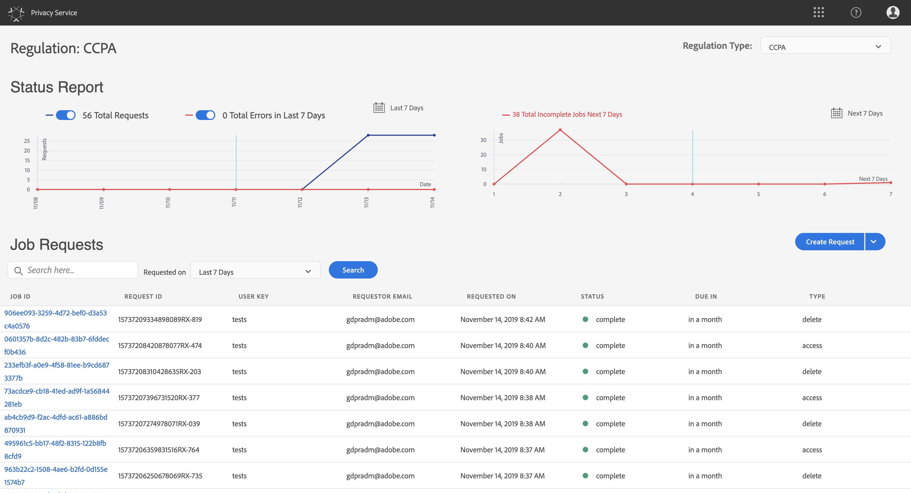

### Regulation Type

[!DNL Privacy Service] supports job requests for several privacy regulations. The following table lists the supported regulations and their corresponding label as represented in the UI: 

| UI label | Regulation |
| --- | --- |
| [!UICONTROL APA_AUS] | The [!DNL Australia Privacy Act (Privacy Act)] |
| [!UICONTROL CPA] | The [!DNL Colorado Privacy Act] |
| [!UICONTROL CCPA] | The [!DNL California Consumer Privacy Act] |
| [!UICONTROL CPRA_USA] | The [!DNL California Consumer Privacy Rights Act (CPRA)] |
| [!UICONTROL CTDPA] | The [!DNL Connecticut Data Privacy Act] |
| [!UICONTROL GDPR] | The European Union's [!DNL General Data Protection Regulation] |
| [!UICONTROL HIPAA_AUS] | The [!DNL Health Insurance Portability and Accountability Act] |
| [!UICONTROL LGPD_BRA] | Brazil's [!DNL Lei Geral de Proteção de Dados] |
| [!UICONTROL MHMDA] | The [!DNL Washington My Health My Data Act] |
| [!UICONTROL NZPA_NZL] | The New Zealand [!DNL Privacy Act] |
| [!UICONTROL PDPA_THA] | Thailand's [!DNL Personal Data Protection Act] |
| [!UICONTROL UCPA]  | The [!DNL Utah Consumer Privacy Act] |
| [!UICONTROL VCDPA_USA] | The [!DNL Virginia Consumer Data Protection Act] |

{style="table-layout:auto"}

<!--Not released yet:
| [!UICONTROL PDPA_VNM] | Vietnam's [!DNL Personal Data Protection Decree] |
 -->

>[!NOTE]
>
>See the overview on [supported privacy regulations](../regulations/overview.md) for more information on the legal context of each regulation.

Jobs for each regulation type are tracked separately. To switch between regulation types, select the **[!UICONTROL Regulation Type]** dropdown menu and select the desired regulation from the list.

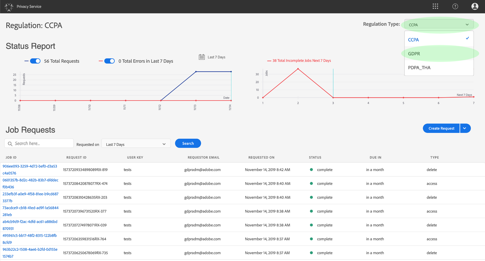

Upon changing the regulation type, the dashboard updates to show all operations, filters, widgets, and job-creation dialogs that apply to the selected regulation.

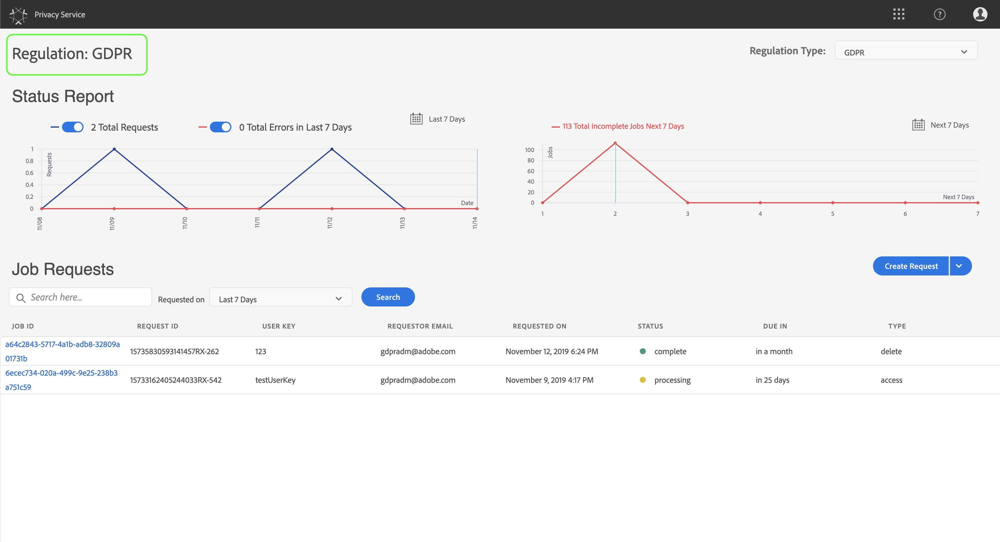

### Status Report

The graph on the left-hand side of the Status Report widget tracks submitted jobs against any jobs that may have reported back with errors. The graph on the right-hand side tracks jobs nearing the end of the 30-day compliance window.

Select one of the two toggle buttons above the graph to show or hide their respective metrics.

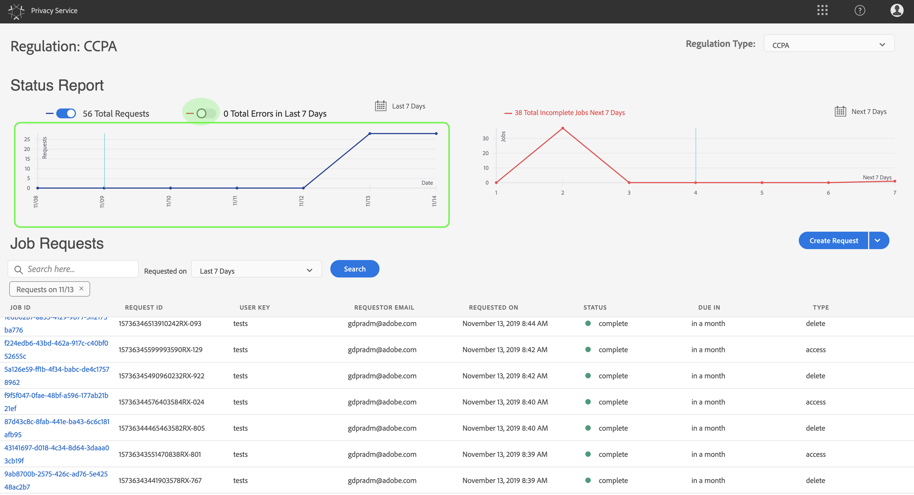

You can view the exact number of jobs associated with any data point on the graphs by hovering your mouse over the data point in question.

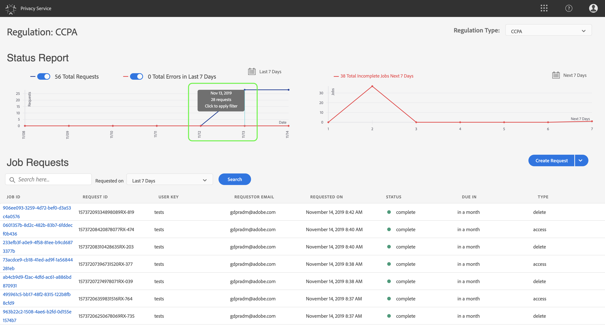

To view further details about a given data point, select the data point in question to display the associated jobs in the Job Requests widget. Take note of the filter that is applied just above the job list.

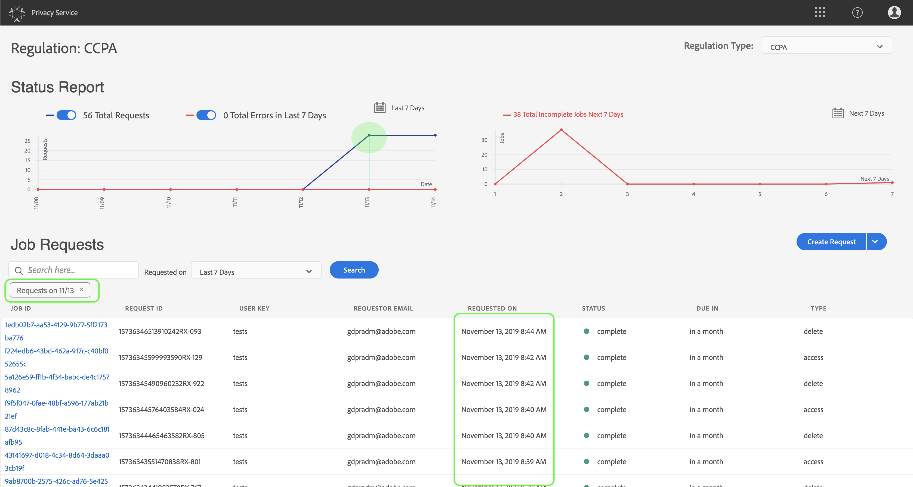

>[!NOTE]
>
>When a filter has been applied to the Job Requests widget, you can remove the filter by selecting the **X** on the filter pill. Job Requests then return to the default tracking list.

### Job Requests {#job-requests}

The [!UICONTROL Job Requests] workspace lists details about the recent job requests in your organization. Details include the request type, current status, due date, requestor email, and so on. Sets of 100 records are loaded at a time. By default, the most recently created jobs are displayed at the top with more sets of records loaded as you scroll down to browse.

>[!NOTE]
>
>The data for previously created jobs is only accessible for 30 days after the completion date.

You can filter the list by typing keywords into the search bar below the [!UICONTROL Job Requests] title. The list automatically filters as you type, showing requests that contain values that match your search terms. The search field performs a "quick" search that matches Privacy Job IDs to the currently rendered/loaded jobs in the UI. It is not a comprehensive search of all your submitted jobs. Rather, it is a filter applied to the loaded results. Use the Privacy Service API to [return jobs based on a specific regulation, date ranges, or a single job](../api/privacy-jobs.md#list).

>[!TIP]
>
>To load records into the UI from the past 30 days, you must scroll down the table and load more batches of records.

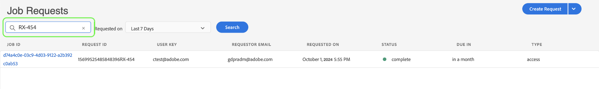

Alternatively, use the search button to perform a privacy job query that spans a particular date range. This action returns all the privacy jobs submitted by your organization during the given time frame. Select the **[!UICONTROL Requested on]** dropdown menu to choose a start and finish date for the query. The available options include [!UICONTROL Today], [!UICONTROL Last 7 Days], [!UICONTROL Last 2 Weeks], [!UICONTROL Last 30 Days], or [!UICONTROL Custom]. When used with the [!UICONTROL Requested on] option, the search feature only displays job requests that were submitted between your chosen date ranges. 

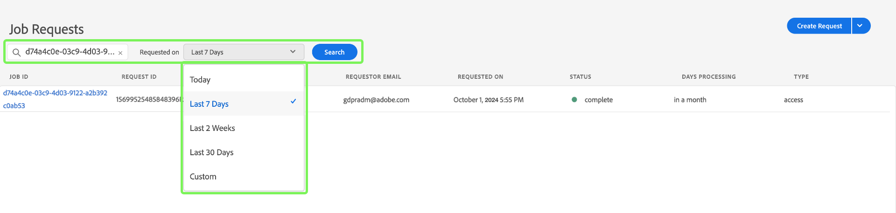

To view the details of a particular job request, select the request's job ID from the list to open the **[!UICONTROL Job Details]** page.

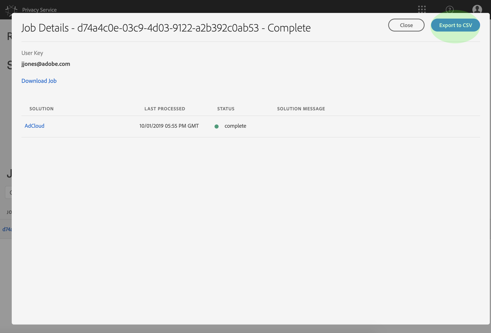

This dialog contains status information about each [!DNL Experience Cloud] solution and its current state in relation to the overall job. As every privacy job is asynchronous, the page displays the latest communication date and time (GMT) from each solution, as some require more time than others to process the request.

If a solution has provided any additional data, it is viewable in this dialog. You can view this data by selecting individual product rows.

To download the complete job data as a CSV file, select **[!UICONTROL Export to CSV]** at the top-right of the dialog.

## Create a new privacy job request {#create-a-new-privacy-job-request}

>[!CONTEXTUALHELP]
>id="platform_privacyConsole_requests_instructions"
>title="Instructions"
>abstract="<ul><li>Select <a href="https://experienceleague.adobe.com/docs/experience-platform/privacy/ui/overview.html#logging-in-from-experience-platform">Requests</a> in the left navigation to open the Privacy Ul, then select <b>Create Request</b>.</li><li>From here you can either use the request builder or upload a JSON file of data subjects.</li><li>If using the request builder, select the job type (access and/or delete) then choose the type of identity you are providing (email, ECID, or AAID) or enter a custom identity namespace. Enter the appropriate identity values for the customers and select <b>Create</b> when finished.</li><li>If uploading a JSON file, select the arrow next to Create Request. From the list of options, select <b>Upload JSON</b> and upload your file. If you don't have a JSON file to upload, select <b>Download Adobe-GDPR-Request.json</b> to download a template that you can populate. Upload the JSON and select <b>Create</b> when finished.</li><li>For more help with this feature, refer to the <a href="https://experienceleague.adobe.com/docs/experience-platform/privacy/ui/user-guide.html">Privacy Service user guide</a> on Experience League.</li></ul>"

>[!NOTE]
>
>In order to create a privacy job request, you must provide identity information for the specific customers whose data is to be accessed or deleted. Please review the document on [identity data for privacy requests](../identity-data.md) before continuing with this section.

The [!DNL Privacy Service] UI provides two methods to create new job requests:

* [Use the Request Builder](#request-builder)
* [Upload a JSON file](#json)

Steps for using each of these methods are provided in the following sections.

### Use the Request Builder {#request-builder}

Using the Request Builder, you can manually create a new privacy job request in the user interface. The Request Builder is best used for simpler and smaller sets of requests, because the Request Builder limits requests to have only ID type per user. For more complicated requests, it may better to [upload a JSON file](#json) instead.

To start using the Request builder, select **[!UICONTROL Create Request]** below the Status Report widget on the right-hand side of the screen.

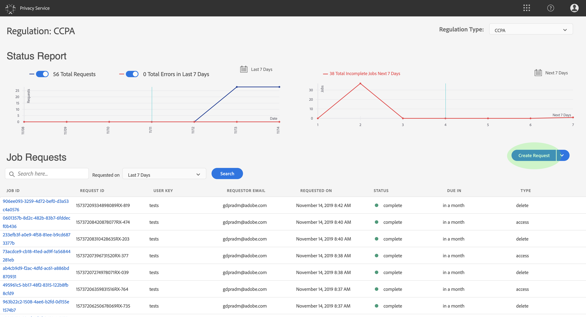

The **[!UICONTROL Create Request]** dialog opens, displaying the available options for submitting a privacy job request for the currently selected regulation type.

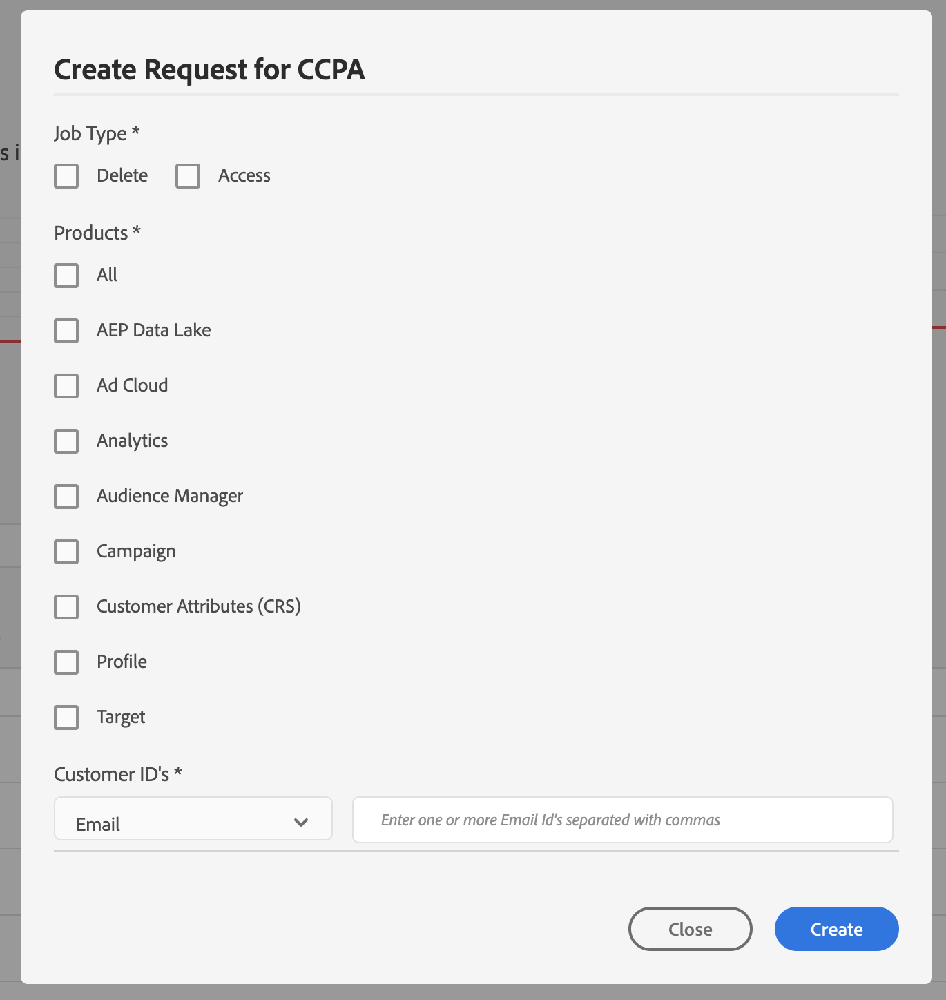 

Select the **[!UICONTROL Job Type]** of the request ("Delete" or "Access") and one or more available products from the list.

Privacy Service supports two kinds of job requests for personal data: [!UICONTROL Access] (read) and/or [!UICONTROL Delete]. You can either submit a request to receive all information held in the product that relates to the subject of the inquiry, or request to delete all the information that relates to the subject of the inquiry.

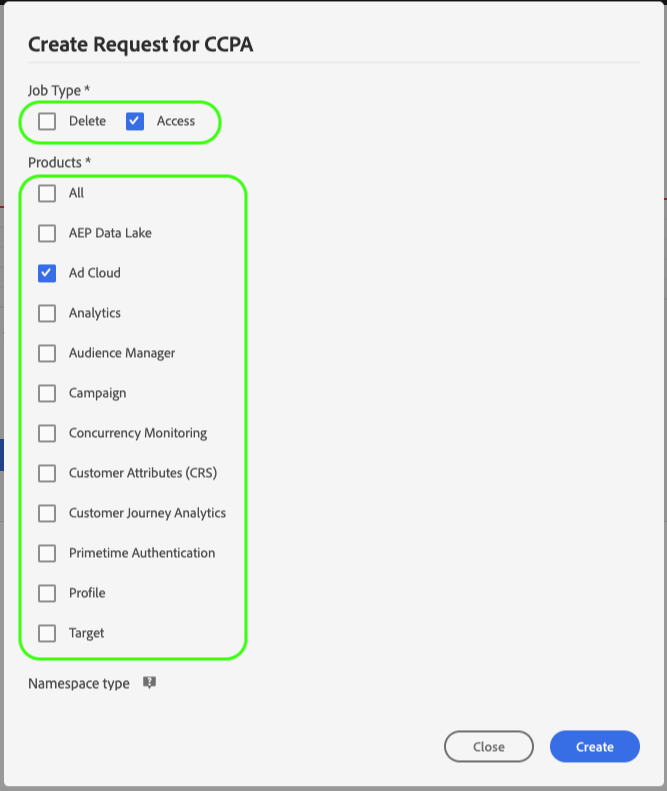 

Under **[!UICONTROL Namespace type]**, select the appropriate namespace type for the customer IDs being sent to [!DNL Privacy Service].

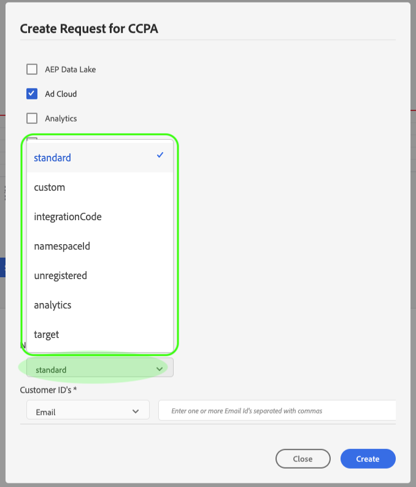 

When using the standard namespace type, select a namespace from the drop-down menu (email, ECID, or AAID), then type the ID values in the textbox to the right, pressing **\<enter>** for each ID to add it to the list.

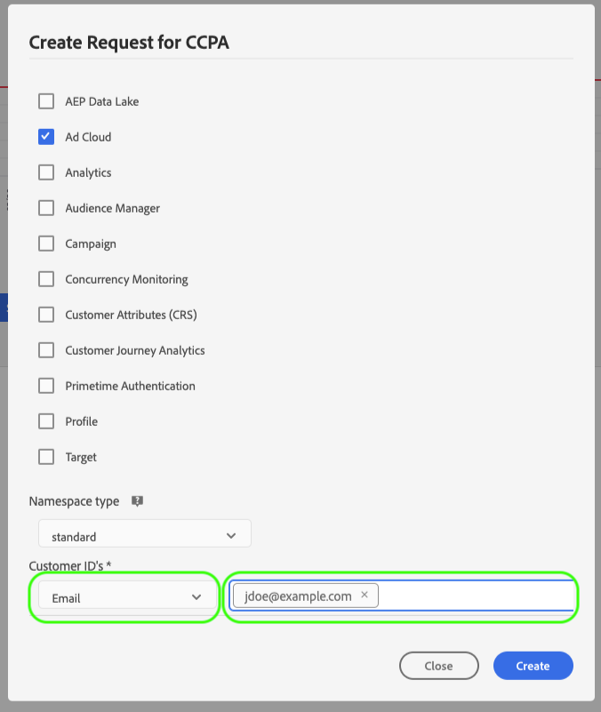 

When using the custom namespace type, you must manually type in the namespace before providing the ID values below.

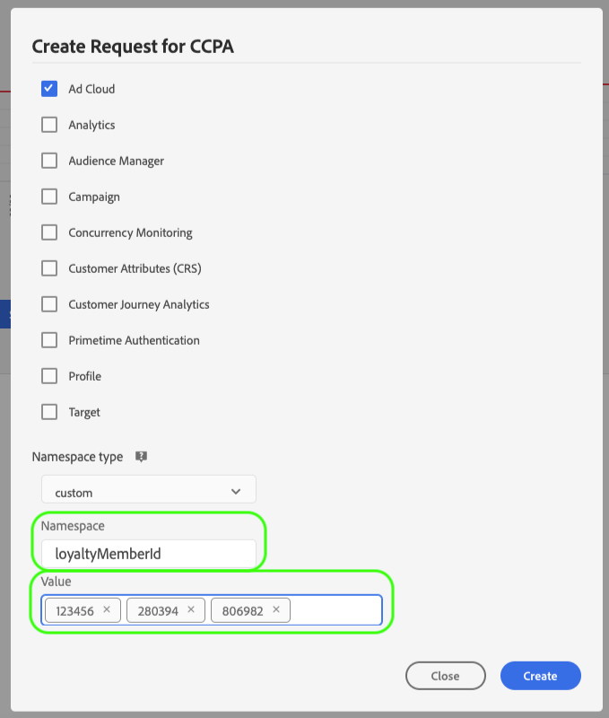 

When finished, select **[!UICONTROL Create]**.

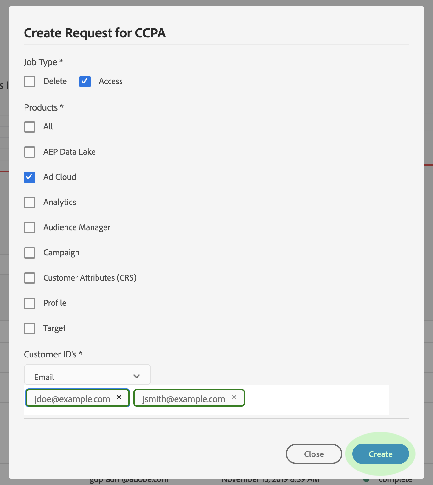 

The dialog disappears, and the new job (or jobs) are listed in the Job Requests widget along with their current processing status.

### Upload a JSON file {#json}

When creating more complicated requests, such as those that use multiple ID types for each data subject being processed, you can create a request by uploading a JSON file.

Select the arrow next to **[!UICONTROL Create Request]**, below the Status Report widget on the right-hand side of the screen. From the list of options that appears, select **[!UICONTROL Upload JSON]**.

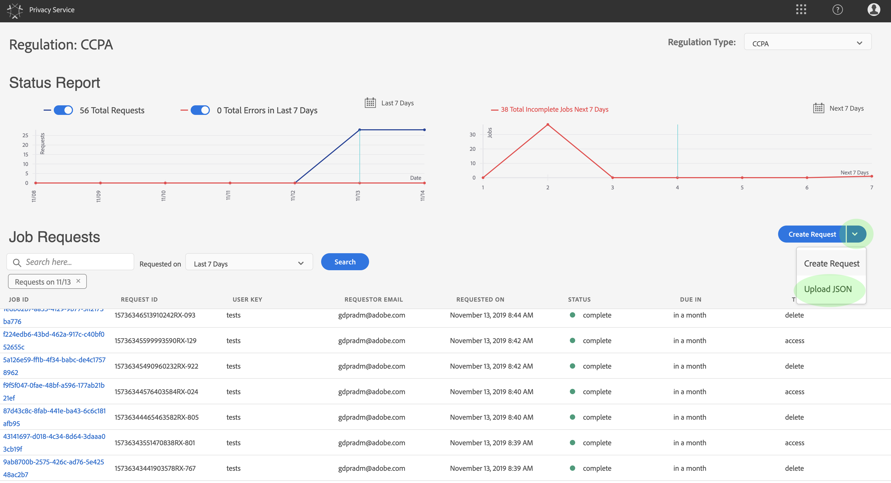

The **[!UICONTROL Upload JSON]** dialog appears, providing a window for you to drag and drop your JSON file into.

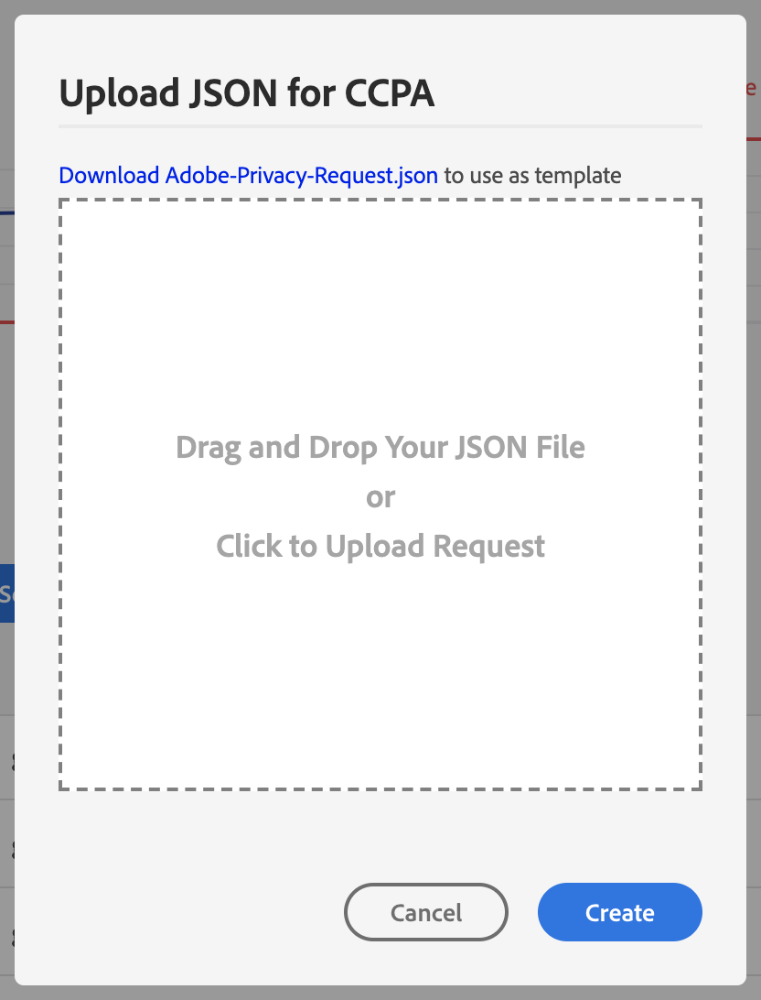 

If you do not have a JSON file to upload, select **[!UICONTROL Download Adobe-GDPR-Request.json]** to download a template that you can populate according to the values you have collected from your data subjects.

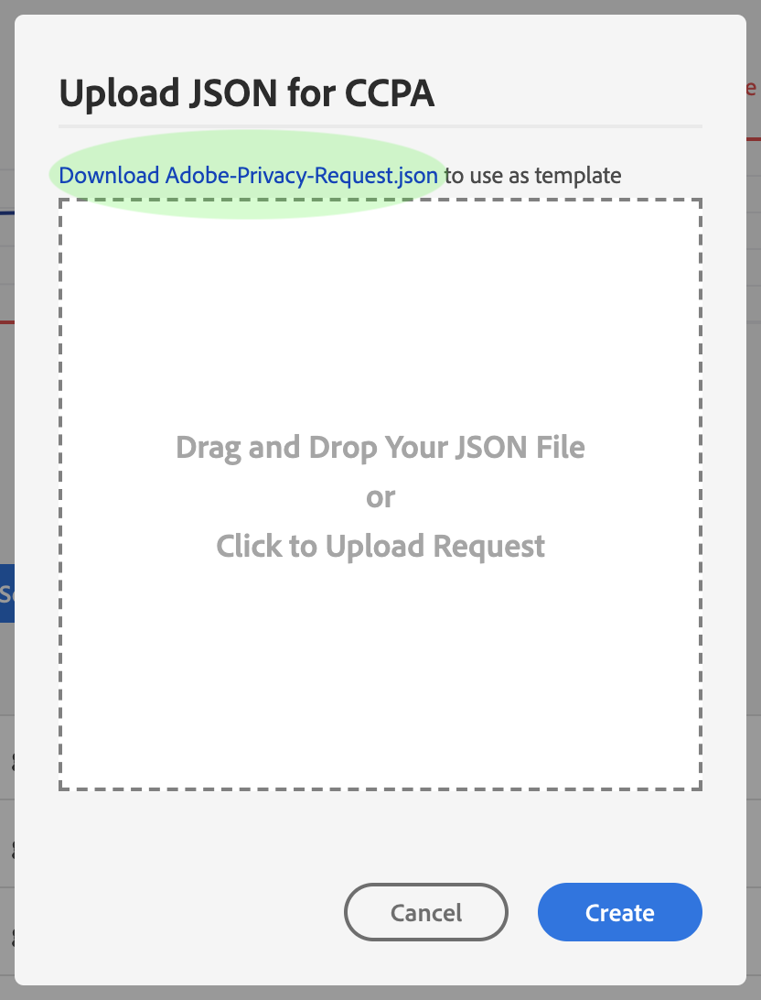 

Locate the JSON file on your computer, and drag it into the dialog window. If the upload is successful, the file name appears in the dialog. You can continue to add more JSON files as necessary by dragging and dropping them into the dialog.

When finished, select **[!UICONTROL Create]**. The dialog disappears, and the new job (or jobs) are listed in the Job Requests widget along with their current processing status.

### Next steps

By reading this document, you have learned how to use the [!DNL Privacy Service] UI to create a privacy job, view a job's details and monitor its processing status, and download the results once it has completed.

For steps on how to perform these operations programmatically using the [!DNL Privacy Service] API, please refer to the [API guide](../api/overview.md).
