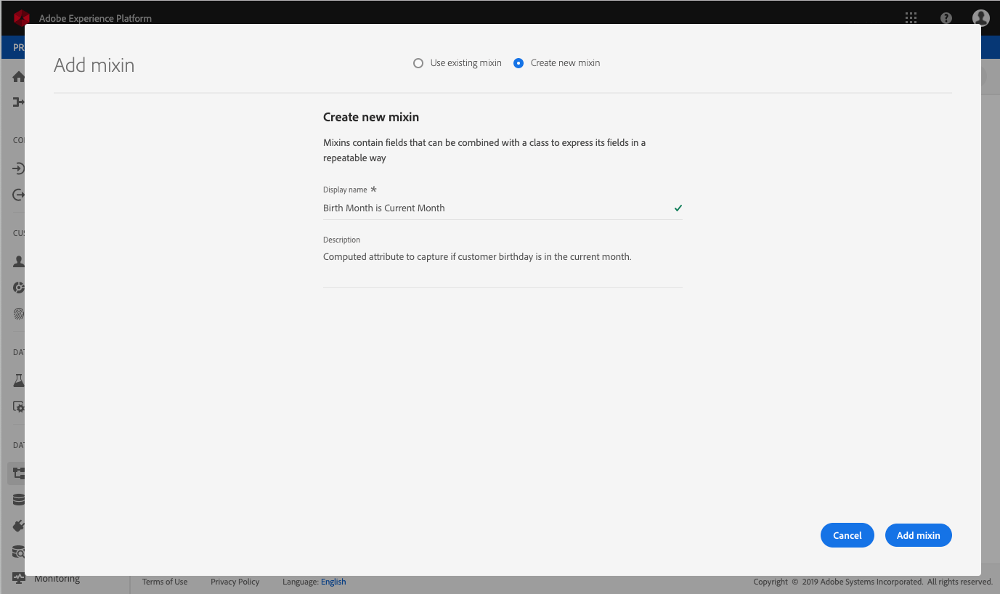

# (Alpha) Computed attributes endpoint

>[!IMPORTANT]
>
>The computed attribute functionality outlined in this document is currently in alpha and is not available to all users. The documentation and the functionality are subject to change.

Computed attributes enable you to automatically compute the value of fields based on other values, calculations, and expressions. Computed attributes operate on the profile level, meaning you can aggregate values across all records and events. 

Each computed attribute contains an expression, or "rule", that evaluates incoming data and stores the resulting value in a profile attribute or into an event. These computations help you to easily answer questions related to things like lifetime purchase value, time between purchases, or number of application opens, without requiring you to manually perform complex calculations each time the information is needed.

This guide will help you to better understand computed attributes within Adobe Experience Platform and includes sample API calls for performing basic CRUD operations using the `/config/computedAttributes` endpoint. 

## Getting started

The API endpoint used in this guide is part of the [Real-time Customer Profile API](https://www.adobe.io/apis/experienceplatform/home/api-reference.html#!acpdr/swagger-specs/real-time-customer-profile.yaml). Before continuing, please review the [getting started guide](getting-started.md) for links to related documentation, a guide to reading the sample API calls in this document, and important information regarding required headers that are needed to successfully make calls to any [!DNL Experience Platform] API.

## Understanding computed attributes

Adobe Experience Platform enables you to easily import and merge data from multiple sources in order to generate [!DNL Real-time Customer Profiles]. Each profile contains important information related to an individual, such as their contact information, preferences, and purchase history, providing a 360-degree view of the customer. 

Some of the information collected in the profile is easily understood when reading the data fields directly (for example, "first name") whereas other data requires performing multiple calculations or relying on other fields and values in order to generate the information (for example, "lifetime purchase total"). To make this data easier to understand at a glance, [!DNL Platform] allows you to create **[!UICONTROL computed attributes]** that automatically perform these references and calculations, returning the value in the appropriate field.

Computed attributes include creating an expression, or "rule", that operates on incoming data and stores the resulting value in a profile attribute or event. Expressions can be defined in multiple different ways, allowing you to specify that a rule evaluate incoming events only, an incoming event and profile data, or an incoming event, profile data, and historical events.

### Use cases

Use cases for computed attributes can range from simple calculations to very complex references. Here are a few example use cases for computed attributes:

1. **[!UICONTROL Percentages]:** A simple computed attribute could include taking two numeric fields on a record and dividing them to create a percentage. For example, you could take the total number of emails sent to an individual and divide it by the number of emails the individual opens. Looking at the resulting computed attribute field would quickly show the percentage of total emails opened by the individual.
1. **[!UICONTROL Application use]:** Another example includes the ability to aggregate the number of times a user opens your application. By tracking the total number of application opens, based on individual open events, you could deliver special offers or messages to users on their 100th open, encouraging deeper engagement with your brand.
1. **[!UICONTROL Lifetime values]:** Gathering running totals, such as a lifetime purchase value for a customer, can be very difficult. This requires updating the historic total each time a new purchase event occurs. A computed attribute allows you to do this much more easily by maintaining the lifetime value in a single field that is updated automatically following each successful purchase event related to the customer.

## Configure a computed attribute

In order to configure a computed attribute, you first need to identify the field that will hold the computed attribute value. This field can be created using a mixin to add the field to an existing schema, or by selecting a field that you have already defined within a schema. 

>[!NOTE]
>
>Computed attributes cannot be added to fields within Adobe-defined mixins. The field must be within the `tenant` namespace, meaning it must be a field that you define and add to a schema.

In order to successfully define a computed attribute field, the schema must be enabled for [!DNL Profile] and appear as part of the union schema for the class upon which the schema is based. For more information on [!DNL Profile]-enabled schemas and unions, please review the section of the [!DNL Schema Registry] developer guide section on [enabling a schema for Profile and viewing union schemas](../../xdm/api/getting-started.md). It is also recommended to review the [section on unions](../../xdm/schema/composition.md) in the schema composition basics documentation.

The workflow in this tutorial uses a [!DNL Profile]-enabled schema and follows the steps for defining a new mixin containing the computed attribute field and ensuring it is the correct namespace. If you already have a field that is in the correct namespace within a Profile-enabled schema, you can proceed directly to the step for [creating a computed attribute](#create-a-computed-attribute).

### View a schema

The steps that follow use the Adobe Experience Platform user interface to locate a schema, add a mixin, and define a field. If you prefer to use the [!DNL Schema Registry] API, please refer to the [Schema Registry developer guide](../../xdm/api/getting-started.md) for steps on how to create a mixin, add a mixin to a schema, and enable a schema for use with [!DNL Real-time Customer Profile].

In the user interface, click **[!UICONTROL Schemas]** in the left-rail and use the search bar on the **[!UICONTROL Browse]** tab to quickly find the schema you wish to update.


Once you have located the schema, click its name to open the [!DNL Schema Editor] where you can make edits to the schema.


### Create a mixin

To create a new mixin, click **[!UICONTROL Add]** next to *Mixins* in the **[!UICONTROL Composition]** section on the left-side of the editor. This opens the **[!UICONTROL Add mixin]** dialog where you can see existing mixins. Click the radio button for **[!UICONTROL Create new mixin]** in order to define your new mixin.

Give the mixin a name and description, and click **[!UICONTROL Add mixin]** when complete.



### Add a computed attribute field to the schema

Your new mixin should now appear in the **[!UICONTROL Mixins]** section under **[!UICONTROL Composition]**. Click on the name of the mixin and multiple **[!UICONTROL Add field]** buttons will appear in the *[!UICONTROL Structure]** section of the editor.

Select **[!UICONTROL Add field]** next to the name of the schema in order to add a top-level field, or you can select to add the field anywhere within the schema you prefer.

After clicking **[!UICONTROL Add field]** a new object opens, named for your tenant ID, showing that the field is in the correct namespace. Within that object, a **[!UICONTROL New field]** appears. This if the field where you will define the computed attribute.


### Configure the field

Using the **[!UICONTROL Field properties]** section on the right side of the editor, provide the necessary information for your new field, including its name, display name, and type. 

>[!NOTE]
>
>The type for the field must be the same type as the computed attribute value. For example, if the computed attribute value is a string, the field being defined in the schema must be a string.

When done, click **[!UICONTROL Apply]** and the name of the field, as well as its type will appear in the **[!UICONTROL Structure]** section of the editor.


### Enable schema for [!DNL Profile]

Before continuing, ensure that the schema has been enabled for [!DNL Profile]. Click on the schema name in the **[!UICONTROL Structure]** section of the editor so that the **[!UICONTROL Schema Properties]** tab appears. If the **[!UICONTROL Profile]** slider is blue, the schema has been enabled for [!DNL Profile]. 

>[!NOTE]
>
>Enabling a schema for [!DNL Profile] cannot be undone, so if you click on the slider once it has been enabled, you do not have to risk disabling it.


You can now click **[!UICONTROL Save]** to save the updated schema and continue with the rest of the tutorial using the API.

### Create a computed attribute {#create-a-computed-attribute}

With your computed attribute field identified, and confirmation that the schema is enabled for [!DNL Profile], you can now configure a computed attribute. 

Begin by making a POST request to the `/config/computedAttributes` endpoint with a request body containing the details of the computed attribute that you wish to create.

**API format**

```http
POST /config/computedAttributes
```

**Request**

```shell
curl -X POST \
  https://platform.adobe.io/data/core/ups/config/computedAttributes \
  -H 'Authorization: Bearer {ACCESS_TOKEN}' \
  -H 'Content-Type: application/json' \
  -H 'x-api-key: {API_KEY}'\
  -H 'x-gw-ims-org-id: {IMS_ORG}' \
  -H 'x-sandbox-name: {SANDBOX_NAME}' \
  -d '{
        "name" : "birthdayCurrentMonth",
        "path" : "_{TENANT_ID}",
        "description" : "Computed attribute to capture if the customer birthday is in the current month.",
        "expression" : {
            "type" : "PQL", 
            "format" : "pql/text", 
            "value":  "person.birthDate.getMonth() = currentMonth()"
        },
        "schema": 
          {
            "name":"_xdm.context.profile"
          }
          
      }'
```

|Property|Description|
|---|---|
|`name`|The name of the computed attribute field, as a string.|
|`path`|The path to the field containing the computed attribute. This path is found within the `properties` attribute of the schema and should NOT include the field name in the path. When writing the path, omit the multiple levels of `properties` attributes.|
|`{TENANT_ID}`|If you are unfamiliar with your tenant ID, please refer to the steps for finding your tenant ID in the [Schema Registry developer guide](../../xdm/api/getting-started.md#know-your-tenant_id).|
|`description`|A description of the computed attribute. This is especially useful once multiple computed attributes have been defined as it will help others within your IMS Organization to determine the correct computed attribute to use.|
|`expression.value`|A valid [!DNL Profile Query Language] (PQL) expression. For more information on PQL and links to supported queries, please read the [PQL overview](../../segmentation/pql/overview.md).|
|`schema.name`|The class upon which the schema containing the computed attribute field is based. Example: `_xdm.context.experienceevent` for a schema based on the XDM ExperienceEvent class.|

**Response**

A successfully created computed attribute returns HTTP Status 200 (OK) and a response body containing the details of the newly created computed attribute. These details include a unique, read-only, system-generated `id` that can be used for referencing the computed attribute during other API operations.

```json
{
    "id": "2afcf410-450e-4a39-984d-2de99ab58877",
    "imsOrgId": "{IMS_ORG}",
    "sandbox": {
        "sandboxId": "ff0f6870-c46d-11e9-8ca3-036939a64204",
        "sandboxName": "prod",
        "type": "production",
        "default": true
    },
    "name": "birthdayCurrentMonth",
    "path": "_{TENANT_ID}",
    "positionPath": [
        "_{TENANT_ID}"
    ],
    "description": "Computed attribute to capture if the customer birthday is in the current month.",
    "expression": {
        "type": "PQL",
        "format": "pql/text",
        "value": "person.birthDate.getMonth() = currentMonth()"
    },
    "schema": {
        "name": "_xdm.context.profile"
    },
    "returnSchema": {
        "meta:xdmType": "string"
    },
    "definedOn": [
        {
            "meta:resourceType": "unions",
            "meta:containerId": "tenant",
            "$ref": "https://ns.adobe.com/xdm/context/profile__union"
        }
    ],
    "encodedDefinedOn":"?\b?VR)JMS?R?())(????+?KL?OJ?K???H??O??+I?(?/(?O??I??/????S?8{?E:",
    "dependencies": [],
    "dependents": [],
    "active": true,
    "type": "ComputedAttribute",
    "createEpoch": 1572555223,
    "updateEpoch": 1572555225
}
```

|Property|Description|
|---|---|
|`id`|A unique, read-only, system-generated ID that can be used for referencing the computed attribute during other API operations.|
|`imsOrgId`| The IMS Organization related to the computed attribute, should match the value sent in the request.|
|`sandbox`|The sandbox object contains details of the sandbox within which the computed attribute was configured. This information is drawn from the sandbox header sent in the request. For more information, please see the [sandboxes overview](../../sandboxes/home.md).|
|`positionPath`|An array containing the deconstructed `path` to the field that was sent in the request.|
|`returnSchema.meta:xdmType`|The type of the field where the computed attribute will be stored.|
|`definedOn`|An array showing the union schemas upon which the computed attribute has been defined. Contains one object per union schema, meaning there may be multiple objects within the array if the computed attribute has been added to multiple schemas based on different classes.|
|`active`|A boolean value displaying whether or not the computed attribute is currently active. By default the value is `true`.|
|`type`|The type of resource created, in this case "ComputedAttribute" is the default value.|
|`createEpoch` and `updateEpoch`|The time at which the computed attribute was created and last updated, respectively.|


## Access computed attributes

When working with computed attributes using the API, there are two options for accessing computed attributes that have been defined by your organization. The first is to list all computed attributes, the second is to view a specific computed attribute by its unique `id`.

Steps for both listing all computed attributes and viewing a specific computed attribute are outlined in the sections that follow.

### List computed attributes {#list-computed-attributes}

Your IMS Organization may create multiple computed attributes, and performing a GET request to the `/config/computedAttributes` endpoint allows you list all existing computed attributes for your organization.

**API format**

```http
GET /config/computedAttributes
```

**Request**

```shell
curl -X GET \
  https://platform.adobe.io/data/core/ups/config/computedAttributes/ \
  -H 'Authorization: Bearer {ACCESS_TOKEN}' \
  -H 'x-api-key: {API_KEY}' \
  -H 'x-gw-ims-org-id: {IMS_ORG}' \ 
  -H 'x-sandbox-name: {SANDBOX_NAME}' \
```

**Response**

A successful response includes a `_page` attribute providing the total number of computed attributes (`totalCount`) and the number of computed attributes on the page (`pageSize`). 

The response also includes a `children` array composed of one or more objects, each containing the details of one computed attribute. If you organization does not have any computed attributes, the `totalCount` and `pageSize` will be 0 (zero) and the `children` array will be empty.

```json
{
    "_page": {
        "totalCount": 2,
        "pageSize": 2
    },
    "children": [
        {
            "id": "2afcf410-450e-4a39-984d-2de99ab58877",
            "imsOrgId": "{IMS_ORG}",
            "sandbox": {
                "sandboxId": "ff0f6870-c46d-11e9-8ca3-036939a64204",
                "sandboxName": "prod",
                "type": "production",
                "default": true
            },
            "name": "birthdayCurrentMonth",
            "path": "person._{TENANT_ID}",
            "positionPath": [
                "person",
                "_{TENANT_ID}"
            ],
            "description": "Computed attribute to capture if the customer birthday is in the current month.",
            "expression": {
                "type": "PQL",
                "format": "pql/text",
                "value": "person.birthDate.getMonth() = currentMonth()"
            },
            "schema": {
                "name": "_xdm.context.profile"
            },
            "returnSchema": {
                "meta:xdmType": "string"
            },
            "definedOn": [
                {
                    "meta:resourceType": "unions",
                    "meta:containerId": "tenant",
                    "$ref": "https://ns.adobe.com/xdm/context/profile__union"
                }
            ],
            "encodedDefinedOn":"?\b?VR)JMS?R?())(????+?KL?OJ?K???H??O??+I?(?/(?O??I??/????S?8{?E:",
            "dependencies": [],
            "dependents": [],
            "active": true,
            "type": "ComputedAttribute",
            "createEpoch": 1572555223,
            "updateEpoch": 1572555225
        },
        {
            "id": "ae0c6552-cf49-4725-8979-116366e8e8d3",
            "imsOrgId": "{IMS_ORG}",
            "sandbox": {
                "sandboxId": "",
                "sandboxName": "",
                "type": "production",
                "default": true
            },
            "name": "productDownloads",
            "path": "_{TENANT_ID}",
            "positionPath": [
                "_{TENANT_ID}"
            ],
            "description": "Calculate total product downloads.",
            "expression": {
                "type" : "PQL", 
                "format" : "pql/text", 
                "value":  "let Y = xEvent[_coresvc.event.subType = \"DOWNLOAD\"].groupBy(_coresvc.attributes[name = \"product\"].value).map({
                  \"downloaded\": this.head()._coresvc.attributes[name = \"product\"].head().value,
                  \"downloadsSum\": this.count(),
                  \"downloadsToday\": this[timestamp occurs today].count(),
                  \"downloadsPast30Days\": this[timestamp occurs < 30 days before now].count(),
                  \"downloadsPast60Days\": this[timestamp occurs < 60 days before now].count(),
                  \"downloadsPast90Days\": this[timestamp occurs < 90 days before now].count() }) in { \"uniqueProductDownloadSum\": Y.count(), \"products\": Y }"
            },
            "returnSchema": {
                "meta:xdmType": "string"
            },
            "definedOn": [
                {
                    "meta:resourceType": "unions",
                    "meta:containerId": "tenant",
                    "$ref": "https://ns.adobe.com/xdm/context/profile__union"
                }
            ],
            "schema": {
                "name": "_xdm.context.profile"
            },
            "encodedDefinedOn": "\u001f?\b\u0000\u0000\u0000\u0000\u0000\u0000\u0000?VR)JMS?R?())(????+?KL?OJ?K???H??O??+I?(?/(?O??I??/????S?\u0005\u00008{?E:\u0000\u0000\u0000",
            "dependencies": [],
            "dependents": [],
            "active": true,
            "type": "ComputedAttribute",
            "createEpoch": 1571945277,
            "updateEpoch": 1571945280
        }
    ],
    "_links": {
        "next": {}
    }
}
```

|Property|Description|
|---|---|
|`_page.totalCount`|The total number of computed attributes defined by your IMS Organization.|
|`_page.pageSize`|The number of computed attributes returned on this page of results. If `pageSize` is equal to `totalCount`, this means that there is only one page of results and all computed attributes have been returned. If they are not equal, there are additional pages of results that can be accessed. See `_links.next` for details.|
|`children`|An array composed of one or more objects, each containing the details of a single computed attribute. If no computed attributes have been defined, the `children` array is empty.|
|`id`|A unique, read-only, system-generated value assigned automatically to a computed attribute when it is created. For more information on the components of a computed attribute object, please see the section on [creating a computed attribute](#create-a-computed-attribute) earlier in this tutorial.|
|`_links.next`|If a single page of computed attributes is returned, `_links.next` is an empty object, as shown in the sample response above. If your organization has many computed attributes, they will be returned on multiple pages that you can access by make a GET request to the `_links.next` value.|

### View a computed attribute {#view-a-computed-attribute}

You can also view a specific computed attribute by making a GET request to the `/config/computedAttributes` endpoint and including the computed attribute ID in the request path.

**API format**

```http
GET /config/computedAttributes/{ATTRIBUTE_ID}
```

|Parameter|Description|
|---|---|
|`{ATTRIBUTE_ID}`|The ID of the computed attribute that you wish to view.|

**Request**

```shell
curl -X GET \
  https://platform.adobe.io/data/core/ups/config/computedAttributes/2afcf410-450e-4a39-984d-2de99ab58877 \
  -H 'Authorization: Bearer {ACCESS_TOKEN}' \
  -H 'x-api-key: {API_KEY}' \
  -H 'x-gw-ims-org-id: {IMS_ORG}' \ 
  -H 'x-sandbox-name: {SANDBOX_NAME}' \
```

**Response**

```json
{
    "id": "2afcf410-450e-4a39-984d-2de99ab58877",
    "imsOrgId": "{IMS_ORG}",
    "sandbox": {
        "sandboxId": "ff0f6870-c46d-11e9-8ca3-036939a64204",
        "sandboxName": "prod",
        "type": "production",
        "default": true
    },
    "name": "birthdayCurrentMonth",
    "path": "_{TENANT_ID}",
    "positionPath": [
        "_{TENANT_ID}"
    ],
    "description": "Computed attribute to capture if the customer birthday is in the current month.",
    "expression": {
        "type": "PQL",
        "format": "pql/text",
        "value": "person.birthDate.getMonth() = currentMonth()"
    },
    "schema": {
        "name": "_xdm.context.profile"
    },
    "returnSchema": {
        "meta:xdmType": "string"
    },
    "definedOn": [
        {
            "meta:resourceType": "unions",
            "meta:containerId": "tenant",
            "$ref": "https://ns.adobe.com/xdm/context/profile__union"
        }
    ],
    "encodedDefinedOn":"?\b?VR)JMS?R?())(????+?KL?OJ?K???H??O??+I?(?/(?O??I??/????S?8{?E:",
    "dependencies": [],
    "dependents": [],
    "active": true,
    "type": "ComputedAttribute",
    "createEpoch": 1572555223,
    "updateEpoch": 1572555225
}
```

## Update a computed attribute

Should you find that you need to update an existing computed attribute, this can be done by making a PATCH request to the `/config/computedAttributes` endpoint and including the ID of the computed attributed that you wish to update in the request path.

**API format**

```http
PATCH /config/computedAttributes/{ATTRIBUTE_ID}
```

|Parameter|Description|
|---|---|
|`{ATTRIBUTE_ID}`|The ID of the computed attribute that you wish to update.|

**Request**

This request uses [JSON Patch formatting](http://jsonpatch.com/) to update the "value" of the "expression" field.

```shell
curl -X PATCH \
  https://platform.adobe.io/data/core/ups/config/computedAttributes/ae0c6552-cf49-4725-8979-116366e8e8d3 \
  -H 'Authorization: Bearer {ACCESS_TOKEN}'\
  -H 'Content-Type: application/json' \
  -H 'x-api-key: {API_KEY}' \
  -H 'x-gw-ims-org-id: {IMS_ORG}' \
  -H 'x-sandbox-name: {SANDBOX_NAME}' \  
  -d '[
        {
          "op": "add",
          "path": "/expression",
          "value": 
          {
            "type" : "PQL", 
            "format" : "pql/text", 
            "value":  "{NEW_EXPRESSION_VALUE}"
          }
        }
      ]'
```

|Property|Description|
|---|---|
|`{NEW_EXPRESSION_VALUE}`|A valid [!DNL Profile Query Language] (PQL) expression. For more information on PQL and links to supported queries, please read the [PQL overview](../../segmentation/pql/overview.md).|

**Response**

A successful update returns HTTP Status 204 (No Content) and an empty response body. If you wish to confirm the update was successful, you can perform a GET request to view the computed attribute by its ID.

## Delete a computed attribute

It is also possible to delete a computed attribute using the API. This is done by making a DELETE request to the `/config/computedAttributes` endpoint and including the ID of the computed attribute that you wish to delete in the request path.

>[!NOTE]
>
>Please use caution when deleting a computed attribute as it may be in use in more than one schema and the DELETE operation cannot be undone.

**API format**

```http
DELETE /config/computedAttributes/{ATTRIBUTE_ID}
```

|Parameter|Description|
|---|---|
|`{ATTRIBUTE_ID}`|The ID of the computed attribute that you wish to delete.|

**Request**

```shell
curl -X DELETE \
  https://platform.adobe.io/data/core/ups/config/computedAttributes/ae0c6552-cf49-4725-8979-116366e8e8d3 \
  -H 'Authorization: Bearer {ACCESS_TOKEN}' \
  -H 'x-api-key: {API_KEY}' \
  -H 'x-gw-ims-org-id: {IMS_ORG}'
  -H 'x-sandbox-name: {SANDBOX_NAME}' \ 
```

**Response**

A successful delete request returns HTTP Status 200 (OK) and an empty response body. To confirm the deletion was successful, you can perform a GET request to lookup the computed attribute by its ID. If the attribute was deleted, you will receive an HTTP Status 404 (Not Found) error.

## Next steps

Now that you have learned the basics of computed attributes, you are ready to begin defining them for your organization.