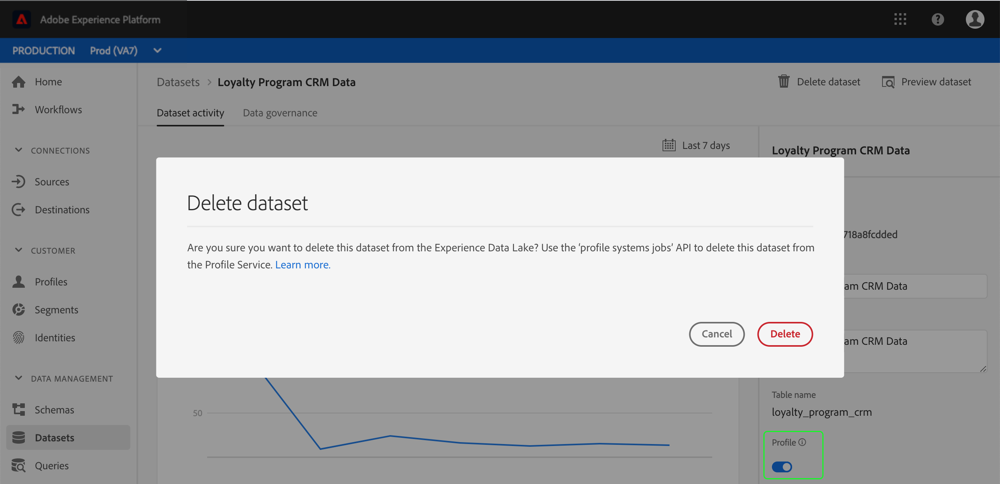

# Profile system jobs endpoint (Delete requests)

Adobe Experience Platform enables you to ingest data from multiple sources and build robust profiles for individual customers. Data ingested into [!DNL Platform] is stored in the [!DNL Data Lake] as well as the [!DNL Real-time Customer Profile] data store. Occasionally it may be necessary to delete a dataset or batch from the Profile Store in order to remove data that is no longer needed or was added in error. This requires using the [!DNL Real-time Customer Profile] API to create a [!DNL Profile] system job, also known as a "[!DNL delete request]", that can also be modified, monitored, or removed if required.

>[!NOTE]
>If you are trying to delete datasets or batches from the [!DNL Data Lake], please visit the [Catalog Service overview](../../catalog/home.md) for instructions.

## Getting started

The API endpoint used in this guide is part of the [!DNL Real-time Customer Profile API](https://www.adobe.io/apis/experienceplatform/home/api-reference.html#!acpdr/swagger-specs/real-time-customer-profile.yaml). Before continuing, please review the [getting started guide](getting-started.md) for links to related documentation, a guide to reading the sample API calls in this document, and important information regarding required headers that are needed to successfully make calls to any [!DNL Experience Platform] API.

## View delete requests

A delete request is a long-running, asynchronous process, meaning that your organization may be running multiple delete requests at once. In order to view all delete requests that your organization is currently running, you can perform a GET request to the `/system/jobs` endpoint. 

You may also use optional query parameters to filter the list of delete requests returned in the response. To use multiple parameters, separate each parameter using an ampersand (&).

**API format**

```http
GET /system/jobs
GET /system/jobs?{QUERY_PARAMETERS}
```

|Parameter|Description|
|---|---|
|`start`|Offset the page of results returned, as per the create time of the request. Example: *`start=4`*|
|`limit`|Limit the number of results returned. Example: *`limit=10`*|
|`page`|Return a specific page of results, as per the create time of the request. Example: ***`page=2`***|
|`sort`|Sort results by a specific field in ascending (*`asc`*) or descending (**`desc`**) order. The sort parameter does not work when returning multiple pages of results. Example: `sort=batchId:asc`| 

**Request**

```shell
curl -X GET \
  https://platform.adobe.io/data/core/ups/system/jobs \
  -H 'Authorization: Bearer {ACCESS_TOKEN}' \
  -H 'x-api-key: {API_KEY}' \
  -H 'x-gw-ims-org-id: {IMS_ORG}' \
  -H 'x-sandbox-name: {SANDBOX_NAME}' \
```

**Response**

The response includes a "children" array with an object for each delete request containing the details of that request.

```json
{
  "_page": {
    "count": 100,
    "next": "K1JJRDpFaWc5QUwyZFgtMEpBQUFBQUFBQUFBPT0jUlQ6MSNUUkM6MiNGUEM6QWdFQUFBQVFBQWZBQUg0Ly9yL25PcmpmZndEZUR3QT0="
  },
  "children": [
    {
      "id": "9c2018e2-cd04-46a4-b38e-89ef7b1fcdf4",
      "imsOrgId": "{IMS_ORG}",
      "batchId": "8d075b5a178e48389126b9289dcfd0ac",
      "jobType": "DELETE",
      "status": "COMPLETED",
      "metrics": "{\"recordsProcessed\":5,\"timeTakenInSec\":1}",
      "createEpoch": 1559026134,
      "updateEpoch": 1559026137
    },
    {
      "id": "3f225e7e-ac8c-4904-b1d5-0ce79e03c2ec",
      "imsOrgId": "{IMS_ORG}",
      "dataSetId": "5c802d3cd83fc114b741c4b5",
      "jobType": "DELETE",
      "status": "PROCESSING",
      "metrics": "{\"recordsProcessed\":0,\"timeTakenInSec\":15}",
      "createEpoch": 1559025404,
      "updateEpoch": 1559025406
    }
  ]
}
```

|Property|Description|
|---|---|
|`_page.count`|The total number of requests. This response has been truncated for space.|
|`_page.next`|If an additional page of results exists, view the next page of results by replacing the ID value in a [lookup request](#view-a-specific-delete-request) with the `"next"` value provided.|
|`jobType`|The type of job being created. In this case, it will always return `"DELETE"`.|
|`status`|The status of the delete request. Possible values are `"NEW"`, `"PROCESSING"`, `"COMPLETED"`, `"ERROR"`.|
|`metrics`|An object that includes the number of records that have been processed (`"recordsProcessed"`) and the time in seconds that the request has been processing, or how long the request took to complete (`"timeTakenInSec"`).|

## Create a delete request {#create-a-delete-request}

Initiating a new delete request is done through a POST request to the `/systems/jobs` endpoint, where the ID of the dataset or batch to be deleted is provided in the body of the request.

### Delete a dataset

In order to delete a dataset, the dataset ID must be included in the body of the POST request. This action will delete ALL data for a given dataset. [!DNL Experience Platform] allows you to delete datasets based on both record and time series schemas.

>[!CAUTION]
> When attempting to delete a [!DNL Profile]-enabled dataset using the [!DNL Experience Platform] UI, the dataset is disabled for ingestion but will not be deleted until a delete request is created using the API. For more information, see the [appendix](#appendix) to this document.

**API format**

```http
POST /system/jobs
```

**Request**

```shell
curl -X POST \
  https://platform.adobe.io/data/core/ups/system/jobs \
  -H 'Content-Type: application/json' \
  -H 'Authorization: Bearer {ACCESS_TOKEN}' \
  -H 'x-api-key: {API_KEY}' \
  -H 'x-gw-ims-org-id: {IMS_ORG}' \
  -H 'x-sandbox-name: {SANDBOX_NAME}' \
  -d '{
        "dataSetId": "5c802d3cd83fc114b741c4b5"
      }'
```

|Property|Description|
|---|---|
|`dataSetId`|**(Required)** The ID of the dataset you wish to delete.|

**Response**

A successful response returns the details of the newly created delete request, including a unique, system-generated, read-only ID for the request. This can be used to look up the request and check its status. The **`status`** for the request at time of creation is *`"NEW"`* until it begins processing. The **`dataSetId`** in the response should match the ***`dataSetId`*** sent in the request.

```json
{
    "id": "3f225e7e-ac8c-4904-b1d5-0ce79e03c2ec",
    "imsOrgId": "{IMS_ORG}",
    "dataSetId": "5c802d3cd83fc114b741c4b5",
    "jobType": "DELETE",
    "status": "NEW",
    "createEpoch": 1559025404,
    "updateEpoch": 1559025406
}
```

|Property|Description|
|---|---|
|`id`|The unique, system-generated, read-only ID of the delete request.|
|`dataSetId`|The ID of the dataset, as specified in the POST request.|

### Delete a batch

In order to delete a batch, the batch ID must be included in the body of the POST request. Please be advised that you cannot delete batches for datasets based on record schemas. Only batches for datasets based on time series schemas may be deleted. 

>[!NOTE]
> The reason you cannot delete batches for datasets based on record schemas is because record type dataset batches overwrite previous records and therefore cannot be "undone" or deleted. The only way to remove the impact of erroneous batches for datasets based on record schemas is to re-ingest the batch with the correct data in order to overwrite the incorrect records. 

For more information on record and time series behavior, please review the [section on XDM data behaviors](../../xdm/home.md#data-behaviors) in the [!DNL XDM System] overview.

**API format**

```http
POST /system/jobs
```

**Request**

```shell
curl -X POST \
  https://platform.adobe.io/data/core/ups/system/jobs \
  -H 'Content-Type: application/json' \
  -H 'Authorization: Bearer {ACCESS_TOKEN}' \
  -H 'x-api-key: {API_KEY}' \
  -H 'x-gw-ims-org-id: {IMS_ORG}' \
  -H 'x-sandbox-name: {SANDBOX_NAME}' \
  -d '{
       "batchId": "8d075b5a178e48389126b9289dcfd0ac"
      }'
```

|Property|Description|
|---|---|
|`batchId`|**(Required)** The ID of the batch you wish to delete.|

**Response**

A successful response returns the details of the newly created delete request, including a unique, system-generated, read-only ID for the request. This can be used to look up the request and check its status. The `"status"` for the request at time of creation is `"NEW"` until it begins processing. The `"batchId"` in the response should match the `"batchId"` sent in the request.

```json
{
    "id": "9c2018e2-cd04-46a4-b38e-89ef7b1fcdf4",
    "imsOrgId": "{IMS_ORG}",
    "batchId": "8d075b5a178e48389126b9289dcfd0ac",
    "jobType": "DELETE",
    "status": "NEW",
    "createEpoch": 1559026131,
    "updateEpoch": 1559026132
}
```

|Property|Description|
|---|---|
|`id`|The unique, system-generated, read-only ID of the delete request.|
|`batchId`|The ID of the batch, as specified in the POST request.|

If you attempt to initiate a delete request for a Record dataset batch, you will encounter a 400-level error, similar to the following:

```json
{
    "requestId": "bc4eb29f-63a8-4653-9133-71238884bb81",
    "errors": {
        "400": [
            {
                "code": "500",
                "message": "Batch can only be specified for EE type 'a294e36d382649dab2cc6ad64a41b674'"
            }
        ]
    }
}
```

## View a specific delete request {#view-a-specific-delete-request}

To view a specific delete request, including details such as its status, you can perform a lookup (GET) request to the `/system/jobs` endpoint and include the ID of the delete request in the path.

**API format**

```http
GET /system/jobs/{DELETE_REQUEST_ID}
```

|Parameter|Description|
|---|---|
|`{DELETE_REQUEST_ID}`|**(Required)** The ID of the delete request that you wish to view.|

**Request**

```shell
curl -X POST \
  https://platform.adobe.io/data/core/ups/system/jobs/9c2018e2-cd04-46a4-b38e-89ef7b1fcdf4 \
  -H 'Authorization: Bearer {ACCESS_TOKEN}' \
  -H 'x-api-key: {API_KEY}' \
  -H 'x-gw-ims-org-id: {IMS_ORG}' \
  -H 'x-sandbox-name: {SANDBOX_NAME}' \
```

**Response**

The response provides the details of the delete request, including its updated status. The ID of the delete request in the response should match the ID sent in the request path.

```json
{
    "id": "9c2018e2-cd04-46a4-b38e-89ef7b1fcdf4",
    "imsOrgId": "{IMS_ORG}",
    "batchId": "8d075b5a178e48389126b9289dcfd0ac",
    "jobType": "DELETE",
    "status": "COMPLETED",
    "metrics": "{\"recordsProcessed\":5,\"timeTakenInSec\":1}",
    "createEpoch": 1559026134,
    "updateEpoch": 1559026137
}
```

|Properties|Description|
|---|---|
|`jobType`|The type of job being created, in this case it will always return `"DELETE"`.|
|`status`|The status of the delete request. Possible values: `"NEW"`, `"PROCESSING"`, `"COMPLETED"`, `"ERROR"`.|
|`metrics`|An array that includes the number of records that have been processed (`"recordsProcessed"`) and the time in seconds that the request has been processing, or how long the request took to complete (`"timeTakenInSec"`).|

Once the delete request status is `"COMPLETED"` you can confirm that the data has been deleted by attempting to access the deleted data using the Data Access API. For instructions on how to use the Data Access API to access datasets and batches, please review the [Data Access documentation](../../data-access/home.md).

## Remove a delete request

[!DNL Experience Platform] allows you to delete a previous request, which may be useful for a number of reasons including if the delete job did not complete or became stuck in the processing stage. In order to remove a delete request, you can perform a DELETE request to the `/system/jobs` endpoint and include the ID of the delete request that you wish to remove to the request path.

**API format**

```http
DELETE /system/jobs/{DELETE_REQUEST_ID}
```

|Parameter|Description|
|---|---|
|{DELETE_REQUEST_ID}|The ID of the delete request that you wish to remove.|

**Request**

```shell
curl -X POST \
  https://platform.adobe.io/data/core/ups/system/jobs/9c2018e2-cd04-46a4-b38e-89ef7b1fcdf4 \
  -H 'Authorization: Bearer {ACCESS_TOKEN}' \
  -H 'x-api-key: {API_KEY}' \
  -H 'x-gw-ims-org-id: {IMS_ORG}' \
  -H 'x-sandbox-name: {SANDBOX_NAME}' \
```

**Response**

A successful delete request returns HTTP Status 200 (OK) and an empty response body. You can confirm the request was deleted by performing a GET request to view the delete request by its ID. This should return an HTTP Status 404 (Not Found), indicating the delete request was removed.

## Next Steps

Now that you know the steps involved in deleting datasets and batches from the [!DNL Profile Store] within [!DNL Experience Platform], you can safely delete data that has been added erroneously or that your organization no longer needs. Please be mindful that a delete request cannot be undone, therefore you should only delete data that you are confident you do not need now and will not need in the future.

## Appendix {#appendix}

The following information is supplemental to the act of deleting a dataset from the [!DNL Profile Store].

### Deleting a dataset using the [!DNL Experience Platform] UI

When using the [!DNL Experience Platform] user interface to delete a dataset that has been enabled for [!DNL Profile], a dialog opens asking, "Are you sure you want to delete this dataset from the [!DNL Experience Data Lake]? Use the 'p[!DNL rofile systems jobs]' API to delete this dataset from the [!DNL Profile Service]."

Clicking **[!UICONTROL Delete]** in the UI disables the dataset for ingestion, but DOES NOT automatically delete the dataset in the backend. In order to permanently delete the dataset, a delete request must be created manually using the steps in this guide for [creating a delete request](#create-a-delete-request).

The following image shows the warning when attempting to delete a [!DNL Profile]-enabled dataset using the UI.



For more information regarding working with datasets, please begin by reading the [datasets overview](../../catalog/datasets/overview.md).