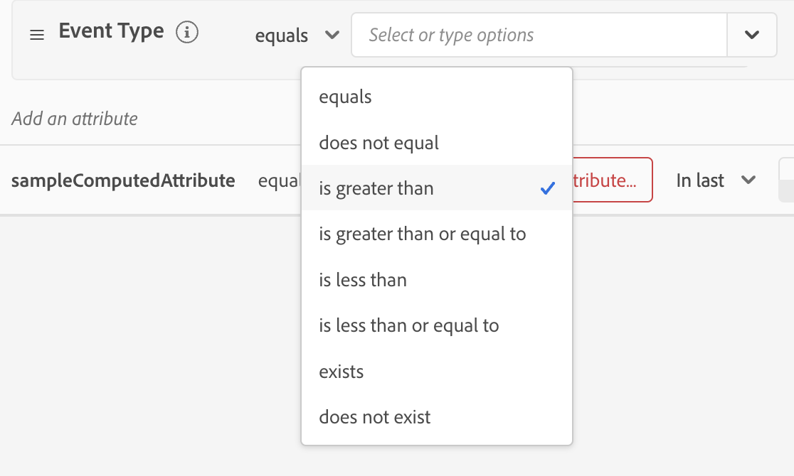
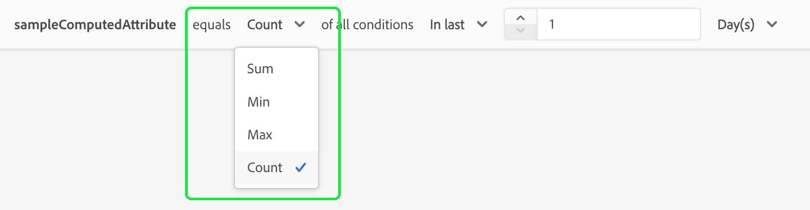
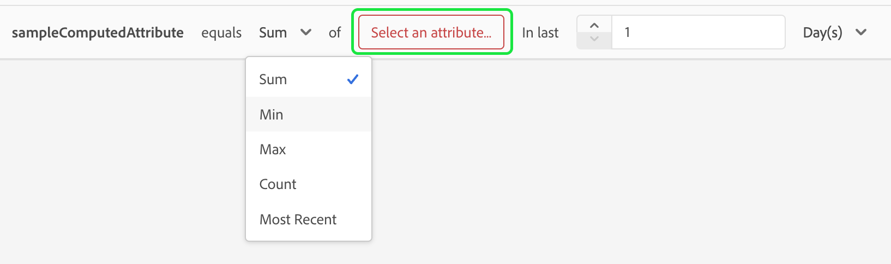
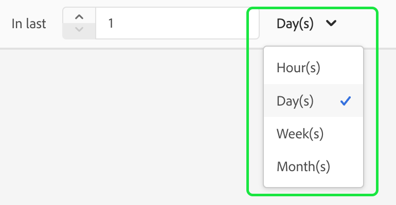
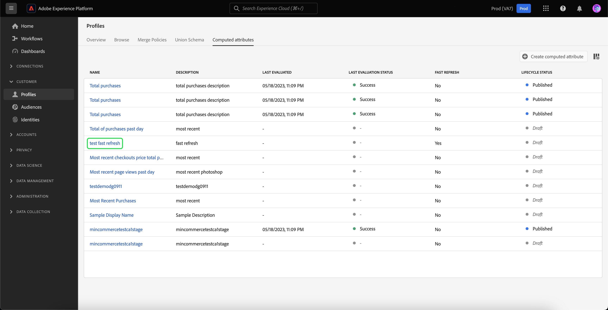
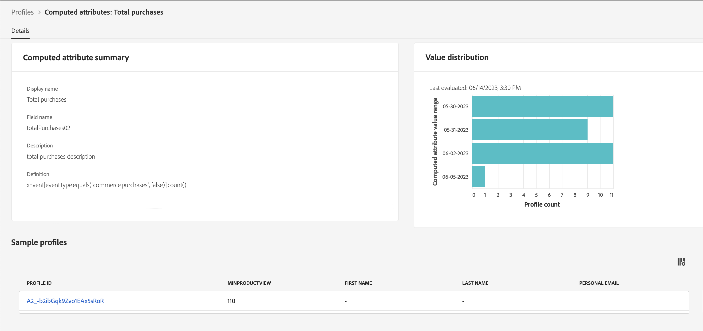
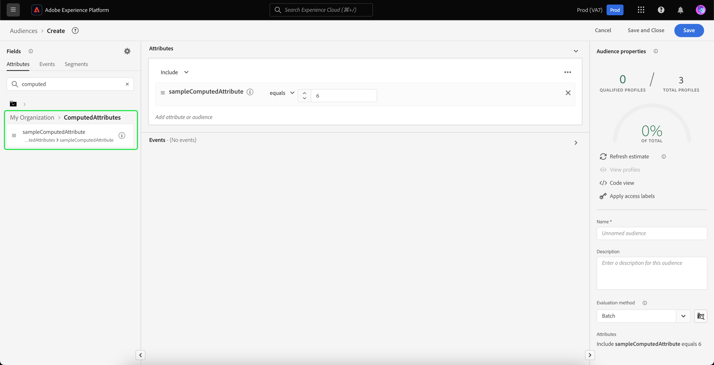

# Computed attributes UI guide

This document provides a guide on how to create and update computed attributes using the Adobe Experience Platform UI.

## Getting started

This UI guide requires an understanding of the various [!DNL Experience Platform] services involved with managing [!DNL Real-Time Customer Profiles]. Before reading this guide, or working in the UI, please review the documentation for the following services:

- [[!DNL Real-Time Customer Profile]](../home.md): Provides a unified, real-time consumer profile based on aggregated data from multiple sources.
- [[!DNL Experience Data Model (XDM) System]](../../xdm/home.md): The standardized framework by which [!DNL Experience Platform] organizes customer experience data.

## View computed attributes {#view}

In the Experience Platform UI, select **[!UICONTROL Profiles]** in the left navigation, followed by **[!UICONTROL Computed attributes]** to see a list of the computed attributes available for your organization. This includes information about the computed attribute's name, description, last evaluation date, and last evaluation status.

![The [!UICONTROL Profile] section and the [!UICONTROL Computed attributes] tabs are highlighted, showing users how to access the computed attributes browse page.](./images/ui/browse.png)

To select which fields are visible, you can select  to add or remove which fields you want to be displayed.

| Field | Description |
| ----- | ----------- |
| [!UICONTROL Name] | The display name of the computed attribute. |
| [!UICONTROL Description] | The description for the computed attribute. |
| [!UICONTROL Evaluation method] | The evaluation method for the computed attribute. At this time, only **batch** is supported. |
| [!UICONTROL Last evaluated] | This timestamp represents the last successful evaluation run. Only events that ocurred **before** this timestamp are considered in the last successful evaluation. |
| [!UICONTROL Last evaluation status] | The status that states whether or not the computed attribute was successfully calculated in the last evaluation run. Possible values include **[!UICONTROL Success]** or **[!UICONTROL Failed]**. | 
| [!UICONTROL Refresh frequency] | An indication on how frequently the computed attribute is expected to be refreshed. Possible values include hourly, daily, weekly, or monthly. |
| [!UICONTROL Fast refresh] | A value that shows whether or not fast refresh is enabled for this compute attribute. If fast refresh is enabled, this lets the computed attribute be refreshed on a daily basis, rather than on a weekly, bi-weekly, or monthly basis. This value is only applicable for computed attributes with a lookback period greater than a weekly basis. |
| [!UICONTROL Lifecycle status] | The current status of the computed attribute. There are three possible statuses: <ul><li>**[!UICONTROL Draft]:** The computed attribute does **not** have a field created on the schema yet. In this state, the computed attribute can be edited. </li><li>**[!UICONTROL Published]:** The computed attribute has a field created on the schema and is ready to be used. In this state, the computed attribute **cannot** be edited.</li><li>**[!UICONTROL Inactive]:** The computed attribute is disabled. For more information about the inactive status, please read the [frequently asked questions page](./faq.md#inactive-status). </li> | 

Additionally, you can select a computed attribute to see more detailed information about it. For more information on the computed attributes details page, please read the [view a computed attribute's details section](#view-details).

## Create a computed attribute {#create}

To create a new computed attribute, select **[!UICONTROL Create computed attribute]** to enter the new computed attribute workflow.

![The [!UICONTROL Create computed attributes] button is highlighted, showing users how to reach the create a computed attribute page.](./images/ui/create.png)

The **[!UICONTROL Create computed attribute]** page appears. On this page, you can add the basic information for the computed attribute you want to create.

| Field | Description |
| ----- | ----------- |
| [!UICONTROL Display name] | The name which the computed attribute will be known by. You should keep this display name unique for each computed attribute. As a best practice, this display name should contain identifiers related to the computed attribute. So, for example, "Sum of purchases for shoes in the last 7 days". |
| [!UICONTROL Field name] | A name which is used to refer to the computed attribute in other downstream services. This name is automatically derived from the display name and is written in camelCase. |
| [!UICONTROL Description] | A description of the computed attribute you're trying to create. |

![The [!UICONTROL Basic information] section of the [!UICONTROL Create computed attribute] page is highlighted.](./images/ui/basic-information.png)

After adding the computed attribute details, you can start  defining your rules. 

### Specify event filtering conditions

To create a rule, first select attributes from the **[!UICONTROL Events]** section to filter down events that you want to aggregate on. Currently, only non-array events are supported.

![The [!UICONTROL Events] section is highlighted.](./images/ui/events.png)

After selecting the attribute to use in the computed attribute definition, you can choose what this value will be compared to.

### Apply aggregation function

Now, you can apply a function to the field from the conditional output. First, select the aggregation function type. Available options include [!UICONTROL Sum], [!UICONTROL Min], [!UICONTROL Max], [!UICONTROL Count], and [!UICONTROL Most Recent]. More information about these functions can be found in the [functions section](./overview.md#functions) of the computed attributes overview.

After choosing a function, you can choose the field to aggregate on. The eligible fields to choose are dependent on the function selected.

### Lookback duration

After applying the aggregation function, you'll need to define the lookback period of the computed attribute. This lookback period specifies the length of time that you want to aggregate events on. This lookback duration can be specified in terms of hours, days, weeks, or months.

With these steps completed, you can now either choose to save this computed attribute as a draft or to immediately publish it.

![The [!UICONTROL Save as draft] and [!UICONTROL Publish] buttons are highlighted.](./images/ui/draft-or-publish.png)

## View a computed attribute's details {#view-details}

To view the details of a computed attribute, select the computed attribute you want to see details about on the [!UICONTROL **Browse**] page.

The content of the page differs, depending if the computed attribute is **[!UICONTROL Published]** or in **[!UICONTROL Draft]**.

### Published computed attribute {#published}

When selecting a published computed attribute, the computed attributes detail page appears.

This page displays a summary of the computed attribute's details, as well as a graph showing the value distribution as well as sample profiles that qualify for the computed attribute.

>[!NOTE]
>
>The value distribution reflects the distribution of attribute values for profiles at the time of the sampling job. The computed attribute value in the sample profile reflects the latest merged profile value for a few sample profiles.

### Draft computed attribute {#draft}

When selecting a draft computed attribute, the **[!UICONTROL Edit computed attributes]** page appears. This page, similarly to the Create computed attributes page, lets you edit your computed attribute's basic information, as well as its definition, before letting you update the draft or publish it.

![The [!UICONTROL Edit computed attributes ]page is displayed.](./images/ui/edit.png)

## Using computed attributes {#usage}

After creating a computed attribute, you can use **published** computed attributes in other downstream services. Since computed attributes are profile attribute fields created on your profile union schema, you can look up computed attribute values for a Real-Time Customer Profile, use them in an audience, activate them to a destination, or use them for personalization in journeys in Adobe Journey Optimizer.

## Next steps

To learn more about computed attributes, please read the [computed attributes overview](./overview.md). For information on creating and configuring computed attributes using the API, please read the [computed attributes developer guide](./api.md).
