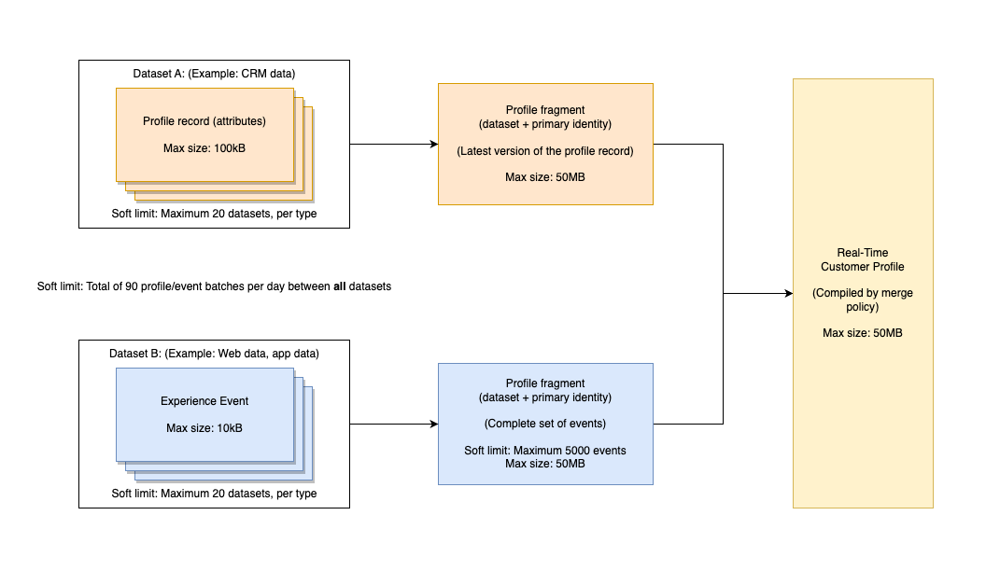
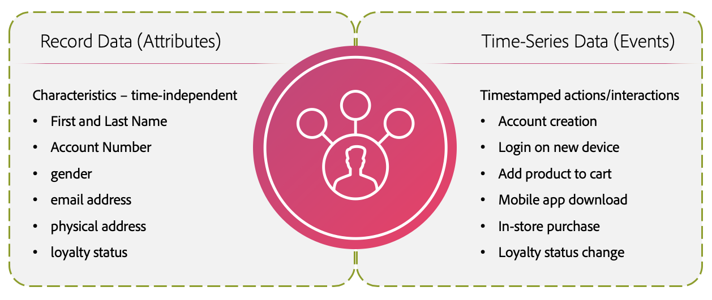
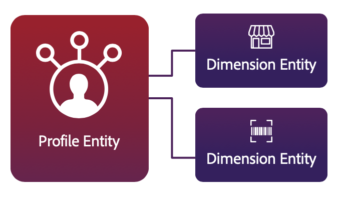

# Default Guardrails for [!DNL Real-Time Customer Profile] data

Adobe Experience Platform enables you to deliver personalized cross-channel experiences based on behavioral insights and customer attributes in the form of Real-Time Customer Profiles. To support this new approach to profiles, Experience Platform uses a highly denormalized hybrid data model that differs from the traditional relational data model.

This document provides default use and rate limits to help you model your Profile data for optimal system performance. When reviewing the following guardrails, it is assumed that you have modeled the data correctly. If you have questions on how to model your data, please contact your customer service representative.

>[!NOTE]
>
>Most customers do not exceed these default limits. If you would like to learn about custom limits, please contact your customer care representative.

## Getting started

The following Experience Platform services are involved with modeling Real-Time Customer Profile data: 

* [[!DNL Real-Time Customer Profile]](home.md): Create unified consumer profiles using data from multiple sources.
* [Identities](../identity-service/home.md): Bridge identities from disparate data sources as they are ingested into Platform.
* [Schemas](../xdm/home.md): Experience Data Model (XDM) schemas are the standardized framework by which Platform organizes customer experience data.
* [Audiences](../segmentation/home.md): The segmentation engine within Platform is used to create audiences from your customer profiles based on customer behaviors and attributes.

## Limit types

There are two types of default limits within this document:

* **Soft limit:** It is possible to go beyond a soft limit, however soft limits provide a recommended guideline for system performance. 

* **Hard limit:** A hard limit provides an absolute maximum.

>[!NOTE]
>
>The limits outlined in this document are constantly being improved. Please check back regularly for updates. If you are interested in learning about custom limits, please contact your customer care representative.

## Data model limits

The following guardrails provide recommended limits when modeling Real-Time Customer Profile data. To learn more about primary entities and dimension entities, see the section on [entity types](#entity-types) in the Appendix.

### Primary entity guardrails

| Guardrail | Limit | Limit Type | Description |
| --- | --- | --- | --- |
| XDM Individual Profile class datasets | 20 | Soft| A maximum of 20 datasets that leverage the XDM Individual Profile class is recommended.|
| XDM ExperienceEvent class datasets | 20 | Soft| A maximum of 20 datasets that leverage the XDM ExperienceEvent class is recommended.|
| Adobe Analytics report suite datasets enabled for Profile| 1 | Soft | A maximum of one (1) Analytics report suite dataset should be enabled for Profile. Attempting to enable multiple Analytics report suite datasets for Profile may have unintended consequences for data quality. For more information, see the section on [Adobe Analytics datasets](#aa-datasets) in the Appendix.|
| Multi-entity relationships| 5 | Soft | A maximum of 5 multi-entity relationships defined between primary entities and dimension entities is recommended. Additional relationship mappings should not be made until an existing relationship is removed or disabled. | 
| JSON depth for ID field used in multi-entity relationship| 4 | Soft | The recommended maximum JSON depth for an ID field used in multi-entity relationships is 4. This means that in a highly nested schema, fields that are nested more than 4 levels deep should not be used as an ID field in a relationship.|
| Array cardinality in a profile fragment|<=500|Soft|The optimal array cardinality in a profile fragment (time-independent data) is <=500.|
| Array cardinality in ExperienceEvent | <=10 | Soft | The optimal array cardinality in an ExperienceEvent (time series data) is <=10. |
| Identity count for individual profile Identity Graph | 50 | Hard | **The maximum number of identities in an Identity Graph for an individual profile is 50.** Any profiles with more than 50 identities are excluded from segmentation, exports, and lookups. | 

{style="table-layout:auto"}

### Dimension entity guardrails

| Guardrail | Limit | Limit Type | Description |
| --- | --- | --- | --- |
| No time-series data permitted for non-[!DNL XDM Individual Profile] entities| 0 | Hard | **Time-series data is not permitted for non-[!DNL XDM Individual Profile] entities in Profile Service.** If a time-series dataset is associated with a non-[!DNL XDM Individual Profile] ID, the dataset should not be enabled for [!DNL Profile]. |
| No nested relationships | 0 | Soft | You should not create a relationship between two non-[!DNL XDM Individual Profile] schemas. The ability to create relationships is not recommended for any schemas which are not part of the [!DNL Profile] union schema.|
| JSON depth for primary ID field | 4 | Soft | The recommended maximum JSON depth for the primary ID field is 4. This means that in a highly nested schema, you should not select a field as a primary ID if it is nested more than 4 levels deep. A field that is on the 4th nested level can be used as a primary ID.|

{style="table-layout:auto"}

## Data size limits

The following guardrails refer to data size and provide recommended limits for data that can be ingested, stored, and queried as intended. To learn more about primary entities and dimension entities, see the section on [entity types](#entity-types) in the Appendix.

>[!NOTE]
>
>Data size is measured as uncompressed data in JSON at time of ingestion.

### Primary entity guardrails

| Guardrail | Limit| Limit Type | Description|
| --- | --- | --- | --- |
| Maximum ExperienceEvent size | 10KB | Hard | **The maximum size of an event is 10KB.** Ingestion will continue, however any events larger than 10KB will be dropped.|
| Maximum profile record size | 100KB | Hard | **The maximum size of a profile record is 100KB.** Ingestion will continue, however profile records larger than 100KB will be dropped.|
| Maximum profile fragment size | 50MB | Hard | **The maximum size of a single profile fragment is 50MB.** Segmentation, exports, and lookups may fail for any [profile fragment](#profile-fragments) that is larger than 50MB.|
| Maximum profile storage size | 50MB | Soft | **The maximum size of a stored profile is 50MB.** Adding new [profile fragments](#profile-fragments) into a profile that is larger than 50MB will affect system performance. For example, a profile could contain a single fragment that is 50MB or it could contain multiple fragments across multiple datasets with a combined total size of 50MB. Attempting to store a profile with a single fragment larger than 50MB, or multiple fragments that total more than 50MB in combined size, will affect system performance.|
| Number of Profile or ExperienceEvent batches ingested per day | 90 | Soft | **The maximum number of Profile or ExperienceEvent batches ingested per day is 90.** This means that the combined total of Profile and ExperienceEvent batches ingested each day cannot exceed 90. Ingesting additional batches will affect system performance.|
| Number of ExperienceEvents per profile record | 5000 | Soft | **The maximum number of ExperienceEvents per profile record is 5000.** Profiles with more than 5000 ExperienceEvents will **not** be considered for segmentation. | 

{style="table-layout:auto"}

### Dimension entity guardrails

| Guardrail | Limit | Limit Type | Description|
| --- | --- | --- | --- |
| Total size for all dimensional entities | 5GB | Soft | The recommended total size for all dimensional entities is 5GB. Ingesting large dimension entities may affect system performance. For example, attempting to load a 10GB product catalog as a dimension entity is not recommended.|
| Datasets per dimensional entity schema | 5 | Soft | A maximum of 5 datasets associated with each dimensional entity schema is recommended. For example, if you create a schema for "products" and add five contributing datasets, you should not create a sixth dataset tied to the products schema.|
|Dimension entity batches ingested per day |4 per entity|Soft|The recommended maximum number of dimension entity batches ingested per day is 4 per entity. For example, you could ingest updates to a product catalog up to 4 times per day. Ingesting additional dimension entity batches for the same entity may affect system performance.|

{style="table-layout:auto"}

## Segmentation guardrails

The guardrails outlined in this section refer to the number and nature of audiences an organization can create within Experience Platform, as well as mapping and activating audiences to destinations.

| Guardrail | Limit | Limit Type | Description|
| --- | --- | --- | --- |
| Audiences per sandbox | 4000 | Soft | An organization can have more than 4000 audiences in total, as long as there are less than 4000 audiences in each individual sandbox. Attempting to create additional audiences may affect system performance.|
| Edge audiences per sandbox | 150 | Soft | An organization can have more than 150 edge audiences in total, as long as there are less than 150 edge audiences in each individual sandbox. Attempting to create additional edge audiences may affect system performance. | 
| Streaming audiences per sandbox | 500 | Soft | An organization can have more than 500 streaming audiences in total, as long as there are less than 500 streaming audiences in each individual sandbox. Attempting to create additional streaming audiences may affect system performance.|
| Batch audiences per sandbox | 4000 | Soft | An organization can have more than 4000 batch audiences in total, as long as there are less than 4000 batch audiences in each individual sandbox. Attempting to create additional batch audiences may affect system performance.|

{style="table-layout:auto"}

## Appendix

This section provides additional details for the limits in this document.

### Entity types

The [!DNL Profile] store data model consists of two core entity types: [primary entities](#primary-entity) and [dimension entities](#dimension-entity).

#### Primary entity

A primary entity, or profile entity, merges data together to form a "single source of truth" for an individual. This unified data is represented using what is known as a "union view". A union view aggregates the fields of all schemas that implement the same class into a single union schema. The union schema for [!DNL Real-Time Customer Profile] is a denormalized hybrid data model that acts as a container for all profile attributes and behavioral events. 

Time-independent attributes, also known as "record data" are modeled using [!DNL XDM Individual Profile], while time-series data, also known as "event data" is modeled using [!DNL XDM ExperienceEvent]. As record and time-series data is ingested in Adobe Experience Platform, it triggers [!DNL Real-Time Customer Profile] to begin ingesting data that has been enabled for its use. The more interactions and details that are ingested, the more robust individual profiles become.

 

#### Dimension entity

While the Profile data store maintaining profile data is not a relational store, Profile permits integration with small dimension entities in order to create audiences in a simplified and intuitive manner. This integration is known as [multi-entity segmentation](../segmentation/multi-entity-segmentation.md).

Your organization may also define XDM classes to describe things other than individuals, such as stores, products, or properties. These non-[!DNL XDM Individual Profile] schemas are called "dimension entities" (also known as "lookup entities") and do not contain time-series data. Schemas that represent dimension entities are linked to profile entities through the use of [schema relationships](../xdm/tutorials/relationship-ui.md).

Dimension entities provide lookup data which aids and simplifies multi-entity segment definitions and must be small enough that the segmentation engine can load the entire data set into memory for optimal processing (fast point lookup).

### Profile fragments

In this document, there are several guardrails that refer to "profile fragments." In Experience Platform, multiple profile fragments are merged together to form the Real-Time Customer Profile. Each fragment represents a unique primary identity and the corresponding record or complete set of event data for that ID within a given dataset. To learn more about profile fragments, refer to the [Profile overview](home.md#profile-fragments-vs-merged-profiles).

### Merge policies {#merge-policies}

When bringing data together from multiple sources, merge policies are the rules that Platform uses to determine how data will be prioritized and what data will be combined to create that unified view. For example, if a customer interacts with your brand across several channels, your organization will have multiple profile fragments related to that single customer appearing in multiple datasets. When these fragments are ingested into Platform, they are merged together in order to create a single profile for that customer. When the data from multiple sources conflicts the merge policy determines which information to include in the profile for the individual. A maximum of five (5) merge policies is allowed per organization. To learn more about merge policies, please read the [merge policies overview](merge-policies/overview.md).

### Adobe Analytics report suite datasets in Platform {#aa-datasets}

Multiple report suites can be enabled for Profile as long as all data conflicts are resolved. You can use the Data Prep functionality to resolve data conflicts across eVars, Lists, and Props. To learn more about how to use the Data Prep functionality, please read the [Adobe Analytics connector UI guide](../sources/tutorials/ui/create/adobe-applications/analytics.md). 
