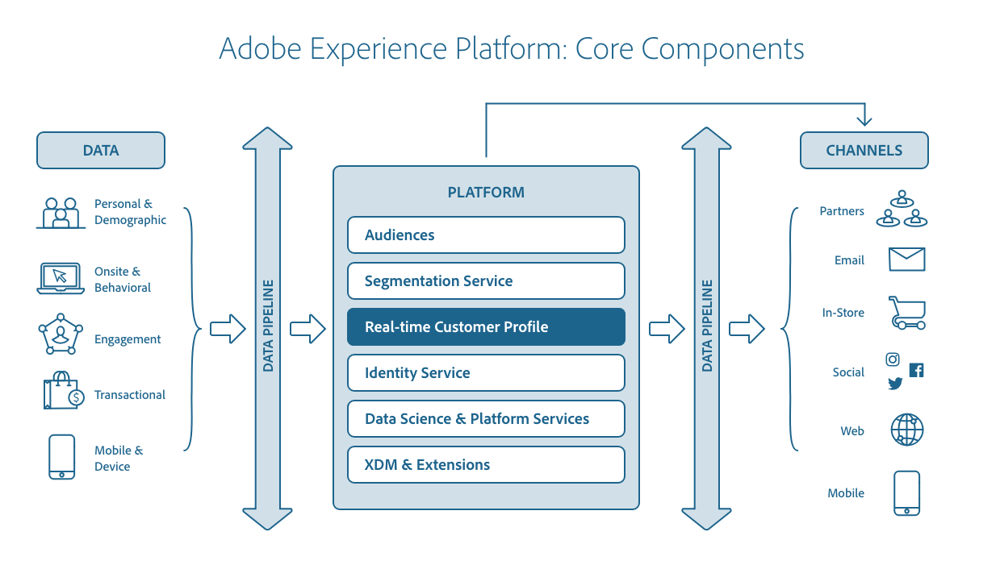

# [!DNL Real-Time Customer Profile] overview

Adobe Experience Platform enables you to drive coordinated, consistent, and relevant experiences for your customers no matter where or when they interact with your brand. With [!DNL Real-Time Customer Profile], you can see a holistic view of each individual customer by combining data from multiple channels, including online, offline, CRM, and third party. [!DNL Profile] allows you to consolidate your customer data into a unified view offering an actionable, timestamped account of every customer interaction. This overview will help you understand the role and use of [!DNL Real-Time Customer Profile] in [!DNL Experience Platform].

## [!DNL Profile] in Experience Platform

The relationship between Real-Time Customer Profile and other services within Experience Platform is highlighted in the following diagram:

 

## Understanding profiles

[!DNL Real-Time Customer Profile] merges data from various enterprise systems and then provides access to that data in the form of customer profiles with related time series events. This feature enables marketers to drive coordinated, consistent and relevant experiences with their audiences across multiple channels. The following sections highlight some of the core concepts that you must understand in order to effectively build and maintain profiles within Platform.

### Profile entity composition

A Real-Time Customer Profile is composed of a main entity, called the **primary entity**, and various supporting entities. The primary entity is composed of traits, behaviors, and segment memberships of a profile. Other entities allow the segmentation engine to utilize data outside of the primary entity of the profile, and include the following:

- **Dimensional entity**: The entity that is used to simplify the data modelling process for information shared across events or profile records. This is also known as the lookup entity or classification entity.
- **B2B entity**: Entities that describe the profile's relationship with business-to-business accounts and opportunities.

 

>[!IMPORTANT]
>
>Since dimensional and B2B entities only exist outside the primary entity, these are only used for batch segmentation.

### Profile data store

Although [!DNL Real-Time Customer Profile] processes ingested data and uses Adobe Experience Platform [!DNL Identity Service] to merge related data through identity mapping, it maintains its own data in the [!DNL Profile] data store. The [!DNL Profile] store is separate from catalog data in the data lake and [!DNL Identity Service] data in the identity graph.

The Profile store uses a Microsoft Azure Cosmos DB infrastructure and the Platform Data Lake uses Microsoft Azure Data Lake storage.

### Profile guardrails

Experience Platform provides a series of guardrails to help you avoid creating [Experience Data Model (XDM) schemas](../xdm/home.md) which Real-Time Customer Profile cannot support. This includes soft limits that will result in performance degradation, as well has hard limits that will result in errors and system breakages. For more information, including a list of guidelines and example use cases, please read the [Profile guardrails](guardrails.md) documentation.

### Profile dashboard {#profile-dashboard}

The Experience Platform UI provides a dashboard through which you can view important information about your Real-Time Customer Profile data, as captured during a daily snapshot. To learn how to access and work with the [!DNL Profile] dashboard in the UI, and detailed information regarding the metrics displayed in the dashboard, refer to the [Profile dashboard UI guide](ui/profile-dashboard.md).  

### Profile fragments vs merged profiles {#profile-fragments-vs-merged-profiles}

Each individual customer profile is composed of multiple profile fragments that have been merged to form a single view of that customer. For example, if a customer interacts with your brand across several channels, your organization will have multiple profile fragments related to that single customer appearing in multiple datasets. When these fragments are ingested into Platform, they are merged together in order to create a single profile for that customer. 

In other words, profile fragments represent a unique primary identity and the corresponding [record](#record-data) or [event](#time-series-events) data for that ID within a given dataset. 

When the data from multiple datasets conflicts (for example one fragment lists the customer as "single" while the other lists the customer as "married") the [merge policy](#merge-policies) determines which information to prioritize and include in the profile for the individual. Therefore, the total number of profile fragments within Platform is likely to always be higher than the total number of merged profiles, as each profile is typically composed of multiple fragments from multiple datasets.

### Record data {#record-data}

A profile is a representation of a subject, an organization or an individual, composed of many attributes (also known as record data). For example, the profile of a product may include a SKU and description, whereas the profile of a person contains information like first name, last name, and email address. Using [!DNL Experience Platform], you can customize profiles to use specific data relevant to your business. The standard [!DNL Experience Data Model] (XDM) class, [!DNL XDM Individual Profile], is the preferred class upon which to build a schema when describing customer record data, and supplies the data integral to many interactions between Platform services. For more information on working with schemas in [!DNL Experience Platform], please begin by reading the [XDM System overview](../xdm/home.md).

### Time series events {#time-series-events}

Time series data provides a snapshot of the system at the time an action was taken either directly or indirectly by a subject, as well as data detailing the event itself. Represented by the standard schema class XDM ExperienceEvent, time series data can describe events such as items being added to a cart, links being clicked, and videos viewed. Time series data can be used to base segmentation rules on, and events can be accessed individually in the context of a profile. 

### Identities

Every business wants to communicate with their customers in a way that feels personal. However, one of the challenges of delivering relevant digital experiences to customers is understanding how to tie their disconnected data together, which is often spread across different digital channels such as tablets, mobile phones and laptops. [!DNL Identity Service] allows you to piece together the complete picture of your customer by linking identities from multiple channels and creating an identity graph for each customer. Visit the [Identity Service overview](../identity-service/home.md) for more information.

### Merge policies

When bringing data fragments together from multiple sources and combining them in order to see a complete view of each of your individual customers, merge policies are the rules that [!DNL Platform] uses to determine how data will be prioritized and what data will be used to create the customer profile. 

When there is conflicting data from multiple datasets, the merge policy determines how that data should be treated and which value should be used. Through RESTful APIs or the user interface, you can create new merge policies, manage existing policies, and set a default merge policy for your organization. 

To learn more about merge policies and their role within Experience Platform, please begin by reading the [merge policies overview](merge-policies/overview.md). 

### Union schemas {#profile-fragments-and-union-schemas}

One of the key features of [!DNL Real-Time Customer Profile] is the ability to unify multi-channel data. When [!DNL Real-Time Customer Profile] is used to access an entity, it can supply you with a merged view of all profile fragments for that entity across datasets, referred to as the "union view" and made possible through what is known as a union schema. 

To learn more about union schemas, including how to access union schemas in the UI, visit the [union schema UI guide](ui/union-schema.md).

### (Alpha) Computed attributes

>[!IMPORTANT]
>
>Computed attribute functionality is in alpha. The documentation and functionality are subject to change.

Computed attributes are functions used to aggregate event-level data into profile-level attributes. These functions are automatically computed so that they can be used across segmentation, activation, and personalization. These computations help you to easily answer questions related to things like lifetime purchase value, time between purchases, or number of application opens, without requiring you to manually perform complex calculations each time the information is needed. For more information on computed attributes, including understanding the role computed attributes play within Adobe Experience Platform, please begin by reading the [computed attributes overview](computed-attributes/overview.md).

## Profiles and segments

Adobe Experience Platform [!DNL Segmentation Service] produces the audiences needed to power experiences for your individual customers. When an audience segment is created, the ID of that segment is added to the list of segment memberships for all qualifying profiles. Segment rules are built and applied to [!DNL Real-Time Customer Profile] data using RESTful APIs and the Segment Builder user interface. To learn more about segmentation, please begin by reading the [Segmentation Service overview](../segmentation/home.md). 
  
### Streaming ingestion and streaming segmentation

Real-time input is made possible through a process called streaming ingestion. As profile and time series data is ingested, [!DNL Real-Time Customer Profile] automatically decides to include or exclude that data from segments through an ongoing process called streaming segmentation, before merging it with existing data and updating the union view. As a result, you can instantaneously perform computations and make decisions to deliver enhanced, individualized experiences to customers as they interact with your brand. While being ingested, the data also undergoes validation to ensure it being ingested properly and conforming to the schema upon which the dataset is based. For more information about what validation is done during ingestion, please begin by reading the [data ingestion quality overview](../ingestion/quality/overview.md).

## Edge projections

In order to drive coordinated, consistent, and personalized experiences for your customers across multiple channels in real time, the right data needs to be readily available and continuously updated as changes happen. Adobe Experience Platform enables this real-time access to data through the use of what are known as edges. An edge is a geographically placed server that stores data and makes it readily accessible to applications. For example, Adobe applications such as Adobe Target and Adobe Campaign use edges in order to provide personalized customer experiences in real time. Data is routed to an edge by a projection, with a projection destination defining the edge to which data will be sent, and a projection configuration defining the specific information that will be made available on the edge. To learn more and begin working with projections using the [!DNL Real-Time Customer Profile] API, refer to the [edge projection endpoints guide](api/edge-projections.md). 

## Ingesting data into [!DNL Profile]

[!DNL Platform] can be configured to send record and time-series data to [!DNL Profile], supporting real-time streaming ingestion and batch ingestion. For more information, see the tutorial outlining how to [add data to Real-Time Customer Profile](tutorials/add-profile-data.md). 

>[!NOTE]
>
>Data collected through Adobe solutions, including [!DNL Analytics Cloud], [!DNL Marketing Cloud], and [!DNL Advertising Cloud], flows into [!DNL Experience Platform] and is ingested into [!DNL Profile].

### Profile ingestion metrics

Observability Insights allows you to expose key metrics in Adobe Experience Platform. In addition to [!DNL Experience Platform] usage statistics and performance indicators for various [!DNL Platform] functionalities, there are specific profile-related metrics that allow you to gain insight into incoming request rates, successful ingestion rates, ingested record sizes, and more. To learn more, begin by reading the [Observability Insights API overview](../observability/api/overview.md), and for a complete list of Real-Time Customer Profile metrics, see the documentation on [available metrics](../observability/api/metrics.md#available-metrics).

## Update Profile Store data

Occasionally it may be necessary to update data in your organization's Profile Store. For example, you may need to correct records or change an attribute value. This can be done through batch ingestion and requires a Profile-enabled dataset configured with an upsert tag. For more information on how to configure a dataset for attribute updates, please refer to the tutorial for [enabling a dataset for Profile and upsert](../catalog/datasets/enable-upsert.md).

## Data Governance and [!DNL Privacy]

Data Governance is a series of strategies and technologies used to manage customer data and ensure compliance with regulations, restrictions, and policies applicable to data use. 

As it relates to accessing data, data governance plays a key role within [!DNL Experience Platform] at various levels: 

-   Data usage labeling 
-   Data access policies 
-   Access control on data for marketing actions

Data Governance is managed at several points. These include deciding what data is ingested into [!DNL Platform] and what data is accessible after ingestion for a given marketing action. For more information, begin by reading the [data governance overview](../data-governance/home.md).

### Handling opt-out and data privacy requests

[!DNL Experience Platform] enables your customers to send opt-out requests related to the usage and storage of their data within [!DNL Real-Time Customer Profile]. For more information on how opt-out requests are handled, please see the documentation on [honoring opt-out requests](../segmentation/consents.md).

## Next steps and additional resources

To learn more about working with Real-Time Customer Profile data using the Experience Platform UI or the Profile API, please begin by reading the [Profile UI guide](ui/user-guide.md) or [API developer guide](api/overview.md), respectively.
