# Merge policies UI guide

Adobe Experience Platform enables you to bring data fragments together from multiple sources and combine them in order to see a complete view of each of your individual customers. When bringing this data together, merge policies are the rules that [!DNL Platform] uses to determine how data will be prioritized and what data will be combined to create the unified view. 

Using RESTful APIs or the user interface, you can create new merge policies, manage existing policies, and set a default merge policy for your organization. This guide provides step-by-step instructions for working with merge policies using the Adobe Experience Platform user interface (UI).

To learn more about merge policies and they role they play within Experience Platform, please begin by reading the [merge policies overview](overview.md). 

## Getting started

This guide requires a working understanding of several important [!DNL Experience Platform] features. Before following this guide, please review the documentation for the following services:

* [Real-Time Customer Profile](../home.md): Provides a unified, real-time consumer profile based on aggregated data from multiple sources.
* [Adobe Experience Platform Identity Service](../../identity-service/home.md): Enables Real-Time Customer Profile by bridging identities from disparate data sources being ingested into [!DNL Platform].
* [Experience Data Model (XDM)](../../xdm/home.md): The standardized framework by which [!DNL Platform] organizes customer experience data.

## View merge policies {#view-merge-policies}

Within the [!DNL Experience Platform] UI, you can begin working with merge policies by selecting **[!UICONTROL Profiles]** in the left navigation and then selecting the **[!UICONTROL Merge Policies]** tab. This tab includes a list of all existing merge policies for your organization, as well as details for each merge policy including the policy name, whether or not the merge policy is the default merge policy, and the schema class to which the merge policy relates. 

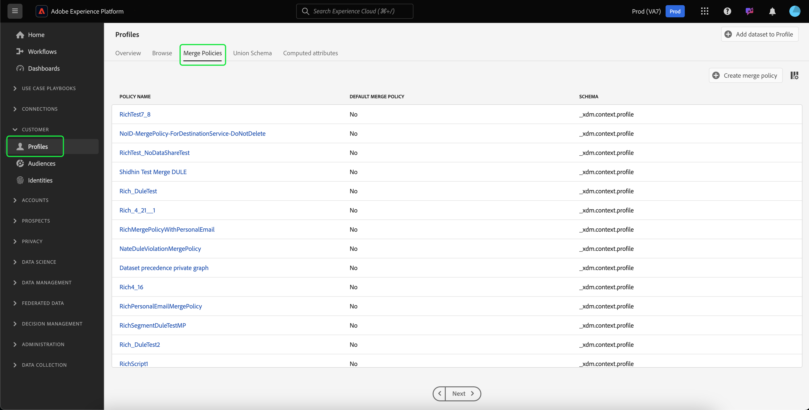

To select which details are visible, or to add additional columns to the display, select **[!UICONTROL Configure columns]** and click on a column name to add or remove it from view.

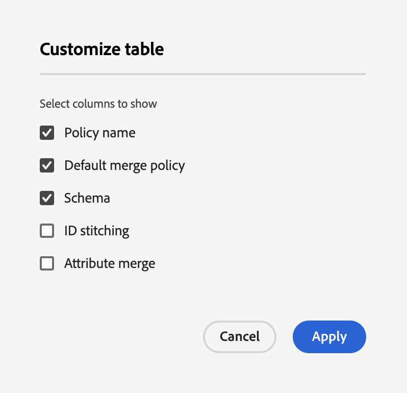

## Create a merge policy {#create-a-merge-policy}

To create a new merge policy, select **[!UICONTROL Create merge policy]** on the merge policies tab to enter the new merge policy workflow.

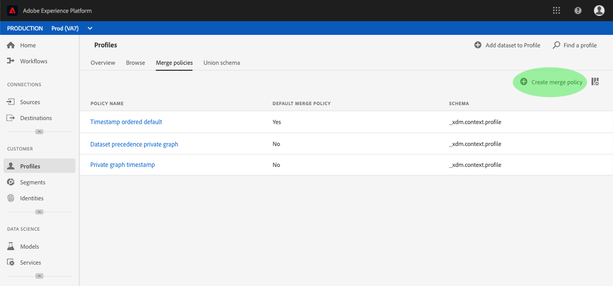

The **[!UICONTROL New merge policy]** workflow, requires you to provide important information for your new merge policy through a series of guided steps. These steps are outlined in the sections that follow.

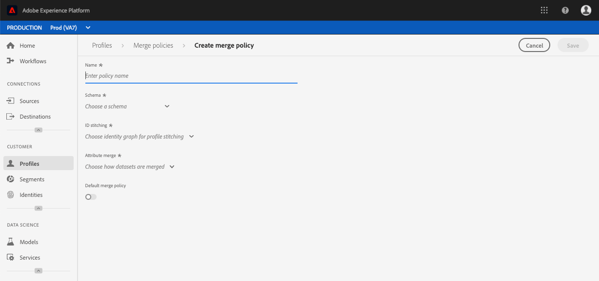

## [!UICONTROL Configure] {#configure}

The first step in the workflow allows you to configure your merge policy by providing basic information. This information includes: 

* **[!UICONTROL Name]**: The name of your merge policy should be descriptive yet concise.
* **[!UICONTROL Schema class]**: The XDM schema class associated with the merge policy. This specifies the schema class for which this merge policy is created. Organizations can create multiple merge policies per schema class. Currently only the [!UICONTROL XDM Individual Profile] class is available in the UI. You can preview the union schema for the schema class by selecting **[!UICONTROL View Union Schema]**. For more information, see the section on [viewing the union schema](#view-union-schema) that follows.
* **[!UICONTROL ID stitching]**: This field defines how to determine the related identities of a customer. There are two possible values for identity stitching, and it is important to understand how the type of identity stitching that you select will impact your data. To learn more, please refer to the [merge policies overview](overview.md). 
  * **[!UICONTROL None]**: Perform no identity stitching.
  * **[!UICONTROL Private Graph]**: Perform identity stitching based on your private identity graph.
* **[!UICONTROL Default merge policy]**: A toggle button that allows you to select whether or not this merge policy will be the default for your organization. If the selector is toggled on, a warning appears asking you to confirm that you wish to change your organization's default merge policy. See the [merge policies overview](overview.md) to learn more about default merge policies.
    
* **[!UICONTROL Active-On-Edge Merge Policy]**: A toggle button that allows you to select whether or not this merge policy will be active on edge. To ensure all profile consumers are working with the same view on edges, merge policies can be marked as active on edge. In order for a segment to be activated on edge (marked as an edge segment), it must be tied to a merge policy that is marked as active on edge. If a segment is **not** tied to a merge policy that is marked as active on edge, the segment will not be marked as active on edge, and will be marked as a streaming segment. Additionally, each sandbox in an Organization can only have **one** merge policy that is active on edge. 

Once the required fields have been completed, you can select **[!UICONTROL Next]** to continue with the workflow.

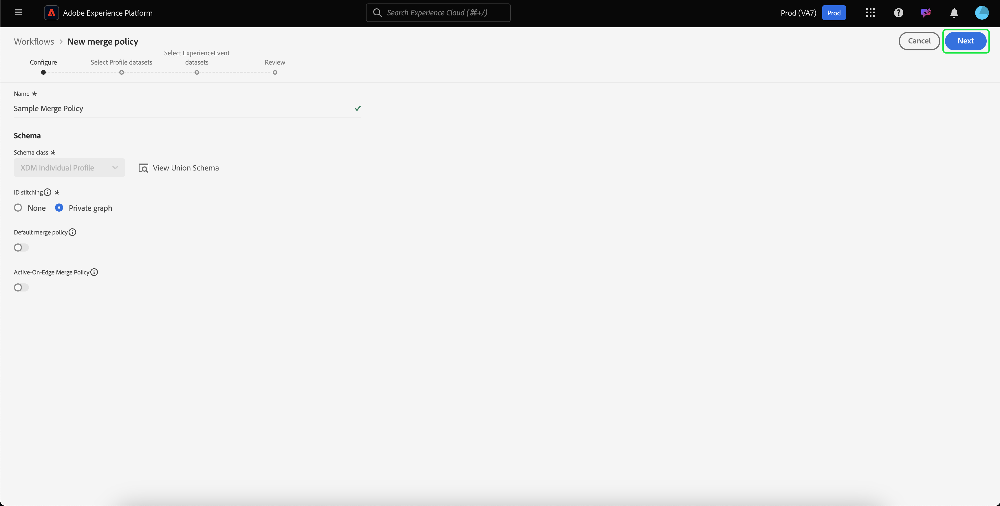

## [!UICONTROL View Union Schema] {#view-union-schema}

When creating or editing a merge policy, you can view the union schema for the chosen schema class by selecting **[!UICONTROL View Union Schema]**. 

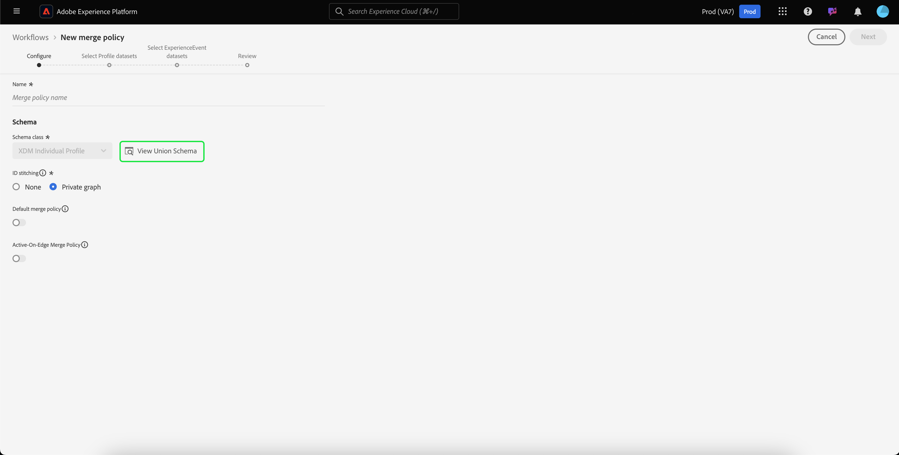

This opens the [!UICONTROL View Union Schema] dialog, showing all contributing schemas, identities, and relationships associated with the union schema. You can use the dialog to explore the union schema in the same way that you would by accessing the [!UICONTROL Union Schema] tab in the [!UICONTROL Profiles] section of the Platform UI.

For detailed information on union schemas, including how to interact with them in the [!UICONTROL Union Schema] tab or the [!UICONTROL View Union Schema] dialog shown in the merge policies workflow, please visit the [union schema UI guide](../ui/union-schema.md).

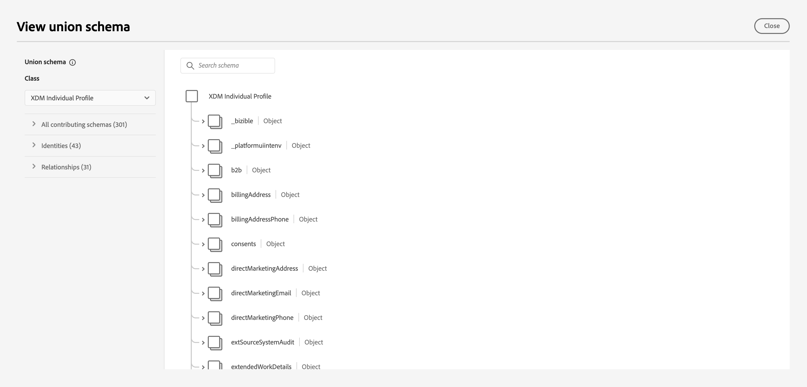

## [!UICONTROL Select Profile datasets] {#select-profile-datasets}

On the **[!UICONTROL Select Profile datasets]** screen, you must select the **[!UICONTROL Merge method]** that you wish to use for your merge policy. Also displayed on the screen is the total number of [!UICONTROL Profile datasets] in your organization that relate to the schema class that was selected on the previous screen. 

Depending on the merge method that you choose, all of the Profile datasets will be merged by the order in which they were last updated (timestamp ordered) or you will need to select which Profile datasets to include in the merge policy and the order in which to merge them (dataset precedence). 

For more information on merge methods, please refer to the [merge policies overview](overview.md).

### Timestamp ordered {#timestamp-ordered-profile}

Selecting **[!UICONTROL Timestamp ordered]** as the merge method means that attributes from the most recently updated datasets will take precedence. This applies across all Profile datasets. 

>[!NOTE]
>
>The number in brackets next to **[!UICONTROL Profile datasets]** (for example, `(37)` in the image shown) shows the total number of profile datasets that will be included.

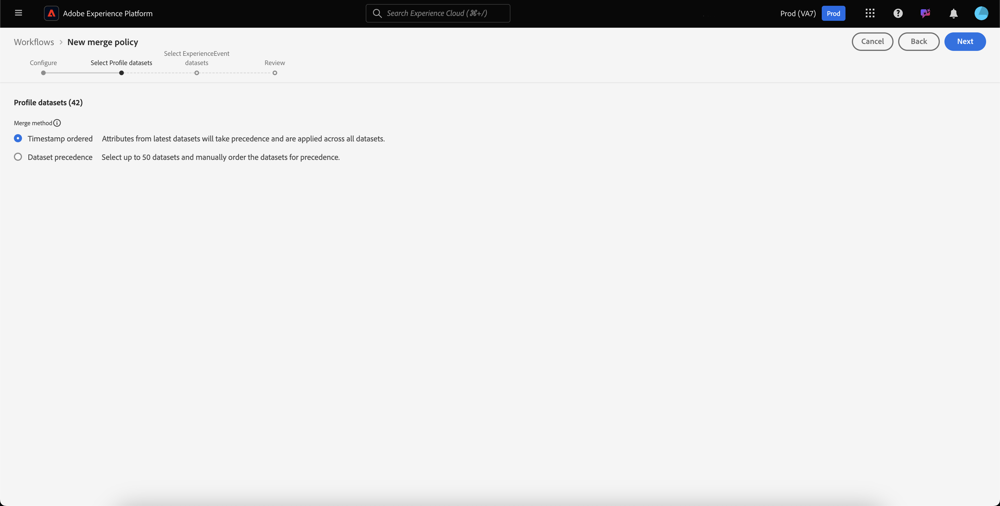

### Dataset precedence {#dataset-precedence-profile}

Selecting **[!UICONTROL Dataset precedence]** as the merge method requires you to select Profile datasets and manually prioritize them. Each dataset listed also includes the status of the last batch ingested or displays a notice that no batches has been ingested into that dataset. 

You can select up to 50 datasets from the dataset list to include in the merge policy. 

>[!NOTE]
>
>The number in brackets next to **[!UICONTROL Profile datasets]** (for example, `(37)` in the image shown) shows the total number of profile datasets available for selection.

As datasets are selected, they are added to the **[!UICONTROL Select datasets]** section, allowing you to drag and drop the datasets and order them according to your desired precedence. As the datasets are adjusted in the list, the ordinal (1, 2, 3, etc) next to the dataset will update, displaying priority (1 being given the highest priority, then 2, and onward).

Selecting a dataset also updates the **[!UICONTROL Union schema]** section, showing the fields in the union schema to which each dataset contributes data. For more information on union schemas, including how to interact with the visualizations in the UI, please reference the [union schema UI guide](../ui/union-schema.md)  

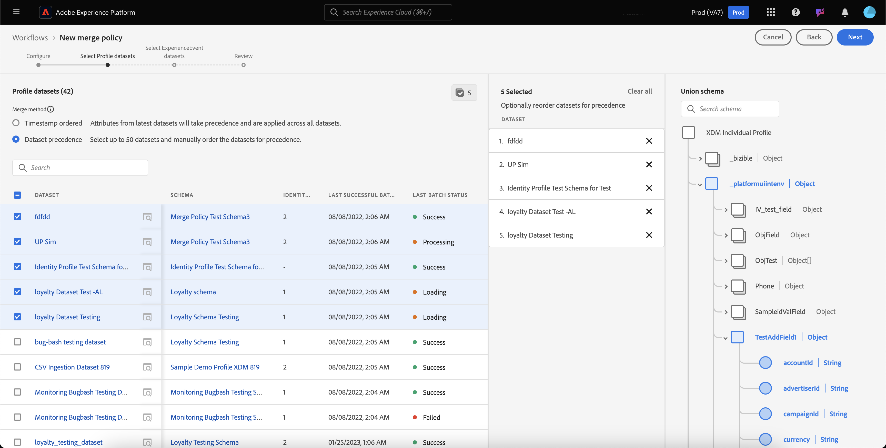

## [!UICONTROL Select ExperienceEvent datasets] {#select-experienceevent-datasets}

The next step in the workflow requires you to select ExperienceEvent datasets. This screen is influenced by the merge method that you selected on the [[!UICONTROL Select Profile datasets]](#select-profile-datasets) screen.

### Timestamp ordered {#timestamp-ordered-experienceevent}

If you selected **[!UICONTROL Timestamp ordered]** as the merge method for Profile datasets, the attributes from the most recently updated ExperienceEvent datasets will take precedence here as well. 

>[!NOTE]
>
>The number in brackets next to **[!UICONTROL ExperienceEvent datasets]** (for example, `(20)` in the image shown) shows the total number of ExperienceEvent datasets created by your organization that relate to the schema class that you selected on the merge policy configuration screen.

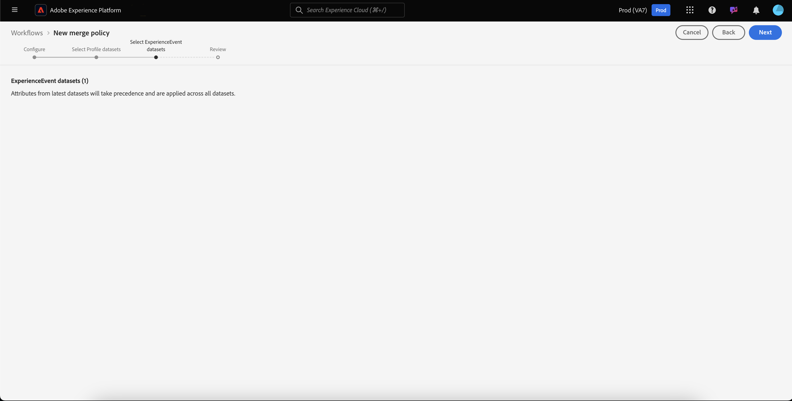

### Dataset precedence {#dataset-precedence-experienceevent}

If you selected **[!UICONTROL Dataset precedence]** as the merge method for Profile datasets, you will need to select ExperienceEvent datasets to include. You can select up to 50 ExperienceEvent datasets from the dataset list. 

>[!NOTE]
>
>The number in brackets next to **[!UICONTROL ExperienceEvent datasets]** (for example, `(20)` in the image shown) shows the total number of ExperienceEvent datasets created by your organization that relate to the schema class that you selected on the merge policy configuration screen.

As datasets are selected, they appear in the [!UICONTROL Select datasets] section. 

ExperienceEvent datasets cannot be manually ordered, instead the attributes in the ExperienceEvent datasets are appended to the Profile datasets if they are part of the same profile fragment.

Similar to selecting Profile datasets, selecting an ExperienceEvent dataset also updates the **[!UICONTROL Union schema]** section, showing the fields in the union schema to which each dataset contributes data. For more information on union schemas, including how to interact with the visualizations in the UI, please reference the [union schema UI guide](../ui/union-schema.md)  

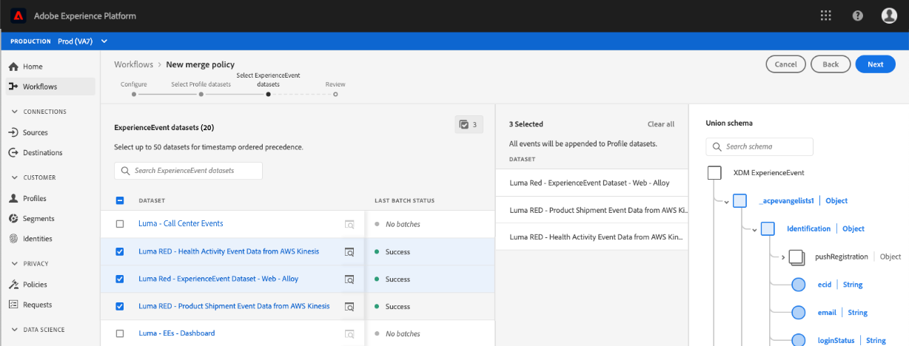

## [!UICONTROL Review] {#review}

The final step in the workflow is to review your merge policy. The **[!UICONTROL Review]** screen displays information about your merge policy, including the ID stitching method selected, merge method selected, and the datasets included. (To view all of the Profile or ExperienceEvent datasets included, select the number of datasets to expand the dropdown list.)

Also included on the review screen is the **[!UICONTROL Preview data]** table showing sample profile records using your merge policy. This enables you to preview what a customer profile looks like before saving your merge policy.

Please ensure that you review your merge policy configuration and preview data carefully before selecting **[!UICONTROL Finish]** to complete the creation workflow.

### Timestamp ordered {#timestamp-ordered-review}

If you selected **[!UICONTROL Timestamp ordered]** as the merge method for your merge policy, the list of Profile datasets includes all of the datasets that have been created by your organization related to the schema class, in order of timestamp. The list of ExperienceEvent datasets includes all datasets that your organization has created for the chosen schema class and will be appended to the Profile datasets.

The **[!UICONTROL Preview data]** table shows sample profile records based on a timestamp ordering of the datasets. This enables you to preview what a customer profile looks like before saving your merge policy.

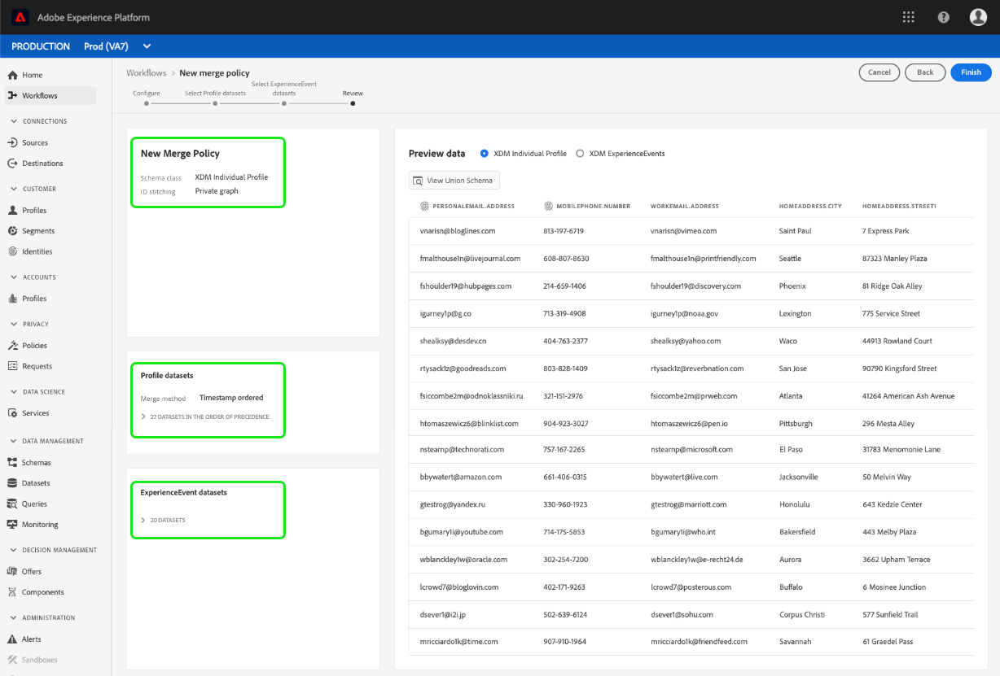

### Dataset precedence {#dataset-precedence-review}

If you selected **[!UICONTROL Dataset precedence]** as the merge method for your merge policy, the lists of Profile and ExperienceEvent datasets include only the Profile and ExperienceEvent datasets that you selected during the creation workflow, respectively. The order of the Profile datasets should match the precedence that you specified during creation. If it doesn't, use the [!UICONTROL Back] button to return to the previous workflow steps and adjust the priority.

The **[!UICONTROL Preview data]** table shows sample profile records using the selected datasets. This enables you to preview what a customer profile looks like before saving your merge policy.

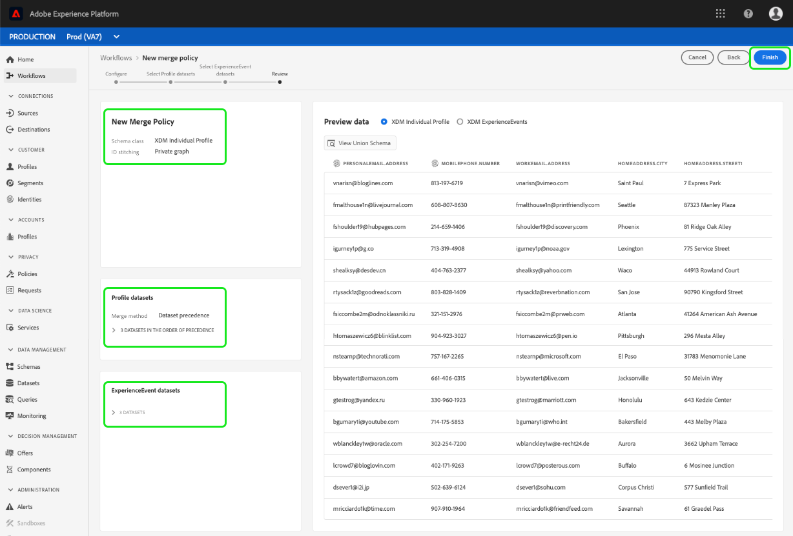

### Updated list of merge policies {#updated-list}

After completing the workflow to create a new merge policy, you are returned to the **[!UICONTROL Merge Policies]** tab. The list of merge policies for your organization should now include the merge policy that you just created.

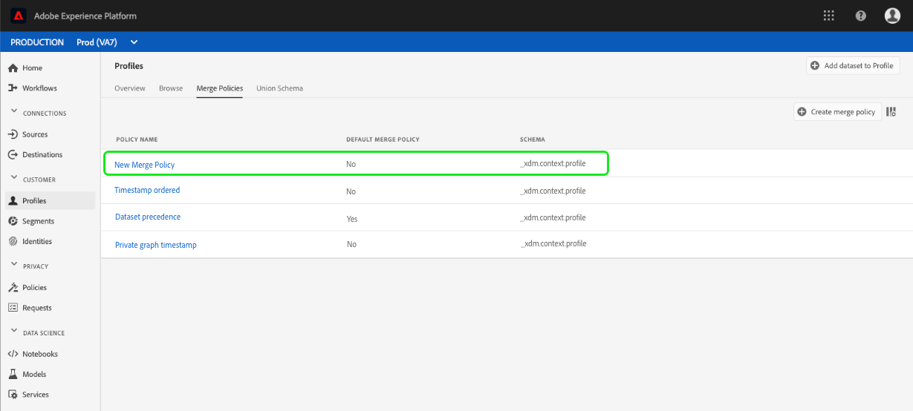

## Edit a merge policy

From the [!UICONTROL Merge Policies] tab, you can modify an existing merge policy created for the [!DNL XDM Individual Profile] class by selecting the **[!UICONTROL Policy name]** for the merge policy you wish to edit.

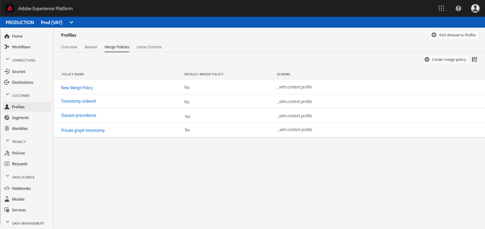

When the **[!UICONTROL Edit merge policy]** screen appears, you can make changes to the name and [!UICONTROL ID stitching] method, as well as change whether or not this policy is the default merge policy for your organization. 

Select **[!UICONTROL Next]** to continue through the merge policy workflow to update the merge method and datasets included in the merge policy.

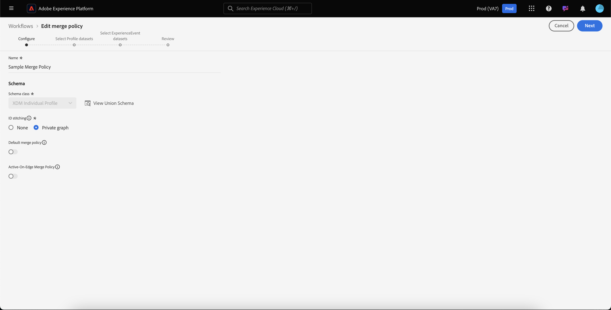

Once you have made the necessary changes, review your merge policy and select **[!UICONTROL Finish]** to save your changes and return to the [!UICONTROL Merge policies] tab.

>[!WARNING]
>
>Changing a merge policy can affect segmentation and profile results, as it will alter the way in which data conflicts are resolved. Please be sure to review changes to your merge policies carefully before saving them.

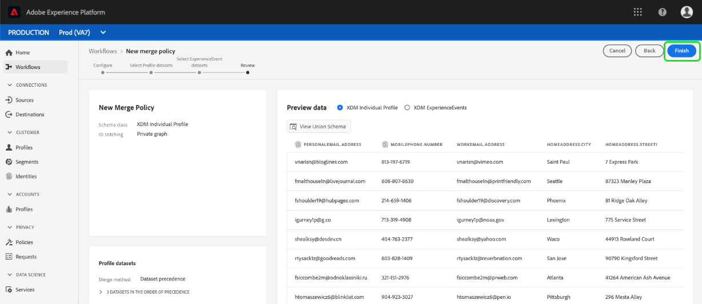

## Data governance policy violations

When creating or updating a merge policy, a check is performed to determine if the merge policy violates any of the data usage policies defined by your organization. Data usage policies are part of Adobe Experience Platform Data Governance and are rules that describe the kinds of marketing actions that you are allowed to, or restricted from, performing on specific [!DNL Platform] data. For example, if a merge policy was used to create a segment that activated to a third-party destination, and your organization had a data usage policy preventing the export of specific data to third parties, you would receive a **[!UICONTROL Data governance policy violation detected]** notification when attempting to save your merge policy. 

This notification includes a list of data usage policies that have been violated and allows you to view the details of the violation by selecting a policy from the list. Upon selecting a violated policy, the **[!UICONTROL Data lineage]** tab provides the reason for the violation and the affected activations, each providing more detail into how the data usage policy has been violated.

To learn more about how data governance is performed within Adobe Experience Platform, please begin by reading the [Data Governance overview](../../data-governance/home.md).

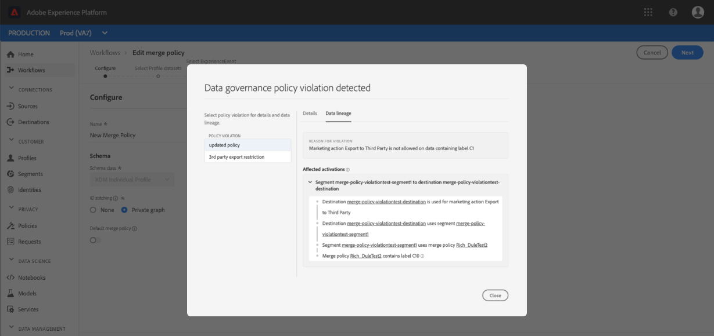

## Next steps

Now that you have created and configured merge policies for your organization, you can use them to adjust the view of customer profiles within Platform and to create audience segments from your Profile data. See the [segmentation overview](../../segmentation/home.md) for more information on how to create and work with segments using the [!DNL Experience Platform] UI and APIs.
