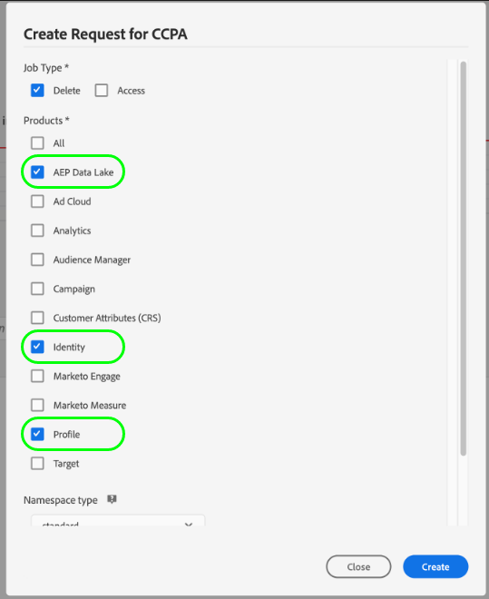
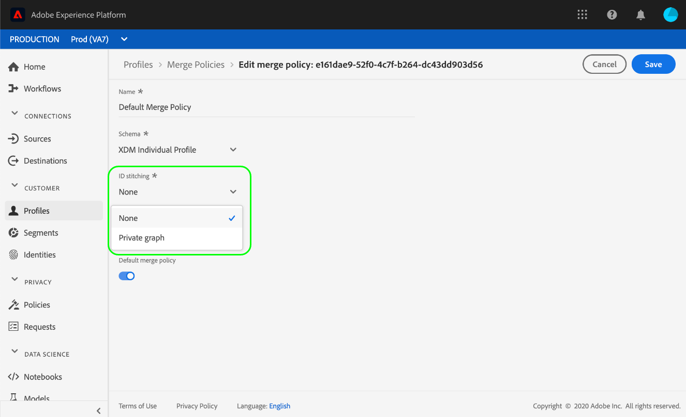

# Privacy request processing in [!DNL Real-Time Customer Profile]

Adobe Experience Platform [!DNL Privacy Service] processes customer requests to access, opt out of sale, or delete their personal data as delineated by privacy regulations such as the General Data Protection Regulation (GDPR) and [!DNL California Consumer Privacy Act] (CCPA).

This document covers essential concepts related to processing privacy requests for [!DNL Real-Time Customer Profile] within Adobe Experience Platform.

>[!NOTE]
>
>This guide only covers how to make privacy requests for the Profile data store in Experience Platform. If you also plan to make privacy requests for the Platform data lake, refer to the guide on [privacy request processing in the data lake](../catalog/privacy.md) in addition to this tutorial.
>
>For steps on how to make privacy requests for other Adobe Experience Cloud applications, refer to the [Privacy Service documentation](../privacy-service/experience-cloud-apps.md).

## Getting started

This guide requires a working understanding of the following [!DNL Platform] components:

* [[!DNL Privacy Service]](../privacy-service/home.md): Manages customer requests for accessing, opting out of sale, or deleting their personal data across Adobe Experience Cloud applications.
* [[!DNL Identity Service]](../identity-service/home.md): Solves the fundamental challenge posed by the fragmentation of customer experience data by bridging identities across devices and systems.
* [[!DNL Real-Time Customer Profile]](home.md): Provides a unified, real-time consumer profile based on aggregated data from multiple sources.

## Understanding identity namespaces {#namespaces}

Adobe Experience Platform [!DNL Identity Service] bridges customer identity data across systems and devices. [!DNL Identity Service] uses **identity namespaces** to provide context to identity values by relating them to their system of origin. A namespace can represent a generic concept such as an email address ("Email") or associate the identity with a specific application, such as an Adobe Advertising Cloud ID ("AdCloud") or Adobe Target ID ("TNTID").

Identity Service maintains a store of globally defined (standard) and user-defined (custom) identity namespaces. Standard namespaces are available for all organizations (for example, "Email" and "ECID"), while your organization can also create custom namespaces to suit its particular needs.

For more information about identity namespaces in [!DNL Experience Platform], see the [identity namespace overview](../identity-service/namespaces.md).

## Submitting requests {#submit}

The sections below outline how to make privacy requests for [!DNL Real-Time Customer Profile] using the [!DNL Privacy Service] API or UI. Before reading these sections, it is strongly recommended that you review the [Privacy Service API](../privacy-service/api/getting-started.md) or [Privacy Service UI](../privacy-service/ui/overview.md) documentation for complete steps on how to submit a privacy job, including how to properly format submitted user identity data in request payloads.

>[!IMPORTANT]
>
>Privacy Service is only able to process [!DNL Profile] data using a merge policy that does not perform identity stitching. See the section on [merge policy limitations](#merge-policy-limitations) for more information.
>
>Please note that the amount of time a privacy request can take to complete **cannot** be guaranteed. If changes occur in your [!DNL Profile] data while a request is still processing, whether or not those records are processed also cannot be guaranteed.

### Using the API

When creating job requests in the API, any IDs provided within `userIDs` must use a specific `namespace` and `type`. A valid [identity namespace](#namespaces) recognized by [!DNL Identity Service] must be provided for the `namespace` value, while the `type` must be either `standard` or `unregistered` (for standard and custom namespaces, respectively).

>[!NOTE]
>
>You may need to provide more than one ID for each customer, depending on the identity graph and how your profile fragments are distributed in Platform datasets. See the next section [profile fragments](#fragments) for more information.

In addition, the `include` array of the request payload must include the product values for the different data stores the request is being made to. To delete the profile data associated with an identity, the array must include the value `ProfileService`. To delete the customer's identity graph associations, the array must include the value `identity`.

>[!NOTE]
>
>See the section on [profile requests and identity requests](#profile-v-identity) later in this document for more detailed information on the effects of using `ProfileService` and `identity` within the `include` array.

The following request creates a new privacy job for a single customer's data in the [!DNL Profile] store. Two identity values are provided for the customer in the `userIDs` array; one using the standard `Email` identity namespace, and the other using a custom `Customer_ID` namespace. It also includes the product value for [!DNL Profile] (`ProfileService`) in the `include` array:

**Request**

```shell
curl -X POST \
  https://platform.adobe.io/data/core/privacy/jobs \
  -H 'Authorization: Bearer {ACCESS_TOKEN}' \
  -H 'x-api-key: {API_KEY}' \
  -H 'x-gw-ims-org-id: {ORG_ID}' \
  -H 'Content-Type: application/json' \
  -d '{
    "companyContexts": [
      {
        "namespace": "imsOrgID",
        "value": "{ORG_ID}"
      }
    ],
    "users": [
      {
        "key": "user12345",
        "action": ["access","delete"],
        "userIDs": [
          {
            "namespace": "Email",
            "value": "ajones@acme.com",
            "type": "standard"
          },
          {
            "namespace": "Customer_ID",
            "value": "12345678",
            "type": "unregistered"
          }
        ]
      }
    ],
    "include": ["ProfileService","identity"],
    "expandIds": false,
    "priority": "normal",
    "regulation": "ccpa"
}'
```

>[!IMPORTANT]
>
>Platform processes privacy requests across all [sandboxes](../sandboxes/home.md) belonging to your organization. As a result, any `x-sandbox-name` header included in the request is ignored by the system.

**Product response**

For Profile Service, once the privacy job has been completed, a response is returned in JSON format with information regarding the user IDs requested.

```json
{
    "privacyResponse": {
        "jobId": "7467850f-9698-11ed-8635-355435552164",
        "response": [
            {
                "sandbox": "prod",
                "mergePolicyId": "none",
                "result": {
                    "person": {
                        "gender": "female"           
                    },
                    "personalEmail": {
                        "address": "ajones@acme.com",
                    },
                    "identityMap": {
                        "crmid": [
                            {
                                "id": "5b7db37a-bc7a-46a2-a63e-2cfe7e1cc068"
                            }
                        ]
                    }
                }
            },
            {
                "sandbox": "prod",
                "mergePolicyId": "none",
                "result": {
                    "person": {
                        "gender": "male"
                    },
                    "id": 12345678,
                    "identityMap": {
                        "crmid": [
                            {
                                "id": "e9d439f2-f5e4-4790-ad67-b13dbd89d52e"
                            }
                        ]
                    }
                }
            }
        ]
    }
}
```

### Using the UI

When creating job requests in the UI, be sure to select **[!UICONTROL AEP Data Lake]** and/or **[!UICONTROL Profile]** under **[!UICONTROL Products]** in order to process jobs for data stored in the data lake or [!DNL Real-Time Customer Profile], respectively.



## Profile fragments in privacy requests {#fragments}

In the [!DNL Profile] data store, the personal data for an individual customer will often be comprised of multiple profile fragments, which are associated with the person through the identity graph. When making privacy requests to the [!DNL Profile] store, it is important to note that requests are only processed on the profile-fragment level, rather than the entire profile.

For example, consider a situation where you are storing customer attribute data in three separate datasets, which use different identifiers to associate that data with individual customers:

| Dataset name | Primary identity field | Stored attributes |
| --- | --- | --- |
| Dataset 1 | `customer_id` | `address` |
| Dataset 2 | `email_id` | `firstName`, `lastName` |
| Dataset 3 | `email_id` | `mlScore` |

One of the datasets uses `customer_id` as its primary identifier, whereas the other two use `email_id`. If you were to send a privacy request (access or delete) using only `email_id` as the user ID value, only the `firstName`, `lastName`, and `mlScore` attributes would be processed, while `address` would not be affected.

To ensure that your privacy requests process all relevant customer attributes, you must provide the primary identity values for all applicable datasets where those attributes may be stored (up to a maximum of nine IDs per customer). See the section on identity fields in the [basics of schema composition](../xdm/schema/composition.md#identity) for more information on fields that are commonly marked as identities.

## Delete request processing {#delete}

When [!DNL Experience Platform] receives a delete request from [!DNL Privacy Service], [!DNL Platform] sends confirmation to [!DNL Privacy Service] that the request has been received and affected data has been marked for deletion. The records are then removed once the privacy job has completed.

Depending on whether you also included Identity Service (`identity`) and the data lake (`aepDataLake`) as products in your privacy request for Profile (`ProfileService`), different sets of data related to the profile are removed from the system at potentially different times:

| Products included | Effects |
| --- | --- |
| `ProfileService` only | The profile is immediately deleted as soon as Platform sends the confirmation that the deletion request was received. However, the profile's identity graph still remains, and the profile can potentially be reconstructed as new data with the same identities is ingested. The data associated with the profile also remains in the data lake. |
| `ProfileService` and `identity` | The profile and its associated identity graph are immediately deleted as soon as Platform sends the confirmation that the deletion request was received. The data associated with the profile remains in the data lake. |
| `ProfileService` and `aepDataLake` | The profile is immediately deleted as soon as Platform sends the confirmation that the deletion request was received. However, the profile's identity graph still remains, and the profile can potentially be reconstructed as new data with the same identities is ingested.<br><br>When the data lake product responds that the request was received and is currently processing, the data associated with the profile is soft-deleted and is therefore not accessible by any [!DNL Platform] service. Once the job is completed, the data is removed from the data lake completely. |
| `ProfileService`, `identity`, and `aepDataLake` | The profile and its associated identity graph are immediately deleted as soon as Platform sends the confirmation that the deletion request was received.<br><br>When the data lake product responds that the request was received and is currently processing, the data associated with the profile is soft-deleted and is therefore not accessible by any [!DNL Platform] service. Once the job is completed, the data is removed from the data lake completely. |

Refer to the [[!DNL Privacy Service] documentation](../privacy-service/home.md#monitor) for more information on tracking job statuses.

### Profile requests versus identity requests {#profile-v-identity}

If a delete request is made for Profile (`ProfileService`) but not Identity Service (`identity`), the resulting job removes the collected attribute data for a customer (or set of customers) but does not remove the associations established in the identity graph.

For example, a delete request that uses a customer's `email_id` and `customer_id` removes all attribute data stored under those IDs. However, any data which is thereafter ingested under the same `customer_id` will still be associated with the appropriate `email_id`, as the association still exists.

To remove the profile and all identity associations for a given customer, make sure to include both Profile and Identity Service as target products in your delete requests.

### Merge policy limitations {#merge-policy-limitations}

Privacy Service is only able to process [!DNL Profile] data using a merge policy that does not perform identity stitching. If you are using the UI to confirm whether your privacy requests are being processed, ensure that you are using a policy with **[!DNL None]** as its [!UICONTROL ID stitching] type. In other words, you cannot use a merge policy where [!UICONTROL ID stitching] is set to [!UICONTROL Private graph].
>
>

## Next steps

By reading this document, you have been introduced to the important concepts involved with processing privacy requests in [!DNL Experience Platform]. To deepen your understanding of how to manage identity data and create privacy jobs, please continue reading the documentation provided throughout this guide.

For information on processing privacy requests for [!DNL Platform] resources not used by [!DNL Profile], see the document on [privacy request processing in the data lake](../catalog/privacy.md).
