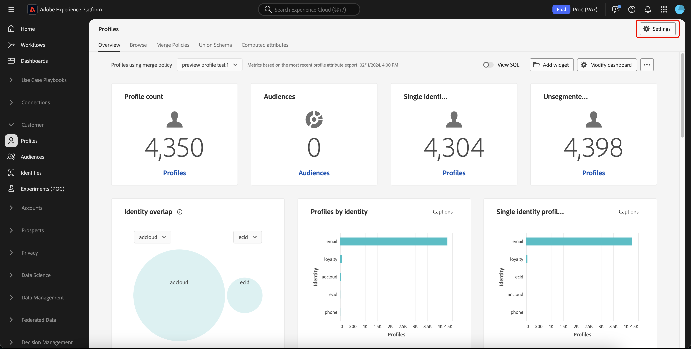

# Pseudonymous profiles data expiration

In Adobe Experience Platform, you can configure data expiration times for Pseudonymous profiles, allowing you to automatically remove data from the Profile store that is no longer valid or useful for your use cases.

## Pseudonymous profile {#pseudonymous-profile}

>[!CONTEXTUALHELP]
>id="platform_profile_pseudonymousprofile"
>title="What's a Pseudonymous profile?"
>abstract="A Pseudonymous profile is a profile that has a pseudonymous or unknown identity namespace or a profile that has had no activity take place for a given amount of time."
>text="Learn more in documentation"

>[!CONTEXTUALHELP]
>id="platform_profile_pseudonymousprofile_dataexpiration"
>title="Pseudonymous profile data expiration"
>abstract="The Pseudonymous profile data expiration represents the number of days a Pseudonymous profile will remain in Adobe Experience Platform before being removed. This value must be set to at least 1. Please note that it may take up to three days for the Pseudonymous profile to be removed."

A profile is considered for Pseudonymous data expiration if it meets the following conditions: 

- The stitched profile's identity namespaces match what the customer has specified as a pseudonymous or unknown identity namespace. 
  - For example, if the profile's identity namespace is `ECID`, `GAID`, or `AAID`. The stitched profile has no IDs from any other identity namespace. In this example, a stitched profile does **not** have either an email or CRM identity. 
- No activity has taken place in a user-defined amount of time. Activity is defined either by any Experience Events being ingested or customer-initiated updates to the profile attributes. 
  - For example, a new page view event or age attribute update is considered as an activity. However, a non-user-initiated audience membership update is **not** considered as an activity. Currently, to compute data expiration, the tracking at a profile level is based on the time of event for Experience Events and time of ingestion for profile attributes.

## Access {#access}

>[!AVAILABILITY]
>
>To access this feature, you must have the following permissions:
>
>- Manage Profiles
>- View Profiles
>
>The **Manage Profiles** permission lets you set the data expirations, while the **View Profiles** permission lets you view the data expirations.
>
>More information about permissions within Experience Platform can be found in the [access control overview](../access-control/home.md#permissions).

To add Pseudonymous profile data expiration to your organization, go the Profile dashboard and select **[!UICONTROL Settings]**.

The [!UICONTROL Profile settings] popover appears. On this popover, you can set the number of days for the Pseudonymous profile data expiration as well as the identity namespace used for the data expiration. 

For production sandboxes, the default Pseudonymous profile data expiration is 14 days, with the minimum being 1 day and the maximum being 365 days. For development sandboxes, the default Pseudonymous profile data expiration is 3 days, with the minimum being 1 day and the maximum being 365 days.

Select **[!UICONTROL Apply]** to save your data expiration settings.

## Frequently asked questions {#faq}

The following section lists frequently asked questions regarding Pseudonymous profiles data expiration:

### How does Pseudonymous Profile data expiration differ from  Experience Event data expiration?

+++ Answer

Pseudonymous Profile data expiration and Experience Event data expiration are complementary features.

#### Granularity

Pseudonymous Profile data expiration works on a **sandbox** level. As a result, the data expiration will affect all profiles in the sandbox.

Experience Event data expiration works on a **dataset** level. As a result, each dataset can have a different data expiration setting.

#### Identity types

Pseudonymous Profile data expiration **only** considers profiles that have identity graphs which contain identity namespaces that were selected by the customer, such as `ECID`, `AAID`, or other types of cookies. If the profile contains **any** additional identity namespace that was **not** in the customer's selected list, the profile will **not** be deleted.

Experience Event data expiration removes events **only** based on the event record's timestamp. The identity namespaces included are **ignored** for expiration purposes.

#### Removed items

Pseudonymous Profile data expiration removes **both** event and profile records. As a result, the profile class data will also be removed.

Experience Event data expiration **only** removes events and does **not** remove profile class data. The profile class data is only removed when all the data is removed across **all** datasets and there are **no** profile class records remaining for the profile.

+++

### How can Pseudonymous Profile data expiration be used in conjunction with Experience Event data expiration?

+++ Answer

Pseudonymous Profile data expiration and Experience Event data expiration can be used to complement each other.

You should **always** set up Experience Event data expiration in your datasets, based on your needs of retaining data about your known customers. Once Experience Event data expiration is set up, you can use Pseudonymous Profile data expiration to automatically remove Pseudonymous Profiles. Typically, the data expiration period for Pseudonymous Profiles is less than the data expiration period for Experience Events.

For a typical use case, you can set your Experience Event data expiration based on the values of your known user data and you can set your Pseudonymous Profile data expiration to a much shorter duration to limit the impact of Pseudonymous profiles on your Experience Platform license compliance.

+++

### What users should be using Pseudonymous profiles data expiration?

+++ Answer

- If you are using Web SDK to directly send data to Experience Platform.
- If you have a website that serves unauthenticated customers en masse.
- If you have excessive profile counts in your datasets and have confirmed that this excessive profile count is because of anonymous cookie-based identity namespace.
  - To determine this, you should use the identity namespace overlap report. More information about this report can be found in the [identity overlap report section](./api/preview-sample-status.md#identity-overlap-report) of the preview sample status API guide.
  
+++

### What are some caveats you should be aware of before using Pseudonymous profiles data expiration?

+++ Answer

- Pseudonymous profile data expiration runs at a **sandbox** level. You can choose to have different configurations for production and development sandboxes.
- Once you have activated this feature, the deletion of profiles is **permanent**. There is **no** way to roll back or restore the deleted profiles.
- This is **not** a one-time cleanup job. Pseudonymous profile data expiration will run once per day and delete profiles that match the customer's input.
- **All** profiles that are defined as Pseudonymous profiles will be affected by the Pseudonymous profile data expiration. It does **not** matter if the profile is Experience Event only or if it only contains profile attributes.
- This cleanup will **only** occur in Profile. Identity Service may continue to show the deleted identities within the graph after the cleanup in cases where the profile has two or more associated pseudonymous identities (such as `AAID` and `ECID`). This discrepancy will be addressed in the near future.
- Pseudonymous profile data expiration does **not** run immediately, and may take up to three days to process.

+++

### How does Pseudonymous profiles data expiration interact with guardrails for Identity Service data?

+++ Answer

- The Identity Service ["first-in, first-out" deletion system](../identity-service/guardrails.md) could delete ECIDs from the identity graph, which are stored in Identity Service.
- If this deletion behavior results in an ECID-only profile being stored in the Real-Time Customer Profile (Profile store), then Pseudonymous profile data expiration will delete this profile from the Profile store.

+++

## Next steps

After reading this guide, you know how to view and create Pseudonymous profile data expirations. For more information on data management on Experience Platform as a whole, please read the [Data management license entitlement best practices guide](../landing/license-usage-and-guardrails/data-management-best-practices.md).
