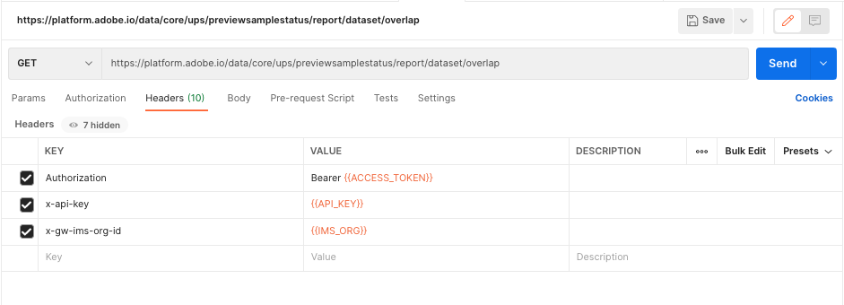
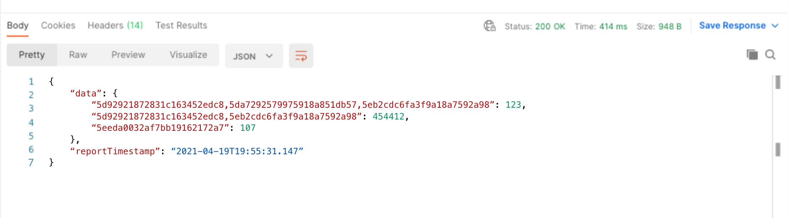

# Generate the dataset overlap report

The dataset overlap report provides visibility into the composition of your organization's [!DNL Profile] store by exposing the datasets that contribute most to your addressable audience (profiles). 

In addition to providing insights into your data, this report can help you take actions to optimize your license usage, such as setting a limit to the lifespan of certain data.

This tutorial outlines the steps necessary to generate the dataset overlap report using the [!DNL Real-Time Customer Profile] API and interpret the results for your organization.

## Getting started

In order to use Adobe Experience Platform APIs, you must first complete the [authentication tutorial](https://www.adobe.com/go/platform-api-authentication-en) to gather the values that you need for the required headers. To learn more about Experience Platform APIs, please refer to the [getting started with Platform APIs documentation](../../landing/api-guide.md). 

The required headers for all of the API calls in this tutorial are:

* `Authorization: Bearer {ACCESS_TOKEN}`: The `Authorization` header requires an access token prepended by the word `Bearer`. A new access token value must be generated every 24 hours.
* `x-api-key: {API_KEY}`: The `API Key` is also known as a `Client ID` and is a value that only needs to be generated once.
* `x-gw-ims-org-id: {ORG_ID}`: The organization ID only needs to be generated once.

After completing the authentication tutorial and gathering the values for the required headers, you are ready to begin making calls to the Real-Time Customer API.

## Generate dataset overlap report using the command line

If you are familiar with using the command line, you can use the following cURL request to generate the dataset overlap report by performing a GET request to `/previewsamplestatus/report/dataset/overlap`.

**Request**

The following request uses the `date` parameter to return the most recent report for the date specified.

```shell
curl -X GET \
  https://platform.adobe.io/data/core/ups/previewsamplestatus/report/dataset/overlap?date=2021-04-19 \
  -H 'Authorization: Bearer {ACCESS_TOKEN}' \
  -H 'x-api-key: {API_KEY}' \
  -H 'x-gw-ims-org-id: {ORG_ID}' \
```

|Parameter|Description|
|---|---|
|`date`| Specify the date of the report to be returned. If multiple reports were run on the date, the most recent report for that date is returned. If a report does not exist for the specified date, an HTTP status 404 (Not Found) error is returned. If no date is specified, the most recent report is returned. Format: YYYY-MM-DD. Example: `date=2024-12-31`|

**Response**

A successful request returns HTTP status 200 (OK) and the dataset overlap report. The report includes a `data` object, containing comma-separated lists of datasets and their respective profile count. For details on how to read the report, see the section on [interpreting the dataset overlap report data](#interpret-the-report) later in this tutorial.

```json
{
    "data": {
        "5d92921872831c163452edc8,5da7292579975918a851db57,5eb2cdc6fa3f9a18a7592a98": 123,
        "5d92921872831c163452edc8,5eb2cdc6fa3f9a18a7592a98": 454412,
        "5eeda0032af7bb19162172a7": 107
    },
    "reportTimestamp": "2021-04-19T19:55:31.147"
}
```

### Generate dataset overlap report using Postman

Postman is a collaborative platform for API development and is useful for visualizing API calls. It can be downloaded for free from the [Postman website](https://www.postman.com) and provides an easy to use UI for performing API calls. The following screenshots use the Postman interface.

**Request**

To request the dataset overlap report using Postman, complete the following steps:

* Using the dropdown, select GET as the request type.
* Enter the required headers in the `KEY` column: 
    * `Authorization`
    * `x-api-key`
    * `x-gw-ims-org-id`
* Enter the values you generated during authentication into the `VALUE` column, replacing the braces (`{{ }}`) and any content within the braces.
* Enter the request path with or without the optional `date` parameter:
  `https://platform.adobe.io/data/core/ups/previewsamplestatus/report/dataset/overlap`  
  or
  `https://platform.adobe.io/data/core/ups/previewsamplestatus/report/dataset/overlap?date=YYYY-MM-DD`

|Parameter|Description|
|---|---|
|`date`| Specify the date of the report to be returned. If multiple reports were run on the date, the most recent report for that date is returned. If a report does not exist for the specified date, an HTTP status 404 (Not Found) error is returned. If no date is specified, the most recent report is returned. <br/>Format: YYYY-MM-DD. Example: `date=2024-12-31`|

After the request type, headers, values, and path are complete, select **Send** to send the API request and generate the report.



**Response**

A successful request returns HTTP status 200 (OK) and the dataset overlap report. The report includes a `data` object, containing comma-separated lists of datasets and their respective profile count. For details on how to read the report, see the section on [interpreting the dataset overlap report data](#interpret-the-report).



## Interpret the dataset overlap report data {#interpret-the-report}

The generated dataset overlap report provides a timestamp showing the date and time of the report and a data object that includes unique combinations of dataset IDs as comma-separated lists. The following sections provide additional information regarding the components of the report.

### Report timestamp

The `reportTimestamp` matches the date provided in the API request, or if no date was provided, the timestamp of the most recent report.

### List of dataset IDs

The `data` object includes unique combinations of dataset IDs as comma-separated lists with the respective profile count for that combination of datasets.

>[!NOTE]
>
>The sum of all of the profile counts associated with each row of the dataset overlap report should equal the total number of profiles in your organization.

To interpret the results of the report, consider the following example:

```json
  "5d92921872831c163452edc8,5da7292579975918a851db57,5eb2cdc6fa3f9a18a7592a98": 123,
  "5d92921872831c163452edc8,5eb2cdc6fa3f9a18a7592a98": 454412,
  "5eeda0032af7bb19162172a7": 107
```

This report provides the following information:

* There are 123 profiles comprised of data coming from the following datasets: `5d92921872831c163452edc8`, `5da7292579975918a851db57`, `5eb2cdc6fa3f9a18a7592a98`.
* There are 454,412 profiles comprised of data coming from these two datasets: `5d92921872831c163452edc8` and `5eb2cdc6fa3f9a18a7592a98`.
* There are 107 profiles that are comprised only of data from dataset `5eeda0032af7bb19162172a7`.
* There is a total of 454,642 profiles in the organization.

## Next steps

After completing this tutorial, you are now able to generate the dataset overlap report using the Real-Time Customer Profile API. To learn more about working with Profile data in both the API and the Experience Platform UI, please begin by reading the [Profile overview documentation](../home.md).
