# [!DNL Real-Time Customer Profile] detail customization {#profile-detail-customization}

Within the Adobe Experience Platform user interface, you can view and interact with [!DNL Real-Time Customer Profile] data in the form of customer profiles. The profile information displayed in the UI has been merged together from multiple profile fragments to form a single view of each individual customer. This includes details such as basic attributes, linked identities, and channel preferences. The default fields shown in profiles can also be changed at an organizational level to display preferred [!DNL Profile] attributes. This guide provides step-by-step instructions for customizing the way in which [!DNL Profile] data is displayed within the Platform UI.  

For a complete guide to the Profiles UI, please visit the [Profile UI guide](user-guide.md).

## Reorder and resize cards {#reorder-and-resize-cards}

From the **[!UICONTROL Detail]** tab of the customer profile, you can select **[!UICONTROL Customize profile details]** in order to resize and reorder existing cards.

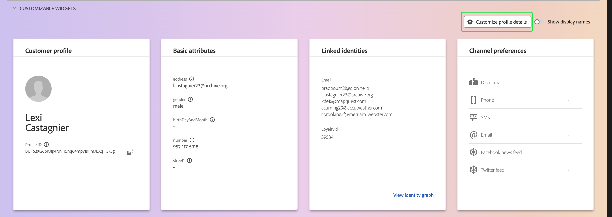

After choosing to modify the dashboard, you can reorder the cards by selecting the card title and dragging and dropping the cards into the desired order. You can also resize a card by selecting the angle symbol in the bottom-right corner of the card (`⌟`) and dragging the card to the desired size. In this example, the **[!UICONTROL Basic attributes]** card is being resized. 

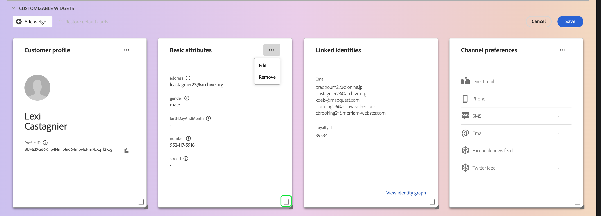

The selected card adjusts to the desired size and surrounding cards are repositioned dynamically. This may cause some cards to be moved to additional rows, requiring you to scroll down in order to see all cards. For example, when the "[!UICONTROL Basic attributes]" card is resized the "[!UICONTROL Linked identities]" card is no longer visible on the top row and now appears on a new second row within the profile (not shown). To return the "[!UICONTROL Linked identities]" card to the top row, you could drag and drop it into the current position of the "[!UICONTROL Channel preferences]" card.

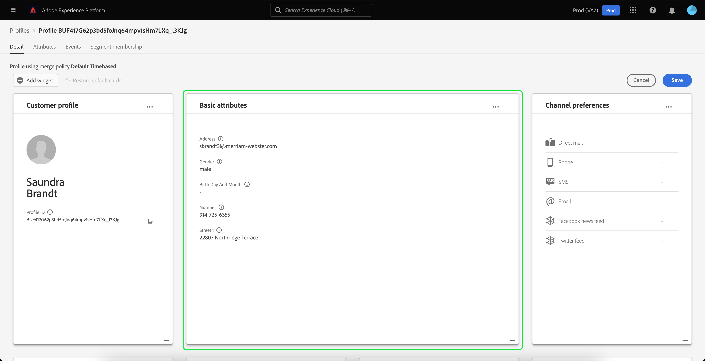

## Edit and remove cards

In addition to resizing and reordering cards, you can edit the content of certain cards and remove some cards from the dashboard entirely. Select the ellipses (`...`) in the top-right corner of the card in order to edit or remove it. This opens a dropdown with options to either edit or remove the card, depending on the properties of the card selected.

>[!NOTE]
>
>Not all cards can be edited or removed. This is because some cards contain read-only or required information. If a card does not have an ellipses in the top-right corner, it contains read-only AND required information and cannot be edited nor can be it removed. If a card has ellipses in the corner and selecting it shows only an option to remove the card, the card information is read-only and cannot be edited.

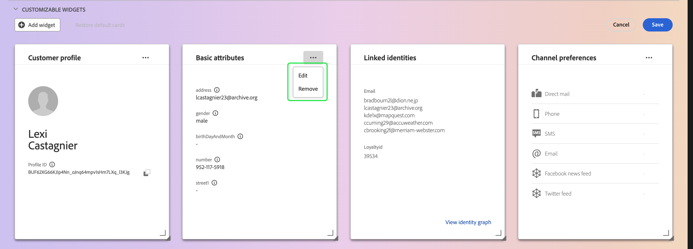

Select **[!UICONTROL Edit]** in the dropdown to open the **[!UICONTROL Edit widget]** workspace, where you can update the card title, reorder or remove the visible attributes, or add additional attributes using the **[!UICONTROL Add attributes]** button.

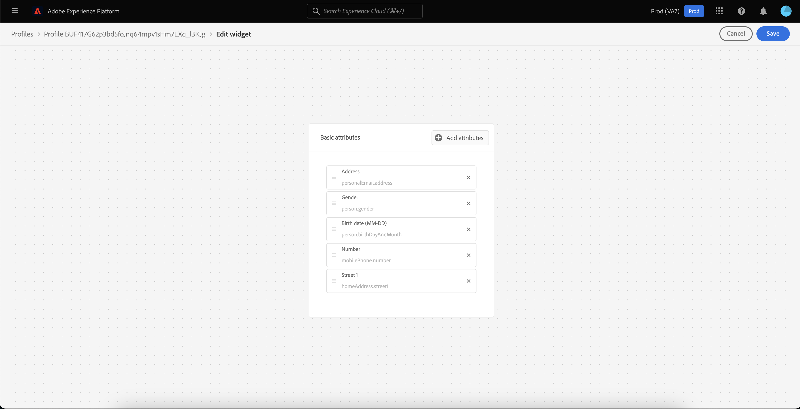

## Add attributes {#add-attributes}

From the **[!UICONTROL Edit widget]** screen, select **[!UICONTROL Add attributes]** in the top-right corner of the card to begin adding attributes to that card.

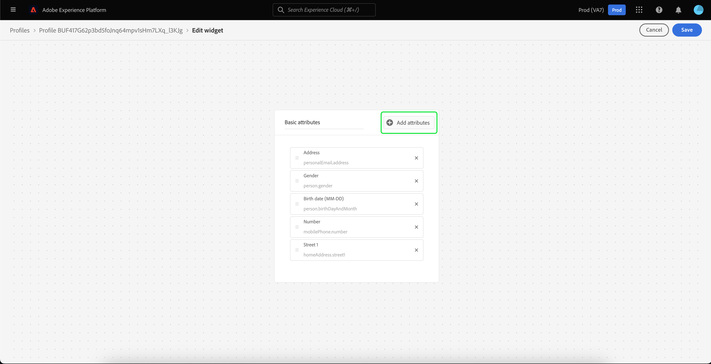

When the **[!UICONTROL Select union schema field]** dialog opens, the left-side of the dialog shows the full [!UICONTROL XDM Individual Profile] union schema, with fields nested underneath. For more information on union schemas, please refer to the [union schemas section of the [!DNL Profile] user guide](user-guide.md#union-schema). 

The **[!UICONTROL Selected Attributes]** section on the right-hand side of the dialog shows the attributes that are currently included in the card that you are editing. You can remove and reorder attributes here as well. The total number of attributes selected is shown, as well as the maximum number of attributes (20) that can be added to a single card.

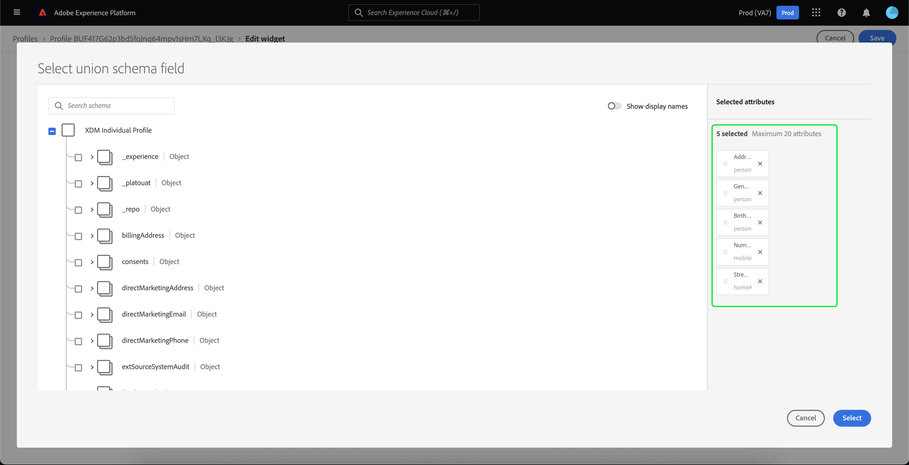

You can select any of the available union schema fields to customize the attributes on the card that you are editing. Selected fields are shown with a check mark next to them and are automatically added to the list of selected attributes. Once you have added all of the attributes that you would like to have displayed on the card, choose **[!UICONTROL Select]** to return to the **[!UICONTROL Edit widget]** screen.

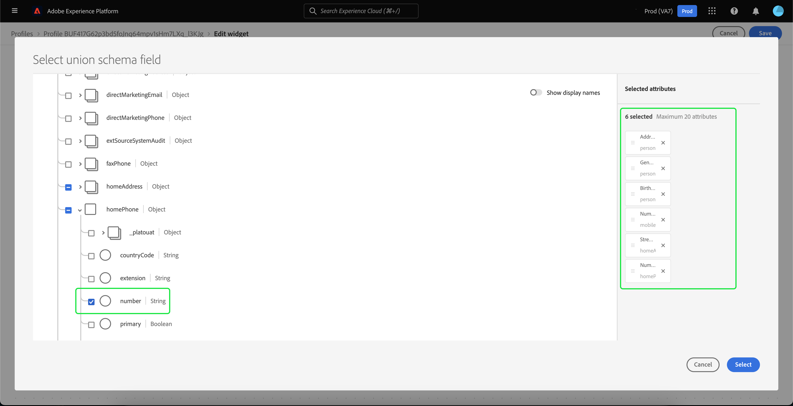

When you return to the **[!UICONTROL Edit widget]** screen, the list of attributes on the card should now be updated to reflect your choices. You can still remove or reorder the card attributes or edit the card title as needed. Once your edits are complete, select **[!UICONTROL Save]** to save your changes.

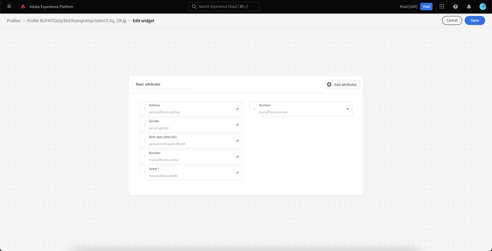

After saving, you are returned to the **[!UICONTROL Detail]** tab where the updated card and attributes are visible.

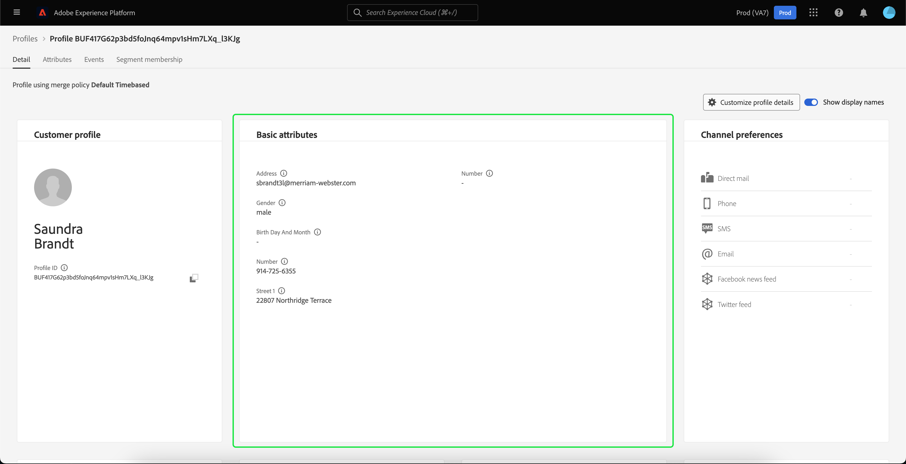

## Add a new card {#add-a-new-card}

To further customize the look of profiles within Experience Platform, you can elect to add new cards to the dashboard and select the attributes that you would like to display on those cards. To begin, select **[!UICONTROL Modify dashboard]** on the **[!UICONTROL Detail]** tab.

Next, select **[!UICONTROL Add widget]** in the top left corner of the dashboard.

Choosing to add a new card opens the **[!UICONTROL Edit widget]** screen where you can provide a title for the new card and choose the attributes that you wish the card to display. To begin adding attributes to the card, select **[!UICONTROL Add attributes]**.

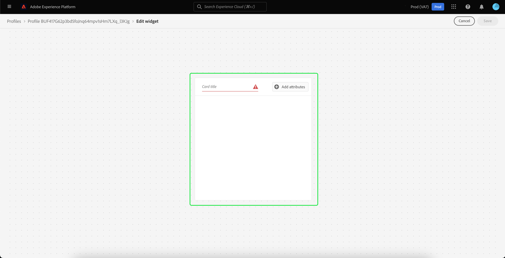

When the **[!UICONTROL Select union schema field]** dialog opens, the left side of the dialog shows the full [!UICONTROL XDM Individual Profile] union schema and the **[!UICONTROL Selected Attributes]** section on the right-hand side of the dialog shows the attributes that you select for your card. For more information on adding attributes, see the [section on adding attributes](#add-attributes) that appears earlier in this document.

The total number of attributes selected is shown, as well as the maximum number of attributes (20) that can be added to a single card. You can also remove and reorder your selected attributes from this screen. Once you have added all of the attributes that you would like displayed on the card, choose **[!UICONTROL Select]** to return to the **[!UICONTROL Edit widget]** screen.

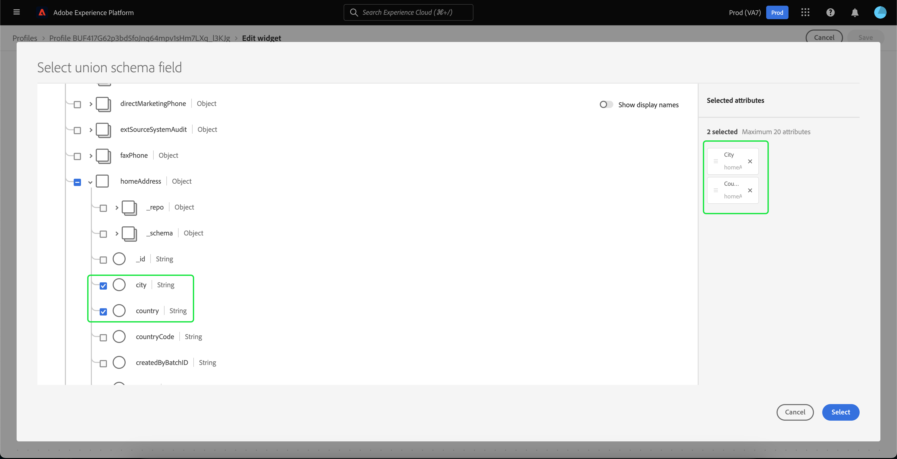

When you return to the **[!UICONTROL Edit widget]** screen, the list of attributes on the card should reflect your choices from the previous screen. You can also reorder and remove card attributes as needed. 

In order to save your new card you must first provide a **[!UICONTROL Card title]**, then you will be able to select **[!UICONTROL Save]** and complete the card creation process.

After saving, you are returned to the **[!UICONTROL Detail]** tab where your new card and attributes are visible.

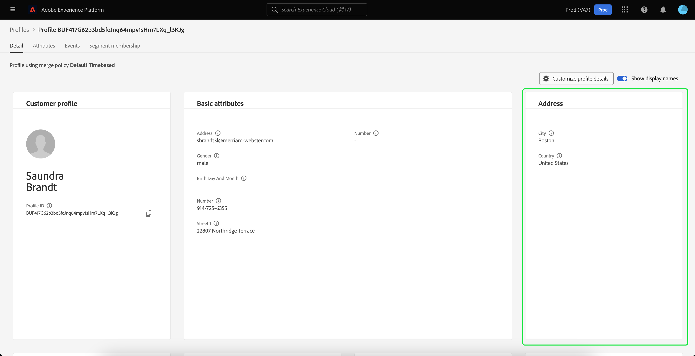

## Restore default cards

If at any point you decide that you would like to restore default cards that have since been removed, you have the ability to quickly and easily do so. First, select **[!UICONTROL Modify dashboard]**, then select **[!UICONTROL Restore default cards]**. Once the default cards are visible, you can select **[!UICONTROL Save]** to save your changes or select **[!UICONTROL Cancel]** if you do not wish to restore the default cards.

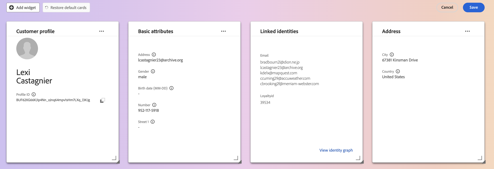

## Next steps

By following this document you should now be able to update the profile view for your organization, including adding and removing cards, editing card details and attributes, and reordering and resizing cards. To learn more about working with [!DNL Profile] data in the Experience Platform UI, please refer to the [[!DNL Profile] user guide](user-guide.md).
