# [!DNL Real-time Customer Profile] detail customization {#profile-detail-customization}

Within the Adobe Experience Platform user interface, you can view and interact with [!DNL Real-time Customer Profile] data. The profile information displayed in the UI has been merged together from multiple profile fragments to form a single view of each individual customer. This includes customer details such as basic attributes, linked identities, and channel preferences. The default fields shown can also be changed at an organizational-level to display preferred Profile attributes. This guide provides step-by-step instructions for customizing the way in which Profile data is displayed within the Platform UI.  

For a complete guide to the [!UICONTROL Profiles] UI, please visit the [Profile user guide](user-guide.md).

## [!UICONTROL Modify dashboard] {#modify-dashboard}

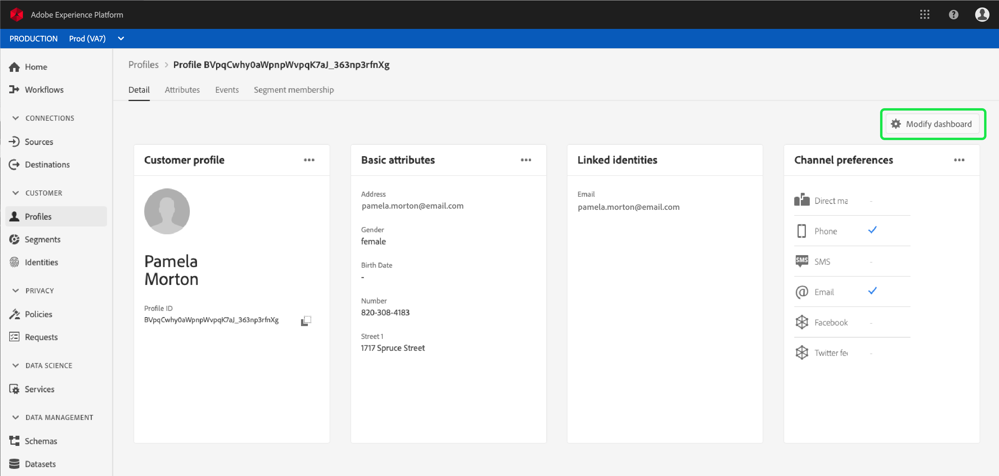

Resize cards.

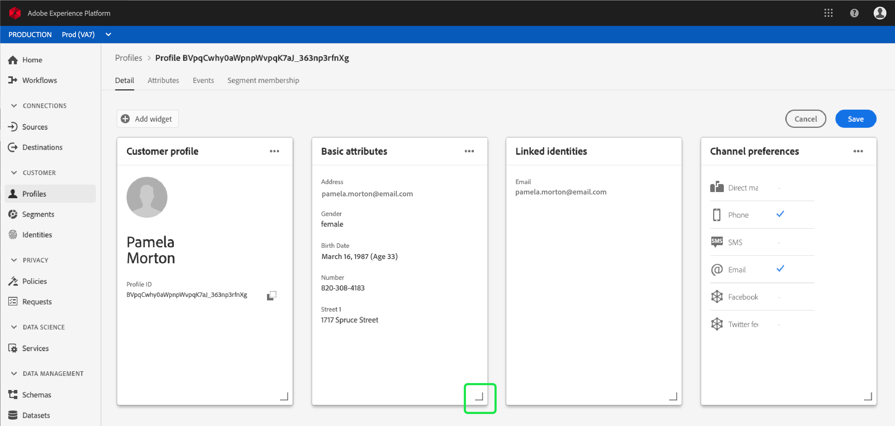

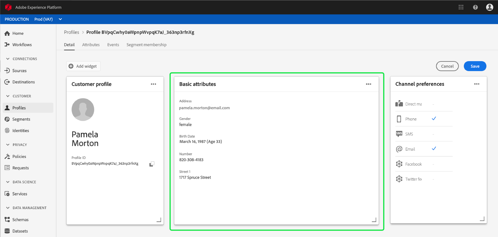

Can only remove some cards - read only
Cannot remove or edit some cards

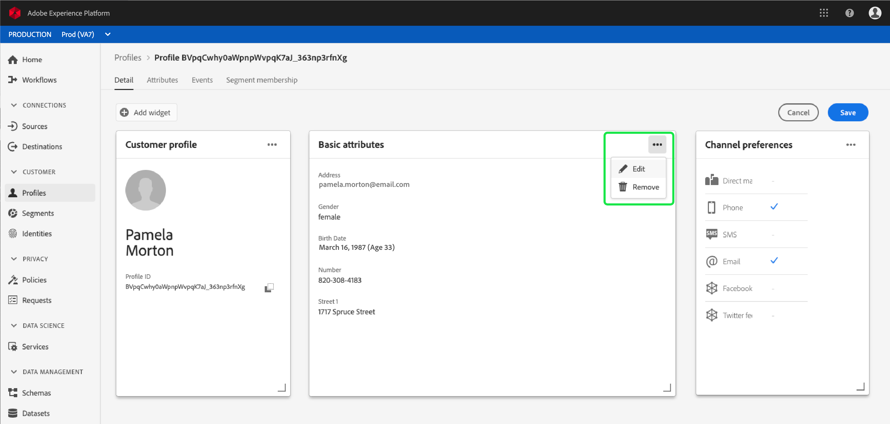

Edit existing card

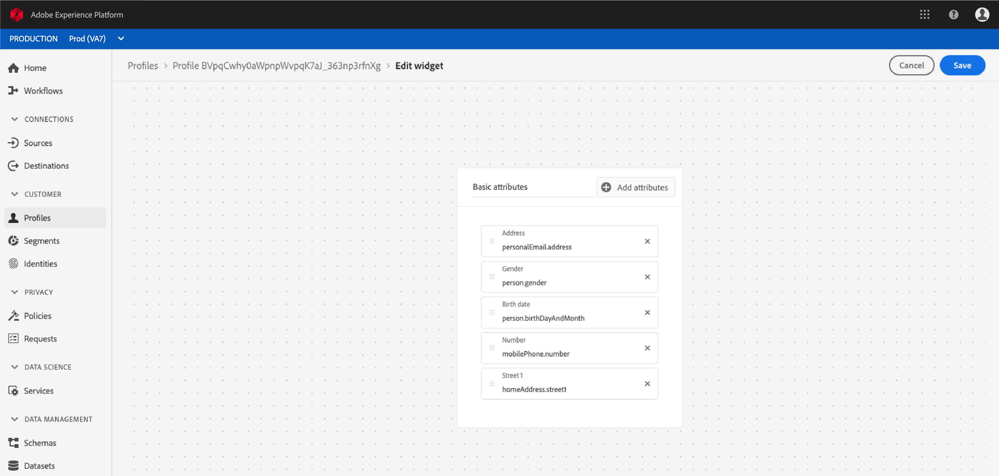

Add attributes

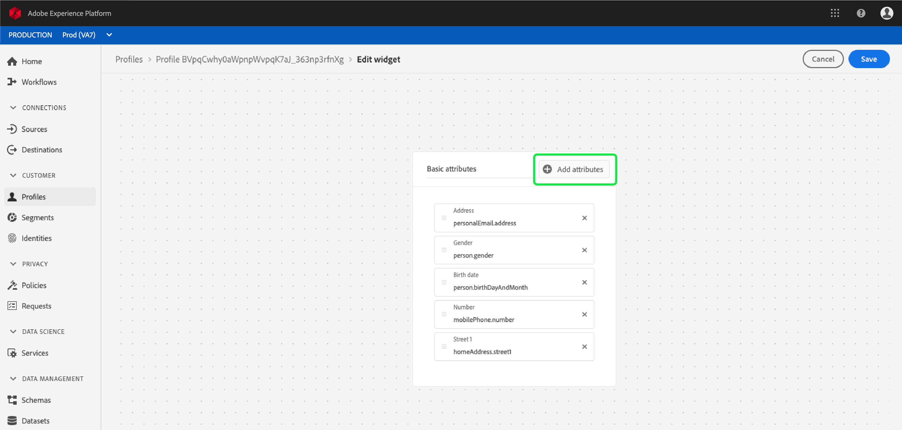

Select schema field - current fields

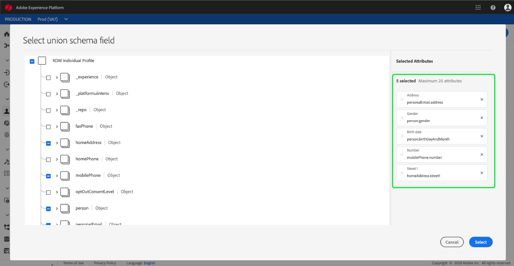

Select schema field - add fields

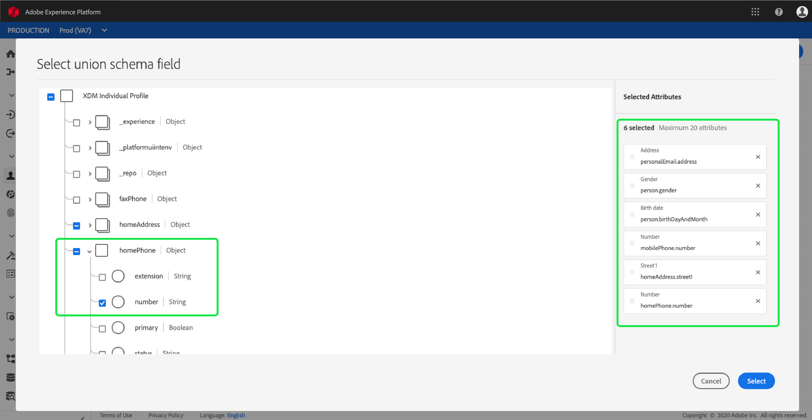

Update and save card

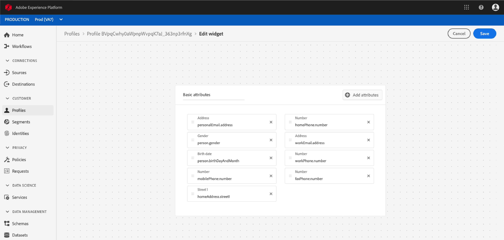

Card with new attributes

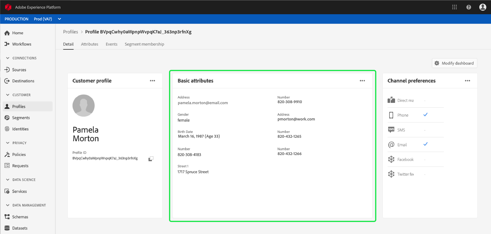

## [!UICONTROL Add widget] {#add-widget}

Modify dashboard.

Add widget.

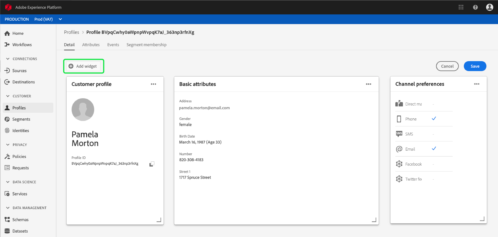

Edit new widget

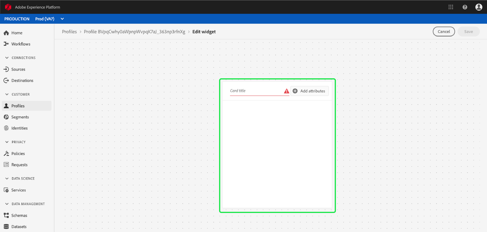

Select fields for new widget

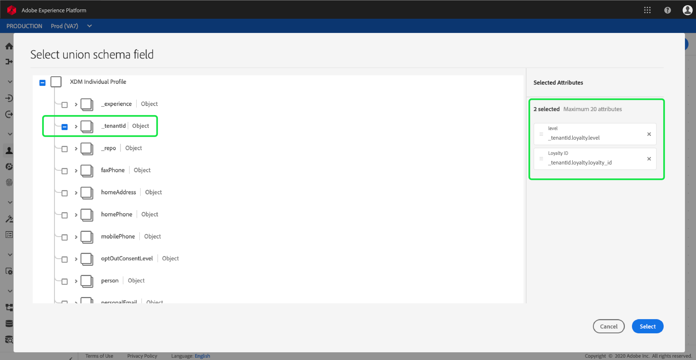

Confirm new widget fields and card title

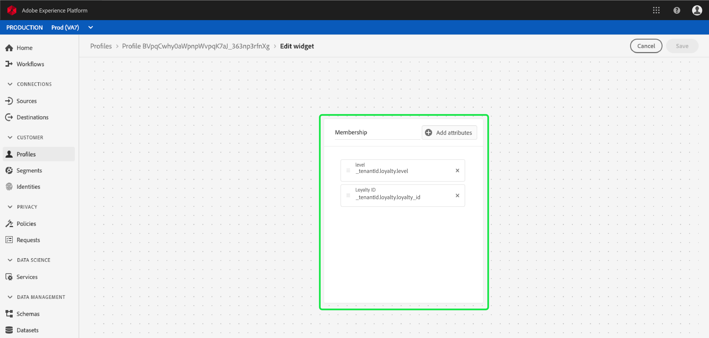

New card with fields

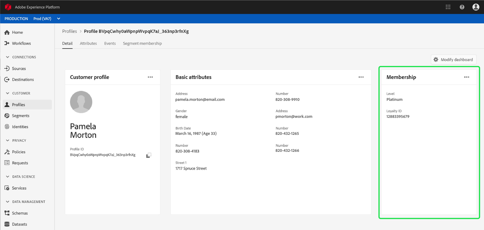

## Next steps