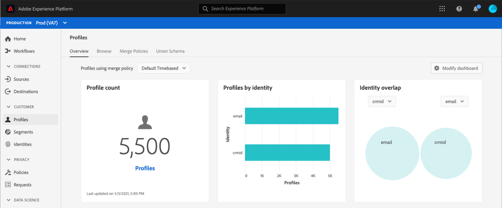

# [!UICONTROL Profiles] dashboard {#profile-dashboard}

The Adobe Experience Platform user interface (UI) provides a dashboard through which you can view important information about your [!DNL Real-Time Customer Profile] data, as captured during a daily snapshot. 

For detailed instructions on how to access and interact with the [!UICONTROL Profiles] dashboard in the UI, as well as to learn more about the available metrics displayed in the dashboard, please visit the [[!UICONTROL Profiles] dashboard guide](../../dashboards/guides/profiles.md).  

For an overview of all of the dashboard features within the Experience Platform user interface, please begin by reading the [dashboards overview](../../dashboards/home.md).

