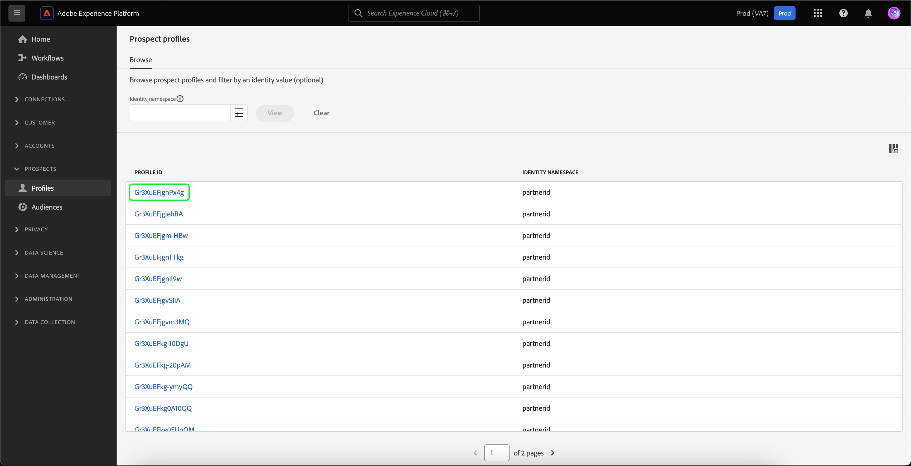
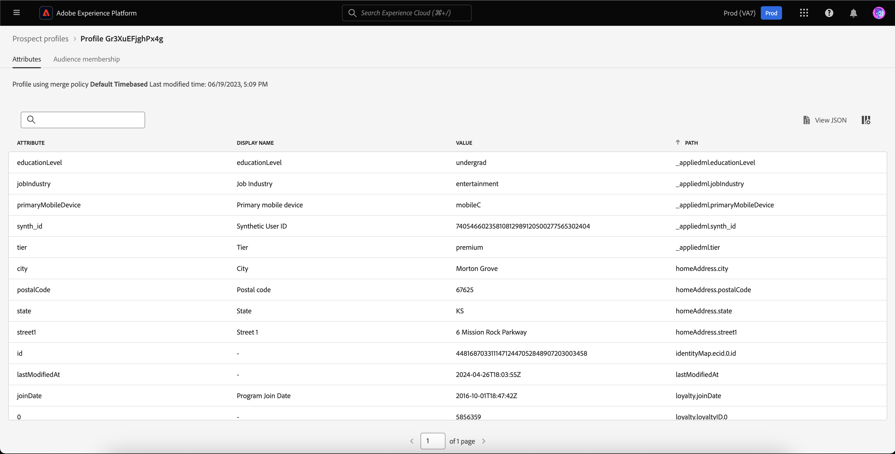
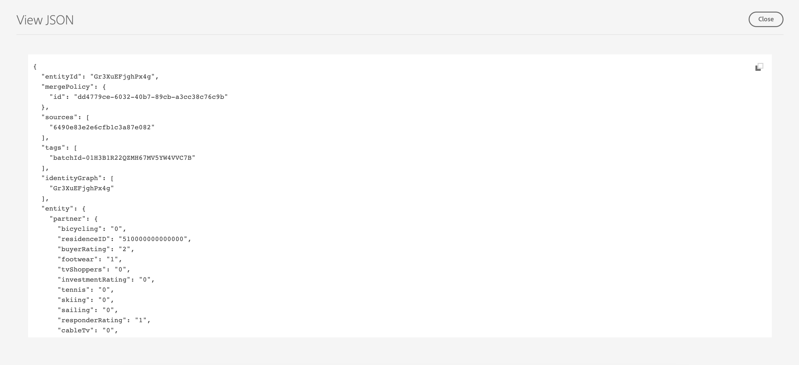

# Prospect profiles

>[!IMPORTANT]
>
>Prospect profiles is currently in **beta** and is **not** available to all users.

Adobe Experience Platform enables you to drive coordinated, consistent, and relevant experiences for your customers no matter where or when they interact with your brand. 

Prospect profiles are used to represent people who have not yet engaged with your company but want to reach out to. With prospect profiles, you can supplement your customer profiles with attributes from trusted third-party partners.

## Browse

To access prospect profiles, select **[!UICONTROL Profiles]** in the **[!UICONTROL Prospects]** section.

The **[!UICONTROL Browse]** page is displayed. A list of all the prospect profiles for the organization is displayed.

![The [!UICONTROL Profiles] button is highlighted, displaying the [!UICONTROL Browse] page for prospect profiles.](../images/prospect-profile/browse-profiles.png)

>[!IMPORTANT]
>
>While most of the browsing functionality between customer profiles and prospect profiles is the same, you **cannot** browse profiles by merge policy. This is because for prospect profiles, only the default merge policy exists.

For more information on browsing profiles, please read the [browse section of the Profile user guide](./user-guide.md#browse-identity).

## Prospect profile details

>[!IMPORTANT]
>
>A prospect profile will expire after 25 days of residing in Adobe Experience Platform.

To view more information about a specific prospect profile, select a profile on the [!UICONTROL Browse] page.

Information about the prospect profile is displayed, including the attributes and audience membership. 

For more information on these tabs, please read the [view Profile details section of the Profile user guide](./user-guide.md#profile-detail).

You can also see all the attributes in JSON format by selecting **[!UICONTROL View JSON]**.

![The [!UICONTROL View JSON] button is highlighted on the prospect profile details page.](../images/prospect-profile/profile-select-view-json.png)

The attributes of the prospect profile are now displayed in JSON form.

## Next steps

After reading this guide, you now understand how prospect profiles can be used in Adobe Experience Platform. To learn how these prospect profiles can be used in audiences, please read the [prospect audiences guide](../../segmentation/ui/prospect-audience.md).
