# [!DNL Real-time Customer Profile] UI guide

[!DNL Real-time Customer Profile] creates a holistic view of each of your individual customers, combining data from multiple channels including online, offline, CRM, and third-party data. This document serves as a guide for interacting with [!DNL Real-time Customer Profile] data in the Adobe Experience Platform user interface (UI).

## Getting started

This UI guide requires an understanding of the various [!DNL Experience Platform] services involved with managing [!DNL Real-time Customer Profiles]. Before reading this guide, or working in the UI, please review the documentation for the following services:

* [[!DNL Real-time Customer Profile]](../home.md): Provides a unified, real-time consumer profile based on aggregated data from multiple sources.
* [[!DNL Identity Service]](../../identity-service/home.md): Enables [!DNL Real-time Customer Profile] by bridging identities from disparate data sources as they are ingested into [!DNL Platform].
* [[!DNL Experience Data Model] (XDM)](../../xdm/home.md): The standardized framework by which [!DNL Platform] organizes customer experience data.

## Overview

In the [[!DNL Experience Platform] UI](http://platform.adobe.com), select **[!UICONTROL Profiles]** in the left navigation to open the **[!UICONTROL Overview]** tab. This tab provides links to documentation and videos to help you understand and begin working with profiles.

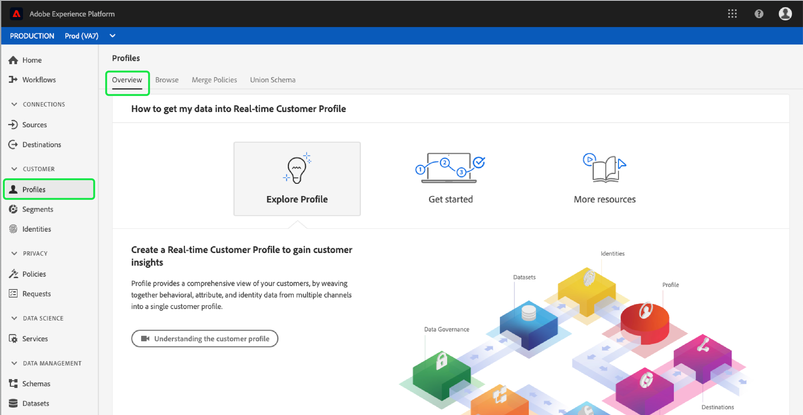

## Browse

Select the **[!UICONTROL Browse]** tab in order to browse profiles by identity. 

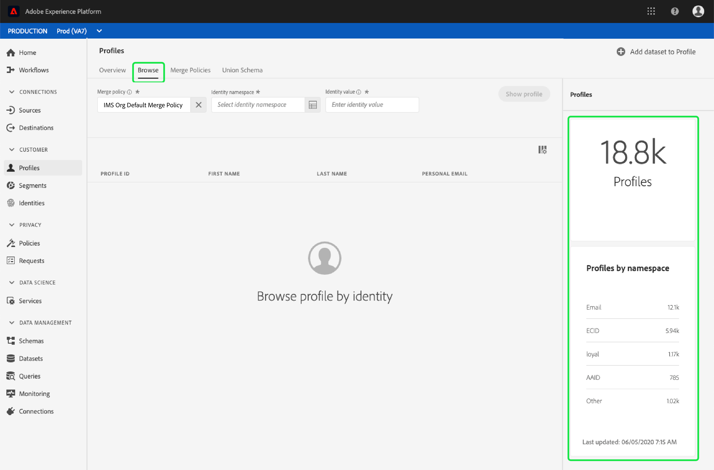

### Profile metrics {#profile-metrics}

On the right-hand side of the **[!UICONTROL Browse]** tab are several important metrics related to your profile data, including your total [profile count](#profile-count) as well as a listing of [profiles by namespace](#profiles-by-namespace). 

These profile metrics are evaluated using the default merge policy of your organization. For more information on working with merge policies, including how to define a default merge policy, see the [Merge Policies user guide](merge-policies.md).

In addition to these metrics, the profile metrics section also provides a last updated date and time, showing when the metrics were last evaluated.

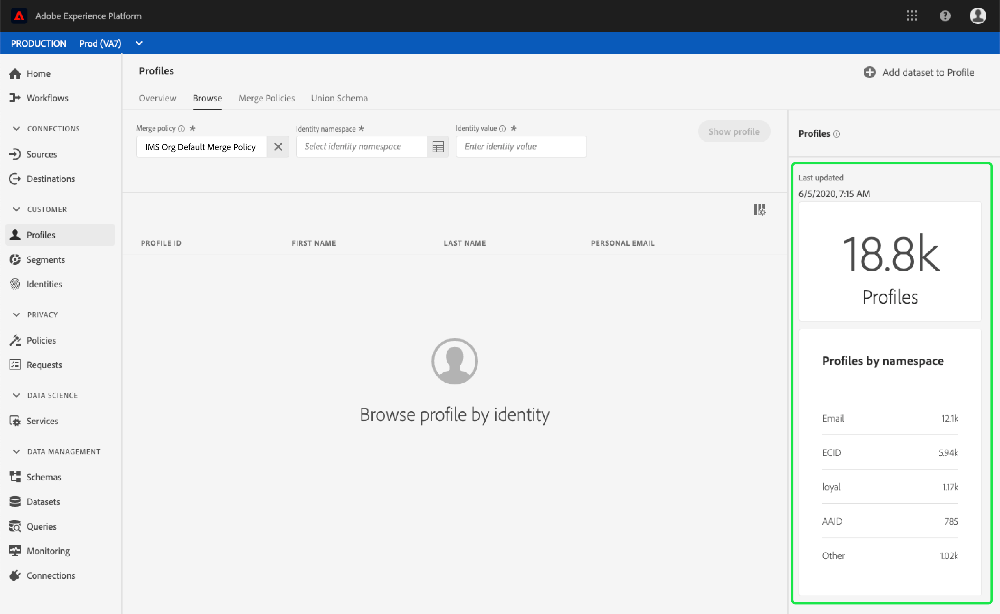

### Profile count {#profile-count}

The profile count displays the total number of profiles your organization has within [!DNL Experience Platform], after your organization's default merge policy has merged together profile fragments to form a single profile for each individual customer. In other words, your organization may have multiple profile fragments related to a single customer who interacts with your brand across different channels, but these fragments would be merged together (according to the default merge policy) and would return a count of "1" profile because they are all related to the same individual.

The profile count also includes both profiles with attributes (record data) as well as profiles containing only time series (event) data, such as Adobe Analytics profiles. The profile count is refreshed regularly to provide an up-to-date total number of profiles within Platform. 

When the ingestion of records into the [!DNL Profile] store increases or decreases the count by more than 5%, a job is triggered to update the count. For streaming data workflows, a check is done on an hourly basis to determine if the 5% increase or decrease threshold has been met. If it has, a job is automatically triggered to update the profile count. For batch ingestion, within 15 minutes of successfully ingesting a batch into the Profile store, if the 5% increase or decrease threshold is met, a job is run to update the profile count.

### Profiles by namespace {#profiles-by-namespace}

The **[!UICONTROL Profiles by namespace]** metric displays the total count and breakdown of namespaces across all of the merged profiles in your Profile Store. The total number of profiles by namespace (in other words, adding together the values shown for each namespace) will always be higher than the profile count metric because one profile could have multiple namespaces associated with it. For example, if a customer interacts with your brand on more than one channel, multiple namespaces will be associated with that individual customer.

Similar to the [profile count](#profile-count) metric, when the ingestion of records into the [!DNL Profile] store increases or decreases the count by more than 5%, a job is triggered to update the namespace metrics. For streaming data workflows, a check is done on an hourly basis to determine if the 5% increase or decrease threshold has been met. If it has, a job is automatically triggered to update the profile count. For batch ingestion, within 15 minutes of successfully ingesting a batch into the [!DNL Profile] store, if the 5% increase or decrease threshold is met, a job is run to update the metrics.

### Merge policy

The **[!UICONTROL Merge policy]** selector automatically selects the default merge policy for your organization. If you do not wish to use that merge policy you can select the `X` beside the default merge policy to open the **[!UICONTROL Select merge policy]** dialog where you can choose another merge policy. To learn more about merge policies and their role within Platform, see the [merge policies user guide](merge-policies.md).

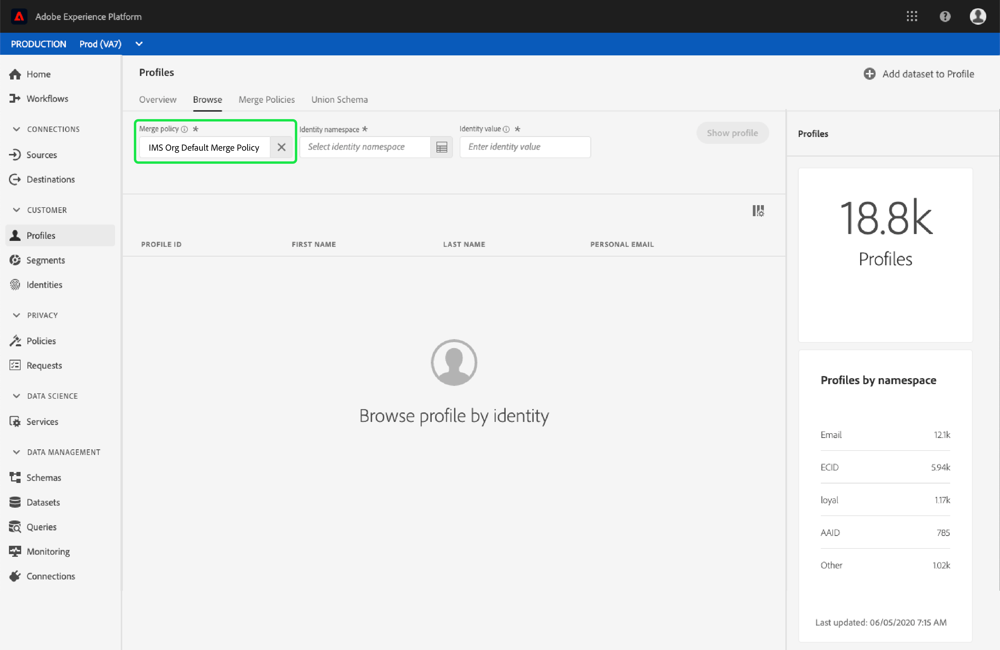

### Identity namespace

The **[!UICONTROL Identity namespace]** selector opens a dialog where you can choose the identity namespace by which you would like to search, and you can customize the attributes that are displayed from your search by selecting the filter icon and choosing which attributes you would like to add or remove.

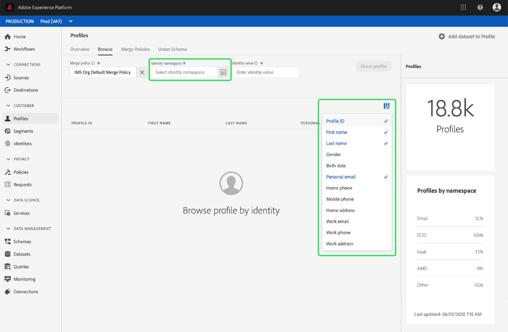

From the **[!UICONTROL Select identity namespace]** dialog, choose the namespace by which you would like to search, or use the search bar in the dialog to begin typing the name of a namespace. You can select a namespace to view additional details, and once you have found the namespace you would like to use you can select the radio button and press **[!UICONTROL Select]** to continue.

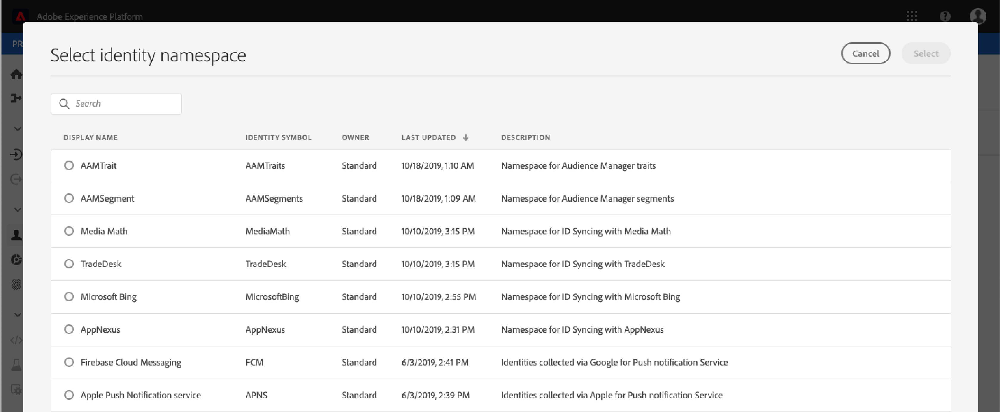

### Identity value

After selecting an identity namespace, you return to the **[!UICONTROL Browse]** tab where you can enter an **[!UICONTROL Identity value]**. This value is specific to an individual customer profile and must be a valid entry for the namespace provided. For example, selecting the identity namespace "Email" would require an identity value in the form of a valid email address. 

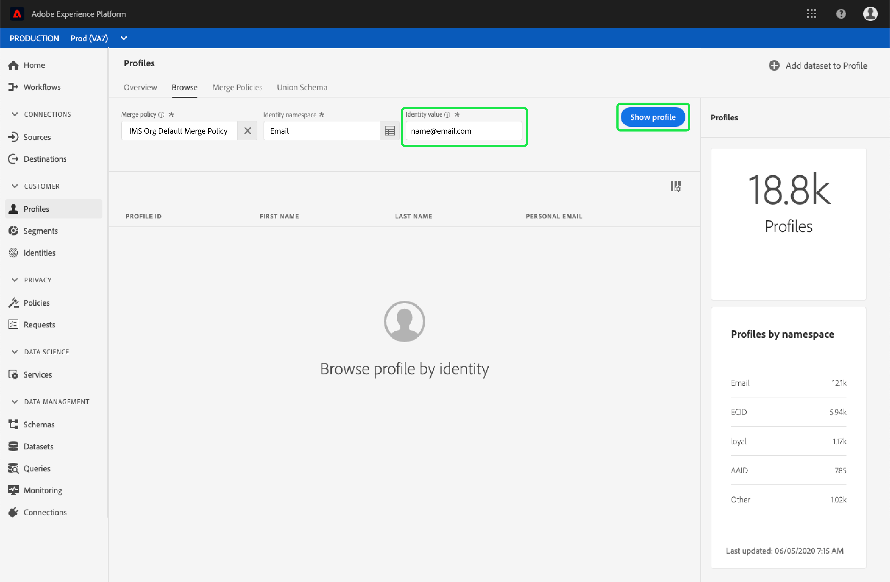

Once a value has been entered, select **[!UICONTROL Show profile]** and a single profile matching the value is returned. Select the **[!UICONTROL Profile ID]** to view the profile details.

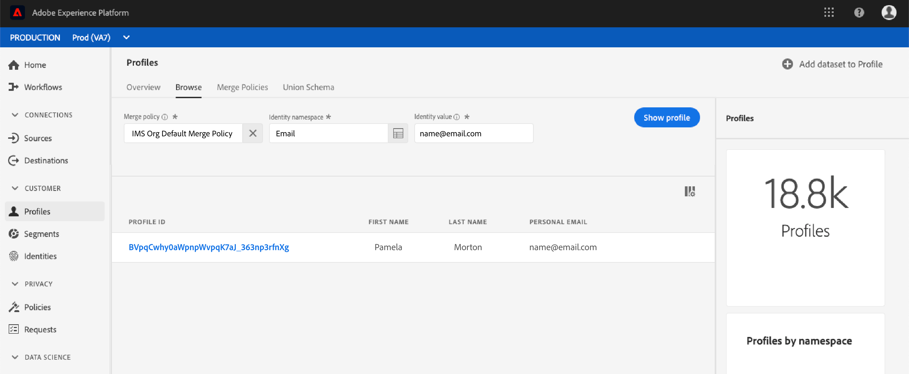

### Profile detail {#profile-detail}

Upon selecting the **[!UICONTROL Profile ID]**, the **[!UICONTROL Detail]** tab opens. The profile information displayed on the **[!UICONTROL Detail]** tab has been merged together from multiple profile fragments to form a single view of the individual customer. This includes customer details such as basic attributes, linked identities, and channel preferences. The default fields shown can also be changed at an organizational-level to display preferred Profile attributes. To learn more about customizing these fields, including step-by-step instructions for adding and removing attributes and resizing dashboard panels, please read the [profile detail customization guide](profile-customization.md).

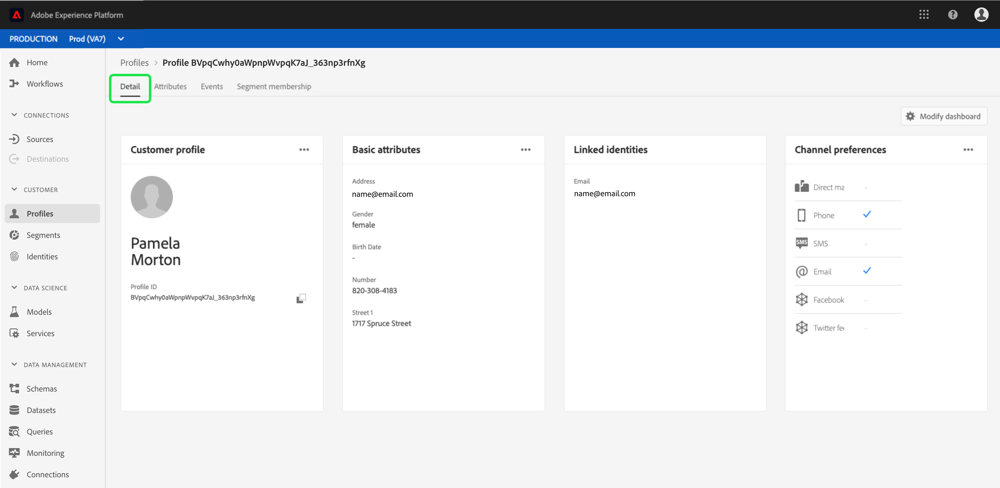

You can view additional information related to the individual profile by selecting another of the available tabs. These tabs include attributes, events, and segment membership, which shows the segments for which the profile is currently qualified.

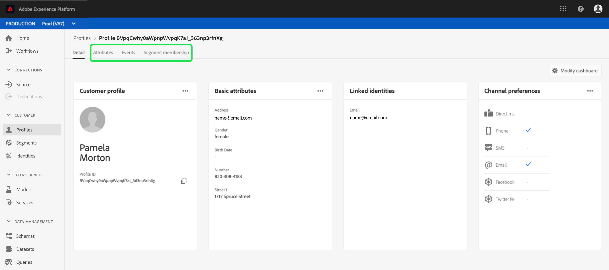

## Merge policies

From the main **[!UICONTROL Profiles]** menu, select the **[!UICONTROL Merge Policies]** tab to view a list of merge policies belonging to your organization. Each listed policy displays its name, whether or not it is the default merge policy, and the schema that it applies to. 

For more information on merge policies, see the [merge policies UI guide](merge-policies.md).

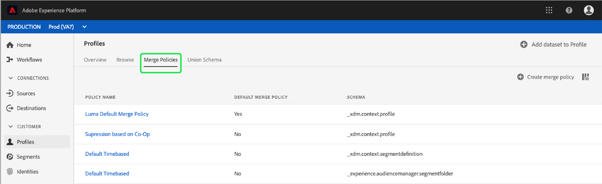

## Union schema {#union-schema}

From the main **[!UICONTROL Profiles]** menu, select the **[!UICONTROL Union Schema]** tab to view the union schemas for your ingested data. A union schema is an amalgamation of all [!DNL Experience Data Model] (XDM) fields under the same class, whose schemas have been enabled for use in [!DNL Real-time Customer Profile]. 

For more information on union schemas, see the [union schema UI guide](union-schema.md).

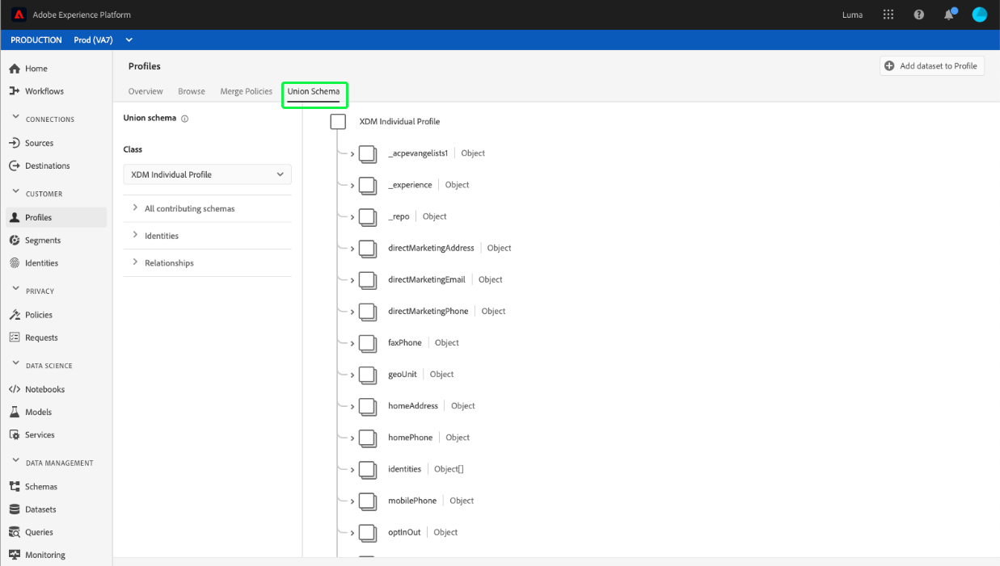

## Next steps

By reading this guide, you now know how to view and manage your [!DNL Profile] data using the [!DNL Experience Platform] UI. For information on how to work with Profile data using the Real-time Customer Profile API, please refer to the [Profile developer guide](../api/overview.md).