# [!DNL Real-Time Customer Profile] UI guide

[!DNL Real-Time Customer Profile] creates a holistic view of each of your individual customers, combining data from multiple channels including online, offline, CRM, and third-party data. This document serves as a guide for interacting with [!DNL Real-Time Customer Profile] data in the Adobe Experience Platform user interface (UI).

## Getting started

This UI guide requires an understanding of the various [!DNL Experience Platform] services involved with managing [!DNL Real-Time Customer Profiles]. Before reading this guide, or working in the UI, please review the documentation for the following services:

* [[!DNL Real-Time Customer Profile] overview](../home.md): Provides a unified, real-time consumer profile based on aggregated data from multiple sources.
* [[!DNL Identity Service]](../../identity-service/home.md): Enables [!DNL Real-Time Customer Profile] by bridging identities from disparate data sources as they are ingested into [!DNL Experience Platform].
* [[!DNL Experience Data Model (XDM)]](../../xdm/home.md): The standardized framework by which [!DNL Experience Platform] organizes customer experience data.

## [!UICONTROL Overview]

In the Experience Platform UI, select **[!UICONTROL Profiles]** in the left navigation to open the **[!UICONTROL Overview]** tab displaying the profile dashboard. 

>[!NOTE]
>
>If your organization is new to Experience Platform and does not yet have active Profile datasets or merge policies created, the [!UICONTROL Profiles] dashboard is not visible. Instead, the [!UICONTROL Overview] tab displays links and documentation to help you get started with Real-Time Customer Profile.

### Profile dashboard {#profile-dashboard}

The profile dashboard outlines key metrics related to your organization's profile data. 

To learn more, visit the [profile dashboard guide](../../dashboards/guides/profiles.md).

## [!UICONTROL Browse] tab 

On the **[!UICONTROL Browse]** tab you can view your profiles either in a **card** view or a **graph** view by selecting the toggle.

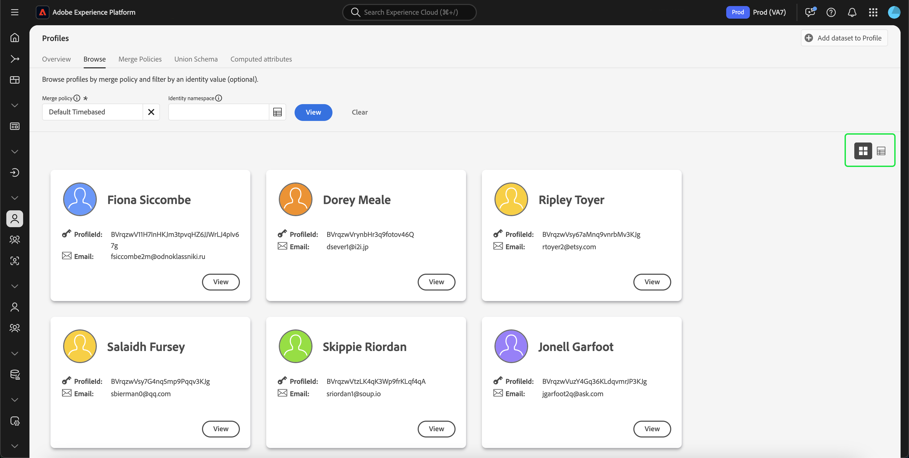

Additionally, you can browse your profiles using a merge policy or look up specific profiles using an identity namespace and value.

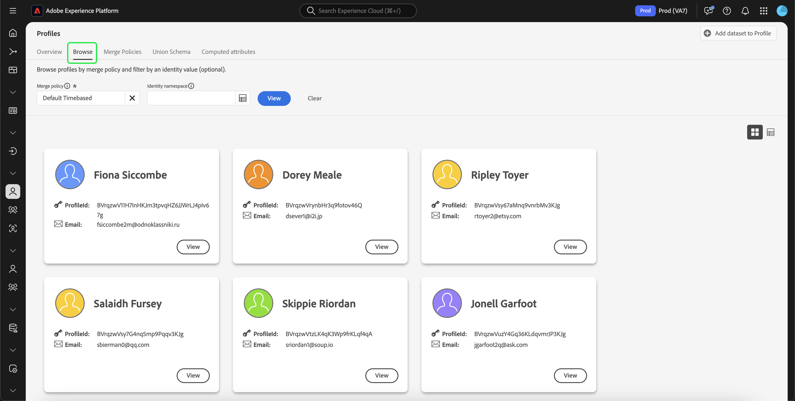

### Browse by [!UICONTROL Merge policy]

The **[!UICONTROL Browse]** tab is set to the default merge policy for your organization by default. To choose a different merge policy, select the `X` beside the merge policy name and then use the selector to open the **[!UICONTROL Select merge policy]** dialog. 

>[!NOTE]
>
>If there is no merge policy selected, use the selector button next to the **[!UICONTROL Merge policy]** field to open the selection dialog.

To choose a merge policy from the **[!UICONTROL Select merge policy]** dialog, select the radio button beside the policy name and then use **[!UICONTROL Select]** to return to the [!UICONTROL Browse] tab. You can then select **[!UICONTROL View]** to refresh the sample profiles and see a sampling of profiles with the new merge policy applied.

The profiles that are shown represent a sample of up to 20 profiles from your organization's Profile store, after the selected merge policy has been applied. The sample profiles for the selected merge policy are refreshed when new data is added to your organization's Profile store.

To view the details of one of the sample profiles, select the **[!UICONTROL Profile ID]**. For more information, see the section later in this guide on [viewing profile details](#profile-detail).

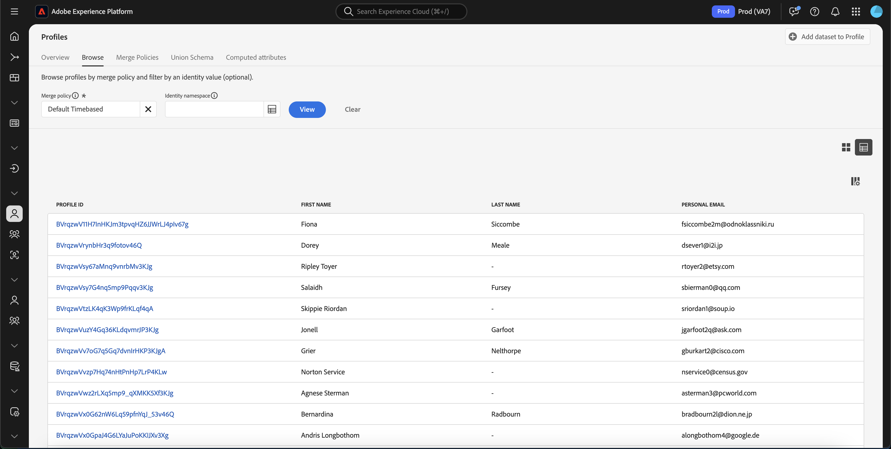

To learn more about merge policies and their role within Experience Platform, see the [merge policies overview](../merge-policies/overview.md).

### Browse by [!UICONTROL Identity] {#browse-identity}

On the **[!UICONTROL Browse]** tab, you can use an identity namespace in order to look up a specific profile by an identity value. Browsing by an identity requires you to provide a merge policy, an identity namespace, and an identity value.

If necessary, use the **[!UICONTROL Merge policy]** selector to open the **[!UICONTROL Select merge policy]** dialog and choose the merge policy that you would like to use.

Then use the **[!UICONTROL Identity namespace]** selector to open the **[!UICONTROL Select identity namespace]** dialog and choose the namespace by which you would like to search. If your organization has many namespaces, you can use the search bar in the dialog to begin typing the name of a namespace. 

You can select a namespace to view additional details or select the radio button to choose a namespace. You can then use **[!UICONTROL Select]** to continue.

After selecting an [!UICONTROL Identity namespace] and returning to the [!UICONTROL Browse] tab, you can enter an **[!UICONTROL Identity value]** related to the namespace that you selected. 

>[!NOTE]
>
>This value is specific to an individual customer profile and must be a valid entry for the namespace provided. For example, selecting the identity namespace "Email" would require an identity value in the form of a valid email address. 

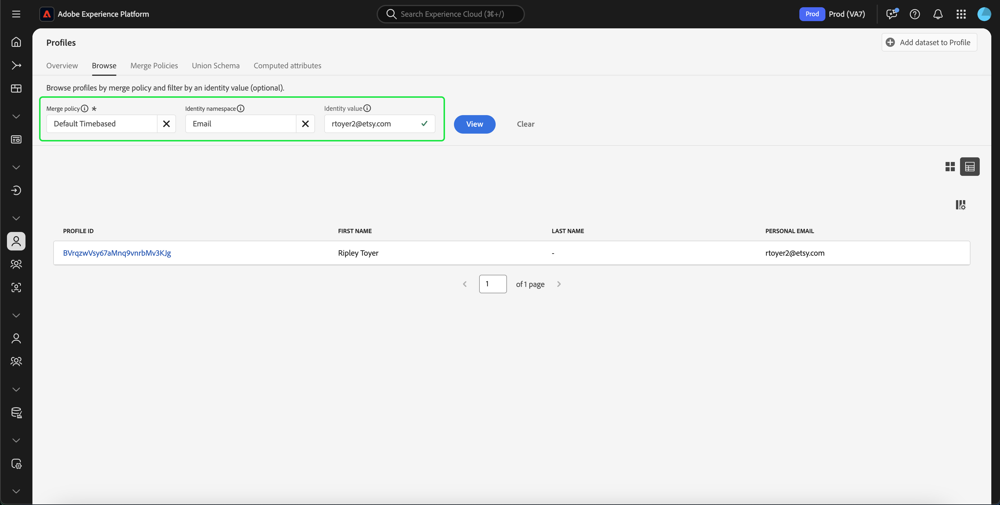

Once a value has been entered, select **[!UICONTROL View]** and a single profile matching the value is returned. Select the **[!UICONTROL Profile ID]** to view a profile.

## View profile {#view-profile}

>[!CONTEXTUALHELP]
>id="platform_errors_uplib_201001_404"
>title="Entity not found"
>abstract="This means that Experience Platform could not find the requested entity. To resolve this error, please try one of the following solutions:<ul><li>Ensure the correct profile ID is listed in the URL of the entity you're trying to access.</li><li>Ensure you have the correct Organization and sandbox combination for the entity you're trying to access.</li></ul>"

After selecting a **[!UICONTROL Profile ID]**, the **[!UICONTROL Detail]** tab opens. The profile information displayed on the **[!UICONTROL Detail]** tab has been merged together from multiple profile fragments to form a single view of the individual customer. This includes customer details such as basic attributes, linked identities, and channel preferences. 

Additionally, you can view other details about profiles such as its [attributes](#attributes), [events](#events), and [audience membership](#audience-membership).

### Details tab {#profile-detail}

The **[!UICONTROL Details]** tab provides more detailed information about the selected profile, and is separated into four sections:  Customer profile insights, AI insight widgets, customizable widgets, and auto-classified widgets.

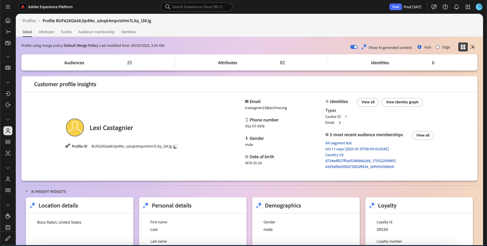

Additionally, you can toggle whether the AI-generated insights are displayed, show the details for hub compared to edge, as well as view the details in graph view.

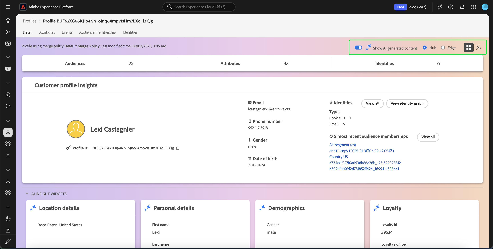

#### Customer profile insights {#customer-profile-insights}

The **[!UICONTROL Customer profile insights]** section displays a brief introduction to the profile's attributes. This includes the profile ID, email, phone number, gender, date of birth, as well as the identities and audience memberships of the profile.

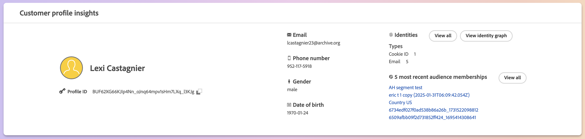

#### AI insight widgets {#ai-insight-widgets}

>[!IMPORTANT]
>
>If you are a Healthcare Shield customer, you will **not** be able to use AI insight widgets.

The **[!UICONTROL AI insight widgets]** section displays widgets that are generated by AI. These widgets provide quick insights to the profile, based off of the profile data including demographics (such as age, gender, or location), user behaviors (such as purchase history, website activity, or social media engagement), as well as psychographics (such as interests, preference, or lifestyle choices). All the AI widgets use data that **already** exists in the profile.

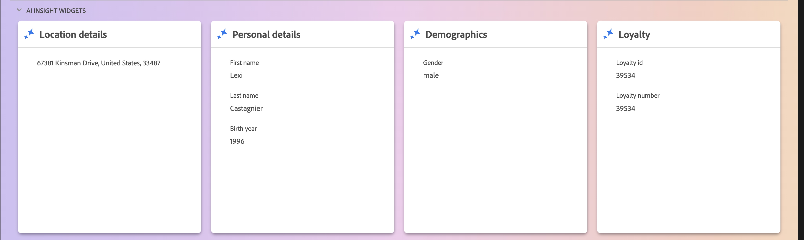

#### Customizable widgets {#customizable-widgets}

The **[!UICONTROL Customizable widgets]** section displays widgets that you can customize to match your business needs. You can group attributes into separate widgets, remove unwanted widgets, or adjust the widgets' layout.

The default fields shown can also be changed at an organizational-level to display preferred Profile attributes. To learn more about customizing these fields, including step-by-step instructions for adding and removing attributes and resizing dashboard panels, please read the [profile detail customization guide](profile-customization.md).

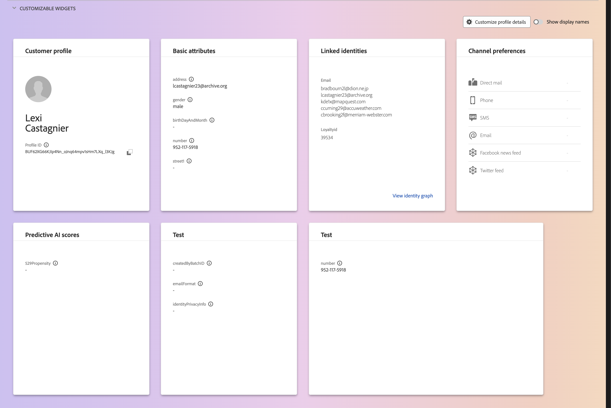

You can also choose to toggle between viewing the attribute names as their display names and their field path names. To switch between these two displays, select the **[!UICONTROL Show display names]** toggle. 

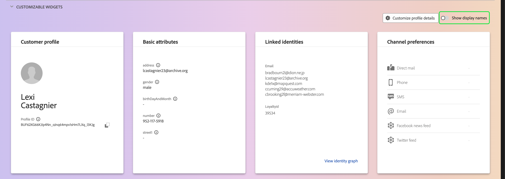

#### Auto-classified widgets {#auto-classified-widgets}

The **[!UICONTROL Auto-classified widgets]** section displays widgets that leverage the union schema to determine the source field groups an attribute belongs to, providing clearer context on where the data originates from. You can use the search bar to more easily look for keywords within your widgets.

These widgets combine both event data (with the Experience events widget) and attribute data, letting you have a unified view of your profile. You can use these widgets to explore the structure of your profile's data to better structure your [customizable widgets](#customizable-widgets).

>[!NOTE]
>
>If there are multiple source field groups, the widgets will only use **one** of the available options.

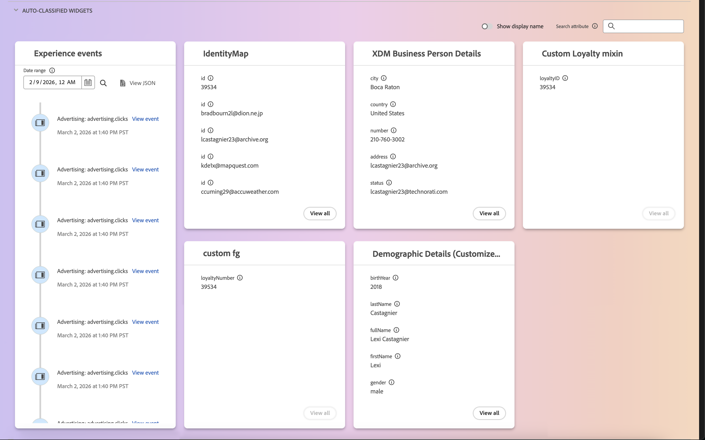

### Attributes tab {#attributes}

The **[!UICONTROL Attributes]** tab provides a list view summarizing all of the attributes related to a single profile, after the specified merge policy has been applied.

These attributes can also be viewed as a JSON object by selecting to **[!UICONTROL View JSON]**. This is helpful for any users wishing to better understand how the profile attributes are ingested into Experience Platform.

To view the attributes that are available on the Edge, select **[!UICONTROL Edge]** on the data location selector.

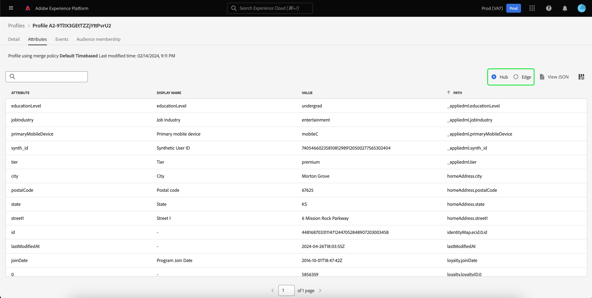

For more information on edge profiles, please read the [edge profiles documentation](../edge-profiles.md).

### Events tab {#events}

The **[!UICONTROL Events]** tab contains data from the 100 most recent ExperienceEvents associated with the customer. This data could include email opens, cart activities, and page views. Selecting **[!UICONTROL View all]** for any individual event provides additional fields and values captures as part of the event.

Events can also be viewed as a JSON object by selecting to **[!UICONTROL View JSON]**. This is helpful for understanding how events are captured in Experience Platform.

### Audience membership tab {#audience-membership}

The **[!UICONTROL Audience membership]** tab displays a list with the name and description of audiences to which the individual customer profile currently belongs. This list is updated automatically as the profile qualifies or expires from audiences. The total count of audiences for which the profile is currently qualified is shown on the right-hand side of the tab.

For more information about segmentation in Experience Platform, please refer to the [Adobes Experience Platform Segmentation Service documentation](../../segmentation/home.md).

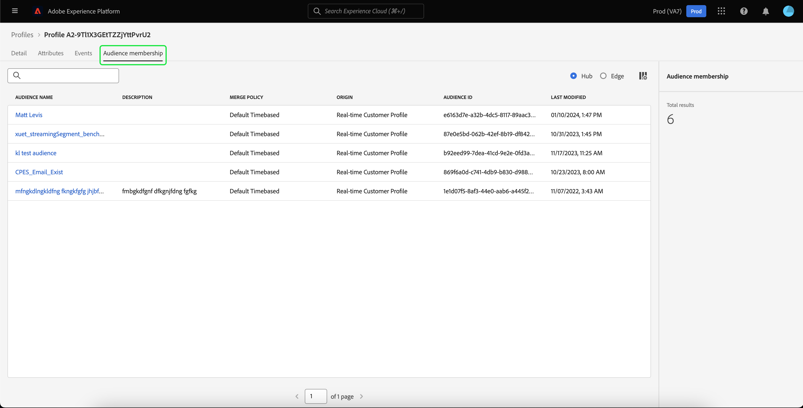

To view the audience membership of the profiles that are available on the Edge, select **[!UICONTROL Edge]** in the data location selector. More information about edge segmentation can be found in the [edge segmentation guide](../../segmentation/methods/edge-segmentation.md).

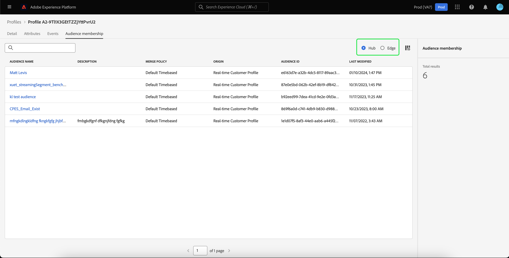

## Merge policies

From the main **[!UICONTROL Profiles]** menu, select the **[!UICONTROL Merge Policies]** tab to view a list of merge policies belonging to your organization. Each listed policy displays its name, whether or not it is the default merge policy, and the schema class that it applies to. 

For more information on merge policies, see the [merge policies overview](../merge-policies/overview.md).

## Union schema {#union-schema}

From the main **[!UICONTROL Profiles]** menu, select the **[!UICONTROL Union Schema]** tab to view available union schemas for your ingested data. A union schema is an amalgamation of all [!DNL Experience Data Model] (XDM) fields under the same class, whose schemas have been enabled for use in [!DNL Real-Time Customer Profile]. 

For more information on union schemas, please visit the [union schema UI guide](union-schema.md).

## Computed attributes {#computed-attributes}

From the main **[!UICONTROL Profiles]** menu, select the **[!UICONTROL Computed attributes]** tab to view a list of computed attributes that belong to your organization.

For more information on computed attributes, please read the [computed attributes overview](../computed-attributes/overview.md). For more information on how to use computed attributes within the Experience Platform UI, please read the [computed attributes UI guide](../computed-attributes/ui.md).

## Next steps

By reading this guide, you know how to view and manage your organization's profile data using the Experience Platform UI. For information on how to work with profile data using Experience Platform APIs, please refer to the [Real-Time Customer Profile API guide](../api/overview.md).
