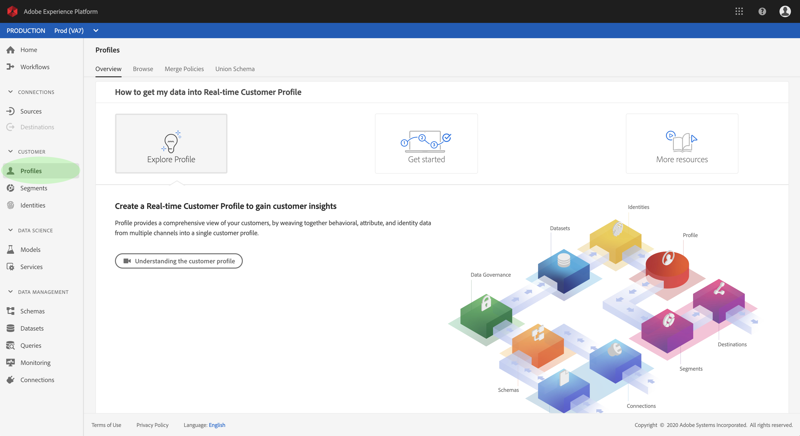
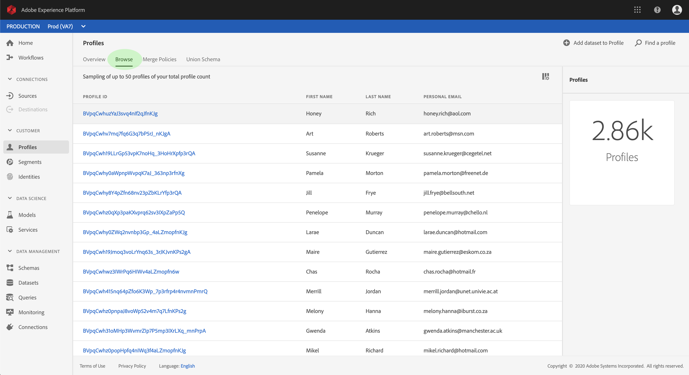
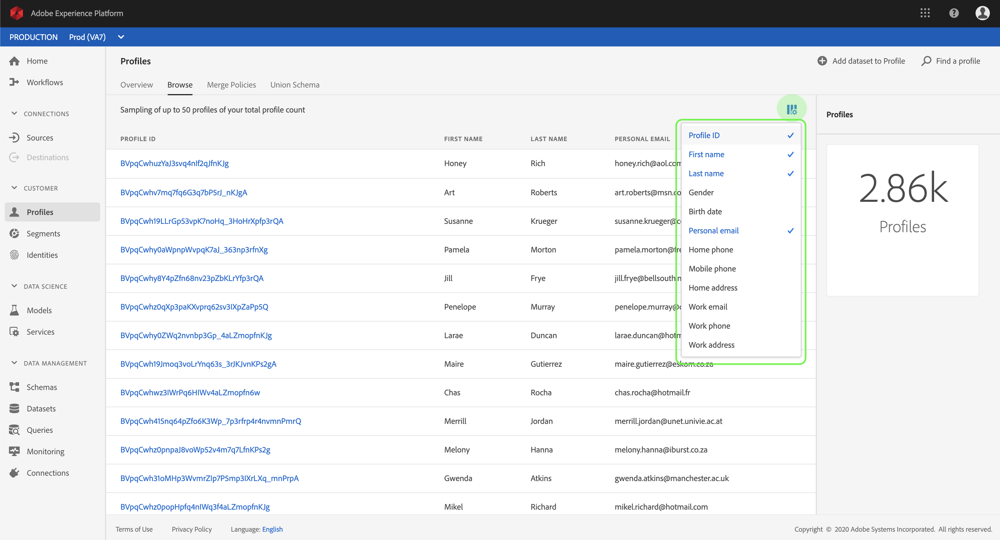
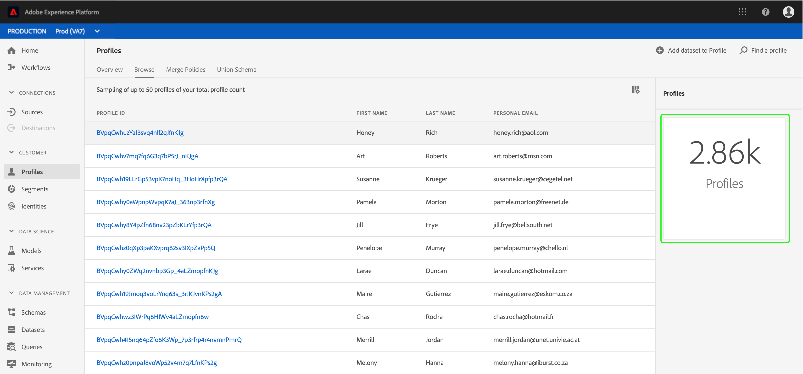
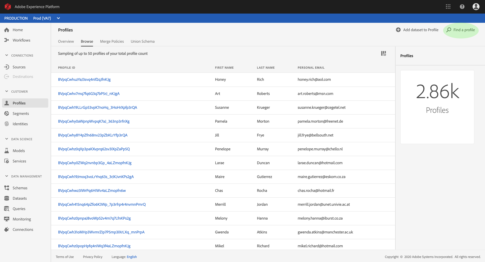
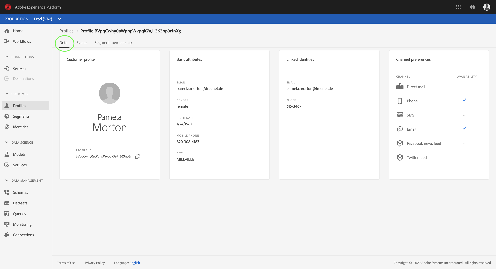
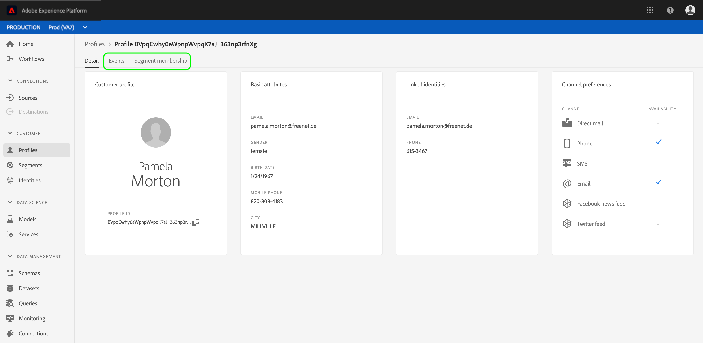
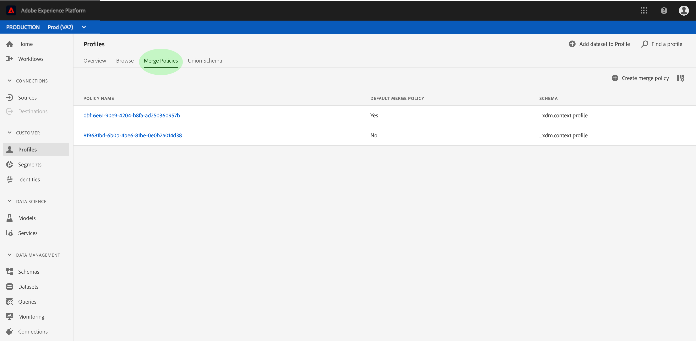
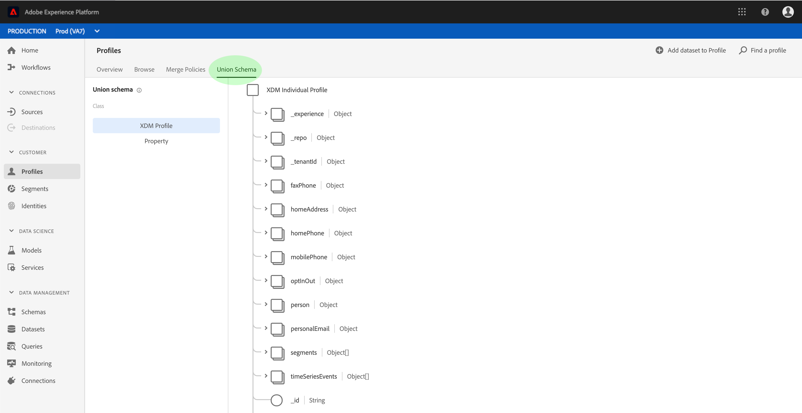

# Real-time Customer Profile user guide

Real-time Customer Profile creates a holistic view of each of your individual customers, combining data from multiple channels including online, offline, CRM, and third-party data.

This document serves as a guide for interacting with Real-time Customer Profile in the Adobe Experience Platform user interface.

## Getting started

This user guide requires an understanding of the various Experience Platform services involved with managing Real-time Customer Profile. Before reading this user guide, please review the documentation for the following services:

* [Real-time Customer Profile](../home.md): Provides a unified, real-time consumer profile based on aggregated data from multiple sources.
* [Identity Service](../../identity-service/home.md): Enables Real-time Customer Profile by bridging identities from disparate data sources being ingested into Platform.
* [Experience Data Model (XDM)](../../xdm/home.md): The standardized framework by which Platform organizes customer experience data.

## Profile overview

In the [Experience Platform UI](http://platform.adobe.com), click **Profiles** in the left navigation to open the _Overview_ tab in the _Profiles_ workspace. This tab displays several widgets that provide high-level information about the Profile store, including the total addressable audience, the number of Profile records that were ingested within the last week, as well as statistics regarding successful and failed records for the same time period.

## View profile samples

Click **Browse** to view a sample list of available profiles. This sample includes up to 50 profiles from your total [profile count](#profile-count). The samples are refreshed by an automatic job that picks up new profile data as it is ingested. Each listed profile displays its ID, first name, last name, and personal email. Clicking the ID of a listed profile displays its details within the [Profile Viewer](#profile-viewer).

You can customize the attributes that are displayed in the list by clicking the column selector icon. This displays a dropdown list containing common profile attributes which you can add or remove.

### Profile count {#profile-count}

The profile count displays the total number of profiles your organization has within Experience Platform, after your organization's default merge policy has merged together profile fragments to form a single profile for each individual customer. In other words, your organization may have multiple profile fragments related to a single customer who interacts with your brand across different channels, but these fragments would be merged together (according to the default merge policy) and would return a count of "1" profile because they are all related to the same individual.

The profile count also includes both profiles with attributes (record data) as well as profiles (such as Adobe Analytics profiles) containing only time series (event) data. The count is refreshed regularly to provide an up-to-date total number of profiles within Platform. Any time an ingestion of profiles increases or decreases the count by more than 5%, a job is automatically triggered to update the count. If your organization is using streaming ingestion, jobs are scheduled to run every hour to pick up newly ingested data.

### Profile search

If you know a linked identity for a particular profile (such as its email address), you can look up that profile by clicking **Find a profile**. This is the most reliable way to access a specific profile, regardless of whether it appears in the list of samples.

In the dialog that appears, select an appropriate ID namespace from the dropdown list ("Email" in this example) and enter the ID value below before clicking **OK**. If found, the details of the targeted profile appear in the profile viewer, as described in the next section.

### Profile viewer {#profile-viewer}

Upon selecting or searching for a specific profile, the _Detail_ screen of the profile viewer opens. This page displays information about the selected profile, such as the profile's basic attributes, linked identities, and available contact channels. The profile information displayed has been merged together from multiple profile fragments to form a single view of the individual customer.

The profile viewer also provides tabs that allow you to view events and segment memberships associated with this profile, if any exist.

## Merge policies

Click **Merge Policies** to view a list of merge policies belonging to your organization. Each listed policy displays its name, whether or not it is the default merge policy, and the schema that it applies to.

For more information on working with merge policies in the UI, see the [mMerge Policies user guide](merge-policies.md).

## Union schema

Click **Union Schema** to view the union schemas for your profile data store. A union schema is an amalgamation of all Experience Data Model (XDM) fields under the same class, whose schemas have been enabled for use in Real-time Customer Profile. Click a class in the left-hand list to view the structure of its union schema in the canvas.

See the section on union schemas in the [schema composition guide](../../xdm/schema/composition.md) for more information on union schemas and their role in Real-time Customer Profile.

## Next steps

By reading this guide, you now know how to view and manage your Profile data using the Experience Platform UI. For information on how to leverage Real-time Customer Profile data to generate audience segments, see the [Segmentation documentation](../../segmentation/home.md).