# [!DNL Real-Time Customer Profile] UI guide

[!DNL Real-Time Customer Profile] creates a holistic view of each of your individual customers, combining data from multiple channels including online, offline, CRM, and third-party data. This document serves as a guide for interacting with [!DNL Real-Time Customer Profile] data in the Adobe Experience Platform user interface (UI).

## Getting started

This UI guide requires an understanding of the various [!DNL Experience Platform] services involved with managing [!DNL Real-Time Customer Profiles]. Before reading this guide, or working in the UI, please review the documentation for the following services:

* [[!DNL Real-Time Customer Profile] overview](../home.md): Provides a unified, real-time consumer profile based on aggregated data from multiple sources.
* [[!DNL Identity Service]](../../identity-service/home.md): Enables [!DNL Real-Time Customer Profile] by bridging identities from disparate data sources as they are ingested into [!DNL Platform].
* [[!DNL Experience Data Model (XDM)]](../../xdm/home.md): The standardized framework by which [!DNL Platform] organizes customer experience data.

## [!UICONTROL Overview]

In the Experience Platform UI, select **[!UICONTROL Profiles]** in the left navigation to open the **[!UICONTROL Overview]** tab displaying the profile dashboard. 

>[!NOTE]
>
>If your organization is new to Platform and does not yet have active Profile datasets or merge policies created, the [!UICONTROL Profiles] dashboard is not visible. Instead, the [!UICONTROL Overview] tab displays links and documentation to help you get started with Real-Time Customer Profile.

### Profile dashboard {#profile-dashboard}

The profile dashboard outlines key metrics related to your organization's profile data. 

To learn more, visit the [profile dashboard guide](../../dashboards/guides/profiles.md).

## [!UICONTROL Browse] tab metrics

Select the **[!UICONTROL Browse]** tab to display several metrics related to your organization's profile data. You can also use this tab to browse the profile store using a merge policy or an identity, as outlined in the next section of this guide.

On the right-hand side of the **[!UICONTROL Browse]** tab is the [profile count](#profile-count) as well as a listing of [profiles by namespace](#profiles-by-namespace). 

>[!NOTE]
>
>These profile metrics may vary from the metrics displayed on the [profile dashboard](#profile-dashboard) because they are evaluated using the default merge policy of your organization. For more information on working with merge policies, including how to define a default merge policy, see the [merge policies overview](../merge-policies/overview.md).

In addition to these metrics, this section provides a last updated date and time, showing when the metrics were last evaluated.

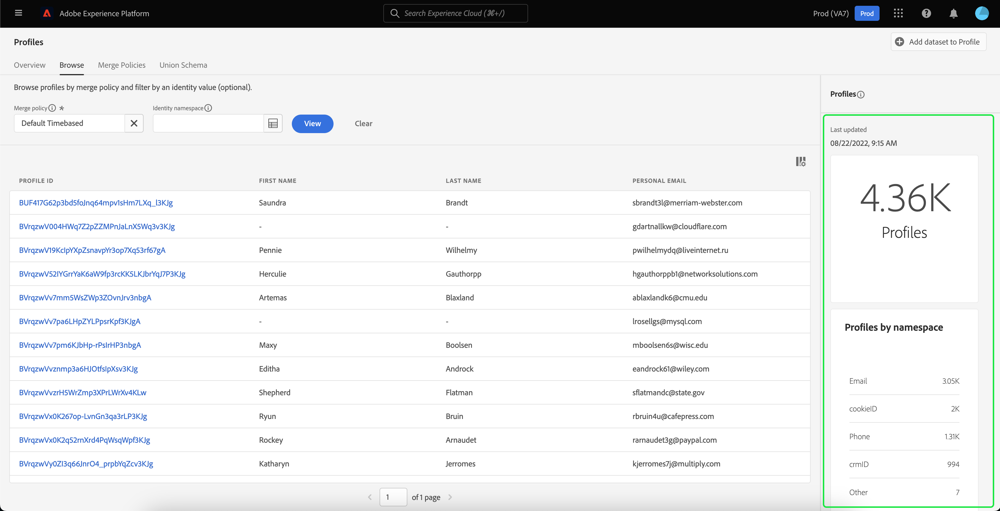

### Profile count {#profile-count}

The profile count displays the total number of profiles your organization has within Experience Platform, after your organization's default merge policy has merged together profile fragments to form a single profile for each individual customer. In other words, your organization may have multiple profile fragments related to a single customer who interacts with your brand across different channels, but these fragments would be merged together (according to the default merge policy) and would return a count of "1" profile because they are all related to the same individual.

The profile count also includes both profiles with attributes (record data) as well as profiles containing only time series (event) data, such as Adobe Analytics profiles. The profile count is refreshed regularly to provide an up-to-date total number of profiles within Platform. 

#### Updating the profile count metric

When the ingestion of records into the [!DNL Profile] store increases or decreases the count by more than 5%, a job is triggered to update the count. For streaming data workflows, a check is done on an hourly basis to determine if the 5% increase or decrease threshold has been met. If it has, a job is automatically triggered to update the profile count. For batch ingestion, within 15 minutes of successfully ingesting a batch into the Profile store, if the 5% increase or decrease threshold is met, a job is run to update the profile count.

### [!UICONTROL Profiles by namespace] {#profiles-by-namespace}

The **[!UICONTROL Profiles by namespace]** metric displays the total count and breakdown of namespaces across all of the merged profiles in your Profile Store. The total number of profiles by namespace (in other words, adding together the values shown for each namespace) will always be higher than the profile count metric because one profile could have multiple namespaces associated with it. For example, if a customer interacts with your brand on more than one channel, multiple namespaces will be associated with that individual customer.

#### Updating the [!UICONTROL Profiles by namespace] metric

Similar to the [profile count](#profile-count) metric, when the ingestion of records into the [!DNL Profile] store increases or decreases the count by more than 5%, a job is triggered to update the namespace metrics. For streaming data workflows, a check is done on an hourly basis to determine if the 5% increase or decrease threshold has been met. If it has, a job is automatically triggered to update the profile count. For batch ingestion, within 15 minutes of successfully ingesting a batch into the [!DNL Profile] store, if the 5% increase or decrease threshold is met, a job is run to update the metrics.

## Use [!UICONTROL Browse] tab to view profiles

On the **[!UICONTROL Browse]** tab you can view sample profiles using a merge policy or look up specific profiles using an identity namespace and value.

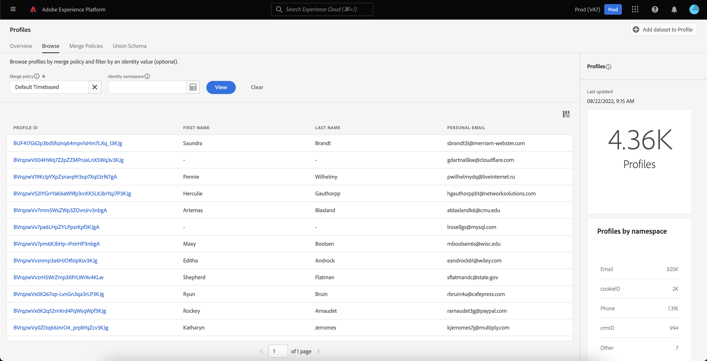

### Browse by [!UICONTROL Merge policy]

The **[!UICONTROL Browse]** tab is set to the default merge policy for your organization by default. To choose a different merge policy, select the `X` beside the merge policy name and then use the selector to open the **[!UICONTROL Select merge policy]** dialog. 

>[!NOTE]
>
>If there is no merge policy selected, use the selector button next to the **[!UICONTROL Merge policy]** field to open the selection dialog.

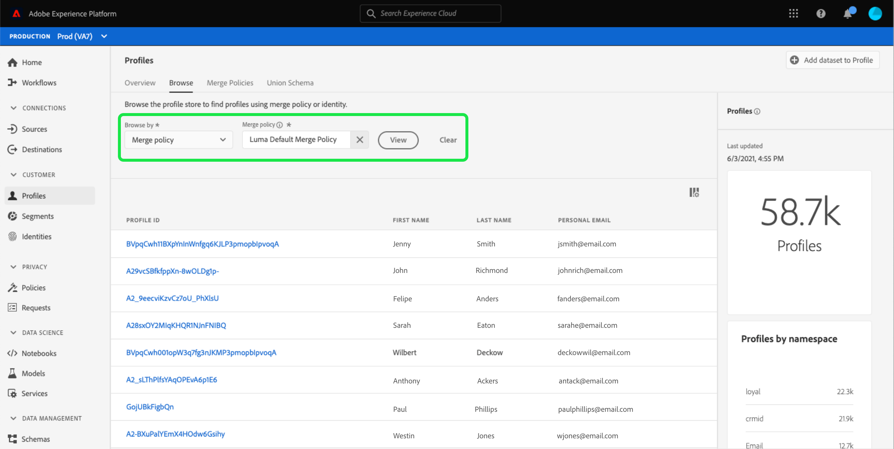

To choose a merge policy from the **[!UICONTROL Select merge policy]** dialog, select the radio button beside the policy name and then use **[!UICONTROL Select]** to return to the [!UICONTROL Browse] tab. You can then select **[!UICONTROL View]** to refresh the sample profiles and see a sampling of profiles with the new merge policy applied.

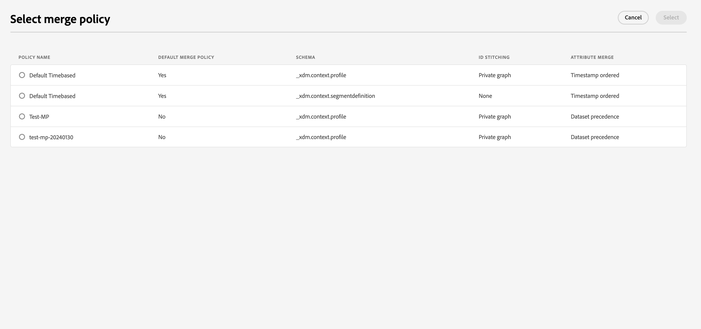

The profiles that are shown represent a sample of up to 20 profiles from your organization's profile store, after the selected merge policy has been applied. The sample profiles for the selected merge policy are refreshed when new data is added to your organization's profile store.

To view the details of one of the sample profiles, select the **[!UICONTROL Profile ID]**. For more information, see the section later in this guide on [viewing profile details](#profile-detail).

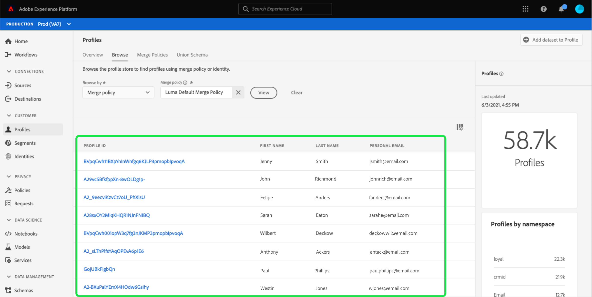

To learn more about merge policies and their role within Platform, see the [merge policies overview](../merge-policies/overview.md).

### Browse by [!UICONTROL Identity] {#browse-identity}

On the **[!UICONTROL Browse]** tab, you can use an identity namespace in order to look up a specific profile by an identity value. Browsing by an identity requires you to provide a merge policy, an identity namespace, and an identity value.

If necessary, use the **[!UICONTROL Merge policy]** selector to open the **[!UICONTROL Select merge policy]** dialog and choose the merge policy that you would like to use.

Then use the **[!UICONTROL Identity namespace]** selector to open the **[!UICONTROL Select identity namespace]** dialog and choose the namespace by which you would like to search. If your organization has many namespaces, you can use the search bar in the dialog to begin typing the name of a namespace. 

You can select a namespace to view additional details or select the radio button to choose a namespace. You can then use **[!UICONTROL Select]** to continue.

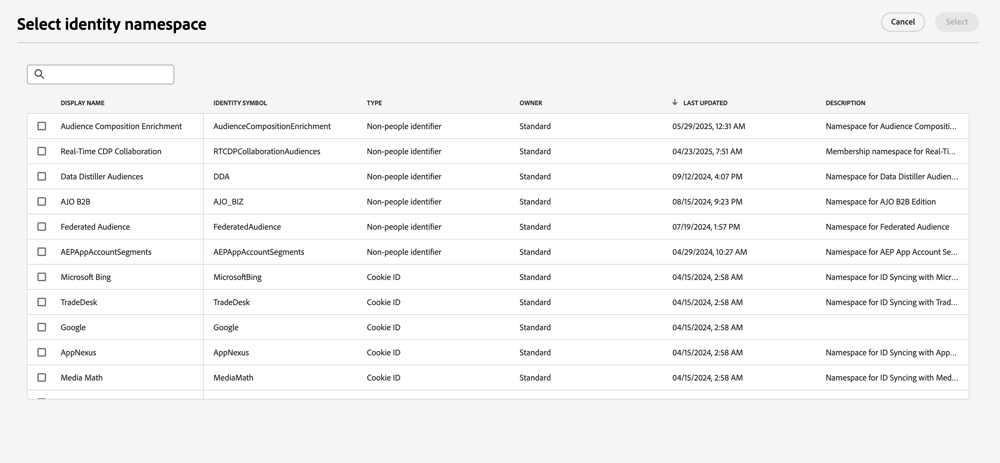

After selecting an [!UICONTROL Identity namespace] and returning to the [!UICONTROL Browse] tab, you can enter an **[!UICONTROL Identity value]** related to the namespace that you selected. 

>[!NOTE]
>
>This value is specific to an individual customer profile and must be a valid entry for the namespace provided. For example, selecting the identity namespace "Email" would require an identity value in the form of a valid email address. 

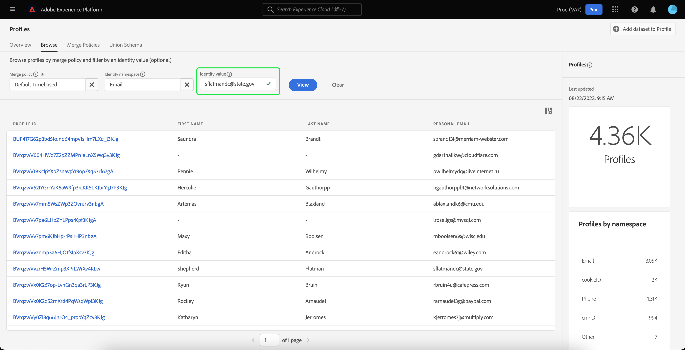

Once a value has been entered, select **[!UICONTROL View]** and a single profile matching the value is returned. Select the **[!UICONTROL Profile ID]** to view the profile details.

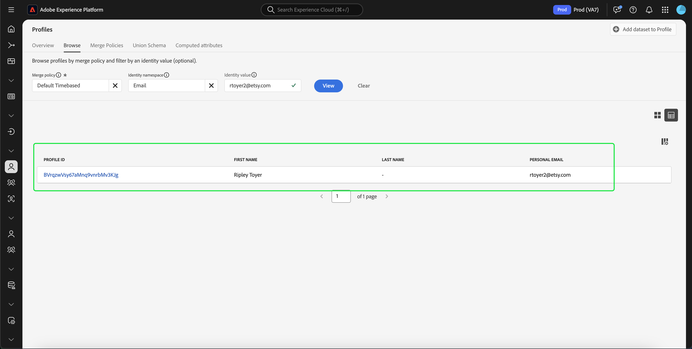

## View profile details {#profile-detail}

After selecting a **[!UICONTROL Profile ID]**, the **[!UICONTROL Detail]** tab opens. The profile information displayed on the **[!UICONTROL Detail]** tab has been merged together from multiple profile fragments to form a single view of the individual customer. This includes customer details such as basic attributes, linked identities, and channel preferences. 

The default fields shown can also be changed at an organizational-level to display preferred Profile attributes. To learn more about customizing these fields, including step-by-step instructions for adding and removing attributes and resizing dashboard panels, please read the [profile detail customization guide](profile-customization.md).

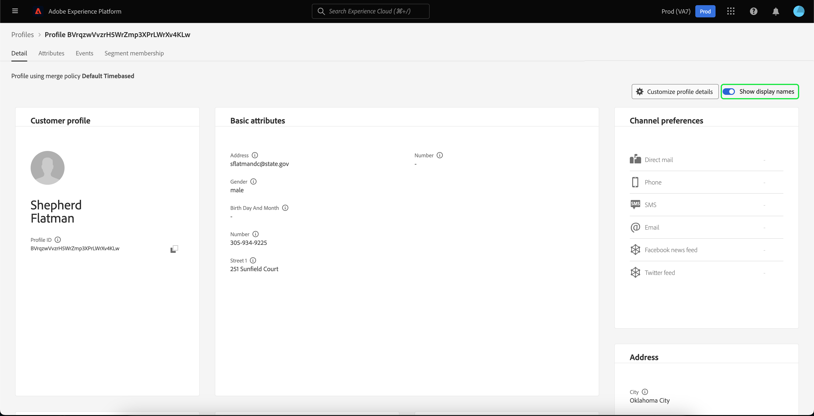

You can view additional information related to the individual customer profile by selecting another of the available tabs. These tabs include attributes, events, and the segment membership tab that shows the segments for which the profile is currently qualified.

### Attributes tab

The **[!UICONTROL Attributes]** tab provides a list view summarizing all of the attributes related to a single profile, after the specified merge policy has been applied.

These attributes can also be viewed as a JSON object by selecting to **[!UICONTROL View JSON]**. This is helpful for any users wishing to better understand how the profile attributes are ingested into Platform.

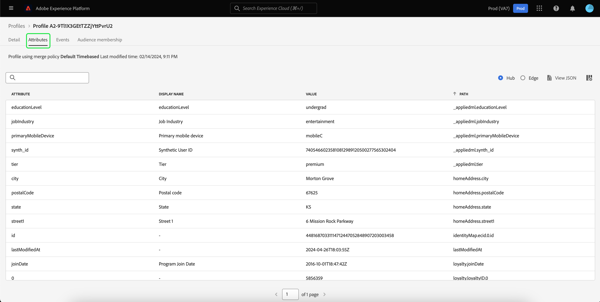

### Events tab

The **[!UICONTROL Events]** tab contains data from the 100 most recent ExperienceEvents associated with the customer. This data could include email opens, cart activities, and page views. Selecting **[!UICONTROL View all]** for any individual event provides additional fields and values captures as part of the event.

Events can also be viewed as a JSON object by selecting to **[!UICONTROL View JSON]**. This is helpful for understanding how events are captured in Platform.

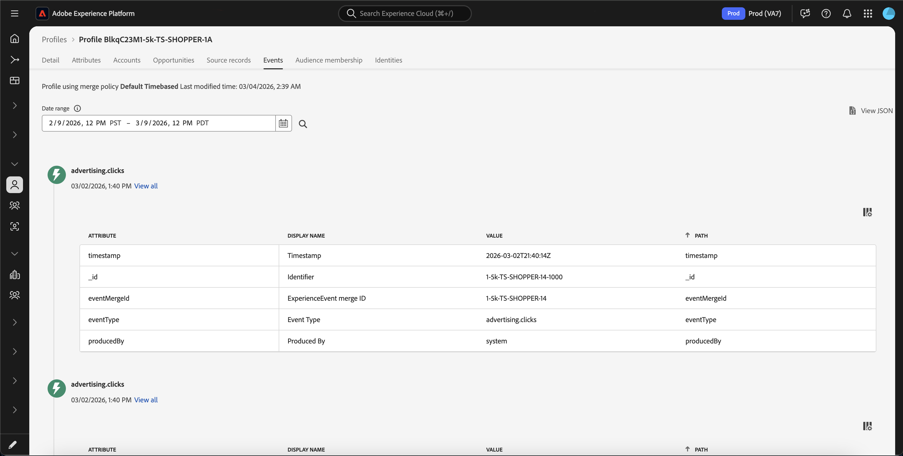

### Segment membership tab

The **[!UICONTROL Segment membership]** tab displays a list with the name and description of segments to which the individual customer profile currently belongs. This list is updated automatically as the profile qualifies or expires from segments. The total count of segments for which the profile is currently qualified is shown on the right-hand side of the tab.

For more information about segmentation in Experience Platform, please refer to the [Adobes Experience Platform Segmentation Service documentation](../../segmentation/home.md).

## Merge policies

From the main **[!UICONTROL Profiles]** menu, select the **[!UICONTROL Merge Policies]** tab to view a list of merge policies belonging to your organization. Each listed policy displays its name, whether or not it is the default merge policy, and the schema class that it applies to. 

For more information on merge policies, see the [merge policies overview](../merge-policies/overview.md).

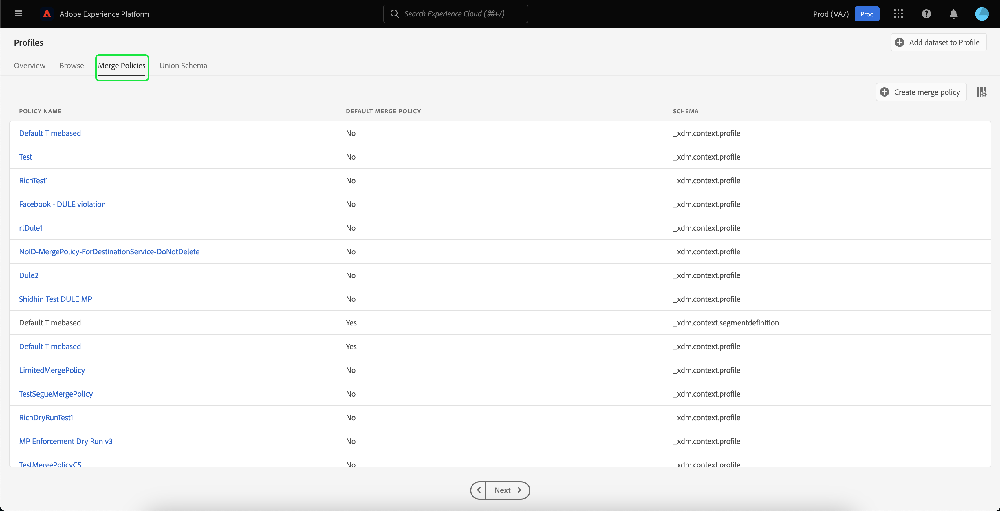

## Union schema {#union-schema}

From the main **[!UICONTROL Profiles]** menu, select the **[!UICONTROL Union Schema]** tab to view available union schemas for your ingested data. A union schema is an amalgamation of all [!DNL Experience Data Model] (XDM) fields under the same class, whose schemas have been enabled for use in [!DNL Real-Time Customer Profile]. 

For more information on union schemas, please visit the [union schema UI guide](union-schema.md).

## Computed attributes {#computed-attributes}

From the main **[!UICONTROL Profiles]** menu, select the **[!UICONTROL Computed attributes]** tab to view a list of computed attributes that belong to your organization.

For more information on computed attributes, please read the [computed attributes overview](../computed-attributes/overview.md). For more information on how to use computed attributes within the Platform UI, please read the [computed attributes UI guide](../computed-attributes/ui.md).

IMAGE

## Next steps

By reading this guide, you know how to view and manage your organization's profile data using the Experience Platform UI. For information on how to work with profile data using Experience Platform APIs, please refer to the [Real-Time Customer Profile API guide](../api/overview.md).
