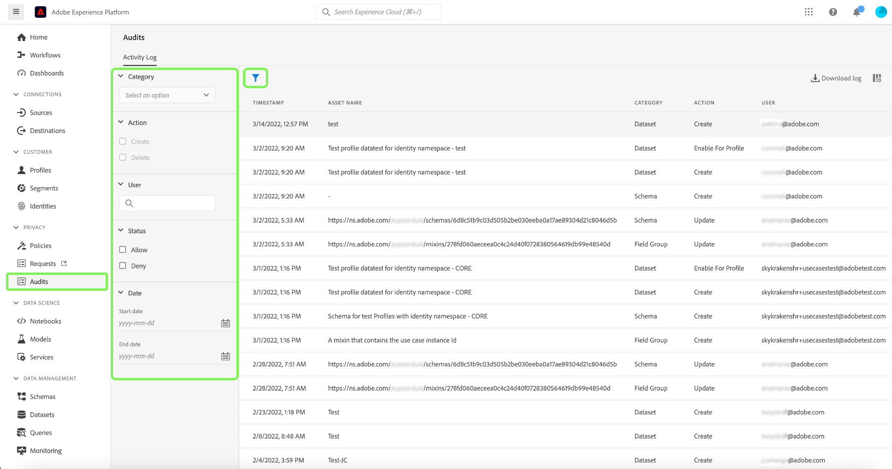
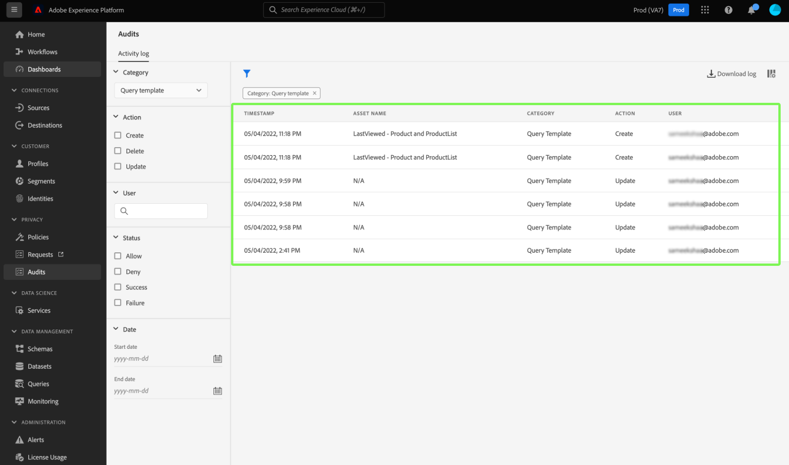
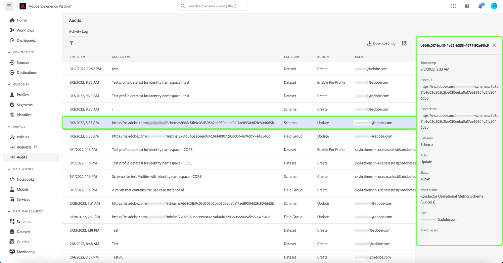

# [!DNL Query Service] audit log integration

The Adobe Experience Platform [!DNL Query Service] audit log integration provides records of query related user actions. Audit logs are an essential tool for troubleshooting and adhering to corporate data stewardship policies and regulatory requirements. The capability allows you to return an action log for many event types and filter and export the records. The logs can be accessed either through the Platform UI or the [Audit Query API](https://www.adobe.io/experience-platform-apis/references/audit-query/) and downloaded in either CSV or JSON file formats.

See the documentation to [learn more about the audit logs user interface](../landing/governance-privacy-security/audit-logs/overview.md) or [making calls to Platform APIs](../landing/api-guide.md). 

## Prerequisites

You must have the [!UICONTROL Data Governance] [!UICONTROL View User Activity Log] permission enabled to view the audit log dashboard within the Platform UI. The permission is enabled through Adobe [Admin Console](https://adminconsole.adobe.com/). Please contact your organization's administrator if you do not have administrator privileges to enable this permission. See the access control documentation for [full instructions on adding permissions through Admin Console](../access-control/home.md). 

## [!DNL Query Service] audit log categories {#audit-log-categories}

The audit log categories provided by [!DNL Query Service] are as follows.

| Category | Description |
|---|---|
| [!UICONTROL Scheduled query] | This category allows you to audit the schedules that have been created within [!DNL Query Service]. |
| [!UICONTROL Query template] | This category allows you audit the various actions taken on an query template. |

## Perform a [!DNL Query Service] audit log {#perform-an-audit-log}

To perform an audit for [!DNL Query Service] activity, select **[!UICONTROL Audits]** form the Platform UI left navigation rail, followed by the funnel icon () to display a list of filter controls to help narrow results.

From the [!UICONTROL Audits] dashboard [!UICONTROL Activity log] tab, you can filter all the recorded Platform actions by any of the [!DNL Query Service] categories. The log results can be further filtered based on the time period they were executed, the action/function taken, or user that enacted the query. See the audit log documentation for [full instructions on how to filter the logs based on category, action, user, and status](../landing/governance-privacy-security/audit-logs/overview.md#managing-audit-logs-in-the-ui).

<!-- The log results can be further filtered based on the time period they were executed, the action/function taken, and the status, or user that enacted the query. 'and the status a was omitted '-->

The returned audit log data contains the following information on all queries that meet your chosen filter criteria.

| Column name  | Description |
|---|---|
| [!UICONTROL Timestamp] | The exact date and time of the query in a `month/day/year hour:minute AM/PM` format.  |
| [!UICONTROL Asset Name] | The value for the [!UICONTROL Asset Name] field depends on the category chosen as a filter. When using the [!UICONTROL Scheduled query] category this is the **schedule name**. When using the [!UICONTROL Query template] category, this is the **template name**.  |
| [!UICONTROL Category] | This field matches the category selected by you in the filter dropdown.  |
| [!UICONTROL Action] |  This can be either create, delete, update, or execute. The available actions depend on the category chosen as a filter. |
| [!UICONTROL User] | This field provides the user ID that executed the query. | 

>[!NOTE]
>
>More query details are provided by downloading the log results in either CSV or JSON file formats, than are displayed by default in the audit log dashboard.

Select any row of audit log results to open a details panel to the right of the screen.

>[!NOTE]
>
>The details panel can be used to find the [!UICONTROL Asset ID]. The value of the [!UICONTROL Asset ID] changes depending on the category used in the audit. When using the [!UICONTROL Query template] category, the [!UICONTROL Asset ID] is the **template ID**. When using the [!UICONTROL Scheduled query] category, the [!UICONTROL Asset ID] is the  **schedule ID**.

## Available filters for [!DNL Query Service] audit log categories {#available-filters}

The following table details the filters available for [!DNL Query Service] audit log categories.

| Filter  | Description |
|---|---|
| Category | See the [[!DNL Query Service] audit log categories](#audit-log-categories) section for a complete list of available categories. |
| Action | When referring to query logs, update is both `UPDATE` and `INSERT`, delete is `DROP TABLE`, create is `CTAS`, and execute is running a query. The execute action is not available as a filter for the [!UICONTROL Query template] category. |
| User | Enter the complete user ID (for example, johndoe@acme.com) to filter by user. |
| Date  | Select a start date and/or an end date to define a date range to filter results by. |
<!-- | Status | Available options are Allow, Deny, Success, and Failure. These are not necessary to filter query logs. | -->

## Next steps

By reading this document you have a better understanding of the [!DNL Query Service] audit log capability and how it can be used to filter your [!DNL Query Service] user actions.

If you are using the [!DNL Query Service] audit log capability for troubleshooting purposes, you are recommended to read the [troubleshooting guide](./troubleshooting-guide.md).  
