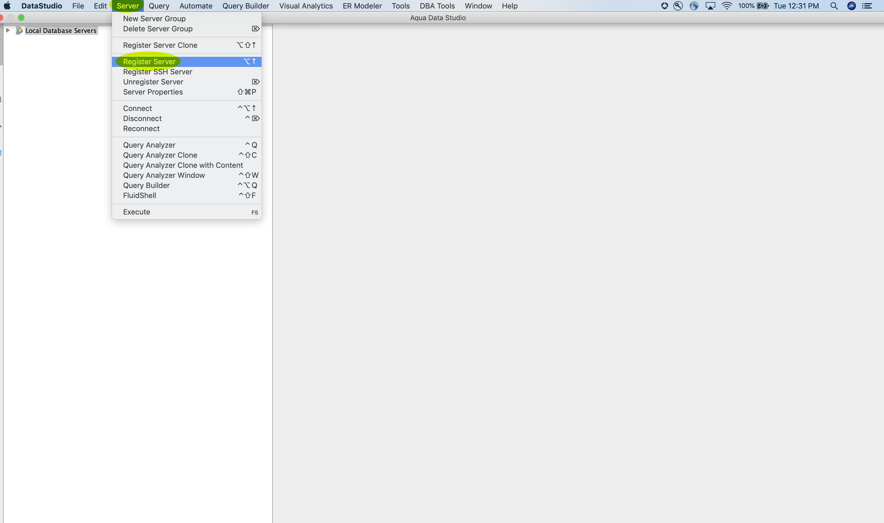

# Connect [!DNL Aqua Data Studio] to Query Service

This document covers the steps for connecting [!DNL Aqua Data Studio] with Adobe Experience Platform [!DNL Query Service].

## Getting started

This guide requires you to already have access to [!DNL Aqua Data Studio] and be familiar with how to navigate its interface. More information about [!DNL Aqua Data Studio] can be found in the [official [!DNL Aqua Data Studio] documentation](https://www.aquaclusters.com/app/home/project/public/aquadatastudio/wikibook/Documentation21.1/page/0/Aqua-Data-Studio-21-1).

>[!NOTE]
>
>There are [!DNL Windows] and [!DNL macOS] versions of [!DNL Aqua Data Studio]. Screenshots in this guide were taken using the [!DNL macOS] desktop app. There may be minor discrepancies in the UI between the versions.

To acquire the necessary credentials for connecting [!DNL Aqua Data Studio] to Experience Platform, you must have access to the [!UICONTROL Queries] workspace in the Platform UI. Please contact your IMS Organization administrator if you do not currently have access to the [!UICONTROL Queries] workspace. 

## Register the server {#register-server}

After installing [!DNL Aqua Data Studio], you must first register the server. From the main menu, select **[!DNL Server]**, followed by **[!DNL Register Server]**.

The **[!DNL Register Server]** dialog appears. Under the **[!DNL General]** tab, select **[!DNL PostgreSQL]** from the list on the left-hand side. In the dialog that appears, provide the following details for the server settings.

- **[!DNL Name]**: The name of your connection. You are recommended to provide a friendly name to recognize the connection.
- **[!DNL Login Name]**: The login name is your Platform Organization ID. It takes the form of `ORG_ID@AdobeOrg`.
- **[!DNL Password]**: This is an alphanumeric string found on the [!DNL Query Service] credentials dashboard.
- **[!DNL Host and Port]**: The host endpoint and its port for [!DNL Query Service]. You must use port 80 to connect with [!DNL Query Service].
- **[!DNL Database]:** The database that will be used. Use the value for the Platform UI credential `dbname`: `prod:all`.

![The [!DNL Aqua Data Studio] General tab with the required input fields highlighted.](../images/clients/aqua-data-studio/register-server-general-tab.png)

### [!DNL Query Service] credentials

To find your credentials, log in to the [!DNL Platform] UI and select **[!UICONTROL Queries]** from the left navigation, followed by **[!UICONTROL Credentials]**. For complete directions to find your login credentials, host, port, and database name, please read the [credentials guide](../ui/credentials.md).

[!DNL Query Service] also offers non-expiring credentials to allow for a one-time setup with third-party clients. See the documentation for [full instructions on how to generate and use non-expiring credentials](../ui/credentials.md#non-expiring-credentials).

### Setting SSL mode

Next, select the **[!DNL Driver]** tab. Under **[!DNL Parameters]**, set the value as `?sslmode=require`

>[!IMPORTANT]
>
>See the [[!DNL Query Service] SSL documentation](./ssl-modes.md) to learn about SSL support for third-party connections to Adobe Experience Platform Query Service, and how to connect using `verify-full` SSL mode.

![The [!DNL Aqua Data Studio] Driver tab with the Parameters field highlighted.](../images/clients/aqua-data-studio/register-server-driver-tab.png)

After inputting your connection details, select **[!DNL Test Connection]** to ensure your credentials work properly. If your connection test is successful, select **[!DNL Save]** to register your server. A confirmation dialog appears confirming connection and the connection appears on the dashboard. You can now connect to the server and view its schema objects.

## Next steps

Now that you have connected to [!DNL Query Service], you can use the **[!DNL Query Analyzer]** within [!DNL Aqua Data Studio] to execute and edit SQL statements. For more information on how to write and run queries, please read the [running queries guide](../best-practices/writing-queries.md).
