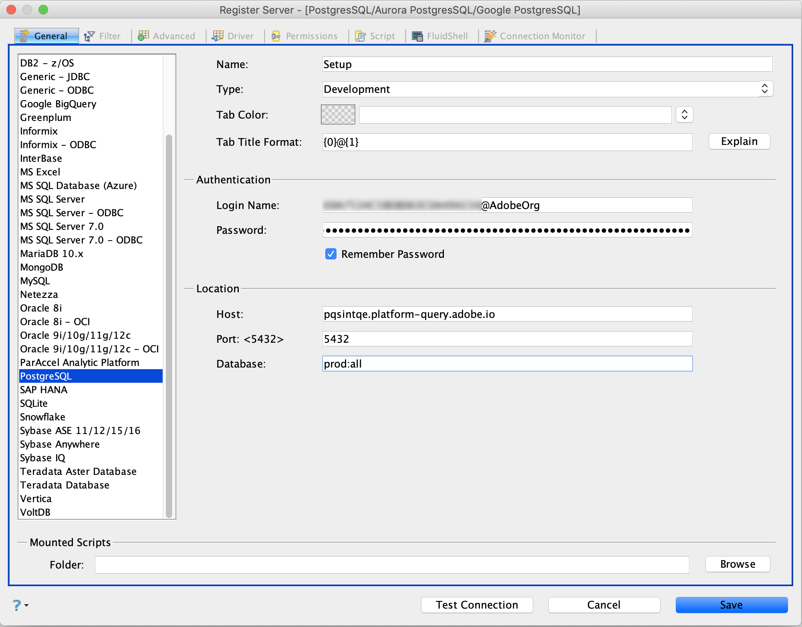

# Connect [!DNL Aqua Data Studio] to Query Service

This document covers the steps for connecting [!DNL Aqua Data Studio] with Adobe Experience Platform [!DNL Query Service].

>[!NOTE]
>
> This guide assumes you already have access to [!DNL Aqua Data Studio] and are familiar with how to navigate its interface. More information about [!DNL Aqua Data Studio] can be found in the [official [!DNL Aqua Data Studio] documentation](https://www.aquaclusters.com/app/home/project/public/aquadatastudio/wikibook/Documentation21.1/page/0/Aqua-Data-Studio-21-1).

After installing [!DNL Aqua Data Studio], you must first register the server. From the main menu, select **[!DNL Server]**, followed by **[!DNL Register Server]**.

The **[!DNL Register Server]** dialog appears. Under the **[!DNL General]** tab, select **[!DNL PostgreSQL]** from the list on the left-hand side. In the dialog that appears, provide the following details for the server settings.

- **[!DNL Name]**: The name of your connection.
- **[!DNL Login Name and Password]**: The login credentials that will be used. The username takes the form of `ORG_ID@AdobeOrg`.
- **[!DNL Host and Port]**: The host endpoint and its port for [!DNL Query Service]. You must use port 80 to connect with [!DNL Query Service].
- **[!DNL Database]:** The database that will be used.

>[!NOTE]
>
>For more information on finding your login credentials, host, port, and database name, visit the [credentials page on Platform](https://platform.adobe.com/query/configuration). To find your credentials, log in to [!DNL Platform], then select **[!UICONTROL Queries]**, followed by **[!UICONTROL Credentials]**.

Select the **[!DNL Driver]** tab. Under **[!DNL Parameters]**, set the value as `?sslmode=require`

After inputting your connection details, select **[!DNL Test Connection]** to ensure your credentials work properly. If your connection is successful, select **[!DNL Save]** to register your server. The connection appears on the dashboard upon successful registration, confirming that you can now connect to the server and view its schema objects.

## Next steps

Now that you have connected to [!DNL Query Service], you can use the **[!DNL Query Analyzer]** within [!DNL Aqua Data Studio] to execute and edit SQL statements. For more information on how to write and run queries, please read the [running queries guide](../best-practices/writing-queries.md).
