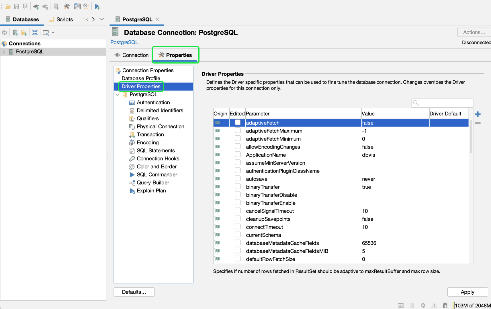
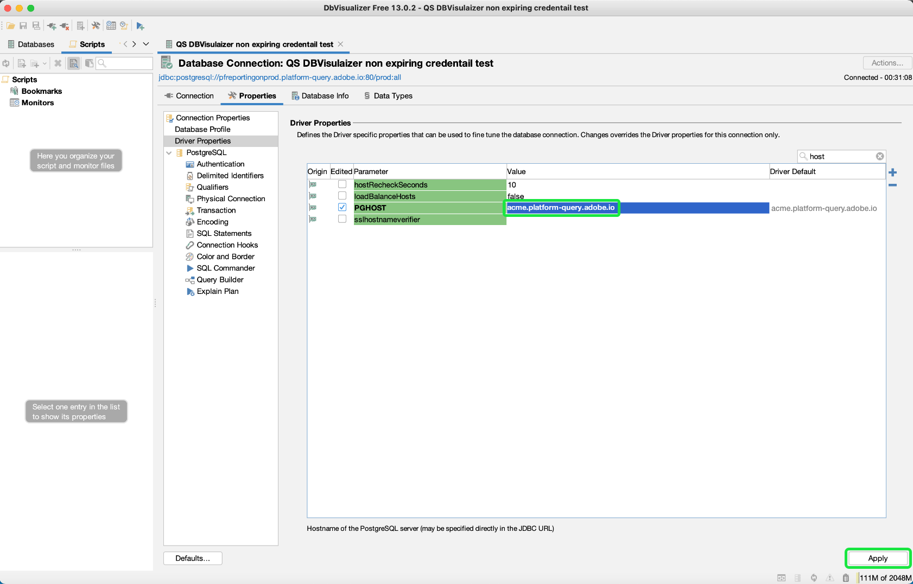

# Connect [!DNL DbVisualizer] to [!DNL Query Service] {#connect-dbvisualizer}

This document covers the steps for connecting the [!DNL DbVisualizer] database tool with Adobe Experience Platform [!DNL Query Service].

## Getting started

This guide requires that you already have access to the [!DNL DbVisualizer] desktop app and are familiar with how to navigate its interface. To download the [!DNL DbVisualizer] desktop app or for more information, see the [official [!DNL DbVisualizer] documentation](https://www.dbvis.com/download/).

>[!NOTE]
>
>There are [!DNL Windows], [!DNL macOS], and [!DNL Linux] versions of [!DNL DbVisualizer]. Screenshots in this guide were taken using the [!DNL macOS] desktop app. There may be minor discrepancies in the UI between the versions.

To acquire the necessary credentials for connecting [!DNL  DbVisualizer] to Experience Platform, you must have access to the Queries workspace in the Platform UI. Please contact your IMS Organization administrator if you do not currently have access to the Queries workspace. 

## Create a database connection {#connect-database}

Once you have installed the desktop app on your local machine, start the app and select **[!DNL Create a Database Connection]** from the initial [!DNL DbVisualizer] menu. Then select **[!DNL Create a Connection]** in the panel to the right.

![The [!DNL DbVisualizer] main menu with "Create a Database Connection" highlighted.](../images/clients/dbvisualizer/create-db-connection.png)

Use the search bar or select [!DNL PostgreSQL] from the driver name dropdown list. The Database Connection workspace appears.

![The driver name dropdown menu with [!DNL PostgreSQL] highlighted.](../images/clients/dbvisualizer/driver-name.png)

### Set properties for your connection {#properties}

From the Database Connection workspace, select the **[!DNL Properties]** tab, followed by the **[!DNL Driver Properties]** from the navigation sidebar.

Next, enter the driver properties described in the table below.

>[!IMPORTANT]
>
>To connect DBVisualizer with Adobe Experience Platform, you must enable the use of SSL. See the [SSL modes documentation](./ssl-modes.md) to learn about SSL support for third-party connections to Adobe Experience Platform Query Service, and how to connect using `verify-full` SSL mode.

| Property | Description|
| ------ | ------ |
| `PGHOST` | The host name for the [!DNL PostgreSQL] server. This value is your Experience Platform **[!UICONTROL Host] credential**. |
| `ssl` | Define the SSL value `1` to enable the use of SSL. |
| `sslmode` | This controls the level of SSL protection. You are recommended to use the `require` SSL mode when connecting third-party clients to Adobe Experience Platform. The `require` mode ensures that encryption is required on all communications and that the network is trusted to connect to the correct server. Server SSL certificate validation is not required. |
| `user` | The username connected to the database is your organization ID. It is an alphanumeric string ending in `@Adobe.Org`. This value is your Experience Platform **[!UICONTROL Username] credential**. |

Use the search bar to find each property then select the corresponding cell for the parameter's value. The cell will highlight in blue. Enter your Platform credential in the value field and select **[!DNL Apply]** to add the driver property.

>[!NOTE]
>
>To add a second `user` profile, select `user` from the parameter column then select the blue + (plus) icon to add credentials for each user. Select **[!DNL Apply]** to add the driver property.

The [!DNL Edited] column shows a checkmark to denote that the parameter value has been updated.

### Input[!DNL Query Service] credentials

To find the credentials necessary to connect BBVisualizer with Query Service, log in to the Platform UI and select **[!UICONTROL Queries]** from the left navigation, followed by **[!UICONTROL Credentials]**. For more information on finding your **host**, **port**, **database**, **username**, and **password** credentials, please read the [credentials guide](../ui/credentials.md). 

>[!IMPORTANT]
>
>[!DNL Query Service] also offers non-expiring credentials to allow for a one-time setup with third-party clients. See the documentation for [full instructions on how to generate and use non-expiring credentials](../ui/credentials.md#non-expiring-credentials). It is necessary to complete this process if you wish to connect BDVisualizer as a one-time setup. The `credential` and `technicalAccountId` values acquired comprise the value for the DBVisualizer `password` parameter.

## Authentication

To require a user ID and password-based authentication each time a connection is established, select **[!DNL Authentication]** from the navigation sidebar under [!DNL PostgreSQL].

In the Connection Authentication panel, check both the **[!DNL Require Userid]** and **[!DNL Require Password]** checkboxes then select **[!DNL Apply]**. 

![The Authentication panel for [!DNL PostgreSQL] Database Connection with the Require Userid and Password checkboxes highlighted.](../images/clients/dbvisualizer/connection-authentication.png)

## Connect to Platform

You can make a connection using expiring or non-expiring credentials. To make a connection, select the **[!DNL Connection]** tab from the Database Connection workspace and enter your Experience Platform credentials for the following settings.

>[!NOTE]
>
>All credentials required by BDVisualizer in the table below are the same for expiring and non-expiring credentials unless stated in the parameter description.

| Connection parameter  | Description |
|---|---|
|**[!UICONTROL Name]**| Create a name for your connection. You are recommended to provide a human-friendly name to recognize the connection. |
|**[!UICONTROL Database Server]**| This is your Experience Platform **[!UICONTROL Host]** credential. |
|**[!UICONTROL Database Port]**| The port for [!DNL Query Service]. You must use port **80** to connect with [!DNL Query Service].|
|**[!UICONTROL Database]**| Use your Experience Platform **[!UICONTROL Database]** credential value: `prod:all`.|
|**[!UICONTROL Database Userid]**| This is your Platform organization Id. Use your Experience Platform **[!UICONTROL Username]** credential value. The ID will be in the format of `ORG_ID@AdobeOrg`.| 
|**[!UICONTROL Database Password]**| This alphanumeric string is your Experience Platform **[!UICONTROL Password]** credential.If you want to use non-expiring credentials, this value is the concatenated arguments from the `technicalAccountID` and the `credential` downloaded in the configuration JSON file. The password value takes the form: {technicalAccountId}:{credential}. The configuration JSON file for non-expiring credentials is a one-time download during their initialization that Adobe does not keep a copy of. |

After you have input all relevant credentials, select **[!DNL Connect]**. 

![The [!DNL PostgreSQL] Database Connection workspace with the Connection tab and connect button highlighted.](../images/clients/dbvisualizer/connect.png)

The [!DNL Connect] dialog appears on the first occasion of the session. 

![The Connect: [!DNL PostgreSQL] dialog with the Database Userid and Database Password text fields highlighted.](../images/clients/dbvisualizer/connect-dialog.png)

Enter your Userid and Password and select **[!DNL Connect]**. A message appears in the log to confirm a successful connection.

## Next steps

Now that you have connected [!DNL DbVisualizer] with [!DNL Query Service], you can use [!DNL DbVisualizer] to write queries. For more information on how to write and run queries, please read the [guide on query execution](../best-practices/writing-queries.md).
