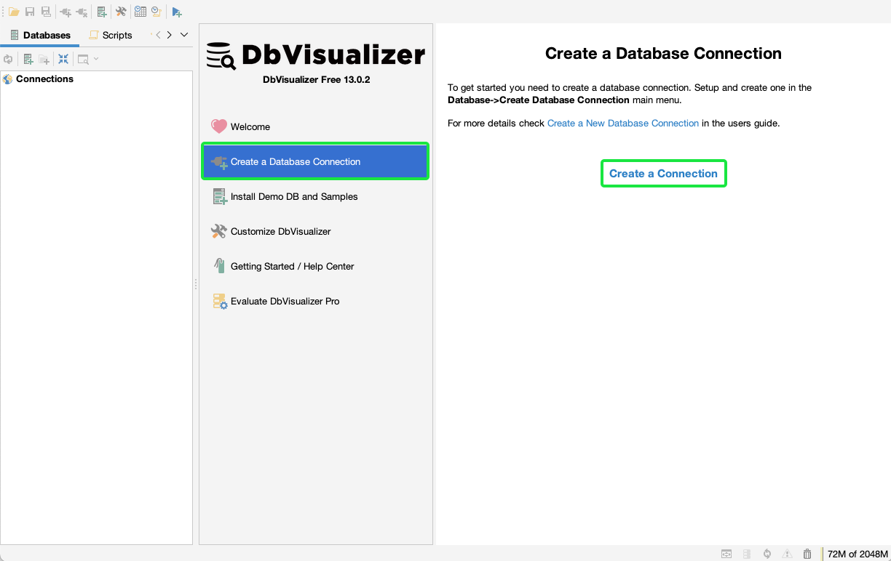
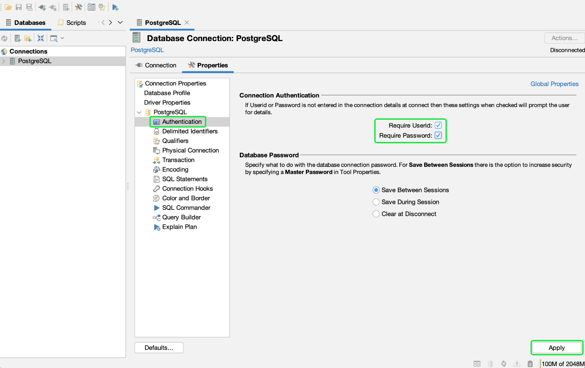
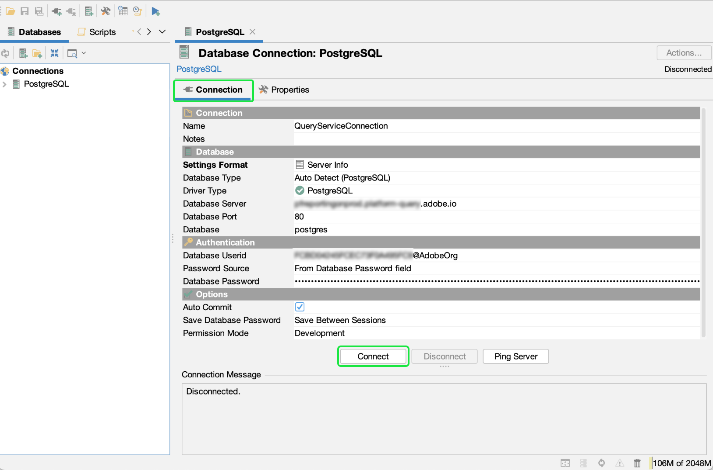
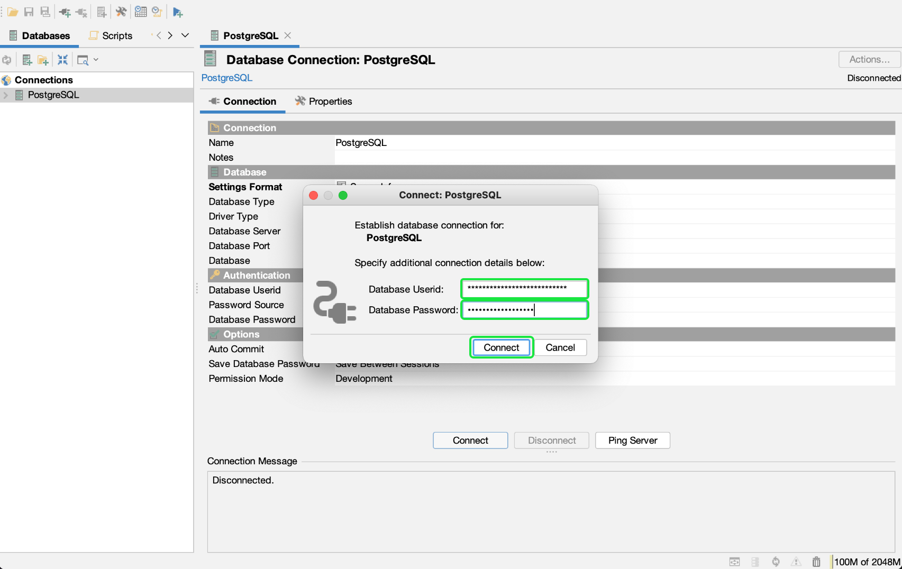

# Connect Db Visualizer to Query Service

This document covers the steps for connecting Db Visualizer Desktop with Adobe Experience Platform Query Service.

## Getting started

This guide requires that you already have access to the Db Visualizer desktop app and are familiar with how to navigate its interface. To download the Db Visualizer Desktop app or for more information, see the [official Db Visualizer documentation](https://www.dbvis.com/download/).

>[!NOTE]
>
>There are Windows, macOS, and Linux versions of Db Visualizer. Screenshots in this guide were taken using the macOS desktop app. There may be minor discrepancies in the UI between the versions.

To acquire the necessary credentials for connecting Db Visualize to Experience Platform, you must have access to the Queries workspace in the Platform UI. Please contact your IMS Organization administrator if you do not currently have access to the Queries workspace. 

## Create a database connection {#connect-database}

Once you have installed the desktop app on your local machine, start the app and select **Create a Database Connection** from the initial Db Visualizer menu. Then select **Create a Connection** in the panel to the right.

Use the search bar or select [!DNL PostgreSQL] from the driver name dropdown list. The Database Connection workspace appears.

![The driver name dropdown menu with [!DNL PostgreSQL] highlighted.](../images/clients/dbvisualizer/driver-name.png)

From the Database Connection workspace, select the **Properties** tab, followed by the **Driver Properties** from the navigation sidebar.

The three required driver properties are seen in the table below. 

| Property | Description|
| ------ | ------ |
| `PGHOST` | The host name for the [!DNL PostgreSQL] server. This value is your Experience Platform [!UICONTROL Host] credential. |
| `SSL` | This controls the use of SSL requirements. You **must** use the value "1" to enable this requirement. |
| `user` | The username connected to the database is your Organization ID. It is an alphanumeric string ending in `@adobe.org` |

The `PGHOST` and `user` values are taken from your Adobe Experience Platform credentials. To find your credentials, log in to the Platform UI and select **[!UICONTROL Queries]** from the left navigation, followed by **[!UICONTROL Credentials]**. For more information on finding your database name, host, port, and login credentials, please read the [credentials guide](../ui/credentials.md). 

Use the search bar to find each property then select the corresponding cell for the parameter's value. The cell will highlight in blue. Enter your Platform credential in the value field and select **Apply** to add the driver property.

>[!NOTE]
>
>To add a second `user` profile, select `user` from the parameter column then select the blue + (plus) icon to add credentials for each user. Select **Apply** to add the driver property.

The Edited column shows a check mark to denote that the parameter value has been updated.

## Authentication

To require authentication in the form of a user ID and password each time a connection is established, select **Authentication** from the navigation sidebar under [!DNL PostgreSQL].

In the Connection Authentication panel, check both the **Require Userid** and **Require Password** checkboxes then select **Apply**. 

## Connect to Platform

To make a connection, select the **Connection** tab from the Database Connection workspace and enter your Experience Platform credentials for the following settings.

- **Name**: You are recommended to provide a friendly name to recognize the connection. 
- **Database Server**: This is your Experience Platform [!UICONTROL Host] credential. 
- **Database Port**: The port for Query Service. You must use port 80 to connect with Query Service.
- **Database**: Use the credential `dbname` value `prod:all`.
- **Database Userid**: This is your Platform Organization Id. The Userid will be in the format of `ORG_ID@AdobeOrg`. 
- **Database Password**: This is an alphanumeric string found on the Query Service credentials dashboard.

After you have input all relevant credentials, select **Connect**. 

The connect dialog appears on the first occasion of the session. 

Enter your Userid and Password and select **Connect**. A message appears in the log to confirm a successful connection.

## Next steps

Now that you have connected Db Visualizer with Query Service, you can use Db Visualizer to write queries. For more information on how to write and run queries, please read the guide on query execution.
