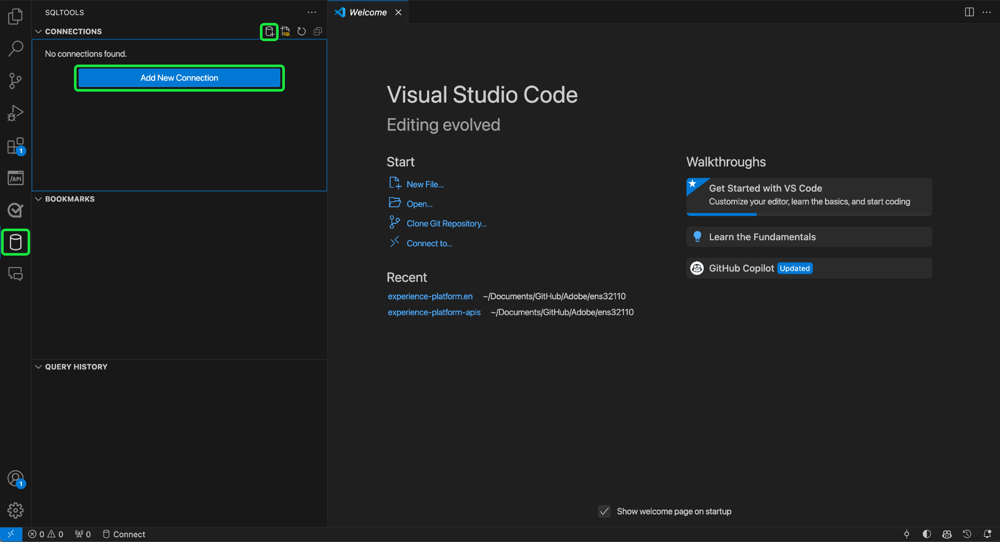
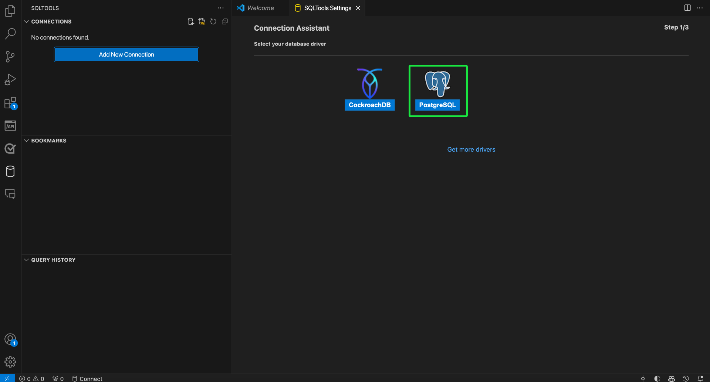
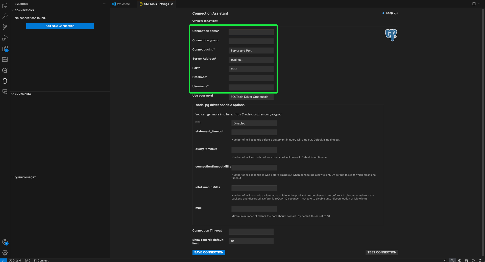
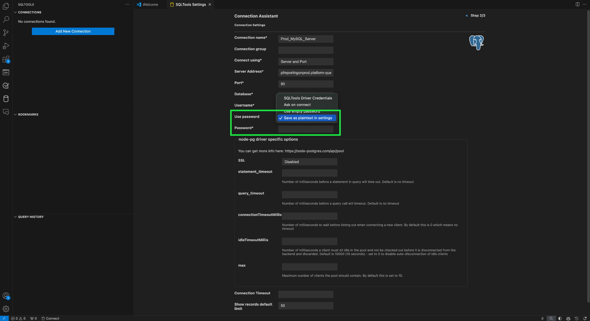
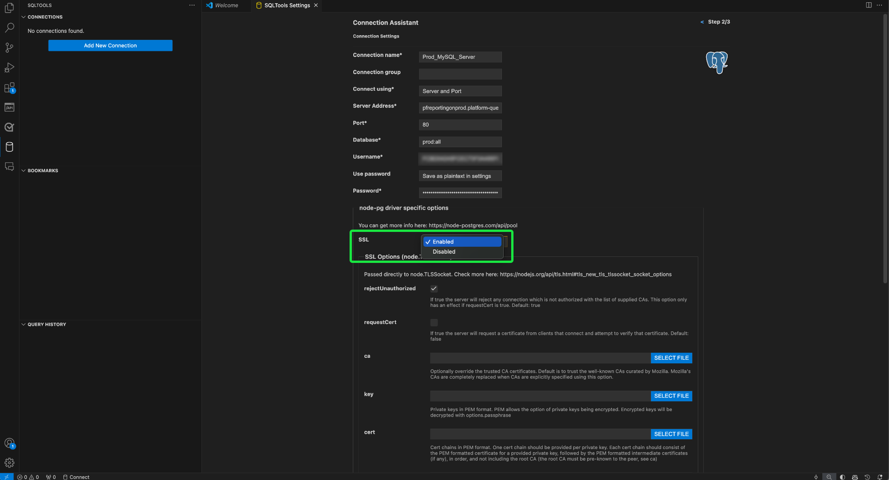
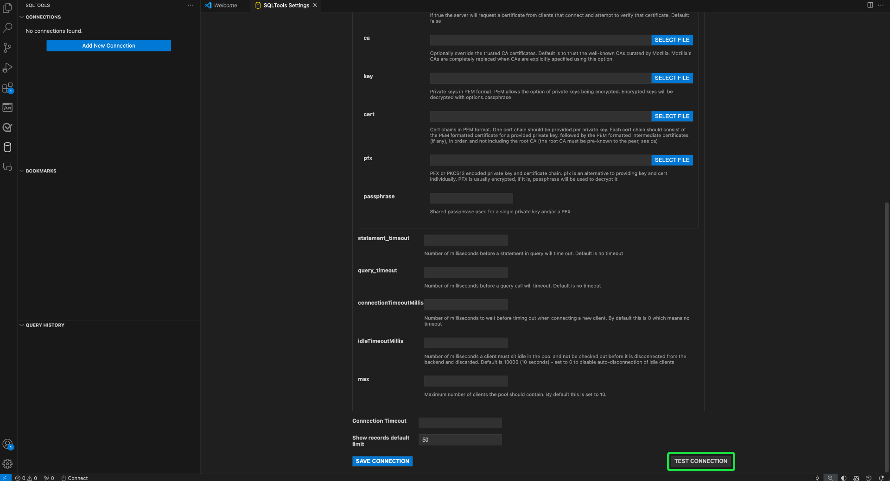
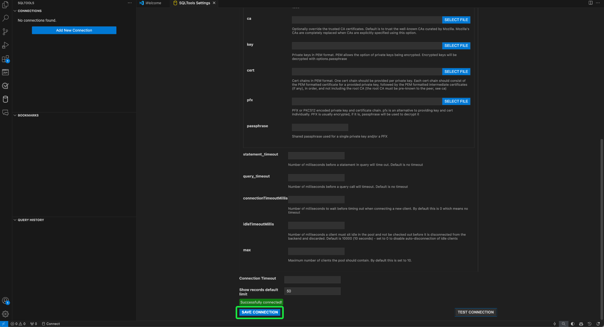
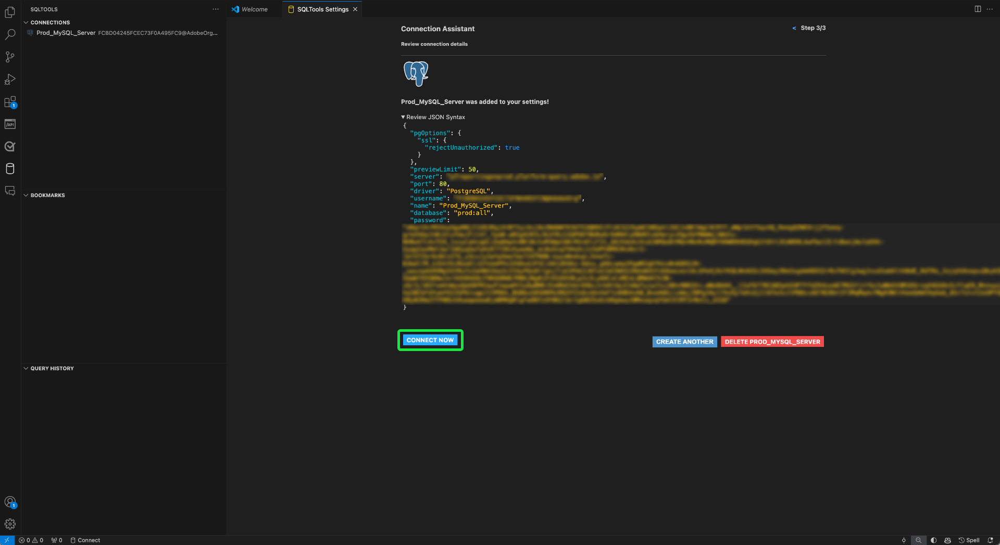
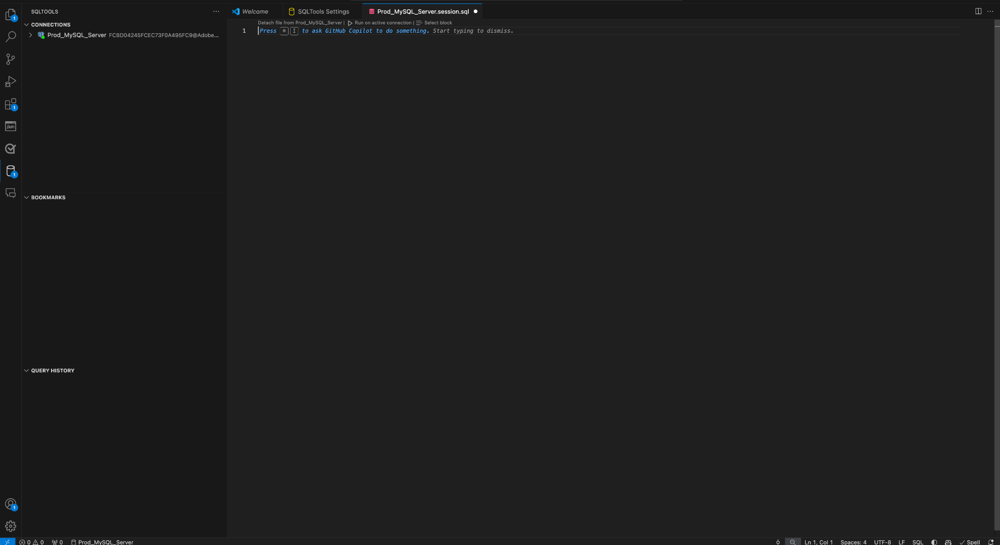

# Connect GitHub Copilot and Visual Studio Code to Query Service

>[!IMPORTANT]
>
>Before using this integrated tool, you must understand what data is shared with GitHub. Shared data includes contextual information about the code and files being edited ("prompts") and details about user actions ("user engagement data").  Please review [GitHub Copilot's privacy statement](https://docs.github.com/en/site-policy/privacy-policies/github-general-privacy-statement#github-privacy-statement) to learn about the data they collect. You must also consider the security implications of involving third-party services, as you are responsible for ensuring compliance with your organization's data governance policies. Adobe is not responsible for any data-related concerns or issues that may arise from the use of this tool. Consult the GitHub's documentation for more information.

GitHub Copilot, powered by OpenAI Codex, is an AI-driven tool that enhances your coding experience by suggesting code snippets and entire functions directly within your editor. Integrated with Visual Studio Code (VS Code), Copilot can significantly accelerate your workflow, especially when working with complex queries. Follow this guide to learn how to connect GitHub Copilot and VS Code to the Query Service to write and manage your queries with greater efficiency. For more information on Copilot, visit [GitHub's Copilot product page](https://github.com/pricing) and the [official Copilot documentation](https://docs.github.com/en/copilot/about-github-copilot/what-is-github-copilot).

This document covers the steps required to connect GitHub Copilot and VS Code with Adobe Experience Platform Query Service.

## Get started {#get-started}

This guide requires that you already have access to a GitHub account and have signed up for GitHub Copilot. You can [sign up from the GitHub website](https://github.com/github-copilot/signup). You also need VS Code. You can [download VS Code from their official website](https://code.visualstudio.com/download).

Once you have installed VS Code and activated your Copilot subscription, acquire your connection credentials for Experience Platform. These credentials are located in the [!UICONTROL Credentials] tab of the [!UICONTROL Queries] workspace in the Platform UI. Read the credentials guide to [learn how to find these values in the Platform UI](../ui/credentials.md). Please contact your organization administrator if you do not currently have access to the [!UICONTROL Queries] workspace.

### Required Visual Studio Code extensions {#required-extensions}

The following Visual Studio Code extensions are required to effectively manage and query your Platform SQL databases directly within the code editor. Download and install these extensions.

- [SQLTools](https://marketplace.visualstudio.com/items?itemName=mtxr.sqltools): Use the SQLTools extension to manage and query multiple SQL databases. It includes features like a query runner, SQL formatter, and connection explorer, with support for additional drivers to boost developer productivity. Read the overview on Visual Studio Marketplace for more details.
- [SQLTools PostgreSQL/Cockroach Driver](https://marketplace.visualstudio.com/items?itemName=mtxr.sqltools-driver-pg): This extension enables you to connect, query, and manage PostgreSQL and CockroachDB databases directly within your code editor.

The next extensions enable GitHub Copilot and its chat features.

- [GitHub Copilot](https://marketplace.visualstudio.com/items?itemName=GitHub.copilot): Provides inline coding suggestions as you type.
- [GitHub Copilot Chat](https://marketplace.visualstudio.com/items?itemName=GitHub.copilot-chat): A companion extension that provides conversational AI assistance.

## Create connection {#create-connection}

Select the cylinder icon () in the left navigation of VS Code, followed by **[!DNL Add New Connection]** or the cylinder plus icon ().

The **[!DNL Connection Assistant]** appears. Select the **[!DNL PostgreSQL]** database driver. 

### Input connection settings {#input-connection-settings}

The [!DNL Connection Settings] view appears. Enter your Platform connection credentials into the appropriate fields of the SQLTools [!DNL Connection Assistant]. The required values are explained in the table below.

| Property  |  Description |
| --- |--- |
|  [!DNL Connection name] | Provide a "[!DNL Connection name]" like `Prod_MySQL_Server` that is descriptive and clearly indicates its purpose (for example, a production environment for a MySQL server). Best practices include: <ul><li>Following your organization's naming conventions to ensure that it is unique within the system.</li><li>Keep it concise to maintain clarity and avoid confusion with other connections.</li><li>Include relevant details about the connection's function or environment in the name.</li></ul>  |
|  [!DNL Connect using]   | Use the **[!DNL Server and Port]** option to specify the server's address (hostname) and the port number to establish a direct connection to Platform  |
|  [!DNL Server address]  | Enter the **[!UICONTROL Host]** value provided in your Platform Postgres credentials, such as `acmeprod.platform-query.adobe.io`. |
|  [!DNL Port]   | This value is typically `80` for Platform services.   |
|  [!DNL Database]   | Enter the **[!UICONTROL Database]** value provided in your Platform Postgres credentials, such as `prod:all`.  |
|  [!DNL Username]   | This property refers to your organization ID. Enter the **[!UICONTROL Username]** value provided in your Platform Postgres credentials.  |
|  [!DNL Password]   | This property is your access token. Enter the **[!UICONTROL Password]** value provided in your Platform Postgres credentials. |

Next, select **[!DNL Use Password]**, followed by **[!DNL Save as plaintext in settings]** from the dropdown menu that appears. The [!DNL Password] field appears. Use this text input field to enter your access token.

Finally, to enable SSL, select the [!DNL SSL] input field and choose [!DNL Enabled] from the dropdown menu that appears. 

>[!TIP]
>
>Once you have entered all your credentials, you can test your connection before saving the connection. Scroll down to the bottom of the workspace and select **[!DNL Test Connection]**.
>
>{width="100" zoomable="yes"}

Once you have correctly input your connection details, select **[!DNL Save Connection]** to confirm your settings.

The [!DNL Review connection details] view appears and displays your connection credentials. When you are sure that your connection details are accurate, select **[!DNL Connect Now]**.

Your VS Code workspace appears with a suggestion from GitHub Copilot.

<!--  -->

## GitHub Copilot quick guide

Once connected to your Platform instance, you can use Copilot as an AI coding assistant to help you write code faster and with more confidence. This section covers its key features and how to use them.

## Getting started with GitHub Copilot {#get-started-with-copilot}

First, ensure that you have the latest version of VS Code installed. An outdated VS Code version can prevent key Copilot features from working as intended. Next, ensure that the [!DNL Enable Auto Completions] setting is enabled. If Copilot is running correctly, the **Copilot icon** () displays in your status bar (if there is an issue, the Copilot error icon displays instead). Select the **Copilot icon** to open the [!DNL GitHub Copilot Menu]. From the **[!DNL GitHub Copilot Menu]**, select **[!DNL Edit Settings]**

Scroll down the options and ensure the check box is enabled for the [!DNL Enable Auto Completions] setting.

## Code completions {#code-completions}

Once you install the GitHub Copilot extension and log in, it automatically activates a feature called **Ghost Text**, which suggests code completions as you type. These suggestions help you write code more efficiently and with fewer interruptions. You can also use comments to guide the AI code suggestions. This means that non-technical users can convert plain speech into code to explore their data.

>[!TIP]
>
>If you would like to turn off Copilot for a specific file or language, select the icon in the status bar and disable it.

### Accept full or partial Ghost Text suggestions {#accept-suggestions}

When GitHub Copilot suggests code completions, you can accept either partial or the compete suggestion. Select **Tab** to accept the entire suggestion, or hold down **Control (or Command on Mac)** and press the **right arrow** to accept partial text. To dismiss a suggestion, press **Escape**.

>[!TIP]
>  
>If you are not getting suggestions, ensure that [Copilot is enabled in your file's language](#get-started-with-copilot).

### Alternative suggestions {#alternative-suggestions}

To cycle through alternative code suggestions, select the arrows in the Copilot dialog.
 

## Use inline chat {#inline-chat}

You can also chat with Copilot directly about your code. Use **Control (or Command) + I** to trigger the inline chat dialog. This feature is used for iterating on your code and refining suggestions in context. You can highlight a block of code and use inline chat to see a different solution proposed by the AI before you accepting them.

## Dedicated chat view

You can use a more traditional chat interface with a dedicated chat sidebar to form ideas and strategy, solvie coding issues, and discuss implementation details. Select the chat icon () in the VS Code sidebar to open a dedicated chat window.

You can also access chat history by selecting the history icon () at the top of the chat panel.

<!-- 
Alt Text: ""

Alt Text: "The VS Code editor with a highlighted suggestion being accepted after pressing Tab, showing the completion of the Ghost Text suggestion."

Alt Text: "Side panel in the VS Code editor displaying multiple alternative code suggestions from GitHub Copilot after pressing Control/Command + Enter."

Alt Text: "Inline Chat window within the code editor showing a conversation between the user and Copilot about refining a block of code."

Alt Text: "The VS Code editor displaying a light bulb icon next to an error, with a dropdown menu of suggested fixes from GitHub Copilot."

Alt Text: "Chat sidebar in the code editor with a conversation between the user and Copilot, showing chat history and an input field for brainstorming solutions."

Alt Text: "Sparkle icon in the terminal, indicating GitHub Copilot assistance is available, with a tooltip highlighting the option to get help."
 -->

## Next steps

You are now ready to efficiently query your Platform databases directly from your code editor, and use GitHub Copilot's AI-powered code suggestions to streamline writing and optimizing SQL queries. For more information on how to write and run queries, refer to the [guidance for query execution](../best-practices/writing-queries.md).
